# JDBC接口详解

<cite>
**本文档引用的文件**  
- [SsDriver.java](file://src/main/java/io/leavesfly/smallsql/SsDriver.java)
- [SsConnection.java](file://src/main/java/io/leavesfly/smallsql/jdbc/SsConnection.java)
- [SsResultSet.java](file://src/main/java/io/leavesfly/smallsql/jdbc/SsResultSet.java)
- [SsDatabaseMetaData.java](file://src/main/java/io/leavesfly/smallsql/jdbc/metadata/SsDatabaseMetaData.java)
- [SsResultSetMetaData.java](file://src/main/java/io/leavesfly/smallsql/jdbc/metadata/SsResultSetMetaData.java)
- [SmallSQLException.java](file://src/main/java/io/leavesfly/smallsql/jdbc/SmallSQLException.java)
- [SsStatement.java](file://src/main/java/io/leavesfly/smallsql/jdbc/statement/SsStatement.java)
- [SsPreparedStatement.java](file://src/main/java/io/leavesfly/smallsql/jdbc/statement/SsPreparedStatement.java)
- [SsCallableStatement.java](file://src/main/java/io/leavesfly/smallsql/jdbc/statement/SsCallableStatement.java)
- [SsSavepoint.java](file://src/main/java/io/leavesfly/smallsql/jdbc/statement/SsSavepoint.java)
</cite>

## 目录
1. [引言](#引言)
2. [驱动程序与连接管理](#驱动程序与连接管理)
3. [连接接口详解](#连接接口详解)
4. [语句对象分析](#语句对象分析)
5. [结果集操作](#结果集操作)
6. [元数据查询](#元数据查询)
7. [异常处理机制](#异常处理机制)
8. [最佳实践示例](#最佳实践示例)
9. [结论](#结论)

## 引言
SmallSQL 是一个轻量级的纯 Java 数据库管理系统，完全实现了 JDBC 4.0 标准。本文档深入解析其 JDBC 接口实现，涵盖从驱动注册、连接管理到元数据查询的完整技术细节。通过系统化的文档化，帮助开发者全面理解 SmallSQL 的内部工作机制和最佳使用方式。

## 驱动程序与连接管理

### SsDriver注册机制
SsDriver 类实现了 java.sql.Driver 接口，作为 SmallSQL 数据库的 JDBC 驱动入口。其注册机制通过静态初始化块自动完成，确保驱动在类加载时即注册到 DriverManager 中。

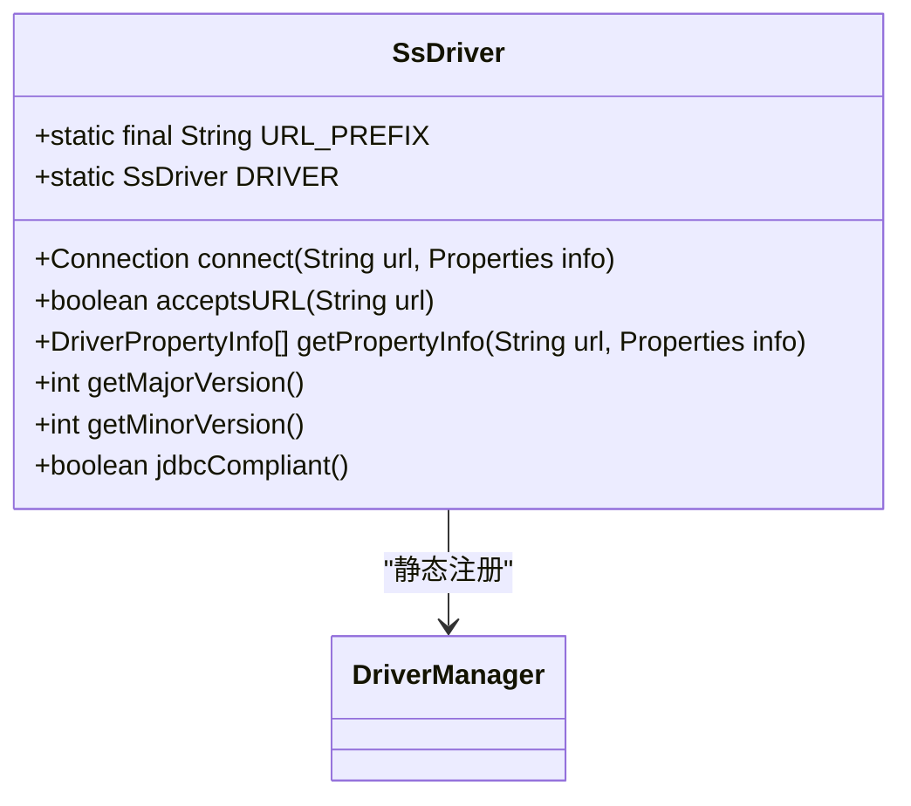

**图示来源**  
- [SsDriver.java](file://src/main/java/io/leavesfly/smallsql/SsDriver.java#L1-L202)

### 连接URL解析逻辑
JDBC URL 的解析遵循标准格式：`jdbc:smallsql:[database_path][?property=value...]`。驱动程序通过 parse 方法解析 URL，提取数据库路径和连接属性。

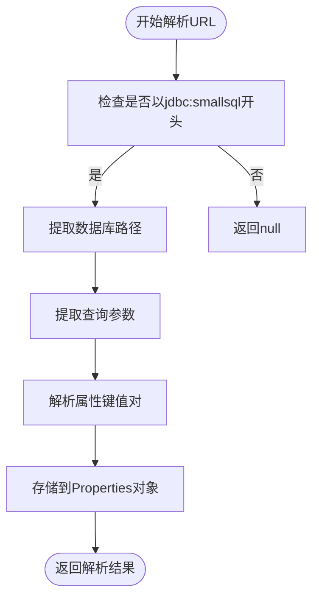

**图示来源**  
- [SsDriver.java](file://src/main/java/io/leavesfly/smallsql/SsDriver.java#L100-L150)

**本节来源**  
- [SsDriver.java](file://src/main/java/io/leavesfly/smallsql/SsDriver.java#L1-L202)

## 连接接口详解

### SsConnection核心属性
SsConnection 类实现了 java.sql.Connection 接口，管理数据库连接的生命周期和事务状态。其核心属性包括：

| 属性名 | 类型 | 说明 |
|--------|------|------|
| readOnly | boolean | 连接是否为只读模式 |
| database | Database | 关联的数据库实例 |
| autoCommit | boolean | 自动提交事务标志 |
| isolationLevel | int | 事务隔离级别 |
| commitPages | List<TransactionStep> | 事务步骤列表 |
| metadata | SsDatabaseMetaData | 数据库元数据对象 |

**本节来源**  
- [SsConnection.java](file://src/main/java/io/leavesfly/smallsql/jdbc/SsConnection.java#L25-L50)

### 连接属性与事务管理
SsConnection 支持多种连接属性，包括数据库路径、只读模式、自动创建数据库等。事务管理通过 commit 和 rollback 方法实现，支持保存点机制。

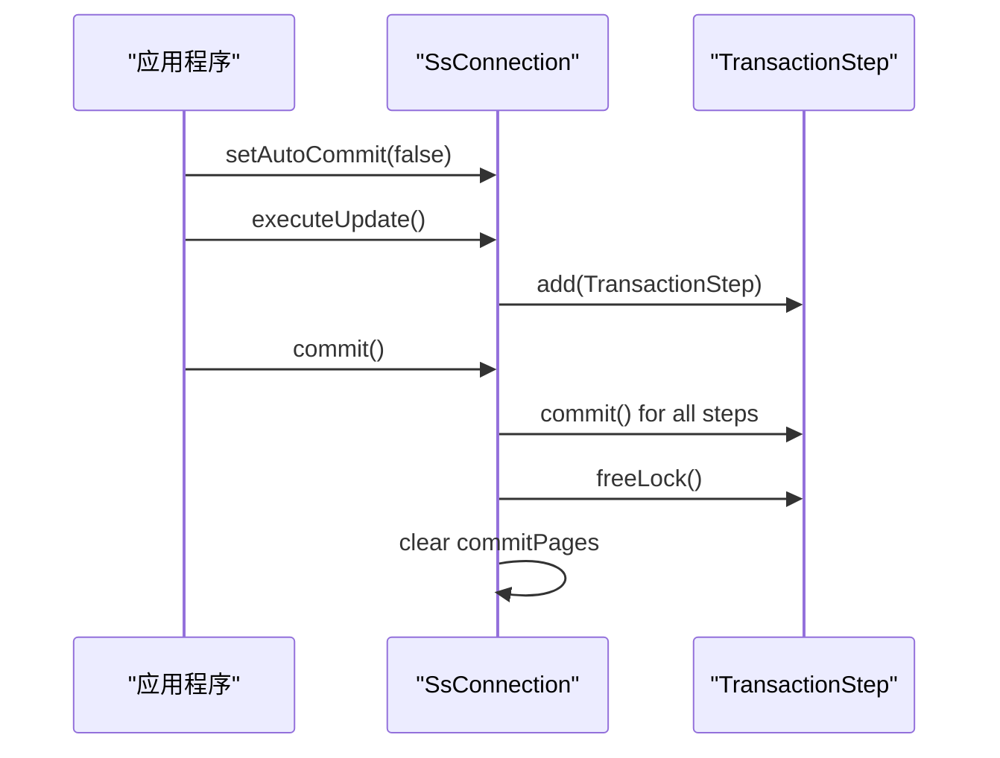

**图示来源**  
- [SsConnection.java](file://src/main/java/io/leavesfly/smallsql/jdbc/SsConnection.java#L200-L300)

### 保存点管理
保存点通过 SsSavepoint 类实现，允许在事务中设置回滚点。SsConnection 提供了完整的保存点操作接口。

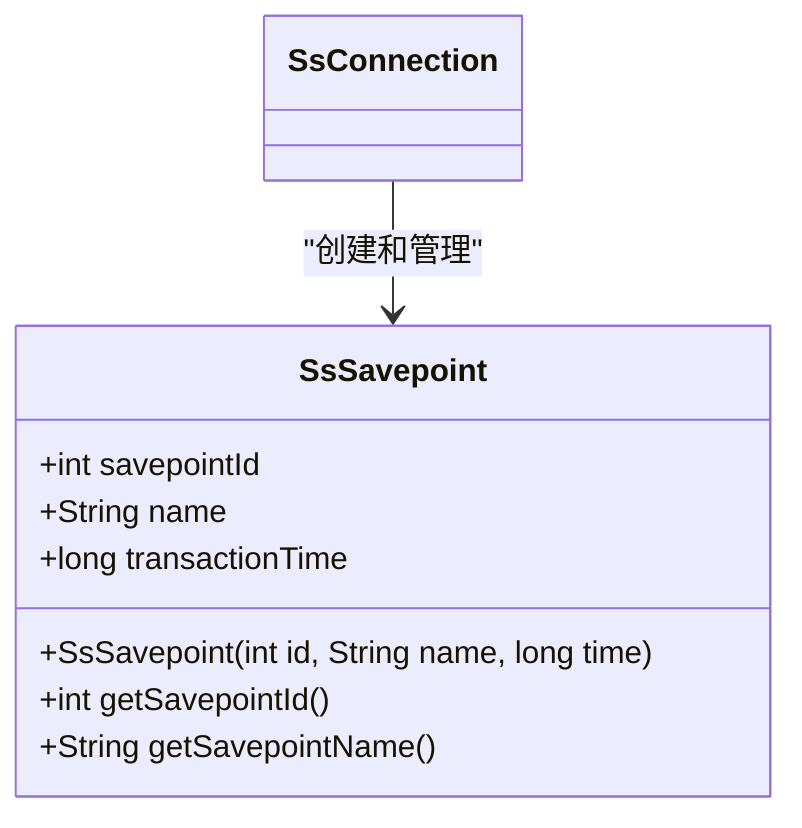

**图示来源**  
- [SsSavepoint.java](file://src/main/java/io/leavesfly/smallsql/jdbc/statement/SsSavepoint.java#L1-L50)
- [SsConnection.java](file://src/main/java/io/leavesfly/smallsql/jdbc/SsConnection.java#L500-L550)

### 连接池兼容性
SsConnection 实现了标准的 JDBC 连接接口，天然支持连接池。通过 close 方法正确释放资源，确保连接池的正常回收。

**本节来源**  
- [SsConnection.java](file://src/main/java/io/leavesfly/smallsql/jdbc/SsConnection.java#L400-L450)

## 语句对象分析

### 语句类型对比
SmallSQL 提供了三种主要的语句类型，各有不同的使用场景和性能特点。

| 特性 | SsStatement | SsPreparedStatement | SsCallableStatement |
|------|-------------|---------------------|---------------------|
| 预编译 | 否 | 是 | 是 |
| 参数化 | 否 | 是 | 是 |
| 存储过程 | 否 | 否 | 是 |
| 性能 | 低 | 高 | 中 |
| 重用性 | 低 | 高 | 中 |

**本节来源**  
- [SsStatement.java](file://src/main/java/io/leavesfly/smallsql/jdbc/statement/SsStatement.java#L1-L50)
- [SsPreparedStatement.java](file://src/main/java/io/leavesfly/smallsql/jdbc/statement/SsPreparedStatement.java#L1-L50)
- [SsCallableStatement.java](file://src/main/java/io/leavesfly/smallsql/jdbc/statement/SsCallableStatement.java#L1-L50)

### SsStatement实现
SsStatement 用于执行静态 SQL 语句，是最基本的语句类型。

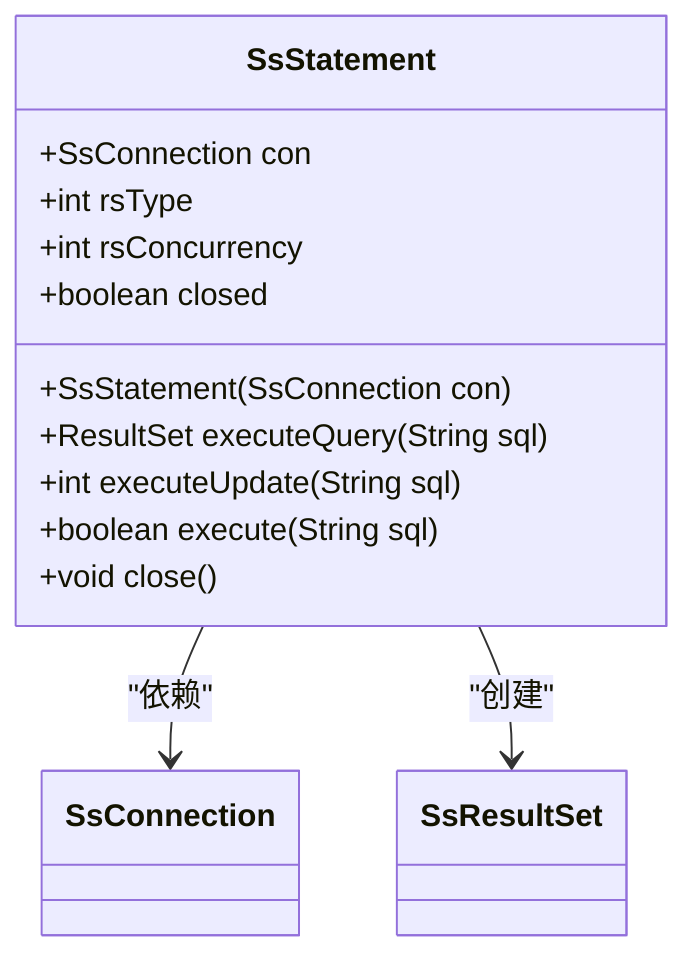

**图示来源**  
- [SsStatement.java](file://src/main/java/io/leavesfly/smallsql/jdbc/statement/SsStatement.java#L1-L100)

### SsPreparedStatement优化
SsPreparedStatement 通过预编译 SQL 语句提高执行效率，特别适合重复执行的查询。

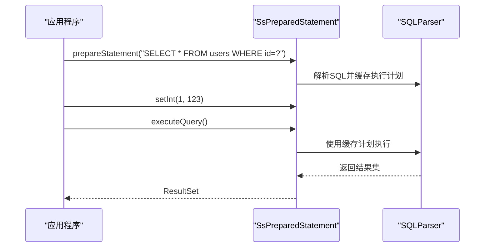

**图示来源**  
- [SsPreparedStatement.java](file://src/main/java/io/leavesfly/smallsql/jdbc/statement/SsPreparedStatement.java#L50-L150)

### SsCallableStatement功能
SsCallableStatement 用于执行存储过程调用，支持输入输出参数。

**本节来源**  
- [SsCallableStatement.java](file://src/main/java/io/leavesfly/smallsql/jdbc/statement/SsCallableStatement.java#L1-L100)

## 结果集操作

### SsResultSet游标操作
SsResultSet 实现了完整的游标操作功能，支持向前、向后、绝对和相对移动。

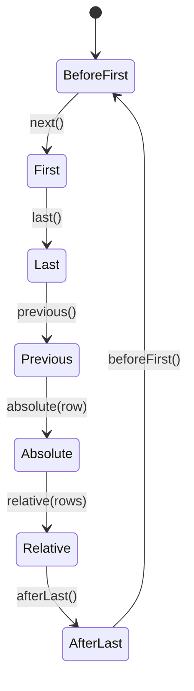

**图示来源**  
- [SsResultSet.java](file://src/main/java/io/leavesfly/smallsql/jdbc/SsResultSet.java#L300-L400)

### 数据类型获取方法
SsResultSet 提供了丰富的数据类型获取方法，支持所有标准 SQL 类型。

| 方法 | 返回类型 | 说明 |
|------|---------|------|
| getString() | String | 获取字符串值 |
| getInt() | int | 获取整数值 |
| getLong() | long | 获取长整数值 |
| getDouble() | double | 获取双精度值 |
| getBoolean() | boolean | 获取布尔值 |
| getDate() | Date | 获取日期值 |
| getTime() | Time | 获取时间值 |
| getTimestamp() | Timestamp | 获取时间戳值 |
| getBytes() | byte[] | 获取二进制值 |

**本节来源**  
- [SsResultSet.java](file://src/main/java/io/leavesfly/smallsql/jdbc/SsResultSet.java#L50-L200)

### 可滚动与可更新特性
SsResultSet 支持可滚动和可更新特性，通过类型和并发性参数控制。

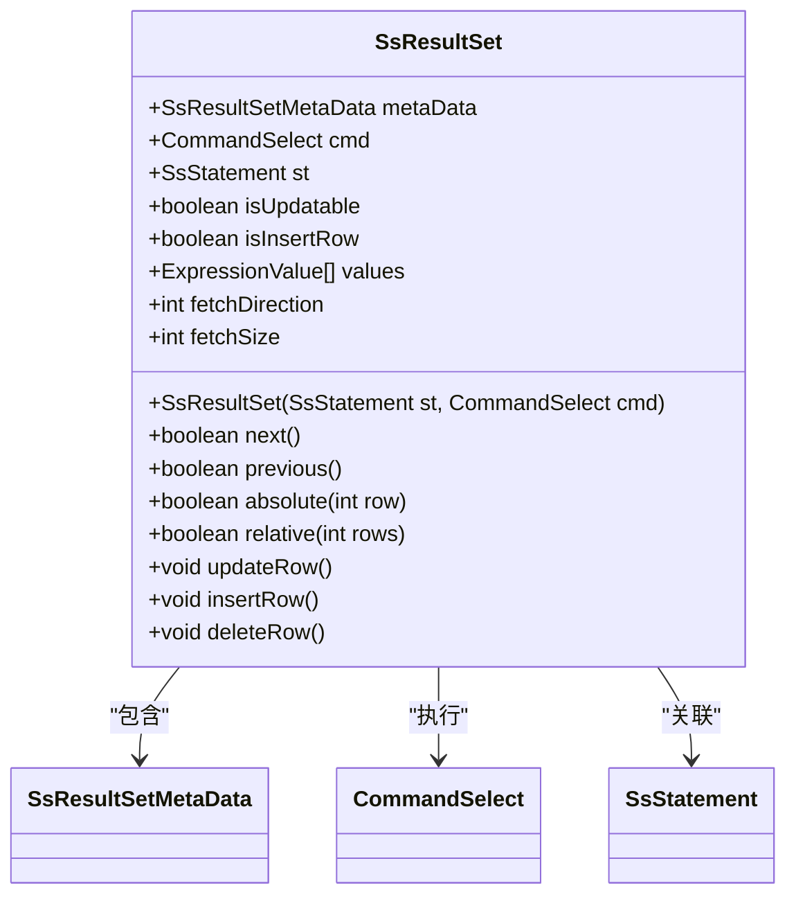

**图示来源**  
- [SsResultSet.java](file://src/main/java/io/leavesfly/smallsql/jdbc/SsResultSet.java#L1-L100)

## 元数据查询

### SsDatabaseMetaData接口
SsDatabaseMetaData 提供了全面的数据库元数据查询功能。

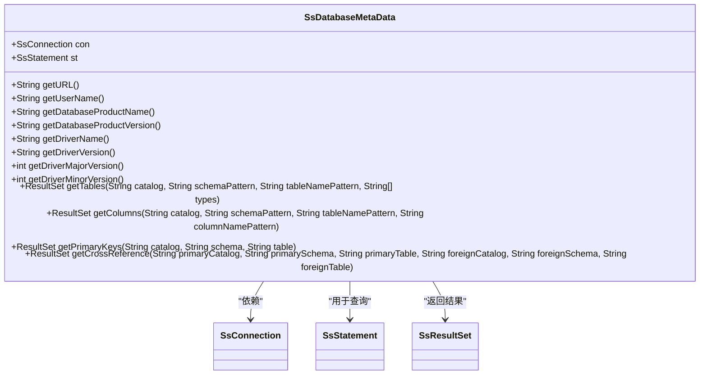

**图示来源**  
- [SsDatabaseMetaData.java](file://src/main/java/io/leavesfly/smallsql/jdbc/metadata/SsDatabaseMetaData.java#L1-L100)

### SsResultSetMetaData实现
SsResultSetMetaData 提供了结果集的列元数据信息。

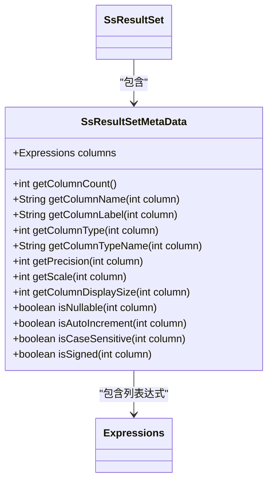

**图示来源**  
- [SsResultSetMetaData.java](file://src/main/java/io/leavesfly/smallsql/jdbc/metadata/SsResultSetMetaData.java#L1-L100)

### 元数据查询方法
系统化文档化所有元数据查询方法：

| 方法 | 功能说明 |
|------|----------|
| getTables() | 获取表信息 |
| getColumns() | 获取列信息 |
| getPrimaryKeys() | 获取主键信息 |
| getImportedKeys() | 获取外键引用 |
| getExportedKeys() | 获取外键被引用 |
| getTypeInfo() | 获取类型信息 |
| getProcedures() | 获取存储过程信息 |
| getCatalogs() | 获取数据库目录 |

**本节来源**  
- [SsDatabaseMetaData.java](file://src/main/java/io/leavesfly/smallsql/jdbc/metadata/SsDatabaseMetaData.java#L100-L500)

## 异常处理机制

### SmallSQLException分类
SmallSQLException 是 SmallSQL 的核心异常类，继承自 SQLException。

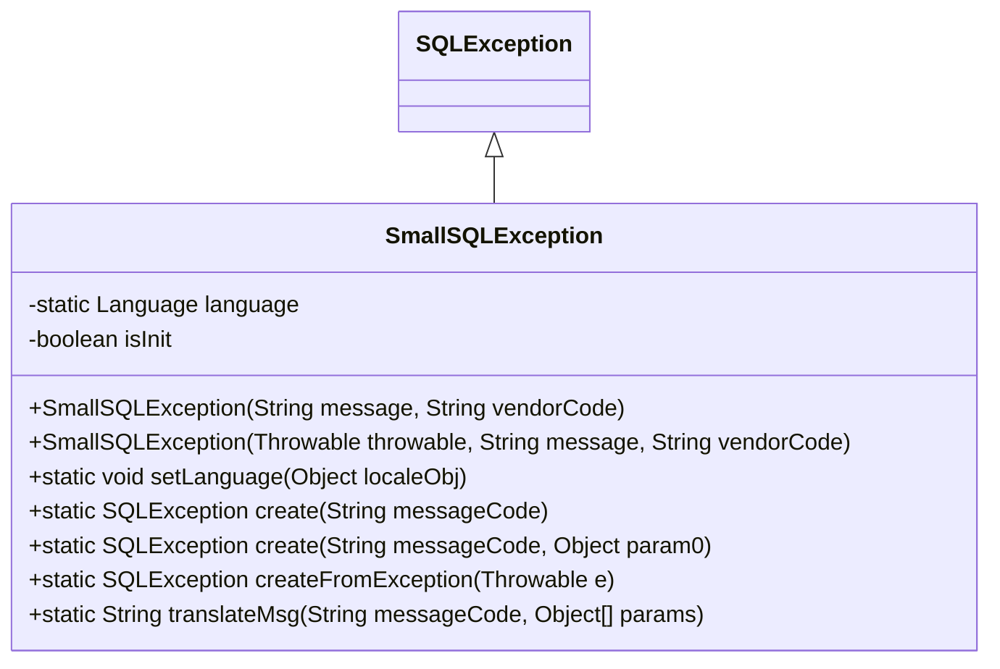

**图示来源**  
- [SmallSQLException.java](file://src/main/java/io/leavesfly/smallsql/jdbc/SmallSQLException.java#L1-L100)

### 错误代码体系
异常通过消息代码和 SQL 状态码进行分类管理。

| 错误类别 | 代码前缀 | 说明 |
|----------|---------|------|
| 连接错误 | CONN_ | 连接相关异常 |
| 语法错误 | SYNTAX_ | SQL 语法错误 |
| 数据错误 | DATA_ | 数据操作异常 |
| 事务错误 | TRANS_ | 事务管理异常 |
| 元数据错误 | META_ | 元数据查询异常 |
| 自定义错误 | CUSTOM_ | 用户自定义异常 |

**本节来源**  
- [SmallSQLException.java](file://src/main/java/io/leavesfly/smallsql/jdbc/SmallSQLException.java#L100-L200)

## 最佳实践示例

### 批处理操作
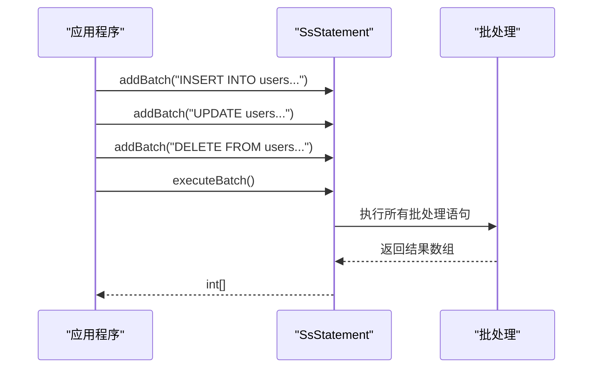

**本节来源**  
- [SsStatement.java](file://src/main/java/io/leavesfly/smallsql/jdbc/statement/SsStatement.java#L200-L250)

### 参数化查询
使用 PreparedStatement 防止 SQL 注入，提高性能。

**本节来源**  
- [SsPreparedStatement.java](file://src/main/java/io/leavesfly/smallsql/jdbc/statement/SsPreparedStatement.java#L150-L200)

### 元数据检索
通过 DatabaseMetaData 获取数据库结构信息。

**本节来源**  
- [SsDatabaseMetaData.java](file://src/main/java/io/leavesfly/smallsql/jdbc/metadata/SsDatabaseMetaData.java#L500-L600)

## 结论
SmallSQL 完整实现了 JDBC 4.0 标准，提供了高性能、轻量级的数据库访问解决方案。其驱动注册、连接管理、语句执行和元数据查询等机制设计合理，适合嵌入式应用和小型项目使用。通过深入理解其内部实现，开发者可以更好地利用其功能，编写高效、安全的数据库应用程序。