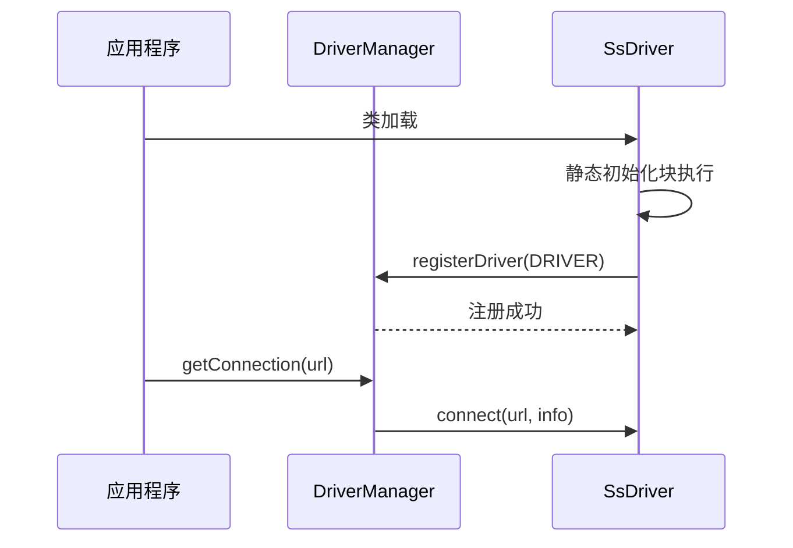
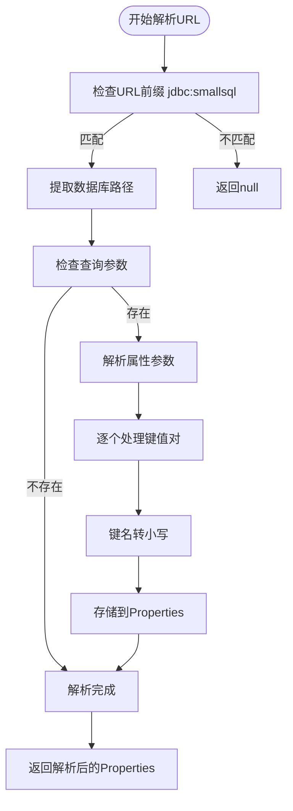
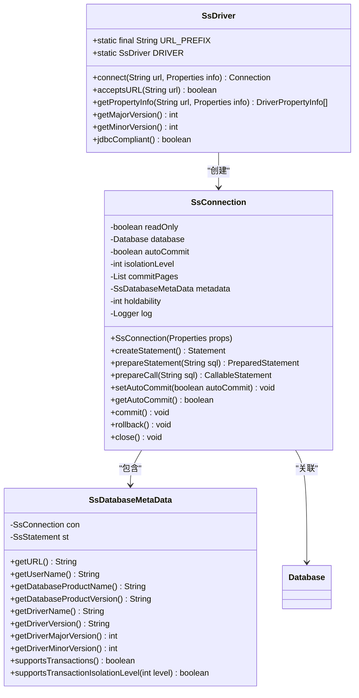
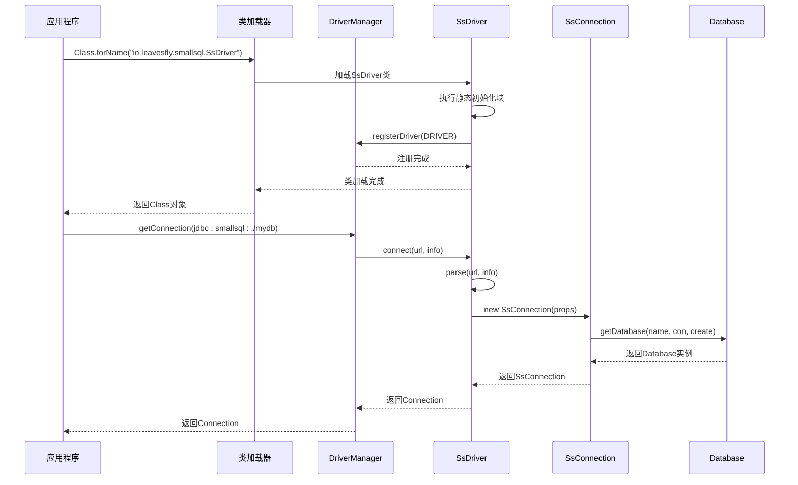
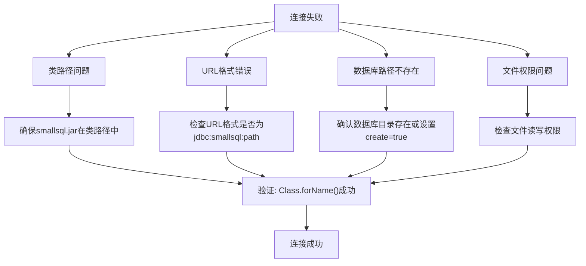
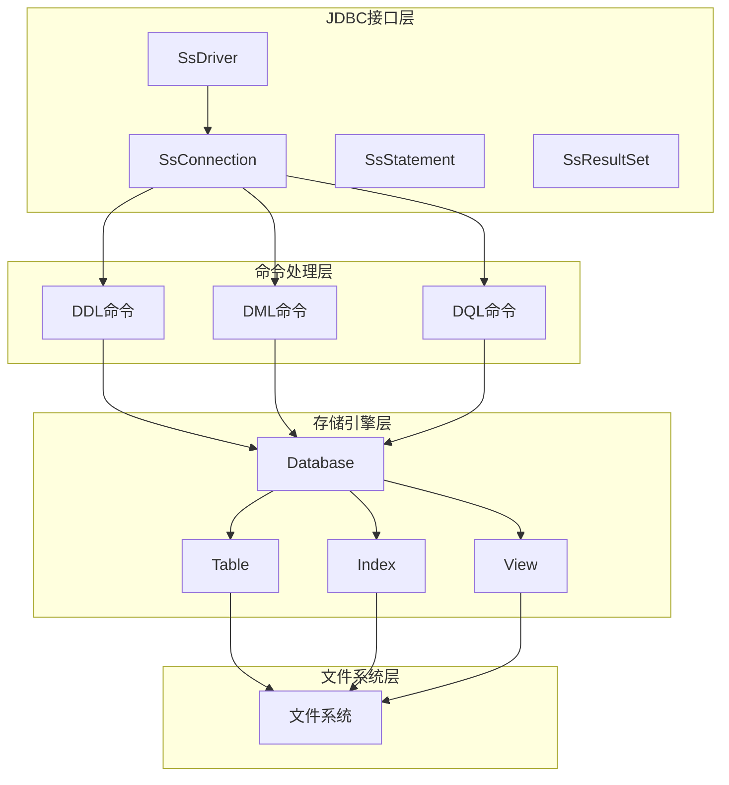

# JDBC驱动实现

<cite>
**本文档引用的文件**  
- [SsDriver.java](file://src/main/java/io/leavesfly/smallsql/SsDriver.java)
- [SsConnection.java](file://src/main/java/io/leavesfly/smallsql/jdbc/SsConnection.java)
- [SsDatabaseMetaData.java](file://src/main/java/io/leavesfly/smallsql/jdbc/metadata/SsDatabaseMetaData.java)
- [Database.java](file://src/main/java/io/leavesfly/smallsql/rdb/engine/Database.java)
- [README.md](file://README.md)
</cite>

## 目录
1. [引言](#引言)
2. [驱动注册与初始化](#驱动注册与初始化)
3. [连接URL解析机制](#连接url解析机制)
4. [驱动属性配置](#驱动属性配置)
5. [连接初始化示例](#连接初始化示例)
6. [版本兼容性与规范符合性](#版本兼容性与规范符合性)
7. [常见连接问题与解决方案](#常见连接问题与解决方案)
8. [架构与组件关系](#架构与组件关系)
9. [结论](#结论)

## 引言

SmallSQL是一个用Java编写的轻量级关系数据库管理系统，提供了完整的JDBC接口实现。本文档重点解析SsDriver类的实现机制，详细说明驱动程序的注册过程、连接管理、URL解析规则以及配置选项。SmallSQL数据库采用嵌入式架构，无需独立服务器进程，适合在应用程序中直接集成使用。

**本文档引用的文件**  
- [README.md](file://README.md)

## 驱动注册与初始化

SsDriver类实现了java.sql.Driver接口，作为SmallSQL数据库的JDBC驱动入口点。驱动程序通过静态初始化块在类加载时自动注册到DriverManager，确保应用程序可以无缝使用JDBC标准API进行数据库连接。



**图示来源**  
- [SsDriver.java](file://src/main/java/io/leavesfly/smallsql/SsDriver.java#L52-L70)

**本节来源**  
- [SsDriver.java](file://src/main/java/io/leavesfly/smallsql/SsDriver.java#L52-L70)

## 连接URL解析机制

SsDriver类实现了标准的JDBC URL解析机制，支持`jdbc:smallsql:[database_path][?property=value...]`格式。驱动程序能够解析数据库路径和连接属性，为后续的连接建立提供必要的配置信息。



**图示来源**  
- [SsDriver.java](file://src/main/java/io/leavesfly/smallsql/SsDriver.java#L100-L134)

**本节来源**  
- [SsDriver.java](file://src/main/java/io/leavesfly/smallsql/SsDriver.java#L100-L134)

## 驱动属性配置

SsDriver支持通过URL查询参数配置连接行为，主要属性包括数据库路径、只读模式和数据库创建选项。这些属性在连接建立时被解析并传递给SsConnection实例，影响数据库的访问方式和行为。



**图示来源**  
- [SsDriver.java](file://src/main/java/io/leavesfly/smallsql/SsDriver.java)
- [SsConnection.java](file://src/main/java/io/leavesfly/smallsql/jdbc/SsConnection.java)
- [SsDatabaseMetaData.java](file://src/main/java/io/leavesfly/smallsql/jdbc/metadata/SsDatabaseMetaData.java)

**本节来源**  
- [SsDriver.java](file://src/main/java/io/leavesfly/smallsql/SsDriver.java#L100-L134)
- [SsConnection.java](file://src/main/java/io/leavesfly/smallsql/jdbc/SsConnection.java#L50-L100)

## 连接初始化示例

以下代码示例展示了如何使用SsDriver进行数据库连接初始化，包括Class.forName()加载驱动和DriverManager.getConnection()建立连接的完整过程。



**图示来源**  
- [SsDriver.java](file://src/main/java/io/leavesfly/smallsql/SsDriver.java#L52-L70)
- [SsConnection.java](file://src/main/java/io/leavesfly/smallsql/jdbc/SsConnection.java#L50-L80)

**本节来源**  
- [SsDriver.java](file://src/main/java/io/leavesfly/smallsql/SsDriver.java#L52-L70)
- [SsConnection.java](file://src/main/java/io/leavesfly/smallsql/jdbc/SsConnection.java#L50-L80)

## 版本兼容性与规范符合性

SsDriver实现了JDBC 4.0规范要求，通过jdbcCompliant()方法返回true表明其符合JDBC规范。驱动程序版本信息通过getMajorVersion()和getMinorVersion()方法提供，当前版本为0.21。驱动支持自动加载机制，通过META-INF/services/java.sql.Driver文件注册，无需显式调用Class.forName()。

```mermaid
flowchart LR
A[JDBC 4.0规范符合性] --> B[jdbcCompliant()返回true]
A --> C[自动服务发现]
A --> D[DriverManager集成]
C --> E[META-INF/services/java.sql.Driver]
D --> F[静态初始化块注册]
F --> G[Driver.registerDriver()]
B --> H[标准JDBC行为]
H --> I[跨平台兼容]
I --> J[应用程序无缝集成]
```

**图示来源**  
- [SsDriver.java](file://src/main/java/io/leavesfly/smallsql/SsDriver.java#L170-L190)

**本节来源**  
- [SsDriver.java](file://src/main/java/io/leavesfly/smallsql/SsDriver.java#L170-L190)

## 常见连接问题与解决方案

在使用SsDriver时，可能会遇到各种连接问题。本节分析常见问题的原因并提供相应的解决方案，帮助开发者快速定位和解决问题。



**图示来源**  
- [SsDriver.java](file://src/main/java/io/leavesfly/smallsql/SsDriver.java#L100-L134)
- [Database.java](file://src/main/java/io/leavesfly/smallsql/rdb/engine/Database.java#L100-L150)

**本节来源**  
- [SsDriver.java](file://src/main/java/io/leavesfly/smallsql/SsDriver.java#L100-L134)
- [Database.java](file://src/main/java/io/leavesfly/smallsql/rdb/engine/Database.java#L100-L150)

## 架构与组件关系

SmallSQL采用分层架构设计，JDBC接口层、命令处理层、存储引擎层和文件系统层各司其职。SsDriver作为JDBC接口层的核心组件，与SsConnection、Database等组件协同工作，提供完整的数据库访问功能。



**图示来源**  
- [README.md](file://README.md)
- [SsDriver.java](file://src/main/java/io/leavesfly/smallsql/SsDriver.java)
- [SsConnection.java](file://src/main/java/io/leavesfly/smallsql/jdbc/SsConnection.java)
- [Database.java](file://src/main/java/io/leavesfly/smallsql/rdb/engine/Database.java)

**本节来源**  
- [README.md](file://README.md)
- [SsDriver.java](file://src/main/java/io/leavesfly/smallsql/SsDriver.java)
- [SsConnection.java](file://src/main/java/io/leavesfly/smallsql/jdbc/SsConnection.java)

## 结论

SsDriver作为SmallSQL数据库的JDBC驱动实现，提供了完整的数据库连接功能。通过静态初始化块自动注册、标准JDBC URL解析、灵活的属性配置和完善的错误处理机制，SsDriver确保了与Java应用程序的无缝集成。驱动程序符合JDBC 4.0规范，支持自动加载机制，简化了应用程序的配置过程。了解SsDriver的实现机制有助于开发者更好地使用SmallSQL数据库，解决连接过程中的各种问题，并充分利用其功能特性。