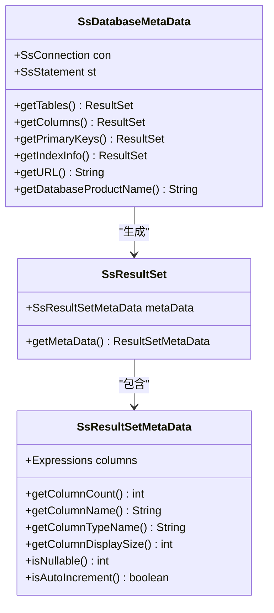
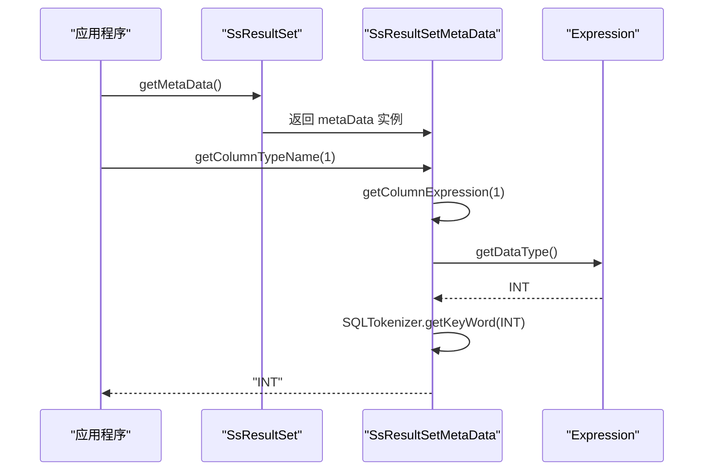

# 元数据访问

<cite>
**本文档中引用的文件**  
- [SsDatabaseMetaData.java](file://src/main/java/io/leavesfly/smallsql/jdbc/metadata/SsDatabaseMetaData.java)
- [SsResultSetMetaData.java](file://src/main/java/io/leavesfly/smallsql/jdbc/metadata/SsResultSetMetaData.java)
- [Database.java](file://src/main/java/io/leavesfly/smallsql/rdb/engine/Database.java)
- [SsResultSet.java](file://src/main/java/io/leavesfly/smallsql/jdbc/SsResultSet.java)
- [Column.java](file://src/main/java/io/leavesfly/smallsql/rdb/engine/table/Column.java)
- [TestDBMetaData.java](file://src/test/java/io/leavesfly/smallsql/junit/sql/ddl/TestDBMetaData.java)
</cite>

## 目录
1. [简介](#简介)
2. [核心元数据类](#核心元数据类)
3. [SsDatabaseMetaData 详解](#ssdatabasemetadata-详解)
4. [SsResultSetMetaData 详解](#ssresultsetmetadata-详解)
5. [元数据查询性能与缓存](#元数据查询性能与缓存)
6. [实际应用示例](#实际应用示例)
7. [结论](#结论)

## 简介

元数据是数据库系统的核心组成部分，它描述了数据库的结构信息，如表、列、索引和约束等。SmallSQL 提供了两个关键的元数据类：`SsDatabaseMetaData` 和 `SsResultSetMetaData`，它们分别实现了 JDBC 的 `DatabaseMetaData` 和 `ResultSetMetaData` 接口。本文档将深入分析这两个类，详细说明其提供的元数据查询功能、返回结果集的结构以及在实际应用中的使用方法。

**Section sources**
- [SsDatabaseMetaData.java](file://src/main/java/io/leavesfly/smallsql/jdbc/metadata/SsDatabaseMetaData.java#L1-L50)
- [SsResultSetMetaData.java](file://src/main/java/io/leavesfly/smallsql/jdbc/metadata/SsResultSetMetaData.java#L1-L50)

## 核心元数据类

SmallSQL 的元数据功能主要由两个类实现：

1.  **`SsDatabaseMetaData`**: 该类提供了对整个数据库的元数据访问。它允许应用程序查询数据库的全局信息，例如支持的 SQL 语法、函数、表、列、主键、外键等。
2.  **`SsResultSetMetaData`**: 该类提供了对单个 `ResultSet` 结果集的元数据访问。它允许应用程序在执行查询后，动态地获取结果集中每一列的详细信息，如列名、数据类型、精度等。

这两个类共同构成了一个完整的元数据访问体系，使得应用程序能够以编程方式探索和操作数据库结构。



**Diagram sources**
- [SsDatabaseMetaData.java](file://src/main/java/io/leavesfly/smallsql/jdbc/metadata/SsDatabaseMetaData.java#L1-L100)
- [SsResultSetMetaData.java](file://src/main/java/io/leavesfly/smallsql/jdbc/metadata/SsResultSetMetaData.java#L1-L100)
- [SsResultSet.java](file://src/main/java/io/leavesfly/smallsql/jdbc/SsResultSet.java#L1-L100)

## SsDatabaseMetaData 详解

`SsDatabaseMetaData` 类是应用程序与数据库结构信息之间的主要接口。它通过一系列方法提供对数据库模式的查询能力。

### 支持的元数据查询方法

以下是 `SsDatabaseMetaData` 提供的主要元数据查询方法及其功能：

| 方法名 | 功能描述 |
| :--- | :--- |
| `getTables()` | 查询数据库中所有符合条件的表和视图。 |
| `getColumns()` | 查询指定表或视图中所有列的详细信息。 |
| `getPrimaryKeys()` | 查询指定表的主键信息。 |
| `getImportedKeys()` / `getExportedKeys()` | 查询指定表的外键引用关系。 |
| `getIndexInfo()` | 查询指定表的索引信息。 |
| `getTypeInfo()` | 查询数据库支持的所有数据类型信息。 |
| `getProcedures()` | 查询数据库中的存储过程（SmallSQL 中未实现）。 |

**Section sources**
- [SsDatabaseMetaData.java](file://src/main/java/io/leavesfly/smallsql/jdbc/metadata/SsDatabaseMetaData.java#L150-L800)

### getTables() 方法详解

`getTables()` 方法用于获取数据库中所有表和视图的列表。

**返回结果集结构**

该方法返回一个 `ResultSet`，其列结构如下：

| 列名 (COLUMN_NAME) | 数据类型 (DATA_TYPE) | 描述 |
| :--- | :--- | :--- |
| `TABLE_CAT` | VARCHAR | 表所属的目录（数据库）名称。 |
| `TABLE_SCHEM` | NULL | 模式名称（SmallSQL 中不支持模式）。 |
| `TABLE_NAME` | VARCHAR | 表或视图的名称。 |
| `TABLE_TYPE` | VARCHAR | 对象类型，值为 "TABLE" 或 "VIEW"。 |
| `REMARKS` | NULL | 备注信息。 |
| `TYPE_CAT` | NULL | 类型目录。 |
| `TYPE_SCHEM` | NULL | 类型模式。 |
| `TYPE_NAME` | NULL | 类型名称。 |
| `SELF_REFERENCING_COL_NAME` | NULL | 自引用列名。 |
| `REF_GENERATION` | NULL | 引用生成方式。 |

```mermaid
flowchart TD
Start([调用 getTables()]) --> Filter["根据 catalog, schemaPattern, tableNamePattern, types 过滤"]
Filter --> GetDB["获取 Database 实例"]
GetDB --> GetTables["调用 database.getTables(tableNamePattern)"]
GetTables --> Loop["遍历所有表名"]
Loop --> IsView{"是视图吗?"}
IsView --> |是| AddView["添加到结果集 (TABLE_TYPE='VIEW')"]
IsView --> |否| AddTable["添加到结果集 (TABLE_TYPE='TABLE')"]
AddView --> Next
AddTable --> Next
Next["下一个表"] --> Loop
Loop --> |完成| Sort["按 TABLE_TYPE, TABLE_NAME 排序"]
Sort --> Return["返回 ResultSet"]
```

**Diagram sources**
- [SsDatabaseMetaData.java](file://src/main/java/io/leavesfly/smallsql/jdbc/metadata/SsDatabaseMetaData.java#L450-L500)
- [Database.java](file://src/main/java/io/leavesfly/smallsql/rdb/engine/Database.java#L300-L350)

### getColumns() 方法详解

`getColumns()` 方法用于获取指定表或视图中所有列的详细信息。

**返回结果集结构**

该方法返回一个 `ResultSet`，其列结构如下：

| 列名 (COLUMN_NAME) | 数据类型 (DATA_TYPE) | 描述 |
| :--- | :--- | :--- |
| `TABLE_CAT` | VARCHAR | 表所属的目录（数据库）名称。 |
| `TABLE_SCHEM` | NULL | 模式名称。 |
| `TABLE_NAME` | VARCHAR | 表或视图的名称。 |
| `COLUMN_NAME` | VARCHAR | 列的名称。 |
| `DATA_TYPE` | SMALLINT | JDBC 数据类型代码（如 Types.INTEGER）。 |
| `TYPE_NAME` | VARCHAR | 数据库特定的数据类型名称（如 "INT"）。 |
| `COLUMN_SIZE` | INTEGER | 列的大小（对于数值类型是精度，对于字符类型是最大长度）。 |
| `DECIMAL_DIGITS` | INTEGER | 小数位数（scale）。 |
| `NULLABLE` | INTEGER | 是否允许为空，值为 `columnNoNulls`, `columnNullable`, `columnNullableUnknown`。 |
| `COLUMN_DEF` | VARCHAR | 列的默认值定义。 |
| `ORDINAL_POSITION` | INTEGER | 列在表中的序号（从1开始）。 |
| `IS_NULLABLE` | VARCHAR | 是否允许为空的字符串表示（"YES" 或 "NO"）。 |

**Section sources**
- [SsDatabaseMetaData.java](file://src/main/java/io/leavesfly/smallsql/jdbc/metadata/SsDatabaseMetaData.java#L600-L650)
- [Database.java](file://src/main/java/io/leavesfly/smallsql/rdb/engine/Database.java#L400-L450)

### getPrimaryKeys() 和 getIndexInfo() 方法

- **`getPrimaryKeys()`**: 返回一个包含主键信息的结果集。关键列包括 `COLUMN_NAME`（主键列名）和 `KEY_SEQ`（主键列的顺序）。
- **`getIndexInfo()`**: 返回一个包含索引信息的结果集。关键列包括 `INDEX_NAME`（索引名）、`NON_UNIQUE`（是否唯一）、`COLUMN_NAME`（索引列名）和 `ORDINAL_POSITION`（列在索引中的位置）。

这些方法对于理解表的约束和性能优化至关重要。

**Section sources**
- [SsDatabaseMetaData.java](file://src/main/java/io/leavesfly/smallsql/jdbc/metadata/SsDatabaseMetaData.java#L700-L800)
- [Database.java](file://src/main/java/io/leavesfly/smallsql/rdb/engine/Database.java#L500-L550)

## SsResultSetMetaData 详解

`SsResultSetMetaData` 类提供了对 `ResultSet` 内部结构的访问，使得应用程序可以在运行时动态地了解查询结果。

### 列信息查询功能

`SsResultSetMetaData` 提供了丰富的列属性查询方法：

| 方法名 | 功能描述 |
| :--- | :--- |
| `getColumnCount()` | 返回结果集中列的总数。 |
| `getColumnName()` / `getColumnLabel()` | 返回指定列的名称或标签。 |
| `getColumnTypeName()` | 返回指定列的数据库数据类型名称（如 "VARCHAR"）。 |
| `getColumnType()` | 返回指定列的 JDBC 数据类型代码（如 `Types.VARCHAR`）。 |
| `getPrecision()` | 返回指定列的精度（对于数值类型）或最大字符长度（对于字符类型）。 |
| `getScale()` | 返回指定列的小数位数（scale）。 |
| `getColumnDisplaySize()` | 返回该列值在显示时建议的宽度。 |
| `isNullable()` | 返回该列是否允许为空。 |
| `isAutoIncrement()` | 返回该列是否为自增列。 |
| `isSigned()` | 返回该列的数值类型是否有符号。 |
| `getColumnClassName()` | 返回该列在 Java 中对应的类名（如 "java.lang.String"）。 |

### 实现原理

`SsResultSetMetaData` 的核心是 `columns` 字段，它是一个 `Expressions` 对象列表，存储了构成 `SELECT` 语句的所有表达式。当 `ResultSet` 被创建时，`SsResultSet` 会将 `CommandSelect` 命令中的 `columnExpressions` 赋值给 `metaData.columns`。随后，所有元数据查询方法都通过索引访问这个列表，并从相应的 `Expression` 对象中提取信息。



**Diagram sources**
- [SsResultSetMetaData.java](file://src/main/java/io/leavesfly/smallsql/jdbc/metadata/SsResultSetMetaData.java#L50-L200)
- [SsResultSet.java](file://src/main/java/io/leavesfly/smallsql/jdbc/SsResultSet.java#L50-L100)

## 元数据查询性能与缓存

元数据查询虽然强大，但频繁调用可能会带来性能开销，因为它们通常涉及文件系统操作或数据库内部结构的遍历。

### 性能影响

- **`getTables()` 和 `getColumns()`**: 这些方法会扫描数据库目录，读取所有表文件的元数据。在包含大量表的数据库中，这可能会比较慢。
- **`getPrimaryKeys()` 和 `getIndexInfo()`**: 这些方法需要解析表定义文件，加载索引描述，也会产生一定的 I/O 开销。

### 缓存策略

SmallSQL 在 `Database` 类中实现了元数据缓存，以提高性能：

1.  **`TableViewMap` 缓存**: `Database` 类使用一个 `tableViews` 的 `HashMap` 来缓存已加载的 `Table` 和 `View` 对象。当第一次调用 `getTableView()` 时，会从磁盘加载表定义并放入缓存；后续调用则直接从内存中获取，避免了重复的 I/O 操作。
2.  **`Database` 实例缓存**: 所有打开的 `Database` 实例都存储在静态的 `databases` `HashMap` 中。当多个连接访问同一个数据库时，它们会共享同一个 `Database` 实例，从而共享其内部的元数据缓存。

这种两级缓存机制显著减少了元数据查询的延迟，尤其是在应用程序频繁访问相同表结构的场景下。

**Section sources**
- [Database.java](file://src/main/java/io/leavesfly/smallsql/rdb/engine/Database.java#L50-L100)
- [Database.java](file://src/main/java/io/leavesfly/smallsql/rdb/engine/Database.java#L200-L250)

## 实际应用示例

以下代码示例展示了如何使用 SmallSQL 的元数据 API。

### 示例 1：探索数据库结构

```java
// 获取数据库元数据
DatabaseMetaData dbMeta = connection.getMetaData();

// 获取所有表
ResultSet tables = dbMeta.getTables(null, null, "%", new String[]{"TABLE"});
while (tables.next()) {
    String tableName = tables.getString("TABLE_NAME");
    System.out.println("表: " + tableName);
    
    // 获取该表的所有列
    ResultSet columns = dbMeta.getColumns(null, null, tableName, "%");
    while (columns.next()) {
        String colName = columns.getString("COLUMN_NAME");
        String colType = columns.getString("TYPE_NAME");
        boolean nullable = columns.getInt("NULLABLE") == DatabaseMetaData.columnNullable;
        System.out.println("  列: " + colName + " (" + colType + "), 可空: " + nullable);
    }
    columns.close();
}
tables.close();
```

### 示例 2：动态 SQL 生成

```java
// 假设我们有一个未知结构的 ResultSet
ResultSet rs = statement.executeQuery("SELECT * FROM some_table");

// 使用 ResultSetMetaData 动态生成 INSERT 语句
ResultSetMetaData rsMeta = rs.getMetaData();
int columnCount = rsMeta.getColumnCount();

StringBuilder insertSql = new StringBuilder("INSERT INTO target_table (");
StringBuilder valuesSql = new StringBuilder("VALUES (");

for (int i = 1; i <= columnCount; i++) {
    if (i > 1) {
        insertSql.append(", ");
        valuesSql.append(", ");
    }
    insertSql.append(rsMeta.getColumnName(i));
    valuesSql.append("?");
}
insertSql.append(") ").append(valuesSql).append(")");

System.out.println("生成的 SQL: " + insertSql.toString());
// 输出: INSERT INTO target_table (col1, col2, col3) VALUES (?, ?, ?)
```

**Section sources**
- [TestDBMetaData.java](file://src/test/java/io/leavesfly/smallsql/junit/sql/ddl/TestDBMetaData.java#L200-L300)

## 结论

`SsDatabaseMetaData` 和 `SsResultSetMetaData` 是 SmallSQL 提供的强大工具，使应用程序能够以编程方式发现和利用数据库的结构信息。通过 `SsDatabaseMetaData`，开发者可以查询数据库的全局模式，包括表、列、键和索引。通过 `SsResultSetMetaData`，开发者可以在运行时动态地解析查询结果的结构。尽管元数据查询可能涉及 I/O 操作，但 SmallSQL 通过 `Database` 和 `TableView` 的缓存机制有效缓解了性能问题。掌握这些 API 对于构建灵活、动态的数据库应用程序至关重要。