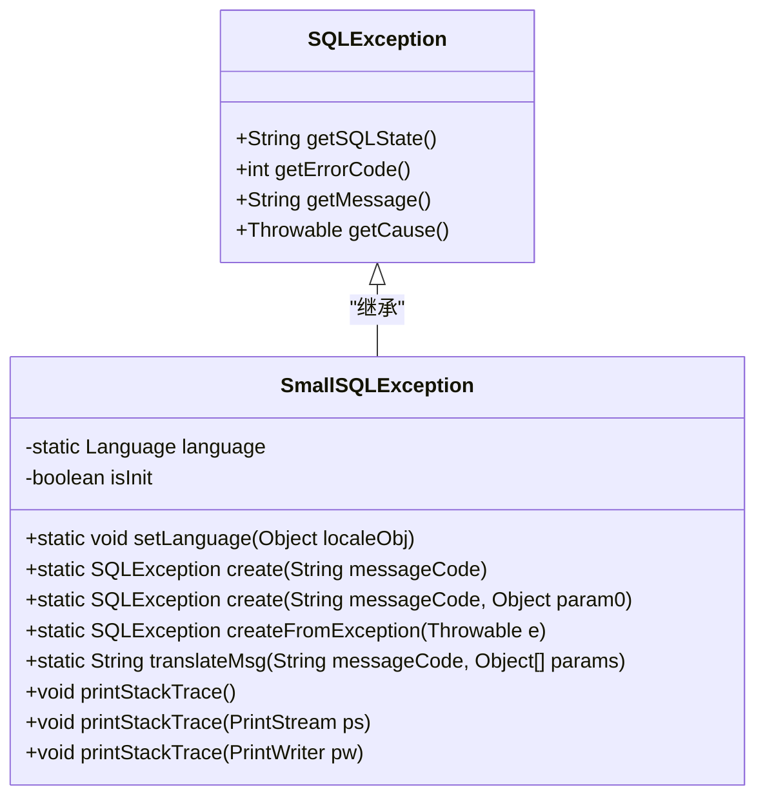
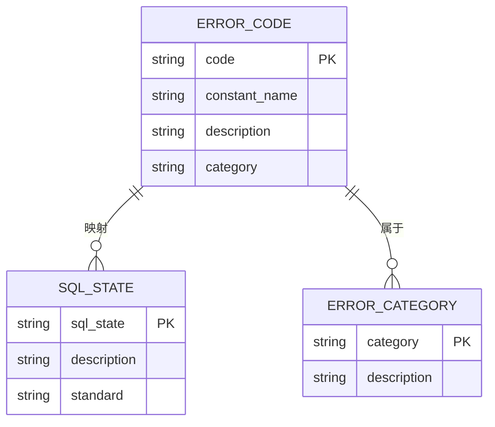
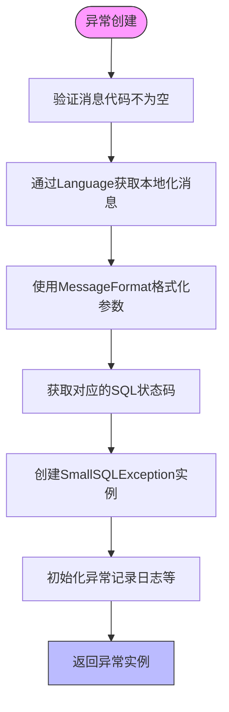

# 异常处理

<cite>
**本文档中引用的文件**   
- [SmallSQLException.java](file://src/main/java/io/leavesfly/smallsql/jdbc/SmallSQLException.java)
- [Language.java](file://src/main/java/io/leavesfly/smallsql/lang/Language.java)
- [TestExceptions.java](file://src/test/java/io/leavesfly/smallsql/junit/sql/dql/TestExceptions.java)
</cite>

## 目录
1. [简介](#简介)
2. [异常层次结构](#异常层次结构)
3. [异常分类体系](#异常分类体系)
4. [SQL状态码和错误代码](#sql状态码和错误代码)
5. [异常创建与工厂方法](#异常创建与工厂方法)
6. [异常捕获与处理最佳实践](#异常捕获与处理最佳实践)
7. [通过异常信息定位问题](#通过异常信息定位问题)
8. [常见异常的触发条件与解决方案](#常见异常的触发条件与解决方案)

## 简介
SmallSQL数据库系统通过精心设计的异常处理机制来确保数据库操作的可靠性和可诊断性。本系统基于Java的SQLException构建了一套完整的异常体系，通过SmallSQLException类扩展了标准的JDBC异常处理能力。该异常体系不仅提供了详细的错误信息，还支持多语言本地化，使得开发者能够更准确地识别和解决数据库操作中的问题。异常系统涵盖了从语法解析到运行时执行的各个阶段，为数据库操作提供了全面的错误报告和诊断支持。

## 异常层次结构
SmallSQLException类继承自java.sql.SQLException，构成了SmallSQL数据库异常体系的核心。这种继承关系使得SmallSQLException能够兼容标准的JDBC异常处理机制，同时扩展了特定于SmallSQL的功能。异常层次结构的设计遵循了面向对象的原则，通过单一的异常类来处理所有数据库相关的错误，简化了异常处理的复杂性。SmallSQLException作为SQLException的子类，保留了父类的所有属性和方法，同时添加了针对SmallSQL特性的增强功能，如本地化消息支持和统一的错误代码体系。

**异常来源**
- [SmallSQLException.java](file://src/main/java/io/leavesfly/smallsql/jdbc/SmallSQLException.java#L46-L230)

**本节来源**
- [SmallSQLException.java](file://src/main/java/io/leavesfly/smallsql/jdbc/SmallSQLException.java#L46-L230)

## 异常分类体系
SmallSQL的异常分类体系通过预定义的异常代码来区分不同类型的数据库错误。这些异常代码按照错误的性质和发生阶段进行了系统化的分类，主要包括语法错误、约束违反、连接异常等类别。每个异常类别都有特定的前缀和编号范围，便于快速识别错误类型。例如，以"SS-06"开头的异常代码通常表示语法错误，而以"SS-03"开头的代码则表示值相关的错误。这种分类体系不仅有助于开发者快速定位问题根源，也为自动化错误处理提供了基础。

### 语法错误
语法错误发生在SQL语句的解析阶段，当输入的SQL语句不符合语法规则时抛出。这类异常通常以"SS-06"开头，如STXADD_IDENT_EXPECT（标识符期望）和SYNTAX_BASE_OFS（偏移量处的语法错误）。语法错误的检测由SQLParser组件负责，它在解析SQL语句时会验证语法结构的正确性。常见的语法错误包括缺少关键字、标识符格式错误、括号不匹配等。

### 约束违反
约束违反异常发生在数据操作违反数据库约束条件时。这类异常包括主键冲突（KEY_DUPLICATE）、外键约束（FK_NOT_TABLE）和列值约束（VALUE_NULL_INVALID）等。当INSERT或UPDATE操作试图插入重复的主键值，或违反NOT NULL约束时，系统会抛出相应的异常。这些异常帮助维护数据的完整性和一致性，防止无效数据进入数据库。

### 连接异常
连接异常与数据库连接的状态和管理相关。当尝试对已关闭的连接执行操作时，会抛出CONNECTION_CLOSED异常。这类异常还包括数据库文件锁定（CANT_LOCK_FILE）和数据库不存在（DB_NONEXISTENT）等情况。连接异常的处理对于确保应用程序的健壮性至关重要，特别是在多线程环境下。

### 数据类型异常
数据类型异常发生在数据类型不匹配或转换失败时。例如，UNSUPPORTED_CONVERSION表示无法将一种数据类型转换为另一种类型，VALUE_CANT_CONVERT表示特定值无法转换为目标类型。这类异常还包括日期时间值无效（DATETIME_INVALID）和数值超出范围（MONTH_TOOLARGE）等情况。数据类型异常的详细信息有助于诊断数据映射和转换问题。

**本节来源**
- [Language.java](file://src/main/java/io/leavesfly/smallsql/lang/Language.java#L50-L550)

## SQL状态码和错误代码
SmallSQL实现了标准的SQL状态码（SQLState）和自定义错误代码的双重编码体系。SQL状态码遵循SQL标准，使用五位字母数字代码，如"01000"表示警告，"HY010"表示函数序列错误。每个异常代码都映射到相应的SQL状态码，确保了与标准JDBC驱动的兼容性。同时，SmallSQL使用自定义的错误代码（如"SS-0613"）提供更详细的错误信息，这些代码具有描述性的常量名称，便于理解和处理。

### SQL状态码编码规则
SQL状态码采用五位字符的格式，第一位表示错误类别，后四位提供更具体的错误信息。在SmallSQL中，大多数异常映射到"01000"（警告）状态码，而特定的异常如STMT_IS_CLOSED则使用"HY010"。这种映射策略确保了异常的兼容性，同时允许在需要时使用更精确的状态码。SQL状态码的主要优势在于其标准化，使得不同数据库系统的错误可以统一处理。

### 错误代码编码规则
SmallSQL的错误代码采用"SS-XXX"格式，其中"SS"代表SmallSQL，"XXX"是三位数字代码。这些代码按功能模块和错误类型进行组织，前两位数字表示错误类别，最后一位提供具体错误的区分。例如，"SS-06"系列用于语法错误，"SS-03"系列用于值错误。每个错误代码都定义为Language类中的常量，如STXADD_IDENT_EXPECT表示"期望标识符"。这种编码规则提供了良好的可读性和可维护性。

### 诊断价值
SQL状态码和错误代码的组合提供了强大的诊断能力。SQL状态码允许应用程序根据标准类别进行通用错误处理，而具体的错误代码则提供了精确的错误信息。开发者可以根据错误代码快速定位问题根源，而无需解析错误消息文本。此外，错误代码的稳定性使得自动化错误处理和日志分析成为可能。通过分析错误代码的分布，还可以识别系统中的常见问题模式。

**异常来源**
- [Language.java](file://src/main/java/io/leavesfly/smallsql/lang/Language.java#L488-L514)
- [SmallSQLException.java](file://src/main/java/io/leavesfly/smallsql/jdbc/SmallSQLException.java#L129-L159)

**本节来源**
- [Language.java](file://src/main/java/io/leavesfly/smallsql/lang/Language.java#L488-L514)
- [SmallSQLException.java](file://src/main/java/io/leavesfly/smallsql/jdbc/SmallSQLException.java#L129-L159)

## 异常创建与工厂方法
SmallSQLException提供了多种静态工厂方法来创建异常实例，这些方法构成了异常创建的主要接口。工厂方法模式的使用简化了异常的创建过程，隐藏了复杂的构造逻辑。主要的工厂方法包括create()、createFromException()和translateMsg()，它们支持不同的异常创建场景，从简单的消息异常到包装其他异常的复杂情况。

### create方法系列
create方法系列提供了创建SmallSQLException实例的主要途径。最基础的create(String messageCode)方法接受一个异常代码，通过查找对应的本地化消息和SQL状态码来创建异常。重载的create(String messageCode, Object param0)方法支持带参数的消息格式化，允许在错误消息中插入动态信息，如文件名或列名。这些工厂方法确保了异常创建的一致性和正确性，避免了直接调用构造函数可能带来的问题。

### createFromException方法
createFromException方法专门用于将其他类型的异常转换为SmallSQLException。当传入的异常已经是SQLException时，方法直接返回原异常，避免了不必要的包装。对于其他类型的Throwable，方法会提取其消息并创建一个新的SmallSQLException，同时将原异常设置为原因（cause）。这种方法保持了异常链的完整性，使得错误的根本原因可以被追溯。

### 消息处理方法
translateMsg方法是异常消息处理的核心，它负责获取本地化的错误消息并进行格式化。该方法接受异常代码和参数数组，通过Language类查找对应的消息模板，并使用MessageFormat进行参数替换。这种设计支持多语言环境，使得错误消息可以根据用户的区域设置进行本地化显示。消息的格式化能力也增强了错误信息的实用性，能够包含具体的上下文信息。

**异常来源**
- [SmallSQLException.java](file://src/main/java/io/leavesfly/smallsql/jdbc/SmallSQLException.java#L129-L192)

**本节来源**
- [SmallSQLException.java](file://src/main/java/io/leavesfly/smallsql/jdbc/SmallSQLException.java#L129-L192)

## 异常捕获与处理最佳实践
有效的异常处理是构建健壮数据库应用程序的关键。SmallSQL的异常处理最佳实践包括分层异常处理策略、适当的日志记录和用户友好的错误报告。这些实践旨在平衡错误信息的详细程度和系统的稳定性，确保应用程序能够优雅地处理各种错误情况。

### 分层异常处理策略
分层异常处理策略建议在不同的应用层次采用不同的异常处理方式。在数据访问层，应该捕获具体的SmallSQLException并进行适当的处理或转换。在业务逻辑层，可以根据业务需求对异常进行进一步的处理或包装。在用户界面层，则应该将技术性的异常信息转换为用户可以理解的错误消息。这种分层方法避免了异常信息的泄露，同时保持了错误处理的灵活性。

### 日志记录建议
日志记录是异常处理的重要组成部分。建议在捕获异常时记录足够的上下文信息，包括SQL语句、参数值和堆栈跟踪。SmallSQLException的printStackTrace方法会自动将异常信息输出到DriverManager的日志写入器，这为调试提供了便利。在生产环境中，应该配置适当的日志级别，避免过度记录影响性能。同时，应该注意不要在日志中记录敏感信息，如密码或个人身份信息。

### 异常传播原则
在决定是否捕获和处理异常时，应该考虑异常的性质和处理能力。对于可以恢复的错误，如连接超时，应该尝试重试或使用备用方案。对于不可恢复的错误，如语法错误，应该让异常向上传播，由更高层次的处理器决定如何处理。避免空的catch块或仅仅打印堆栈跟踪而不采取任何行动，这会掩盖问题并使调试变得困难。

**本节来源**
- [SmallSQLException.java](file://src/main/java/io/leavesfly/smallsql/jdbc/SmallSQLException.java#L200-L230)
- [TestExceptions.java](file://src/test/java/io/leavesfly/smallsql/junit/sql/dql/TestExceptions.java#L50-L100)

## 通过异常信息定位问题
SmallSQL的异常信息设计旨在帮助开发者快速定位和解决问题。异常消息通常包含具体的错误描述和相关的上下文信息，如SQL语句中的偏移量、无效的值或缺失的对象名称。通过分析异常代码和消息，可以准确地确定问题的性质和位置。

### SQL语句错误定位
对于语法错误，异常信息通常包含错误发生的偏移量和附近的SQL文本。例如，SYNTAX_BASE_OFS异常会指出语法错误在SQL字符串中的具体位置。结合原始SQL语句，开发者可以快速找到问题代码。对于语义错误，如列不存在或表不存在，异常消息会明确指出缺失的对象名称，便于验证模式定义。

### 数据类型不匹配问题
当发生数据类型不匹配时，异常信息会详细说明源类型和目标类型。例如，UNSUPPORTED_CONVERSION异常会指出无法将哪种类型转换为哪种类型。对于值范围错误，如日期时间值无效，异常消息会包含具体的无效值，帮助识别数据源的问题。这些详细信息对于调试数据映射和转换逻辑非常有价值。

### 资源和状态问题
对于连接和资源相关的异常，信息会明确指出资源的状态。例如，CONNECTION_CLOSED异常表明连接已关闭，提示需要检查连接管理逻辑。对于文件锁定问题，CANT_LOCK_FILE异常会指出无法锁定的具体文件，帮助诊断并发访问问题。这些信息对于解决环境相关的问题至关重要。

**本节来源**
- [Language.java](file://src/main/java/io/leavesfly/smallsql/lang/Language.java#L471-L496)
- [TestExceptions.java](file://src/test/java/io/leavesfly/smallsql/junit/sql/dql/TestExceptions.java#L20-L40)

## 常见异常的触发条件与解决方案
了解常见异常的触发条件和解决方案对于高效开发和维护SmallSQL应用程序至关重要。以下是一些最常见的异常及其处理方法。

### 语法错误（SS-06系列）
**触发条件**：SQL语句不符合语法规则，如缺少关键字、标识符错误或括号不匹配。
**解决方案**：检查SQL语句的语法，确保所有关键字和标识符正确使用。使用SQL格式化工具可以帮助识别结构问题。

### 连接关闭异常（SS-0070）
**触发条件**：对已关闭的数据库连接执行操作。
**解决方案**：在执行数据库操作前检查连接状态，或实现连接池来管理连接生命周期。

### 列不存在异常（SS-0401）
**触发条件**：SQL语句引用了不存在的列。
**解决方案**：验证表结构和列名拼写，使用数据库元数据API动态获取列信息。

### 主键冲突异常（SS-0222）
**触发条件**：INSERT操作试图插入重复的主键值。
**解决方案**：在插入前检查记录是否存在，或使用UPSERT语句（如果支持）。

### 数据类型转换异常（SS-0287）
**触发条件**：尝试将一种数据类型转换为不兼容的另一种类型。
**解决方案**：确保数据类型匹配，或使用显式转换函数。

**本节来源**
- [Language.java](file://src/main/java/io/leavesfly/smallsql/lang/Language.java#L50-L550)
- [TestExceptions.java](file://src/test/java/io/leavesfly/smallsql/junit/sql/dql/TestExceptions.java#L10-L140)