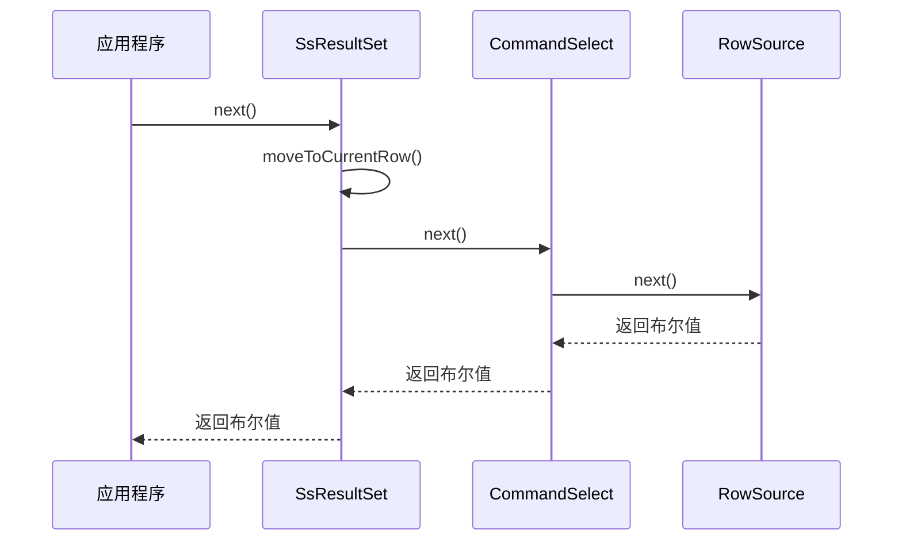
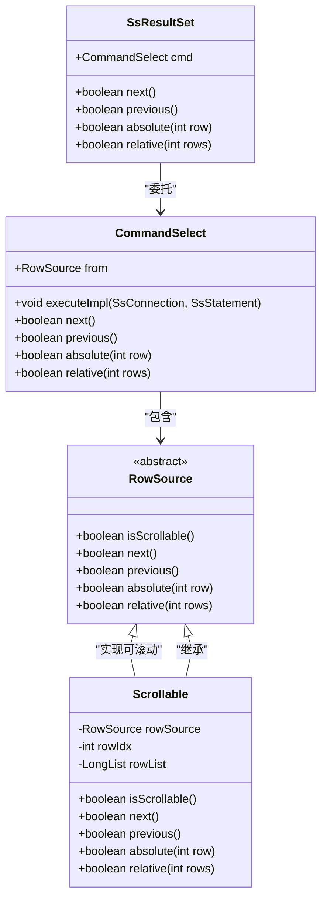
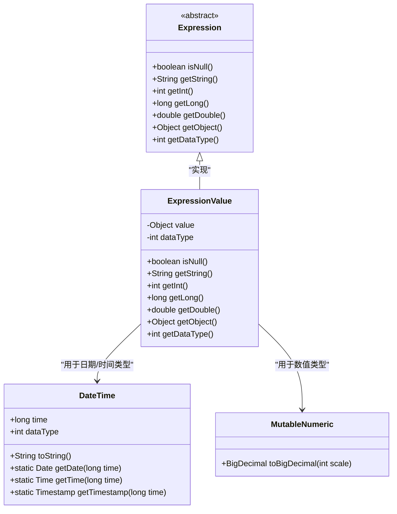
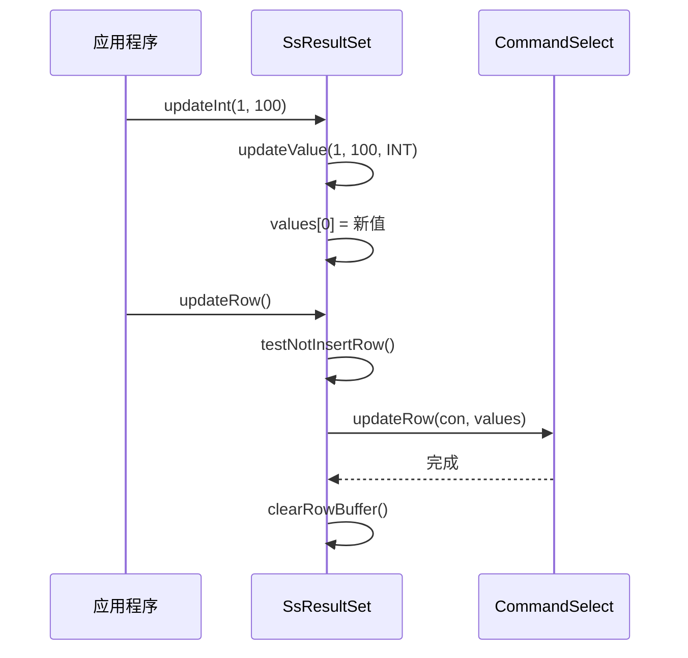
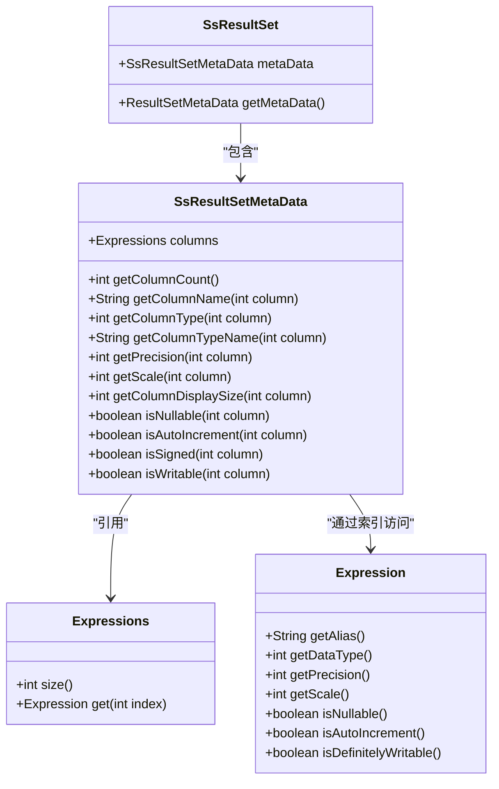

# 结果集处理

<cite>
**本文档中引用的文件**  
- [SsResultSet.java](file://src/main/java/io/leavesfly/smallsql/jdbc/SsResultSet.java)
- [SsResultSetMetaData.java](file://src/main/java/io/leavesfly/smallsql/jdbc/metadata/SsResultSetMetaData.java)
- [CommandSelect.java](file://src/main/java/io/leavesfly/smallsql/rdb/command/dql/CommandSelect.java)
- [Scrollable.java](file://src/main/java/io/leavesfly/smallsql/rdb/engine/selector/Scrollable.java)
- [RowSource.java](file://src/main/java/io/leavesfly/smallsql/rdb/engine/RowSource.java)
- [Expression.java](file://src/main/java/io/leavesfly/smallsql/rdb/sql/expression/Expression.java)
- [DateTime.java](file://src/main/java/io/leavesfly/smallsql/rdb/sql/datatype/DateTime.java)
- [ExpressionValue.java](file://src/main/java/io/leavesfly/smallsql/rdb/sql/expression/ExpressionValue.java)
</cite>

## 目录
1. [引言](#引言)
2. [游标导航与可滚动特性](#游标导航与可滚动特性)
3. [数据访问方法与类型转换规则](#数据访问方法与类型转换规则)
4. [可更新结果集实现机制](#可更新结果集实现机制)
5. [结果集元数据访问](#结果集元数据访问)
6. [大数据集流式处理与内存管理](#大数据集流式处理与内存管理)
7. [结论](#结论)

## 引言

`SsResultSet` 是 SmallSQL 数据库库中的核心组件，实现了 JDBC `ResultSet` 接口，用于处理 SQL 查询返回的数据集。该组件支持游标导航、数据访问、可更新性以及元数据查询等关键功能。本文档全面分析 `SsResultSet` 的游标操作、数据访问方法、可更新性实现机制、元数据访问方式以及大数据集处理的最佳实践。

**Section sources**
- [SsResultSet.java](file://src/main/java/io/leavesfly/smallsql/jdbc/SsResultSet.java#L0-L1338)

## 游标导航与可滚动特性

`SsResultSet` 的游标导航功能通过 `next()`、`previous()`、`absolute()` 和 `relative()` 等方法实现，其底层依赖于 `RowSource` 抽象类和 `Scrollable` 包装器。

### 游标导航方法

游标导航方法通过委托给 `CommandSelect` 对象，再由 `CommandSelect` 调用其内部的 `RowSource` 实现。



**Diagram sources**
- [SsResultSet.java](file://src/main/java/io/leavesfly/smallsql/jdbc/SsResultSet.java#L350-L365)
- [CommandSelect.java](file://src/main/java/io/leavesfly/smallsql/rdb/command/dql/CommandSelect.java#L315-L324)

### 可滚动性实现

`SsResultSet` 的可滚动性由 `Scrollable` 类实现。当创建 `ResultSet` 时，如果请求的类型为 `TYPE_SCROLL_INSENSITIVE` 或 `TYPE_SCROLL_SENSITIVE`，`CommandSelect` 会将原始的 `RowSource` 包装在 `Scrollable` 中。



**Diagram sources**
- [CommandSelect.java](file://src/main/java/io/leavesfly/smallsql/rdb/command/dql/CommandSelect.java#L297-L304)
- [Scrollable.java](file://src/main/java/io/leavesfly/smallsql/rdb/engine/selector/Scrollable.java#L1-L236)
- [RowSource.java](file://src/main/java/io/leavesfly/smallsql/rdb/engine/RowSource.java#L1-L189)

`Scrollable` 类通过 `rowList`（`LongList` 类型）缓存已访问行的位置，从而实现双向滚动。`rowIdx` 变量跟踪当前行索引。

**Section sources**
- [CommandSelect.java](file://src/main/java/io/leavesfly/smallsql/rdb/command/dql/CommandSelect.java#L297-L304)
- [Scrollable.java](file://src/main/java/io/leavesfly/smallsql/rdb/engine/selector/Scrollable.java#L1-L236)

## 数据访问方法与类型转换规则

`SsResultSet` 提供了 `getString()`、`getInt()`、`getTimestamp()` 等一系列 `getXXX()` 方法来访问当前行的数据。这些方法的实现依赖于 `Expression` 接口和 `ExpressionValue` 类。

### 数据访问方法

所有 `getXXX()` 方法都通过 `getValue(columnIndex)` 获取一个 `Expression` 对象，然后调用该对象的相应 `getXXX()` 方法。

```mermaid
flowchart TD
Start([getString(columnIndex)]) --> GetExpr["getValue(columnIndex)"]
GetExpr --> IsNull{"isNull()?"}
IsNull --> |是| ReturnNull["返回 null"]
IsNull --> |否| GetStr["expr.getString()"]
GetStr --> ReturnStr["返回字符串"]
style ReturnNull fill:#f9f,stroke:#333
style ReturnStr fill:#f9f,stroke:#333
```

**Diagram sources**
- [SsResultSet.java](file://src/main/java/io/leavesfly/smallsql/jdbc/SsResultSet.java#L84-L102)

### 类型转换规则

类型转换规则由 `Expression` 及其子类 `ExpressionValue` 定义。`ExpressionValue` 类根据其内部的 `dataType` 字段执行类型转换。



**Diagram sources**
- [Expression.java](file://src/main/java/io/leavesfly/smallsql/rdb/sql/expression/Expression.java#L1-L247)
- [ExpressionValue.java](file://src/main/java/io/leavesfly/smallsql/rdb/sql/expression/ExpressionValue.java#L1-L734)
- [DateTime.java](file://src/main/java/io/leavesfly/smallsql/rdb/sql/datatype/DateTime.java#L1-L803)

例如，`getTimestamp()` 方法会调用 `DateTime.getTimestamp(long)` 静态方法，将内部的 `long` 时间戳转换为 `java.sql.Timestamp` 对象。

**Section sources**
- [SsResultSet.java](file://src/main/java/io/leavesfly/smallsql/jdbc/SsResultSet.java#L180-L198)
- [ExpressionValue.java](file://src/main/java/io/leavesfly/smallsql/rdb/sql/expression/ExpressionValue.java#L1-L734)
- [DateTime.java](file://src/main/java/io/leavesfly/smallsql/rdb/sql/datatype/DateTime.java#L1-L803)

## 可更新结果集实现机制

`SsResultSet` 支持可更新结果集（updatable result set），允许对当前行进行修改、插入和删除操作。其机制基于 `updateXXX()` 方法、`updateRow()`、`insertRow()` 和 `deleteRow()` 方法。

### 可更新性检查

`SsResultSet` 的可更新性在构造函数中确定，取决于 `Statement` 的并发模式和查询是否包含分组。

```java
public SsResultSet(SsStatement st, CommandSelect cmd) {
    // ...
    isUpdatable = st != null && st.rsConcurrency == CONCUR_UPDATABLE
            && !cmd.isGroupResult();
}
```

**Section sources**
- [SsResultSet.java](file://src/main/java/io/leavesfly/smallsql/jdbc/SsResultSet.java#L45-L48)

### 更新操作流程

更新操作通过 `updateXXX()` 方法将新值暂存到 `values` 数组中，然后通过 `updateRow()` 提交。



**Diagram sources**
- [SsResultSet.java](file://src/main/java/io/leavesfly/smallsql/jdbc/SsResultSet.java#L500-L540)
- [CommandSelect.java](file://src/main/java/io/leavesfly/smallsql/rdb/command/dql/CommandSelect.java#L401-L426)

`CommandSelect.updateRow()` 方法会遍历结果集中的所有表，将更新值映射到正确的列，并调用 `TableViewResult.updateRow()` 执行实际的更新。

**Section sources**
- [SsResultSet.java](file://src/main/java/io/leavesfly/smallsql/jdbc/SsResultSet.java#L500-L540)
- [CommandSelect.java](file://src/main/java/io/leavesfly/smallsql/rdb/command/dql/CommandSelect.java#L401-L426)

## 结果集元数据访问

`SsResultSet` 通过 `getMetaData()` 方法提供对结果集结构信息的访问，返回一个 `SsResultSetMetaData` 对象。

### 元数据结构

`SsResultSetMetaData` 类封装了 `CommandSelect` 的 `columnExpressions`，并实现了 `ResultSetMetaData` 接口。



**Diagram sources**
- [SsResultSet.java](file://src/main/java/io/leavesfly/smallsql/jdbc/SsResultSet.java#L30-L31)
- [SsResultSetMetaData.java](file://src/main/java/io/leavesfly/smallsql/jdbc/metadata/SsResultSetMetaData.java#L1-L338)

`SsResultSetMetaData` 的方法通过调用 `Expression` 对象的相应方法来获取列的元数据信息。

**Section sources**
- [SsResultSet.java](file://src/main/java/io/leavesfly/smallsql/jdbc/SsResultSet.java#L30-L31)
- [SsResultSetMetaData.java](file://src/main/java/io/leavesfly/smallsql/jdbc/metadata/SsResultSetMetaData.java#L1-L338)

## 大数据集流式处理与内存管理

`SsResultSet` 的设计考虑了大数据集的处理效率和内存管理。

### 流式处理

`SsResultSet` 本身不直接处理数据流，而是依赖于底层的 `RowSource` 实现。`RowSource` 的 `next()` 方法按需加载下一行数据，实现了流式处理。

### 内存管理

`Scrollable` 类通过缓存行位置（`rowList`）来支持可滚动性，但这会消耗内存。对于大型结果集，建议使用 `TYPE_FORWARD_ONLY` 类型以避免内存消耗。

`SsResultSet` 还提供了 `setFetchSize()` 方法来提示驱动程序一次获取的行数，这可以优化网络和内存使用。

```java
public void setFetchSize(int rows) {
    fetchSize = rows;
}
```

**Section sources**
- [SsResultSet.java](file://src/main/java/io/leavesfly/smallsql/jdbc/SsResultSet.java#L280-L283)

## 结论

`SsResultSet` 是一个功能完整的 JDBC `ResultSet` 实现，支持游标导航、数据访问、可更新性和元数据查询。其可滚动性通过 `Scrollable` 包装器实现，可更新性通过暂存更新值并在提交时应用来实现。对于大数据集，应谨慎使用可滚动结果集以避免内存问题，并利用 `fetchSize` 提示进行优化。