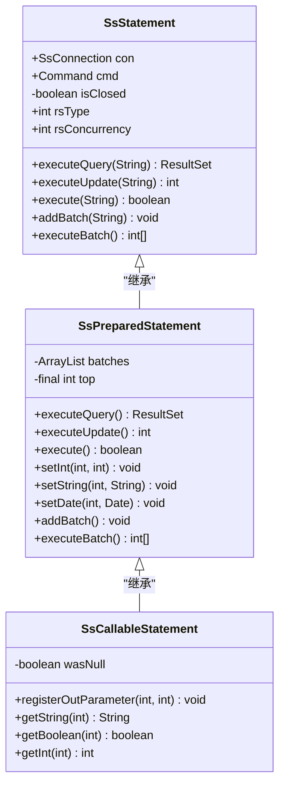
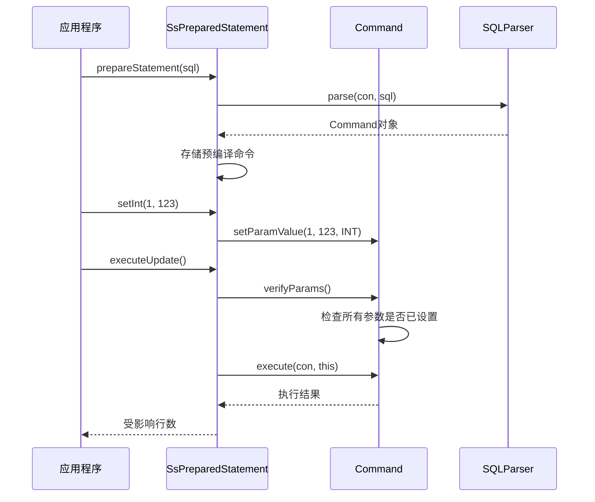
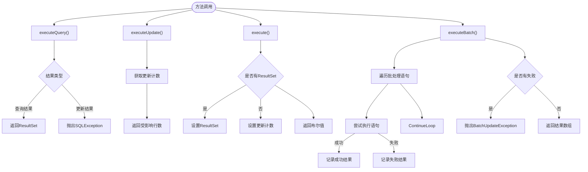
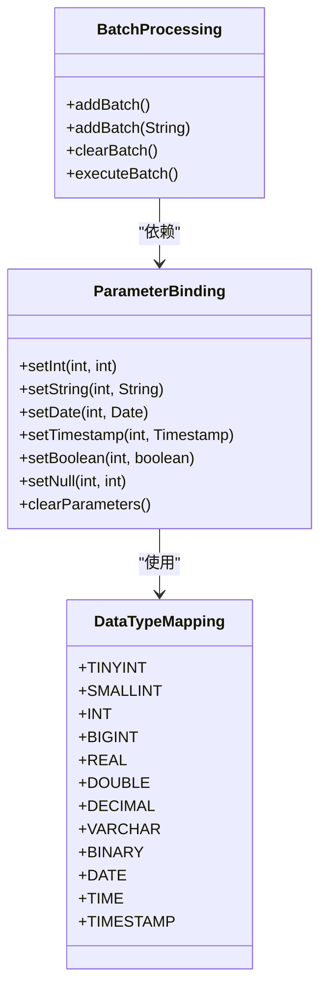
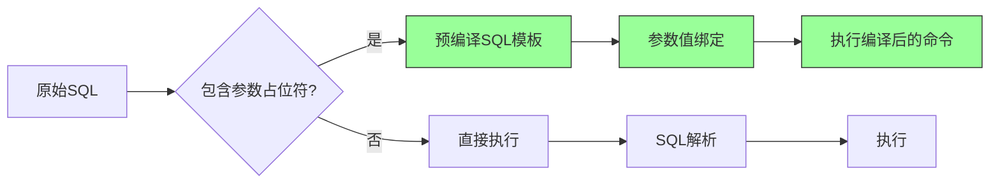
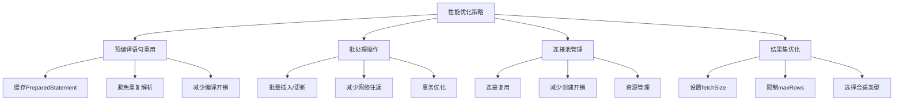

# 语句执行

<cite>
**本文档引用的文件**
- [SsStatement.java](file://src/main/java/io/leavesfly/smallsql/jdbc/statement/SsStatement.java)
- [SsPreparedStatement.java](file://src/main/java/io/leavesfly/smallsql/jdbc/statement/SsPreparedStatement.java)
- [SsCallableStatement.java](file://src/main/java/io/leavesfly/smallsql/jdbc/statement/SsCallableStatement.java)
- [SsConnection.java](file://src/main/java/io/leavesfly/smallsql/jdbc/SsConnection.java)
- [Command.java](file://src/main/java/io/leavesfly/smallsql/rdb/command/Command.java)
</cite>

## 目录
1. [引言](#引言)
2. [语句对象体系结构](#语句对象体系结构)
3. [SsStatement详解](#ssstatement详解)
4. [SsPreparedStatement深入分析](#sspreparedstatement深入分析)
5. [SsCallableStatement接口设计](#sscallablestatement接口设计)
6. [核心方法行为差异](#核心方法行为差异)
7. [参数绑定与批处理机制](#参数绑定与批处理机制)
8. [SQL注入防护实现](#sql注入防护实现)
9. [性能优化建议](#性能优化建议)
10. [结论](#结论)

## 引言
SmallSQL数据库系统提供了完整的JDBC语句执行体系，包含SsStatement、SsPreparedStatement和SsCallableStatement三种核心语句对象。这些对象分别针对不同的使用场景，提供了从简单SQL执行到预编译、参数化查询的完整解决方案。本文档系统化地分析这三种语句对象的实现机制、使用场景、性能特征和安全性优势，重点关注SQL注入防护、参数绑定、批处理操作等关键功能的实现细节。

## 语句对象体系结构

**图示来源**
- [SsStatement.java](file://src/main/java/io/leavesfly/smallsql/jdbc/statement/SsStatement.java#L1-L760)
- [SsPreparedStatement.java](file://src/main/java/io/leavesfly/smallsql/jdbc/statement/SsPreparedStatement.java#L1-L524)
- [SsCallableStatement.java](file://src/main/java/leavesfly/smallsql/jdbc/statement/SsCallableStatement.java#L1-L817)

## SsStatement详解
SsStatement是JDBC语句执行的基础实现，用于执行静态SQL语句。它直接继承自java.sql.Statement接口，提供了执行查询、更新和批处理的基本功能。

该类的核心特点是直接执行传入的SQL字符串，每次执行都需要完整的SQL解析和编译过程。这种模式适用于一次性或低频次的SQL执行场景，但在高并发环境下性能较差，且容易受到SQL注入攻击。

SsStatement支持批处理操作，通过addBatch()方法将多个SQL语句添加到批处理队列中，然后通过executeBatch()方法一次性执行所有语句。批处理执行采用顺序执行模式，如果某个语句执行失败，会继续执行后续语句，并在BatchUpdateException中记录失败信息。

**本节来源**
- [SsStatement.java](file://src/main/java/io/leavesfly/smallsql/jdbc/statement/SsStatement.java#L1-L760)

## SsPreparedStatement深入分析

**图示来源**
- [SsPreparedStatement.java](file://src/main/java/io/leavesfly/smallsql/jdbc/statement/SsPreparedStatement.java#L1-L524)
- [Command.java](file://src/main/java/io/leavesfly/smallsql/rdb/command/Command.java#L85-L126)

SsPreparedStatement是预编译语句的实现，继承自SsStatement并实现了java.sql.PreparedStatement接口。其核心优势在于SQL语句的预编译和参数化执行，提供了更高的性能和安全性。

预编译过程在构造函数中完成，通过SQLParser解析SQL语句并生成Command对象。SQL中的参数占位符(?)被识别并存储为参数列表，后续通过setXxx()系列方法设置具体参数值。这种分离式设计使得相同的SQL模板可以被多次重用，只需改变参数值即可。

参数绑定机制通过Command.setParamValue()方法实现，该方法验证参数索引的有效性，并将值和数据类型信息存储在ExpressionValue对象中。执行前会调用verifyParams()方法检查所有参数是否已正确设置，确保执行的完整性。

**本节来源**
- [SsPreparedStatement.java](file://src/main/java/io/leavesfly/smallsql/jdbc/statement/SsPreparedStatement.java#L1-L524)
- [Command.java](file://src/main/java/io/leavesfly/smallsql/rdb/command/Command.java#L85-L126)

## SsCallableStatement接口设计
SsCallableStatement用于执行存储过程调用，继承自SsPreparedStatement并实现了java.sql.CallableStatement接口。尽管SmallSQL可能不完全支持存储过程功能，但该类提供了完整的接口设计。

该类的核心功能包括参数注册和结果获取。通过registerOutParameter()方法可以声明输出参数，通过getXxx()系列方法可以获取输出参数的值。对于命名参数的支持，通过findParameter()方法将参数名转换为索引，然后调用父类的相应方法。

值得注意的是，当前实现中大部分方法都抛出了"方法未实现"的异常，表明存储过程功能尚未完全实现。但接口设计遵循了JDBC规范，为未来功能扩展提供了基础框架。

**本节来源**
- [SsCallableStatement.java](file://src/main/java/io/leavesfly/smallsql/jdbc/statement/SsCallableStatement.java#L1-L817)

## 核心方法行为差异

**图示来源**
- [SsStatement.java](file://src/main/java/io/leavesfly/smallsql/jdbc/statement/SsStatement.java#L440-L464)
- [SsPreparedStatement.java](file://src/main/java/io/leavesfly/smallsql/jdbc/statement/SsPreparedStatement.java#L206-L232)

三种核心执行方法的行为差异如下：

- **executeQuery()**：专门用于执行SELECT查询语句，返回ResultSet对象。如果执行的不是查询语句，会抛出SQLException异常。

- **executeUpdate()**：用于执行INSERT、UPDATE、DELETE等数据修改语句，返回受影响的行数。对于CREATE、DROP等DDL语句，返回值通常为0。

- **execute()**：通用执行方法，根据SQL语句类型返回不同结果。如果产生ResultSet则返回true，否则返回false。通过getResultSet()和getUpdateCount()方法可以获取具体结果。

- **executeBatch()**：批量执行多个SQL语句，返回包含每个语句执行结果的数组。如果部分语句执行失败，会继续执行后续语句，并在BatchUpdateException中记录失败信息。

**本节来源**
- [SsStatement.java](file://src/main/java/io/leavesfly/smallsql/jdbc/statement/SsStatement.java#L440-L464)
- [SsPreparedStatement.java](file://src/main/java/io/leavesfly/smallsql/jdbc/statement/SsPreparedStatement.java#L206-L232)

## 参数绑定与批处理机制

**图示来源**
- [SsPreparedStatement.java](file://src/main/java/io/leavesfly/smallsql/jdbc/statement/SsPreparedStatement.java#L92-L156)
- [Command.java](file://src/main/java/io/leavesfly/smallsql/rdb/command/Command.java#L85-L126)

参数绑定机制通过一系列setXxx()方法实现，每个方法对应一种Java数据类型。参数值通过Command.setParamValue()方法存储在ExpressionValue对象中，同时记录数据类型信息。这种设计确保了类型安全和正确的数据转换。

批处理机制在SsStatement和SsPreparedStatement中有不同的实现：
- SsStatement的批处理直接存储SQL字符串列表
- SsPreparedStatement的批处理存储参数值的克隆副本，允许在预编译模板上执行多次不同参数的批量操作

批处理执行采用"尽力而为"策略，即使部分语句失败也会继续执行剩余语句，确保最大化的数据处理效率。

**本节来源**
- [SsPreparedStatement.java](file://src/main/java/io/leavesfly/smallsql/jdbc/statement/SsPreparedStatement.java#L92-L156)
- [Command.java](file://src/main/java/io/leavesfly/smallsql/rdb/command/Command.java#L85-L126)

## SQL注入防护实现

**图示来源**
- [SsPreparedStatement.java](file://src/main/java/io/leavesfly/smallsql/jdbc/statement/SsPreparedStatement.java#L1-L524)
- [SQLParser.java](file://src/main/java/io/leavesfly/smallsql/rdb/sql/SQLParser.java#L1-L100)

SQL注入防护主要通过预编译语句实现，其核心机制包括：

1. **SQL与数据分离**：SQL语句在预编译阶段被解析和编译，参数占位符(?)被识别为参数节点。实际参数值在执行时才绑定，确保用户输入不会被解释为SQL代码。

2. **类型安全绑定**：所有参数值都通过特定的setXxx()方法设置，确保数据类型的一致性。字符串值不会被错误地解释为SQL片段。

3. **参数验证**：执行前通过verifyParams()方法检查所有参数是否已设置，防止参数缺失导致的意外行为。

4. **日志记录**：参数设置过程会被记录到日志中，便于审计和调试。

这种设计从根本上防止了SQL注入攻击，因为恶意输入只能作为数据值处理，而不会改变SQL语句的结构。

**本节来源**
- [SsPreparedStatement.java](file://src/main/java/io/leavesfly/smallsql/jdbc/statement/SsPreparedStatement.java#L1-L524)
- [SQLParser.java](file://src/main/java/io/leavesfly/smallsql/rdb/sql/SQLParser.java#L1-L100)

## 性能优化建议

**图示来源**
- [SsStatement.java](file://src/main/java/io/leavesfly/smallsql/jdbc/statement/SsStatement.java#L200-L250)
- [SsPreparedStatement.java](file://src/main/java/io/leavesfly/smallsql/jdbc/statement/SsPreparedStatement.java#L1-L524)

基于SmallSQL的实现特点，提出以下性能优化建议：

1. **预编译语句重用**：对于频繁执行的SQL语句，应使用PreparedStatement并缓存其实例，避免重复的SQL解析和编译开销。

2. **批处理操作**：对于大量相似的数据操作，使用addBatch()和executeBatch()方法进行批量处理，显著减少网络往返和事务开销。

3. **合理设置结果集参数**：通过setMaxRows()限制返回行数，通过setFetchSize()优化网络传输批次，避免一次性加载过多数据。

4. **连接管理**：虽然SmallSQL是嵌入式数据库，但仍应注意及时关闭Statement和ResultSet对象，释放相关资源。

5. **参数化查询**：始终使用参数化查询而非字符串拼接，既保证安全性又提高性能。

**本节来源**
- [SsStatement.java](file://src/main/java/io/leavesfly/smallsql/jdbc/statement/SsStatement.java#L200-L250)
- [SsPreparedStatement.java](file://src/main/java/io/leavesfly/smallsql/jdbc/statement/SsPreparedStatement.java#L1-L524)

## 结论
SmallSQL的语句执行体系提供了完整的JDBC兼容实现，通过SsStatement、SsPreparedStatement和SsCallableStatement三个层次满足不同的使用需求。SsStatement适用于简单的静态SQL执行，SsPreparedStatement通过预编译和参数化提供了更高的性能和安全性，SsCallableStatement为存储过程调用提供了接口基础。

核心优势在于预编译语句的SQL注入防护机制，通过SQL与数据的完全分离，从根本上防止了注入攻击。批处理机制和参数绑定系统设计合理，支持高效的数据操作。尽管存储过程功能尚未完全实现，但整体架构为未来扩展留下了良好基础。

在实际使用中，建议优先使用PreparedStatement进行参数化查询，充分利用其性能和安全优势，同时合理运用批处理功能提高数据操作效率。