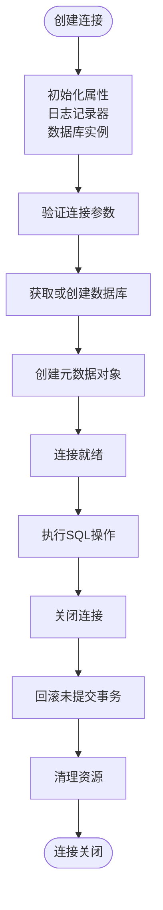
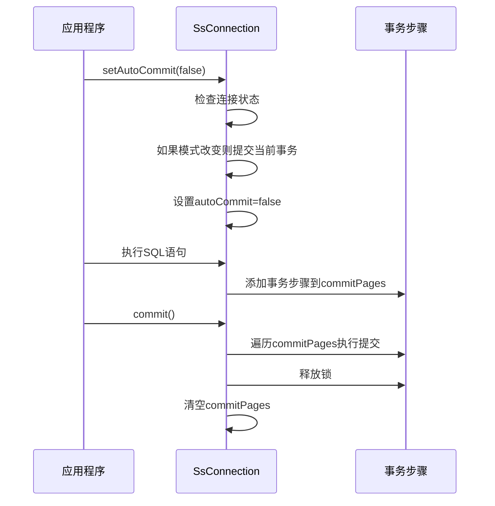
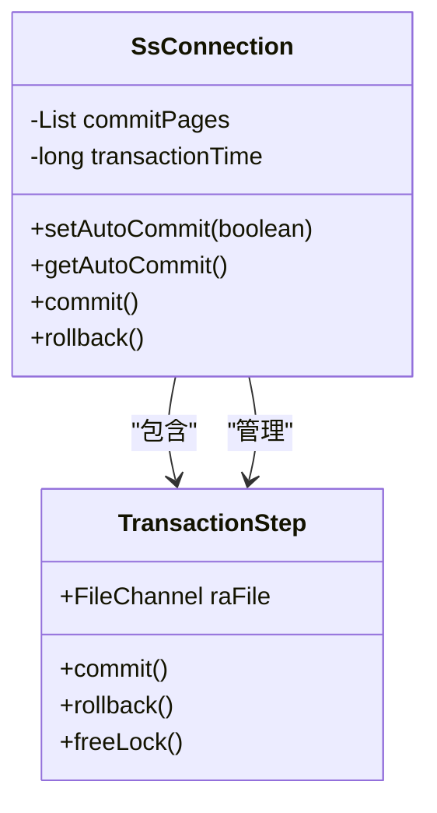
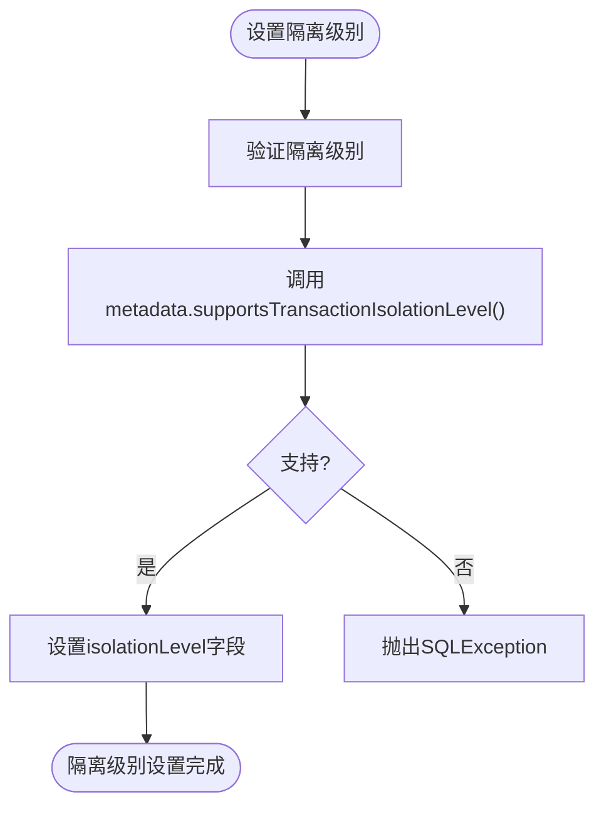
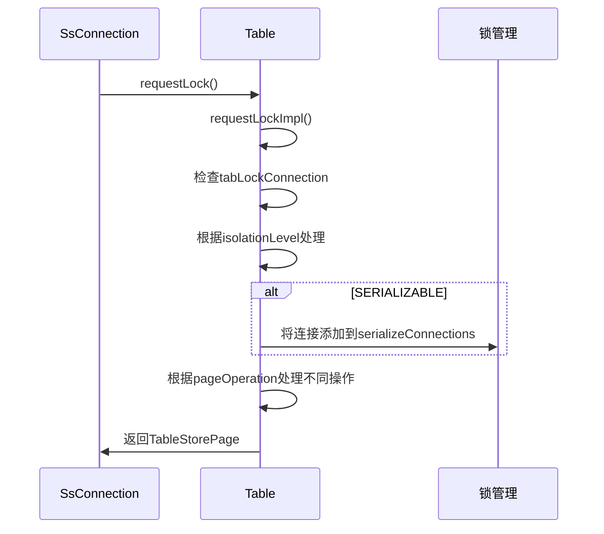
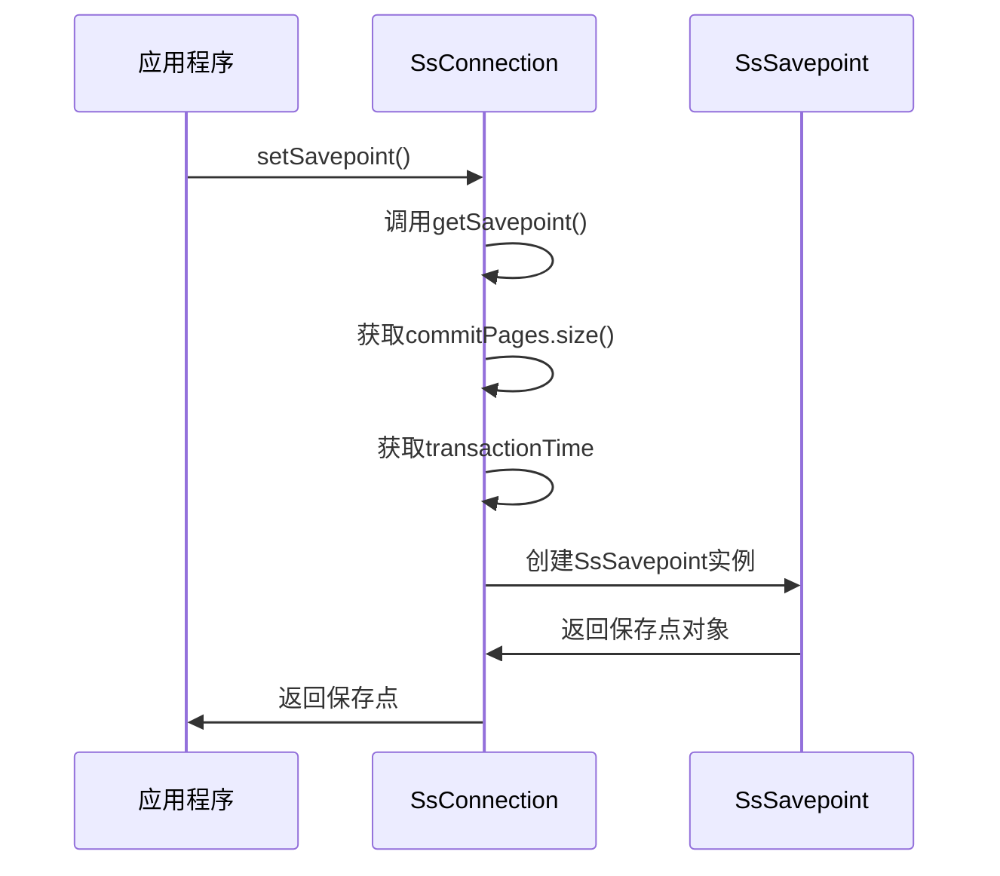
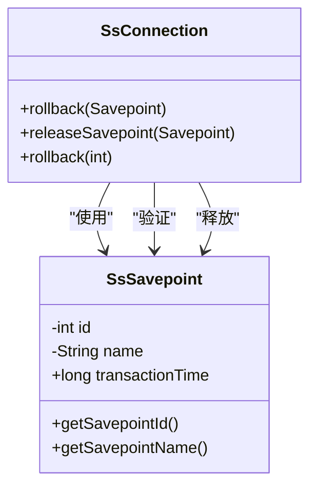
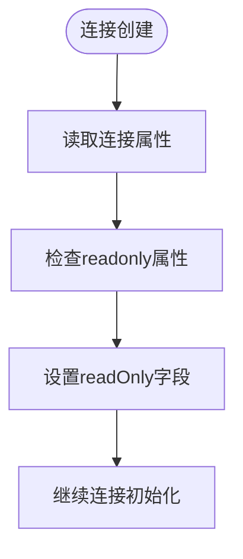
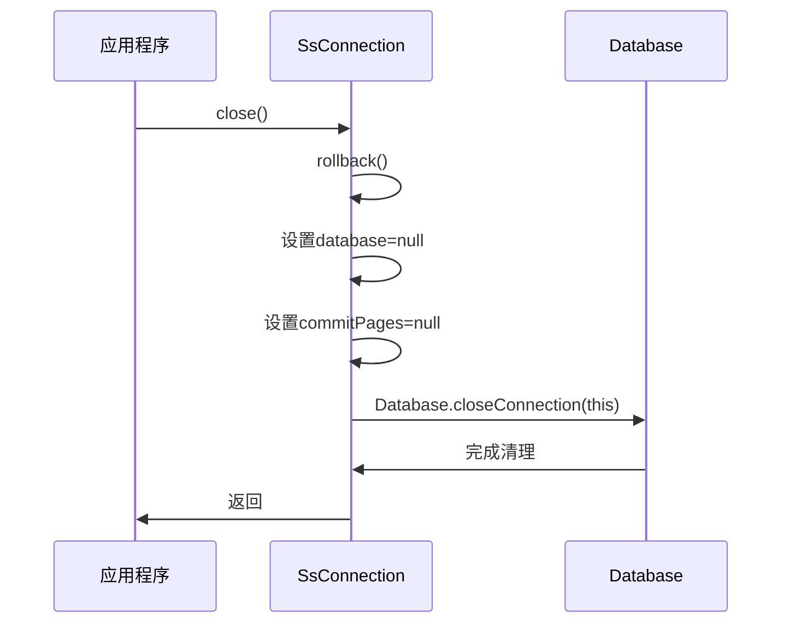
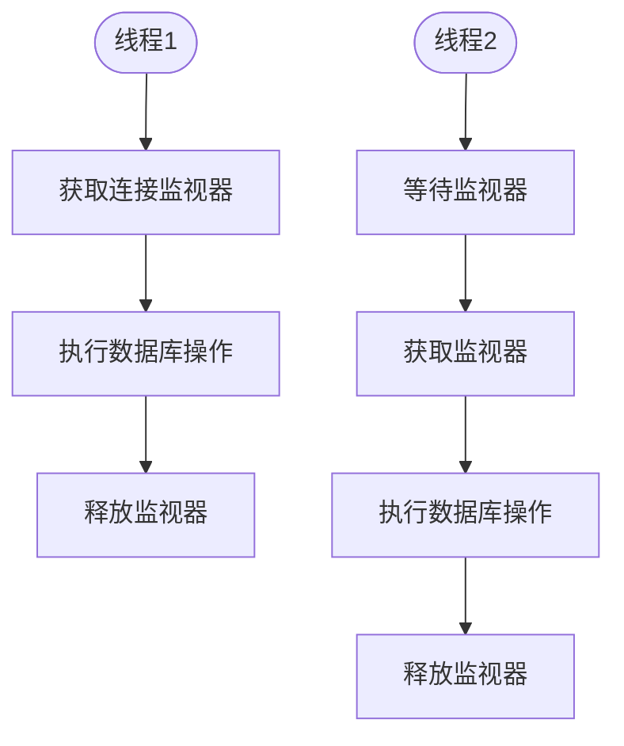

# 连接管理

<cite>
**本文档中引用的文件**  
- [SsConnection.java](file://src/main/java/io/leavesfly/smallsql/jdbc/SsConnection.java)
- [SsSavepoint.java](file://src/main/java/io/leavesfly/smallsql/jdbc/statement/SsSavepoint.java)
- [TransactionStep.java](file://src/main/java/io/leavesfly/smallsql/rdb/engine/TransactionStep.java)
- [Table.java](file://src/main/java/io/leavesfly/smallsql/rdb/engine/Table.java)
- [SsDatabaseMetaData.java](file://src/main/java/io/leavesfly/smallsql/jdbc/metadata/SsDatabaseMetaData.java)
</cite>

## 目录
1. [连接生命周期管理](#连接生命周期管理)
2. [事务控制机制](#事务控制机制)
3. [事务隔离级别实现](#事务隔离级别实现)
4. [保存点管理](#保存点管理)
5. [连接属性配置](#连接属性配置)
6. [连接关闭与资源清理](#连接关闭与资源清理)
7. [多线程使用注意事项](#多线程使用注意事项)

## 连接生命周期管理

SsConnection 类实现了 java.sql.Connection 接口，代表与 SmallSQL 数据库的一个连接。连接的生命周期从创建到关闭，通过 SsConnection 类的构造函数和 close() 方法进行管理。

连接通过 Properties 对象配置，支持数据库路径（dbpath）、只读模式（readonly）和是否创建数据库（create）等属性。连接创建时会初始化数据库实例、元数据对象和日志记录器。



**图示来源**
- [SsConnection.java](file://src/main/java/io/leavesfly/smallsql/jdbc/SsConnection.java#L122-L161)

**本节来源**
- [SsConnection.java](file://src/main/java/io/leavesfly/smallsql/jdbc/SsConnection.java#L122-L161)

## 事务控制机制

SsConnection 类提供了完整的事务控制机制，包括自动提交模式管理、事务提交和回滚功能。事务控制的核心是通过 commitPages 列表来跟踪事务中的所有修改操作。

### 自动提交模式

setAutoCommit() 方法用于设置连接的自动提交模式。当自动提交模式启用时（默认值），每个 SQL 语句都会被视为一个独立的事务并自动提交。禁用自动提交模式后，多个 SQL 语句可以组合成一个事务。



**图示来源**
- [SsConnection.java](file://src/main/java/io/leavesfly/smallsql/jdbc/SsConnection.java#L218-L235)

**本节来源**
- [SsConnection.java](file://src/main/java/io/leavesfly/smallsql/jdbc/SsConnection.java#L218-L235)

### 提交与回滚

commit() 方法提交当前事务，将所有挂起的更改永久保存到数据库。rollback() 方法回滚当前事务，撤销所有未提交的更改。两种操作都会清空 commitPages 列表并更新事务时间戳。



**图示来源**
- [SsConnection.java](file://src/main/java/io/leavesfly/smallsql/jdbc/SsConnection.java#L256-L283)
- [TransactionStep.java](file://src/main/java/io/leavesfly/smallsql/rdb/engine/TransactionStep.java#L1-L57)

**本节来源**
- [SsConnection.java](file://src/main/java/io/leavesfly/smallsql/jdbc/SsConnection.java#L256-L283)
- [TransactionStep.java](file://src/main/java/io/leavesfly/smallsql/rdb/engine/TransactionStep.java#L1-L57)

## 事务隔离级别实现

SsConnection 支持所有标准的事务隔离级别，包括 READ_UNCOMMITTED、READ_COMMITTED、REPEATABLE_READ 和 SERIALIZABLE。隔离级别的实现主要通过表级别的锁机制来完成。

### 隔离级别支持

通过 SsDatabaseMetaData 类的 supportsTransactionIsolationLevel() 方法验证支持的隔离级别。所有标准隔离级别都被支持，确保了与 JDBC 规范的兼容性。



**图示来源**
- [SsConnection.java](file://src/main/java/io/leavesfly/smallsql/jdbc/SsConnection.java#L405-L417)
- [SsDatabaseMetaData.java](file://src/main/java/io/leavesfly/smallsql/jdbc/metadata/SsDatabaseMetaData.java#L534-L540)

**本节来源**
- [SsConnection.java](file://src/main/java/io/leavesfly/smallsql/jdbc/SsConnection.java#L405-L417)
- [SsDatabaseMetaData.java](file://src/main/java/io/leavesfly/smallsql/jdbc/metadata/SsDatabaseMetaData.java#L534-L540)

### 锁机制实现

Table 类中的 requestLockImpl() 方法根据连接的隔离级别实施不同的锁策略。SERIALIZABLE 隔离级别会将连接添加到 serializeConnections 映射中，确保串行化执行。



**图示来源**
- [Table.java](file://src/main/java/io/leavesfly/smallsql/rdb/engine/Table.java#L373-L375)
- [Table.java](file://src/main/java/io/leavesfly/smallsql/rdb/engine/Table.java#L325-L376)

**本节来源**
- [Table.java](file://src/main/java/io/leavesfly/smallsql/rdb/engine/Table.java#L325-L376)

## 保存点管理

SsConnection 类提供了完整的保存点（Savepoint）管理功能，允许在事务中创建检查点，实现部分回滚。

### 保存点创建

setSavepoint() 方法创建一个新的保存点。无参数版本创建匿名保存点，带名称版本创建命名保存点。保存点记录了创建时的事务状态，包括 commitPages 的大小和事务时间戳。



**图示来源**
- [SsConnection.java](file://src/main/java/io/leavesfly/smallsql/jdbc/SsConnection.java#L518-L524)
- [SsSavepoint.java](file://src/main/java/io/leavesfly/smallsql/jdbc/statement/SsSavepoint.java#L1-L64)

**本节来源**
- [SsConnection.java](file://src/main/java/io/leavesfly/smallsql/jdbc/SsConnection.java#L518-L524)
- [SsSavepoint.java](file://src/main/java/io/leavesfly/smallsql/jdbc/statement/SsSavepoint.java#L1-L64)

### 保存点使用与释放

rollback(Savepoint) 方法回滚到指定的保存点，移除保存点之后的所有事务步骤。releaseSavepoint() 方法释放保存点，通过将 transactionTime 设置为 0 来标记保存点无效。



**图示来源**
- [SsConnection.java](file://src/main/java/io/leavesfly/smallsql/jdbc/SsConnection.java#L545-L562)
- [SsSavepoint.java](file://src/main/java/io/leavesfly/smallsql/jdbc/statement/SsSavepoint.java#L1-L64)

**本节来源**
- [SsConnection.java](file://src/main/java/io/leavesfly/smallsql/jdbc/SsConnection.java#L545-L562)
- [SsSavepoint.java](file://src/main/java/io/leavesfly/smallsql/jdbc/statement/SsSavepoint.java#L1-L64)

## 连接属性配置

SsConnection 支持多种连接属性配置，包括只读模式和事务隔离级别。

### 只读模式

isReadOnly() 和 setReadOnly() 方法用于检查和设置连接的只读模式。虽然当前实现中 setReadOnly() 方法是空实现，但 readOnly 字段在连接创建时根据属性设置。



**图示来源**
- [SsConnection.java](file://src/main/java/io/leavesfly/smallsql/jdbc/SsConnection.java#L76-L78)
- [SsConnection.java](file://src/main/java/io/leavesfly/smallsql/jdbc/SsConnection.java#L122-L161)

**本节来源**
- [SsConnection.java](file://src/main/java/io/leavesfly/smallsql/jdbc/SsConnection.java#L76-L78)
- [SsConnection.java](file://src/main/java/io/leavesfly/smallsql/jdbc/SsConnection.java#L122-L161)

### 事务隔离级别

getTransactionIsolation() 和 setTransactionIsolation() 方法用于获取和设置事务隔离级别。默认隔离级别为 TRANSACTION_READ_COMMITTED，可以通过 setTransactionIsolation() 方法更改。

```mermaid
table
key 隔离级别
key 描述
key 支持状态
row TRANSACTION_NONE
row "不支持事务"
row 支持
row TRANSACTION_READ_UNCOMMITTED
row "读未提交"
row 支持
row TRANSACTION_READ_COMMITTED
row "读已提交"
row 支持
row TRANSACTION_REPEATABLE_READ
row "可重复读"
row 支持
row TRANSACTION_SERIALIZABLE
row "串行化"
row 支持
```

**本节来源**
- [SsConnection.java](file://src/main/java/io/leavesfly/smallsql/jdbc/SsConnection.java#L93-L95)
- [SsDatabaseMetaData.java](file://src/main/java/io/leavesfly/smallsql/jdbc/metadata/SsDatabaseMetaData.java#L534-L540)

## 连接关闭与资源清理

close() 方法负责关闭连接并清理相关资源。关闭连接时会自动回滚任何未提交的事务，释放数据库引用，并通知数据库管理器。



**图示来源**
- [SsConnection.java](file://src/main/java/io/leavesfly/smallsql/jdbc/SsConnection.java#L308-L315)

**本节来源**
- [SsConnection.java](file://src/main/java/io/leavesfly/smallsql/jdbc/SsConnection.java#L308-L315)

## 多线程使用注意事项

SsConnection 对象不是线程安全的，不能被多个线程同时使用。虽然连接可以被多个线程共享，但必须确保同一时间只有一个线程在使用连接。

### 线程安全机制

通过 getMonitor() 方法获取连接的监视器对象，用于同步块。所有关键操作都在 synchronized 块中执行，确保操作的原子性。



**本节来源**
- [SsConnection.java](file://src/main/java/io/leavesfly/smallsql/jdbc/SsConnection.java#L163-L171)
- [SsConnection.java](file://src/main/java/io/leavesfly/smallsql/jdbc/SsConnection.java#L256-L283)