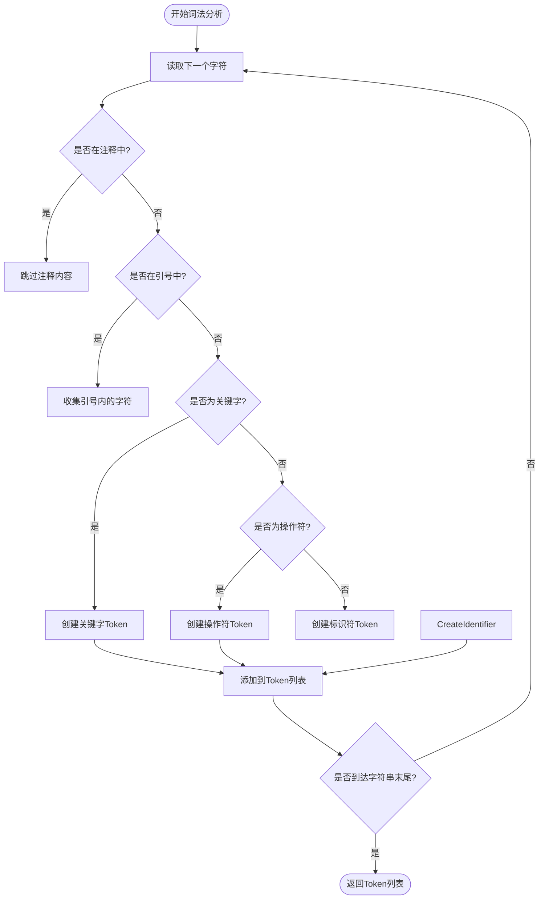
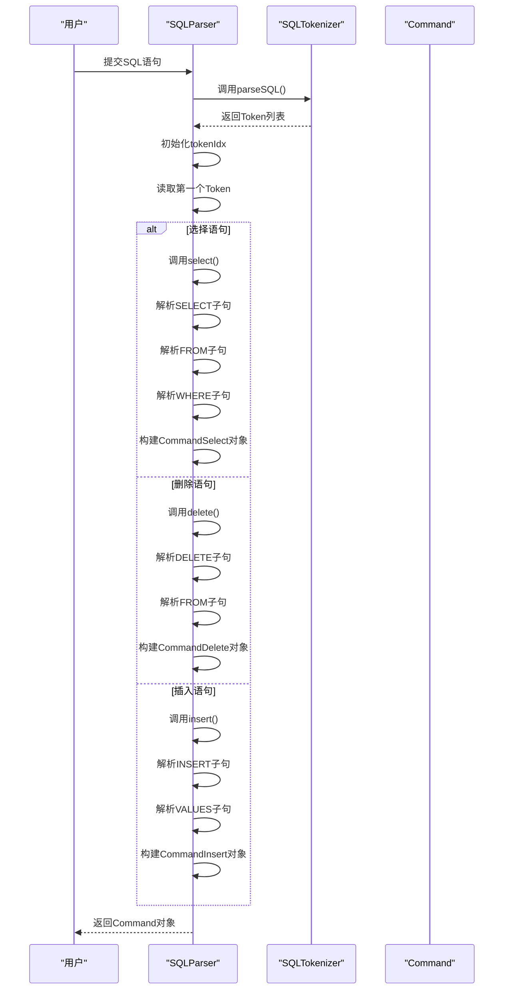
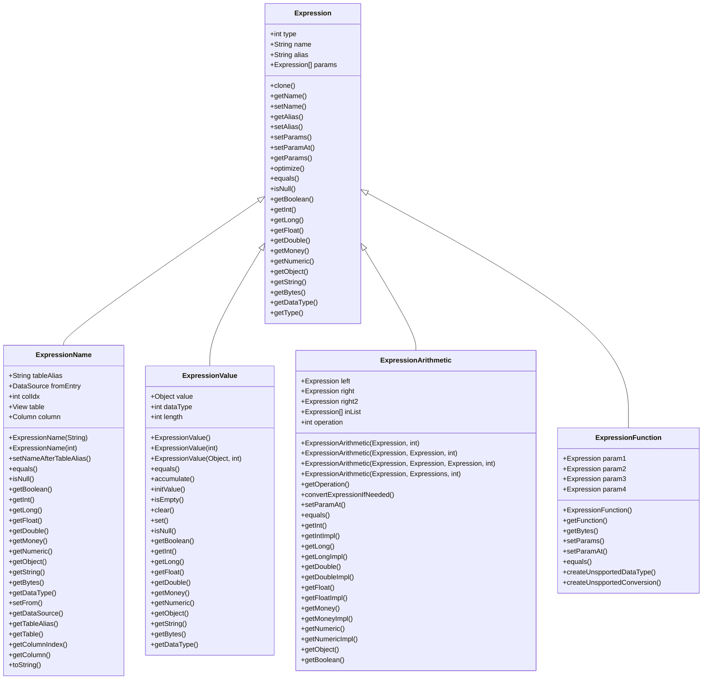
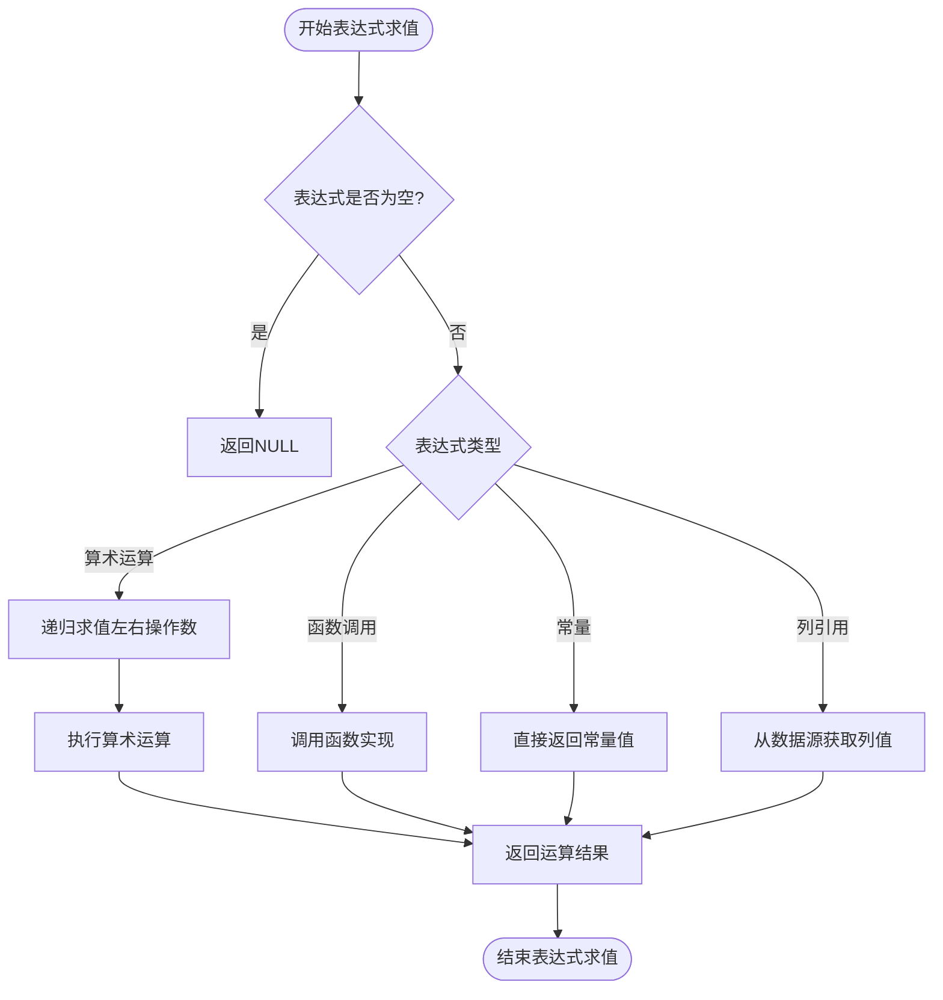
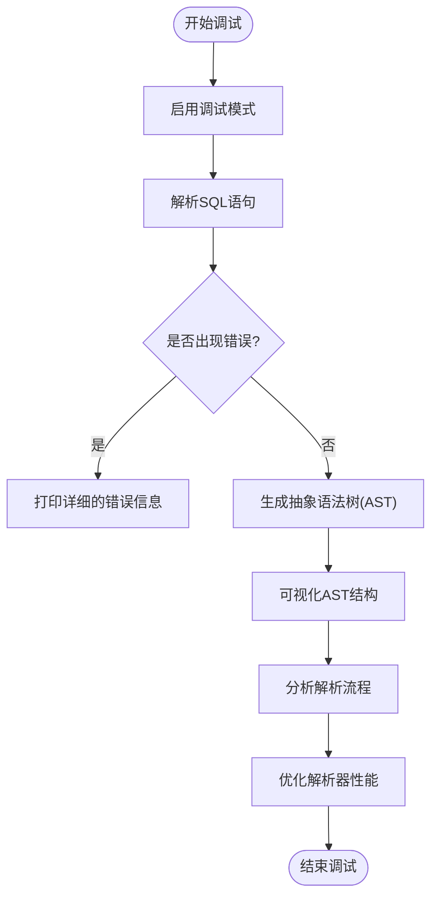
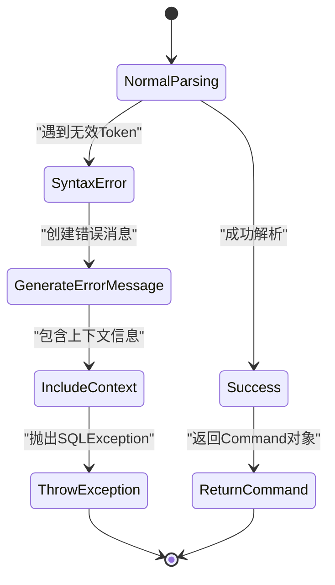

# SQL解析器实现

<cite>
**本文档引用的文件**
- [SQLTokenizer.java](file://src/main/java/io/leavesfly/smallsql/rdb/sql/parser/SQLTokenizer.java)
- [SQLToken.java](file://src/main/java/io/leavesfly/smallsql/rdb/sql/parser/SQLToken.java)
- [SQLParser.java](file://src/main/java/io/leavesfly/smallsql/rdb/sql/SQLParser.java)
- [Expression.java](file://src/main/java/io/leavesfly/smallsql/rdb/sql/expression/Expression.java)
- [Expressions.java](file://src/main/java/io/leavesfly/smallsql/rdb/sql/expression/Expressions.java)
- [ExpressionName.java](file://src/main/java/io/leavesfly/smallsql/rdb/sql/expression/ExpressionName.java)
- [ExpressionValue.java](file://src/main/java/io/leavesfly/smallsql/rdb/sql/expression/ExpressionValue.java)
- [ExpressionArithmetic.java](file://src/main/java/io/leavesfly/smallsql/rdb/sql/expression/operator/ExpressionArithmetic.java)
- [ExpressionFunction.java](file://src/main/java/io/leavesfly/smallsql/rdb/sql/expression/function/ExpressionFunction.java)
</cite>

## 目录
1. [引言](#引言)
2. [词法分析过程](#词法分析过程)
3. [语法分析过程](#语法分析过程)
4. [表达式类层次结构](#表达式类层次结构)
5. [表达式求值与优化](#表达式求值与优化)
6. [解析过程调试技巧](#解析过程调试技巧)
7. [错误恢复机制](#错误恢复机制)
8. [性能特征](#性能特征)
9. [结论](#结论)

## 引言

SQL解析器是数据库管理系统中的核心组件，负责将用户输入的SQL语句转换为可执行的内部表示形式。本技术文档深入探讨了SQL解析器的实现细节，重点分析了词法分析和语法分析两个关键阶段。解析器采用递归下降解析技术，将SQL语句分解为抽象语法树（AST），为后续的查询优化和执行奠定了基础。该解析器支持标准SQL语法，包括SELECT、INSERT、UPDATE、DELETE等数据操作语言（DML）语句，以及CREATE、DROP等数据定义语言（DDL）语句。

## 词法分析过程

词法分析是SQL解析的第一步，其主要任务是将输入的SQL字符串分解为一系列有意义的词法单元（Token）。这一过程由`SQLTokenizer`类实现，它遍历输入的字符数组，识别出关键字、标识符、字符串、数字和操作符等不同类型的Token。

**图示来源**
- [SQLTokenizer.java](file://src/main/java/io/leavesfly/smallsql/rdb/sql/parser/SQLTokenizer.java#L0-L799)

**本节来源**
- [SQLTokenizer.java](file://src/main/java/io/leavesfly/smallsql/rdb/sql/parser/SQLTokenizer.java#L0-L799)
- [SQLToken.java](file://src/main/java/io/leavesfly/smallsql/rdb/sql/parser/SQLToken.java#L0-L66)

## 语法分析过程

语法分析是SQL解析的核心阶段，它使用递归下降解析技术将Token流构建成抽象语法树（AST）。`SQLParser`类负责这一过程，它根据SQL语句的语法结构，通过一系列相互递归的方法来解析不同的SQL语句类型。

**图示来源**
- [SQLParser.java](file://src/main/java/io/leavesfly/smallsql/rdb/sql/SQLParser.java#L0-L799)

**本节来源**
- [SQLParser.java](file://src/main/java/io/leavesfly/smallsql/rdb/sql/SQLParser.java#L0-L799)

## 表达式类层次结构

表达式类层次结构是SQL解析器中用于表示SQL表达式的面向对象设计。`Expression`是所有表达式的抽象基类，它定义了表达式的基本属性和方法。具体的表达式类型通过继承`Expression`类来实现。

**图示来源**
- [Expression.java](file://src/main/java/io/leavesfly/smallsql/rdb/sql/expression/Expression.java#L0-L246)
- [ExpressionName.java](file://src/main/java/io/leavesfly/smallsql/rdb/sql/expression/ExpressionName.java#L0-L247)
- [ExpressionValue.java](file://src/main/java/io/leavesfly/smallsql/rdb/sql/expression/ExpressionValue.java#L0-L733)
- [ExpressionArithmetic.java](file://src/main/java/io/leavesfly/smallsql/rdb/sql/expression/operator/ExpressionArithmetic.java#L0-L799)
- [ExpressionFunction.java](file://src/main/java/io/leavesfly/smallsql/rdb/sql/expression/function/ExpressionFunction.java#L0-L142)

**本节来源**
- [Expression.java](file://src/main/java/io/leavesfly/smallsql/rdb/sql/expression/Expression.java#L0-L246)
- [ExpressionName.java](file://src/main/java/io/leavesfly/smallsql/rdb/sql/expression/ExpressionName.java#L0-L247)
- [ExpressionValue.java](file://src/main/java/io/leavesfly/smallsql/rdb/sql/expression/ExpressionValue.java#L0-L733)
- [ExpressionArithmetic.java](file://src/main/java/io/leavesfly/smallsql/rdb/sql/expression/operator/ExpressionArithmetic.java#L0-L799)
- [ExpressionFunction.java](file://src/main/java/io/leavesfly/smallsql/rdb/sql/expression/function/ExpressionFunction.java#L0-L142)

## 表达式求值与优化

`Expressions`类在表达式求值和优化中扮演着重要角色。它提供了一个动态数组来存储多个表达式，并支持高效的添加、删除和访问操作。在查询执行过程中，这些表达式会被逐个求值，以计算出最终的结果。

**图示来源**
- [Expressions.java](file://src/main/java/io/leavesfly/smallsql/rdb/sql/expression/Expressions.java#L0-L133)

**本节来源**
- [Expressions.java](file://src/main/java/io/leavesfly/smallsql/rdb/sql/expression/Expressions.java#L0-L133)
- [Expression.java](file://src/main/java/io/leavesfly/smallsql/rdb/sql/expression/Expression.java#L0-L246)

## 解析过程调试技巧

调试SQL解析过程是开发和维护数据库系统的重要环节。通过查看生成的抽象语法树（AST），开发者可以深入了解解析器如何理解SQL语句。`SQLParser`类提供了丰富的错误信息，包括语法错误的位置和上下文，这有助于快速定位和修复问题。

**本节来源**
- [SQLParser.java](file://src/main/java/io/leavesfly/smallsql/rdb/sql/SQLParser.java#L0-L799)

## 错误恢复机制

SQL解析器实现了健壮的错误恢复机制，能够在遇到语法错误时提供有意义的错误信息。当解析器检测到无效的Token序列时，它会抛出`SQLException`异常，并包含详细的错误描述，包括错误位置、期望的Token类型和实际的Token内容。

**本节来源**
- [SQLParser.java](file://src/main/java/io/leavesfly/smallsql/rdb/sql/SQLParser.java#L0-L799)

## 性能特征

SQL解析器的性能特征主要体现在其时间复杂度和空间复杂度上。词法分析的时间复杂度为O(n)，其中n是输入SQL字符串的长度。语法分析的时间复杂度取决于SQL语句的复杂度，对于简单的语句接近O(n)，对于复杂的嵌套查询可能达到O(n²)。解析器的空间复杂度主要由生成的AST大小决定，通常与输入语句的复杂度成正比。

**本节来源**
- [SQLTokenizer.java](file://src/main/java/io/leavesfly/smallsql/rdb/sql/parser/SQLTokenizer.java#L0-L799)
- [SQLParser.java](file://src/main/java/io/leavesfly/smallsql/rdb/sql/SQLParser.java#L0-L799)

## 结论

本文档详细阐述了SQL解析器的实现细节，涵盖了从词法分析到语法分析的全过程。通过递归下降解析技术，解析器能够高效地将SQL语句转换为抽象语法树，为后续的查询优化和执行提供了坚实的基础。表达式类层次结构的设计体现了面向对象编程的优势，使得代码具有良好的可扩展性和可维护性。未来的工作可以集中在进一步优化解析器性能，支持更多的SQL标准特性，以及增强错误恢复能力。