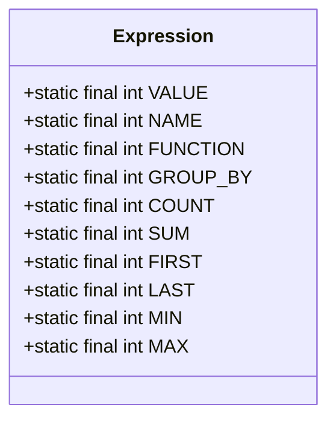
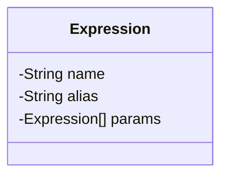
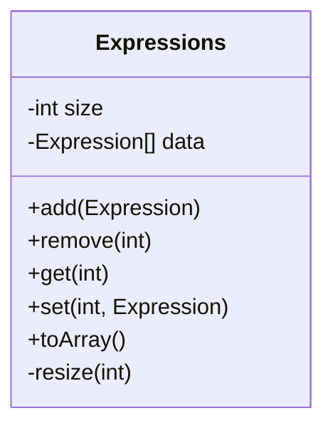
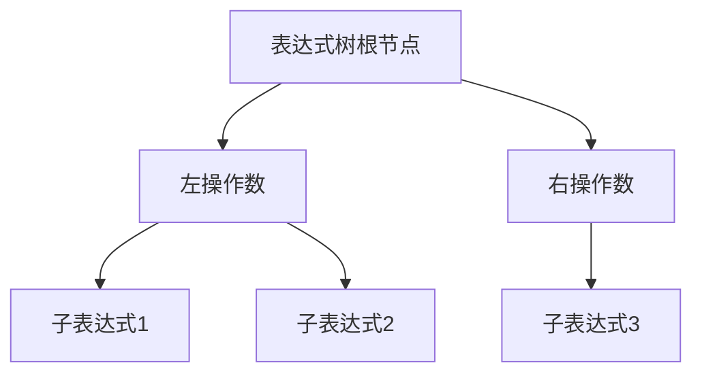
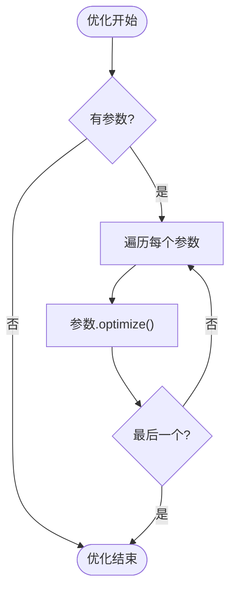
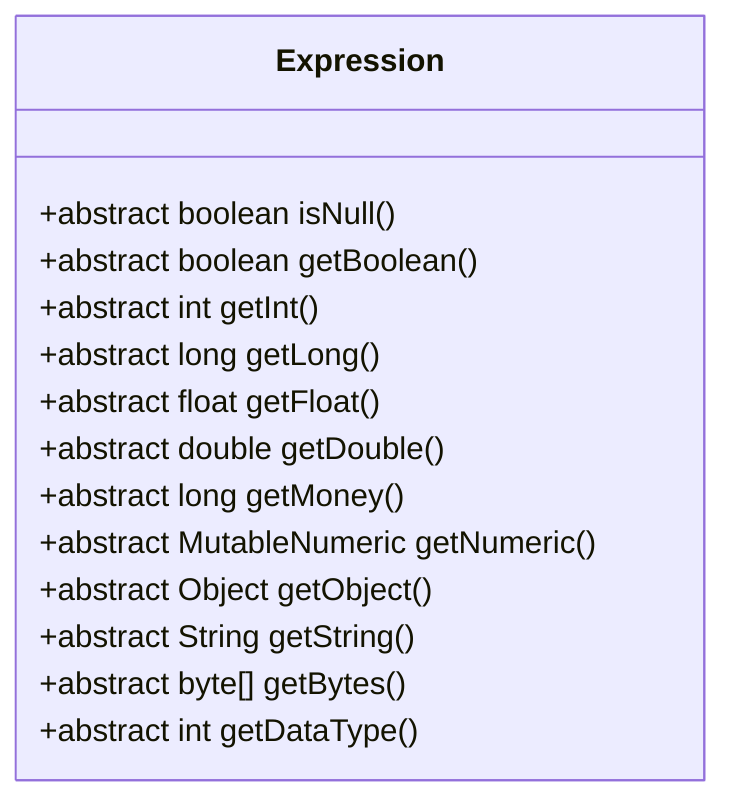
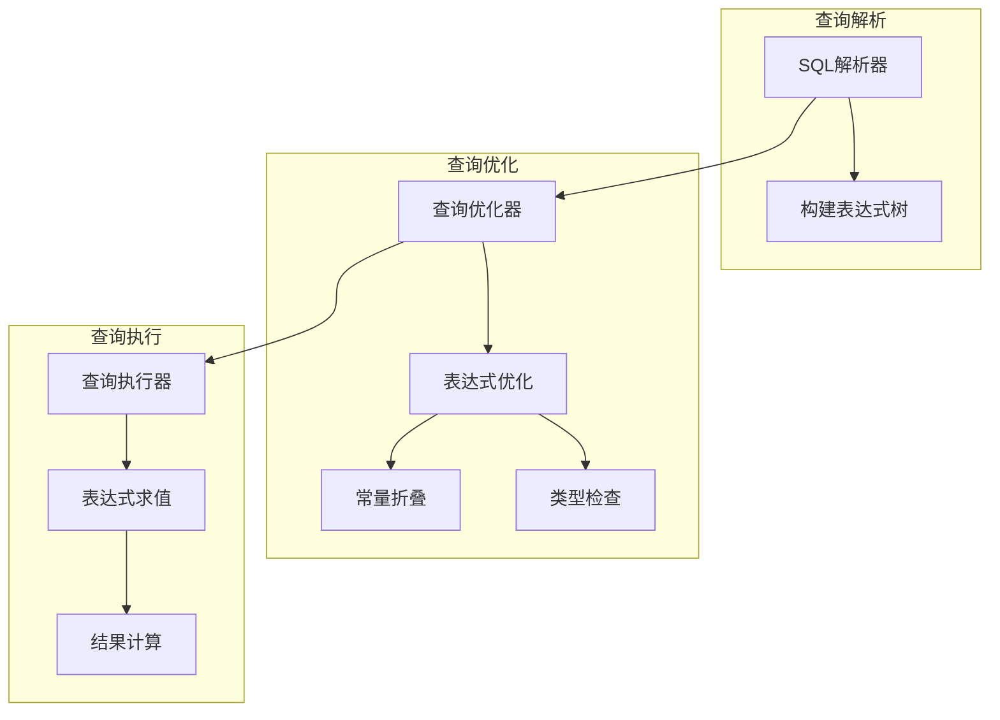
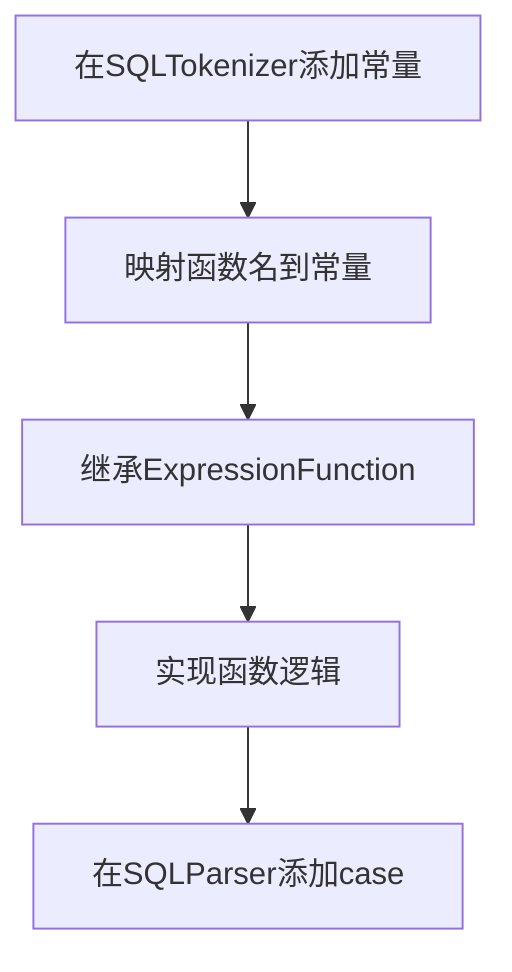

# 表达式模型

<cite>
**本文档中引用的文件**  
- [Expression.java](file://src/main/java/io/leavesfly/smallsql/rdb/sql/expression/Expression.java)
- [Expressions.java](file://src/main/java/io/leavesfly/smallsql/rdb/sql/expression/Expressions.java)
- [ExpressionValue.java](file://src/main/java/io/leavesfly/smallsql/rdb/sql/expression/ExpressionValue.java)
- [ExpressionName.java](file://src/main/java/io/leavesfly/smallsql/rdb/sql/expression/ExpressionName.java)
- [ExpressionFunction.java](file://src/main/java/io/leavesfly/smallsql/rdb/sql/expression/function/ExpressionFunction.java)
- [ExpressionArithmetic.java](file://src/main/java/io/leavesfly/smallsql/rdb/sql/expression/operator/ExpressionArithmetic.java)
- [Utils.java](file://src/main/java/io/leavesfly/smallsql/util/Utils.java)
</cite>

## 目录
1. [引言](#引言)
2. [表达式抽象类](#表达式抽象类)
3. [类型系统与元数据管理](#类型系统与元数据管理)
4. [表达式列表容器](#表达式列表容器)
5. [表达式树构建与优化](#表达式树构建与优化)
6. [表达式求值机制](#表达式求值机制)
7. [在查询计划中的作用](#在查询计划中的作用)
8. [自定义表达式扩展](#自定义表达式扩展)

## 引言
表达式模型是SmallSQL数据库系统的核心组成部分，为SQL查询中的所有表达式提供了统一的抽象和实现机制。该模型通过继承体系实现了对列引用、常量、函数调用和运算符等各种SQL表达式的统一处理，支持复杂的查询解析、优化和执行过程。

**表达式抽象类**作为所有具体表达式的基类，定义了表达式的基本行为和属性。**表达式列表容器**则提供了对表达式集合的高效管理能力。整个表达式系统在查询编译、优化和执行过程中扮演着关键角色，确保了SQL语句的正确解析和高效执行。

## 表达式抽象类

`Expression`抽象类是所有SQL表达式的基类，位于`io.leavesfly.smallsql.rdb.sql.expression`包中。它通过继承体系统一管理各种类型的SQL表达式，包括列引用、常量、函数和运算符等。

该类采用模板方法设计模式，定义了表达式的基本结构和通用行为，同时将具体的求值逻辑留给子类实现。`Expression`类实现了`Cloneable`接口，支持表达式的复制操作，这对于查询计划的优化和重用非常重要。

核心特性包括：
- 抽象方法定义了不同类型表达式的求值接口
- 保护构造函数确保类型安全的实例化
- 参数管理机制支持函数和运算符的多参数处理
- 优化方法为常量表达式求值提供支持

**表达式抽象类**的设计体现了面向对象的多态性原则，使得系统能够以统一的方式处理各种复杂的SQL表达式。

**节来源**
- [Expression.java](file://src/main/java/io/leavesfly/smallsql/rdb/sql/expression/Expression.java#L41-L246)

## 类型系统与元数据管理

### 类型系统

表达式模型通过静态常量定义了完整的类型系统，涵盖了SQL表达式的各种类型：

**图来源**
- [Expression.java](file://src/main/java/io/leavesfly/smallsql/rdb/sql/expression/Expression.java#L220-L246)

这些类型常量用于区分不同类型的表达式：
- `VALUE`: 常量值表达式
- `NAME`: 列引用表达式
- `FUNCTION`: 函数调用表达式
- 聚合函数类型：COUNT、SUM、MIN、MAX等

### 元数据管理

表达式类通过以下字段管理元数据信息：

**图来源**
- [Expression.java](file://src/main/java/io/leavesfly/smallsql/rdb/sql/expression/Expression.java#L47-L52)

元数据管理功能包括：
- `name`: 存储原始列名
- `alias`: 存储别名信息
- `params`: 存储参数列表，用于函数和运算符表达式

通过`setName()`和`setAlias()`方法，系统可以在查询解析过程中正确设置表达式的命名信息，确保SQL语义的正确性。

**节来源**
- [Expression.java](file://src/main/java/io/leavesfly/smallsql/rdb/sql/expression/Expression.java#L54-L81)

## 表达式列表容器

`Expressions`类是表达式列表的动态容器，提供了高效的增删改查操作。它采用数组实现，通过动态扩容机制确保性能。

**图来源**
- [Expressions.java](file://src/main/java/io/leavesfly/smallsql/rdb/sql/expression/Expressions.java#L10-L133)

核心特性包括：
- 初始容量为16个表达式的数组
- 当容量不足时自动扩容（双倍增长）
- 提供标准的集合操作接口
- 支持高效的数组复制操作

容器的实现考虑了性能优化：
- 使用`System.arraycopy`进行批量数据操作
- 采用位运算`size << 1`实现快速的容量翻倍
- 提供`toArray()`方法支持与其他系统的集成

`Expressions`容器在查询解析过程中被广泛使用，用于存储SELECT子句中的列列表、WHERE子句中的条件列表等。

**节来源**
- [Expressions.java](file://src/main/java/io/leavesfly/smallsql/rdb/sql/expression/Expressions.java#L10-L133)

## 表达式树构建与优化

### 表达式树构建

表达式树通过递归组合的方式构建，每个表达式节点可以包含多个子表达式作为参数。这种树形结构能够准确表示SQL表达式的层次关系。

**图来源**
- [Expression.java](file://src/main/java/io/leavesfly/smallsql/rdb/sql/expression/Expression.java#L60-L65)

构建过程的关键方法：
- `setParams()`: 设置表达式的参数列表
- `setParamAt()`: 替换单个参数，确保引用完整性
- `getParams()`: 获取参数列表

### 表达式优化

表达式优化通过`optimize()`方法实现，主要针对常量表达式进行预计算：

**图来源**
- [Expression.java](file://src/main/java/io/leavesfly/smallsql/rdb/sql/expression/Expression.java#L108-L123)

优化过程的特点：
- 递归优化所有子表达式
- 为常量折叠和预计算提供基础
- 在查询编译阶段执行，提高运行时性能

`Utils.getExpressionNameFromTree()`方法提供了表达式树的遍历功能，用于提取所有列引用表达式，这在查询分析和优化中非常重要。

**节来源**
- [Expression.java](file://src/main/java/io/leavesfly/smallsql/rdb/sql/expression/Expression.java#L108-L123)
- [Utils.java](file://src/main/java/io/leavesfly/smallsql/util/Utils.java#L656-L687)

## 表达式求值机制

表达式求值通过多态方法实现，每个具体表达式类型提供自己的求值逻辑。基类定义了统一的求值接口：

**图来源**
- [Expression.java](file://src/main/java/io/leavesfly/smallsql/rdb/sql/expression/Expression.java#L135-L185)

具体实现示例：
- `ExpressionValue`: 直接返回存储的值
- `ExpressionName`: 从数据源获取当前行的值
- `ExpressionFunction`: 执行函数逻辑并返回结果
- `ExpressionArithmetic`: 执行算术运算

`getApiObject()`方法提供了与JDBC API的兼容性，处理可变对象的不可变转换，确保外部接口的稳定性。

求值机制的设计考虑了：
- 类型安全：通过`getDataType()`确保类型一致性
- 性能优化：避免不必要的对象创建
- 错误处理：统一的异常传播机制

**节来源**
- [Expression.java](file://src/main/java/io/leavesfly/smallsql/rdb/sql/expression/Expression.java#L135-L185)
- [ExpressionValue.java](file://src/main/java/io/leavesfly/smallsql/rdb/sql/expression/ExpressionValue.java#L185-L733)
- [ExpressionName.java](file://src/main/java/io/leavesfly/smallsql/rdb/sql/expression/ExpressionName.java#L85-L145)

## 在查询计划中的作用

表达式模型在查询计划和结果计算中扮演核心角色：

**图来源**
- [Expression.java](file://src/main/java/io/leavesfly/smallsql/rdb/sql/expression/Expression.java)
- [Expressions.java](file://src/main/java/io/leavesfly/smallsql/rdb/sql/expression/Expressions.java)

具体作用包括：
- **查询解析**: 将SQL文本转换为表达式树结构
- **查询优化**: 通过`optimize()`方法进行常量预计算
- **执行计划**: 表达式树作为执行计划的基本单元
- **结果计算**: 在查询执行时动态求值

在聚合查询中，`ExpressionValue`的`accumulate()`方法实现了COUNT、SUM、MIN、MAX等聚合函数的累加逻辑，这是结果计算的关键部分。

**节来源**
- [Expression.java](file://src/main/java/io/leavesfly/smallsql/rdb/sql/expression/Expression.java)
- [ExpressionValue.java](file://src/main/java/io/leavesfly/smallsql/rdb/sql/expression/ExpressionValue.java#L145-L425)
- [Expressions.java](file://src/main/java/io/leavesfly/smallsql/rdb/sql/expression/Expressions.java)

## 自定义表达式扩展

### 扩展方法

要扩展自定义表达式，需要遵循以下步骤：

**图来源**
- [ExpressionFunction.java](file://src/main/java/io/leavesfly/smallsql/rdb/sql/expression/function/ExpressionFunction.java#L45-L65)

### 设计模式

表达式系统使用了多种设计模式：
- **模板方法模式**: `ExpressionFunction`定义了函数的通用结构
- **工厂模式**: `FunctionFactory`负责创建具体的函数对象
- **组合模式**: 表达式树的递归结构

### 扩展示例

创建自定义函数的基本步骤：

1. 在`SQLTokenizer`中添加新的常量定义
2. 在关键字映射表中添加函数名到常量的映射
3. 创建继承`ExpressionFunction`的类
4. 实现`getFunction()`方法返回对应的常量
5. 实现具体的求值逻辑
6. 在`SQLParser.function()`方法中添加对应的case分支

这种扩展机制确保了系统的可维护性和可扩展性，允许用户根据需要添加新的SQL函数。

**节来源**
- [ExpressionFunction.java](file://src/main/java/io/leavesfly/smallsql/rdb/sql/expression/function/ExpressionFunction.java#L45-L65)
- [Expression.java](file://src/main/java/io/leavesfly/smallsql/rdb/sql/expression/Expression.java)
- [ExpressionArithmetic.java](file://src/main/java/io/leavesfly/smallsql/rdb/sql/expression/operator/ExpressionArithmetic.java)