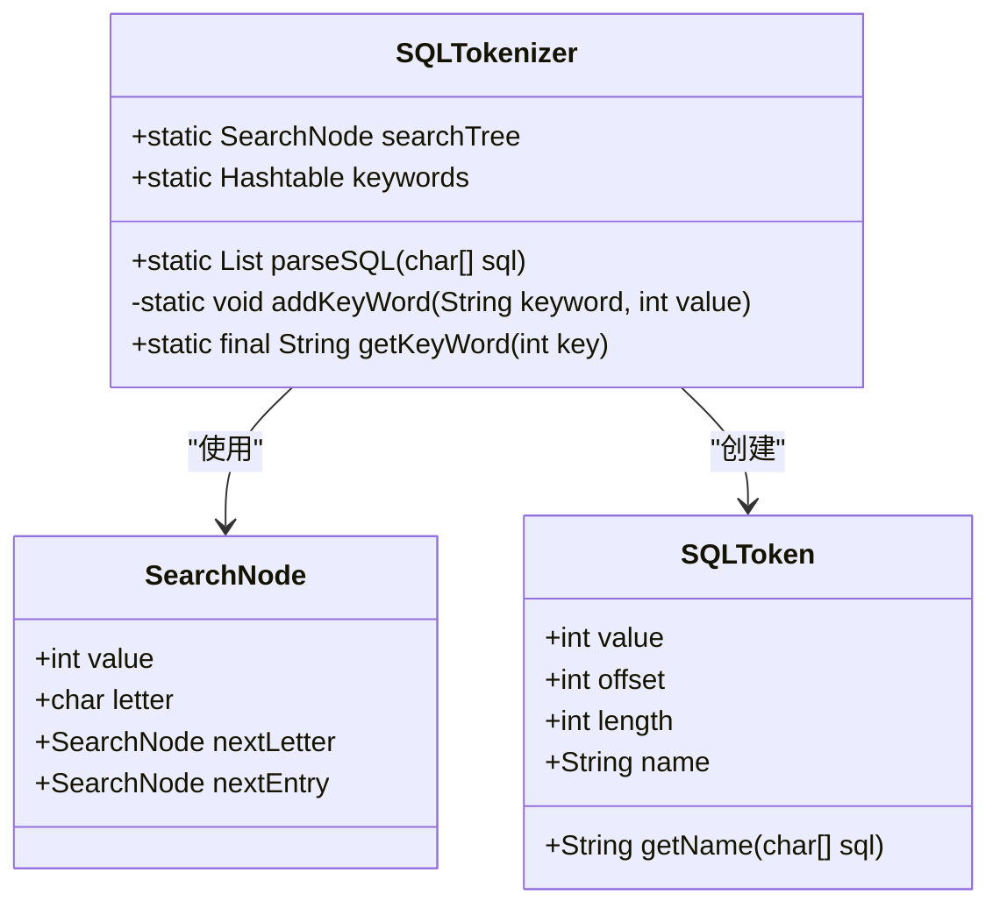

# 词法分析器

<cite>
**本文档中引用的文件**   
- [SQLTokenizer.java](file://src/main/java/io/leavesfly/smallsql/rdb/sql/parser/SQLTokenizer.java)
- [SQLToken.java](file://src/main/java/io/leavesfly/smallsql/rdb/sql/parser/SQLToken.java)
- [SQLParser.java](file://src/main/java/io/leavesfly/smallsql/rdb/sql/SQLParser.java)
- [TestTokenizer.java](file://src/test/java/io/leavesfly/smallsql/junit/sql/TestTokenizer.java)
</cite>

## 目录
1. [引言](#引言)
2. [核心组件](#核心组件)
3. [基于状态机的字符扫描算法](#基于状态机的字符扫描算法)
4. [SearchNode树形结构分析](#searchnode树形结构分析)
5. [词法单元类型与处理](#词法单元类型与处理)
6. [错误处理机制](#错误处理机制)
7. [调试技巧](#调试技巧)
8. [性能特征与内存使用](#性能特征与内存使用)

## 引言
词法分析器是SQL解析过程中的第一个关键阶段，负责将原始的SQL字符串分解为有意义的词法单元（Token）。本技术文档深入分析`SQLTokenizer`类的实现机制，详细阐述其基于状态机的字符扫描算法、SearchNode树形结构的高效匹配原理、各种词法单元的识别规则、错误处理策略以及性能特征。通过本文档，读者将全面理解词法分析器如何为后续的语法分析提供准确、高效的输入。

## 核心组件

词法分析器的核心由`SQLTokenizer`和`SQLToken`两个类构成。`SQLTokenizer`是主要的分析引擎，它通过`parseSQL`方法接收一个字符数组形式的SQL语句，并输出一个`SQLToken`对象列表。`SQLToken`类则代表了单个词法单元，它不仅存储了词法单元的值（如关键字、标识符、字符串内容等），还记录了该单元在原始SQL字符串中的起始偏移量（offset）和长度（length），这对于后续的错误报告和语法分析至关重要。

**本文档中引用的文件**   
- [SQLTokenizer.java](file://src/main/java/io/leavesfly/smallsql/rdb/sql/parser/SQLTokenizer.java#L34-L55)
- [SQLToken.java](file://src/main/java/io/leavesfly/smallsql/rdb/sql/parser/SQLToken.java#L34-L65)

## 基于状态机的字符扫描算法

`SQLTokenizer`的核心算法是一个基于状态机的单次遍历过程。它通过一个`for`循环逐个扫描输入的字符数组，并根据当前字符和内部状态来决定如何处理。

### 状态变量
算法维护了多个关键状态变量：
- `comment`：记录当前是否处于注释状态（`NOT_COMMENT`, `LINE_COMMENT`, `MULTI_COMMENT`）。
- `quote`：记录当前是否处于引号字符串中，以及引号的类型（`'` 或 `"`）。
- `quoteBuffer`：一个`StringBuffer`，用于累积引号内的字符。
- `wasWhiteSpace`：一个布尔值，用于判断前一个字符是否为空白字符，这有助于确定词法单元的边界。
- `tokenStart`：记录当前正在构建的词法单元在原始字符串中的起始位置。
- `value`：用于存储当前识别到的词法单元的类型值（如`SELECT`, `IDENTIFIER`等）。

### 状态转移逻辑
算法的主体是一个`switch`语句，根据当前字符`c`进行分支处理：
1.  **引号处理**：当遇到单引号或双引号时，如果不在注释中，则根据`quote`的状态来判断是开始一个新字符串、结束当前字符串，还是处理转义字符（如`''`表示一个单引号）。
2.  **点号处理**：点号`.`的处理较为复杂，需要区分是浮点数的一部分（如`5.3`）还是标识符的一部分（如`"abc"."def"`）。算法通过检查点号前的字符来做出判断。
3.  **空白字符与操作符**：对于空格、制表符、换行符以及各种操作符（如`+`, `-`, `*`, `/`, `=`, `<`, `>`），算法首先检查是否处于注释状态。如果处于单行注释（`--`）中，遇到换行符则结束注释；如果处于多行注释（`/* */`）中，遇到`*/`则结束注释。对于非注释状态下的操作符，算法会先将之前累积的词法单元（如果存在）添加到结果列表中，然后根据操作符的类型创建新的`SQLToken`。例如，连续的`<`和`>`会被识别为`UNEQUALS`（`<>`）操作符。
4.  **默认情况（字母与数字）**：对于字母和数字，算法会利用`SearchNode`树来高效匹配SQL关键字。如果`wasWhiteSpace`为真，表示开始一个新的词法单元，此时会从`searchTree`根节点开始匹配。通过将字符转换为小写（`c |= 0x20`）实现不区分大小写的匹配。

**本文档中引用的文件**   
- [SQLTokenizer.java](file://src/main/java/io/leavesfly/smallsql/rdb/sql/parser/SQLTokenizer.java#L57-L255)

## SearchNode树形结构分析

为了高效地识别SQL关键字，`SQLTokenizer`使用了一个名为`SearchNode`的树形数据结构。这种结构类似于一个简化的Trie树，能够以接近O(n)的时间复杂度完成关键字匹配，其中n是关键字的长度。

### 节点结构
`SearchNode`类包含四个字段：
- `value`：当该节点是某个关键字的结尾时，存储该关键字对应的整数值（如`SELECT`对应200）。
- `letter`：存储该节点所代表的字符。
- `nextLetter`：指向树中下一个字符的节点，形成关键字的路径。
- `nextEntry`：指向另一个以相同前缀开始但后续字符不同的节点，用于处理具有相同首字母的关键字（如`SELECT`和`SET`）。

### 构建与匹配过程
- **构建**：`addKeyWord`方法负责将关键字插入到树中。它逐个字符遍历关键字，如果当前路径不存在，则创建新的`SearchNode`，并根据是延续路径（`nextLetter`）还是分支（`nextEntry`）来建立连接。最终，关键字末尾的节点的`value`字段会被设置为该关键字的ID。
- **匹配**：在`parseSQL`方法的`default`分支中，算法从`searchTree`根节点开始，根据当前字符在`nextEntry`链表中查找匹配的节点。如果找到，则沿着`nextLetter`进入下一个字符；如果未找到，则说明当前字符序列不是一个已知的关键字，`value`被重置为0，该序列将被当作普通标识符处理。

这种树形结构避免了对所有关键字进行线性搜索，极大地提升了词法分析的效率。

**图源**  
- [SQLTokenizer.java](file://src/main/java/io/leavesfly/smallsql/rdb/sql/parser/SQLTokenizer.java#L42-L964)
- [SearchNode.java](file://src/main/java/io/leavesfly/smallsql/rdb/sql/parser/SQLTokenizer.java#L966-L972)
- [SQLToken.java](file://src/main/java/io/leavesfly/smallsql/rdb/sql/parser/SQLToken.java#L34-L65)

**本文档中引用的文件**   
- [SQLTokenizer.java](file://src/main/java/io/leavesfly/smallsql/rdb/sql/parser/SQLTokenizer.java#L966-L972)
- [SQLTokenizer.java](file://src/main/java/io/leavesfly/smallsql/rdb/sql/parser/SQLTokenizer.java#L257-L300)

## 词法单元类型与处理

`SQLTokenizer`能够识别多种类型的词法单元，每种类型都有其特定的处理逻辑。

### 关键字与保留字
通过`SearchNode`树匹配，`SELECT`, `FROM`, `WHERE`等关键字被识别，并赋予特定的整数值（如`SELECT = 200`）。这些值在后续的语法分析中被直接使用。

### 标识符
未被识别为关键字的字母数字序列被视为标识符（`IDENTIFIER`）。双引号包围的字符串（如`"MyColumn"`）也被视为标识符，这允许使用包含空格或保留字的列名。

### 字符串字面量
单引号包围的字符串（如`'Hello'`）被识别为字符串字面量（`STRING`）。算法支持转义，即两个连续的单引号表示一个单引号字符。

### 数字
算法能够识别整数、浮点数和科学计数法表示的数字。通过检查点号前后的字符，可以正确区分`5.3`（数字）和`"5"."3"`（标识符）。

### 操作符
支持多种操作符，包括：
- 算术操作符：`+`, `-`, `*`, `/`, `%`
- 比较操作符：`=`, `<>`, `<=`, `>=`, `<`, `>`
- 逻辑操作符：`AND`, `OR`, `NOT`
- 其他：`(`, `)`, `,`, `?`等。

### 注释
- **单行注释**：以`--`开头，直到行尾结束。在`parseSQL`中，当检测到`--`时，`comment`状态被设置为`LINE_COMMENT`，后续字符将被忽略，直到遇到换行符。
- **多行注释**：以`/*`开头，以`*/`结束。`comment`状态被设置为`MULTI_COMMENT`，期间所有字符都被忽略。如果遍历结束时`comment`状态仍为`MULTI_COMMENT`，则会抛出“未闭合的注释”错误。

**本文档中引用的文件**   
- [SQLTokenizer.java](file://src/main/java/io/leavesfly/smallsql/rdb/sql/parser/SQLTokenizer.java#L57-L255)
- [SQLTokenizer.java](file://src/main/java/io/leavesfly/smallsql/rdb/sql/parser/SQLTokenizer.java#L148-L203)

## 错误处理机制

词法分析器具备基本的错误检测和处理能力。

### 未闭合的注释
如果SQL字符串以一个未闭合的多行注释（`/*`）结束，`parseSQL`方法在循环结束后会检查`comment`状态。如果状态仍为`MULTI_COMMENT`，则会抛出一个`SQLException`，错误信息来自`Language.STXADD_COMMENT_OPEN`。

### 语法错误
虽然词法分析器主要负责分词，但它也会在某些情况下抛出错误。例如，在`SQLParser`中，如果在解析完所有Token后仍有剩余字符，会抛出“额外的Token”错误。此外，对于无法识别的函数名等，也会在`function`方法中抛出“未知函数”错误。

## 调试技巧

为了诊断语法分析问题，可以利用`SQLTokenizer`生成的Token流。

### 输出Token流
可以通过调用`SQLTokenizer.parseSQL(sql.toCharArray())`方法获取`SQLToken`列表。然后遍历该列表，使用`token.getName(sql)`方法获取每个Token的原始文本，并打印其`value`（类型）和`offset`（位置）。这有助于确认词法分析器是否正确地将SQL字符串分解为预期的Token序列。

### 单元测试
项目中的`TestTokenizer.java`文件提供了测试用例，可以用来验证词法分析器对各种SQL语句（包括包含注释的语句）的处理能力。通过分析这些测试用例，可以更好地理解词法分析器的行为。

**本文档中引用的文件**   
- [SQLParser.java](file://src/main/java/io/leavesfly/smallsql/rdb/sql/SQLParser.java#L137-L2527)
- [TestTokenizer.java](file://src/test/java/io/leavesfly/smallsql/junit/sql/TestTokenizer.java#L44-L126)

## 性能特征与内存使用

`SQLTokenizer`的设计注重性能和效率。

### 时间复杂度
由于算法采用单次遍历和基于树的匹配，其时间复杂度为O(n)，其中n是输入SQL字符串的长度。这是词法分析所能达到的最优时间复杂度。

### 空间复杂度
- **输入**：需要O(n)的空间来存储输入的字符数组。
- **输出**：需要O(m)的空间来存储m个`SQLToken`对象。
- **内部状态**：`SearchNode`树的大小是固定的，与输入无关，它存储了所有预定义的关键字。`quoteBuffer`的大小与最长的字符串字面量成正比。

总体而言，该词法分析器在时间和空间上都是高效的，适合处理各种规模的SQL查询。

**本文档中引用的文件**   
- [SQLTokenizer.java](file://src/main/java/io/leavesfly/smallsql/rdb/sql/parser/SQLTokenizer.java#L42-L964)