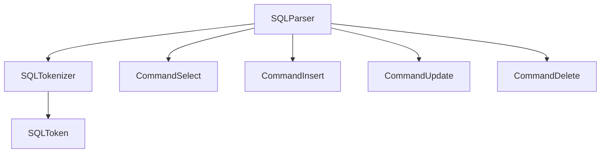
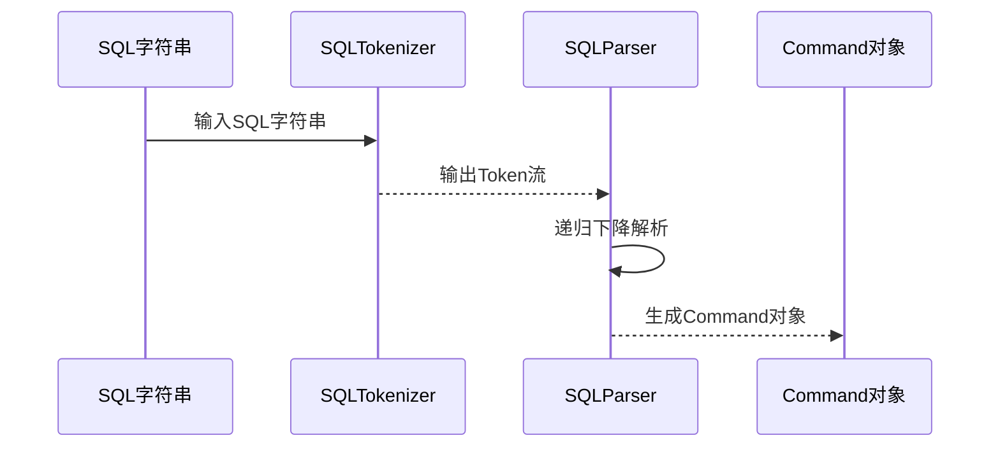
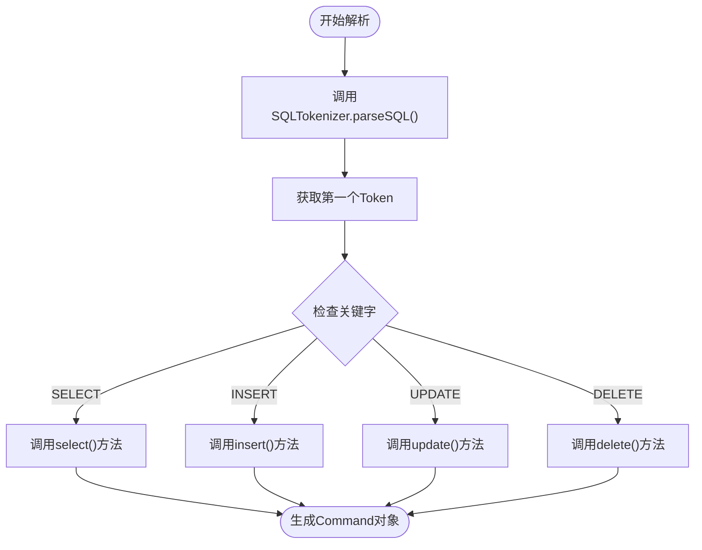
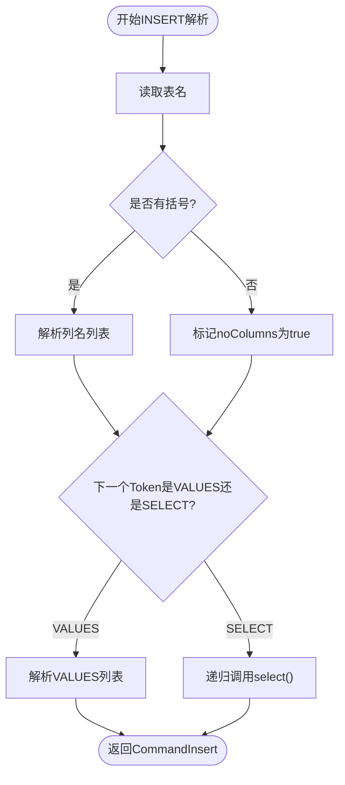
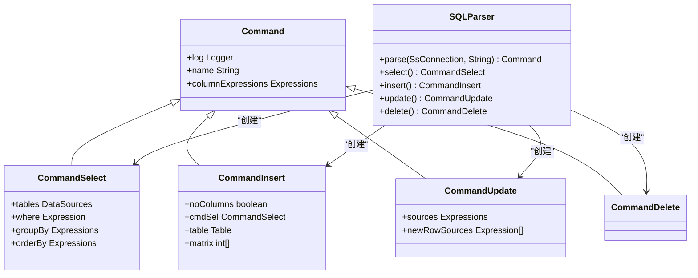
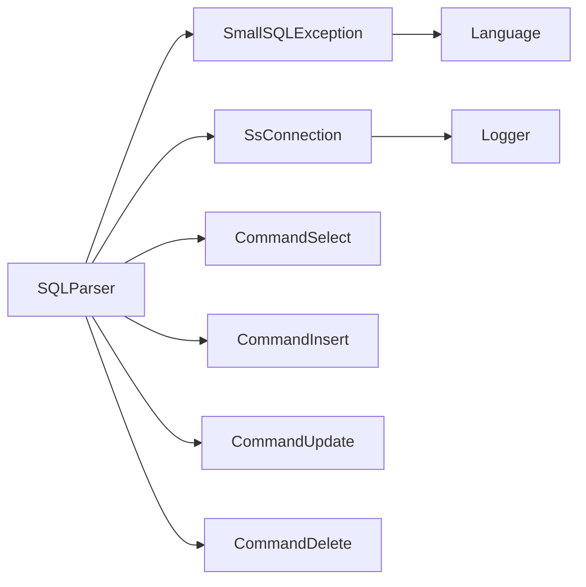

# 语法分析器核心

<cite>
**本文档引用的文件**   
- [SQLParser.java](file://src/main/java/io/leavesfly/smallsql/rdb/sql/SQLParser.java)
- [SQLTokenizer.java](file://src/main/java/io/leavesfly/smallsql/rdb/sql/parser/SQLTokenizer.java)
- [SQLToken.java](file://src/main/java/io/leavesfly/smallsql/rdb/sql/parser/SQLToken.java)
- [CommandSelect.java](file://src/main/java/io/leavesfly/smallsql/rdb/command/dql/CommandSelect.java)
- [CommandInsert.java](file://src/main/java/io/leavesfly/smallsql/rdb/command/dml/CommandInsert.java)
- [CommandUpdate.java](file://src/main/java/io/leavesfly/smallsql/rdb/command/dml/CommandUpdate.java)
- [CommandDelete.java](file://src/main/java/io/leavesfly/smallsql/rdb/command/dml/CommandDelete.java)
</cite>

## 目录
1. [简介](#简介)
2. [项目结构](#项目结构)
3. [核心组件](#核心组件)
4. [架构概述](#架构概述)
5. [详细组件分析](#详细组件分析)
6. [依赖分析](#依赖分析)
7. [性能考虑](#性能考虑)
8. [故障排除指南](#故障排除指南)
9. [结论](#结论)

## 简介
本文档深入探讨了SmallSQL数据库系统中SQL语法分析器的核心实现。该分析器采用递归下降解析技术，将SQL语句的Token流转换为抽象语法树（AST），为后续的查询执行提供结构化基础。文档详细阐述了分析器的主分发逻辑、核心解析方法、错误处理机制以及调试技巧，旨在为开发者提供全面的技术参考。

## 项目结构
SmallSQL的语法分析器主要由`SQLParser`、`SQLTokenizer`和`SQLToken`三个核心类构成，位于`io.leavesfly.smallsql.rdb.sql`包及其子包中。这些类协同工作，完成从SQL字符串到可执行命令对象的转换过程。



**图示来源**
- [SQLParser.java](file://src/main/java/io/leavesfly/smallsql/rdb/sql/SQLParser.java#L137-L2527)
- [SQLTokenizer.java](file://src/main/java/io/leavesfly/smallsql/rdb/sql/parser/SQLTokenizer.java#L34-L799)
- [SQLToken.java](file://src/main/java/io/leavesfly/smallsql/rdb/sql/parser/SQLToken.java#L34-L66)

**本节来源**
- [SQLParser.java](file://src/main/java/io/leavesfly/smallsql/rdb/sql/SQLParser.java#L137-L2527)
- [SQLTokenizer.java](file://src/main/java/io/leavesfly/smallsql/rdb/sql/parser/SQLTokenizer.java#L34-L799)

## 核心组件
语法分析器的核心组件包括词法分析器（`SQLTokenizer`）、语法分析器（`SQLParser`）和命令对象（如`CommandSelect`、`CommandInsert`等）。`SQLTokenizer`负责将SQL字符串分解为Token流，`SQLParser`则基于这些Token构建AST，最终生成具体的命令对象。

**本节来源**
- [SQLParser.java](file://src/main/java/io/leavesfly/smallsql/rdb/sql/SQLParser.java#L137-L2527)
- [SQLTokenizer.java](file://src/main/java/io/leavesfly/smallsql/rdb/sql/parser/SQLTokenizer.java#L34-L799)

## 架构概述
SmallSQL的语法分析器采用经典的编译器架构，分为词法分析和语法分析两个阶段。词法分析器将输入的SQL字符串转换为一系列Token，语法分析器则根据这些Token，通过递归下降的方式构建出代表SQL语句结构的抽象语法树。



**图示来源**
- [SQLParser.java](file://src/main/java/io/leavesfly/smallsql/rdb/sql/SQLParser.java#L137-L2527)
- [SQLTokenizer.java](file://src/main/java/io/leavesfly/smallsql/rdb/sql/parser/SQLTokenizer.java#L34-L799)

## 详细组件分析

### 递归下降解析机制
`SQLParser`类是语法分析的核心，它使用递归下降技术来解析SQL语句。该技术的特点是每个非终结符（如SELECT、INSERT）都对应一个独立的解析方法，这些方法相互调用，形成递归结构。

#### 主分发逻辑
`SQLParser`的`parse`方法是整个解析过程的入口点。它首先调用`SQLTokenizer.parseSQL`将SQL字符串分解为Token列表，然后根据第一个关键字的值，通过`switch`语句分发到相应的解析方法。



**图示来源**
- [SQLParser.java](file://src/main/java/io/leavesfly/smallsql/rdb/sql/SQLParser.java#L137-L2527)

**本节来源**
- [SQLParser.java](file://src/main/java/io/leavesfly/smallsql/rdb/sql/SQLParser.java#L137-L2527)

### 核心解析方法分析

#### SELECT语句解析流程
`select()`方法负责解析SELECT语句。它首先调用`singleSelect()`解析单个SELECT子句，然后处理可能存在的UNION操作。`singleSelect()`方法会扫描DISTINCT、ALL、TOP等前缀，并解析SELECT列表中的列表达式。

```mermaid
sequenceDiagram
participant Parser as SQLParser
participant SelCmd as CommandSelect
participant Token as SQLToken
Parser->>SelCmd : new CommandSelect()
loop 处理前缀
Parser->>Token : nextToken()
Token-->>Parser : 返回Token
alt 是TOP关键字
Parser->>SelCmd : setMaxRows()
else 是DISTINCT关键字
Parser->>SelCmd : setDistinct(true)
end
end
loop 解析列表达式
Parser->>Parser : expression()
Parser-->>SelCmd : addColumnExpression()
Parser->>Token : nextToken()
alt 是AS关键字
Parser->>Token : nextToken()
Parser->>Expression : setAlias()
end
alt 是FROM关键字
Parser->>Parser : from()
break
end
end
```

**图示来源**
- [SQLParser.java](file://src/main/java/io/leavesfly/smallsql/rdb/sql/SQLParser.java#L137-L2527)
- [CommandSelect.java](file://src/main/java/io/leavesfly/smallsql/rdb/command/dql/CommandSelect.java#L0-L587)

**本节来源**
- [SQLParser.java](file://src/main/java/io/leavesfly/smallsql/rdb/sql/SQLParser.java#L137-L2527)
- [CommandSelect.java](file://src/main/java/io/leavesfly/smallsql/rdb/command/dql/CommandSelect.java#L0-L587)

#### INSERT语句解析流程
`insert()`方法解析INSERT语句。它首先读取表名，然后根据是否有括号来决定是解析列名列表还是直接进入VALUES或SELECT子句。



**图示来源**
- [SQLParser.java](file://src/main/java/io/leavesfly/smallsql/rdb/sql/SQLParser.java#L137-L2527)
- [CommandInsert.java](file://src/main/java/io/leavesfly/smallsql/rdb/command/dml/CommandInsert.java#L0-L207)

**本节来源**
- [SQLParser.java](file://src/main/java/io/leavesfly/smallsql/rdb/sql/SQLParser.java#L137-L2527)
- [CommandInsert.java](file://src/main/java/io/leavesfly/smallsql/rdb/command/dml/CommandInsert.java#L0-L207)

#### UPDATE和DELETE语句解析
`update()`和`delete()`方法的结构相对简单。`update()`方法首先解析表名，然后进入SET子句，解析一系列的"列=值"对。`delete()`方法则直接解析FROM子句，并可选地解析WHERE子句。



**图示来源**
- [SQLParser.java](file://src/main/java/io/leavesfly/smallsql/rdb/sql/SQLParser.java#L137-L2527)
- [CommandSelect.java](file://src/main/java/io/leavesfly/smallsql/rdb/command/dql/CommandSelect.java#L0-L587)
- [CommandInsert.java](file://src/main/java/io/leavesfly/smallsql/rdb/command/dml/CommandInsert.java#L0-L207)
- [CommandUpdate.java](file://src/main/java/io/leavesfly/smallsql/rdb/command/dml/CommandUpdate.java#L0-L116)
- [CommandDelete.java](file://src/main/java/io/leavesfly/smallsql/rdb/command/dml/CommandDelete.java#L0-L66)

**本节来源**
- [SQLParser.java](file://src/main/java/io/leavesfly/smallsql/rdb/sql/SQLParser.java#L137-L2527)
- [CommandSelect.java](file://src/main/java/io/leavesfly/smallsql/rdb/command/dql/CommandSelect.java#L0-L587)
- [CommandInsert.java](file://src/main/java/io/leavesfly/smallsql/rdb/command/dml/CommandInsert.java#L0-L207)
- [CommandUpdate.java](file://src/main/java/io/leavesfly/smallsql/rdb/command/dml/CommandUpdate.java#L0-L116)
- [CommandDelete.java](file://src/main/java/io/leavesfly/smallsql/rdb/command/dml/CommandDelete.java#L0-L66)

### 状态管理与错误恢复
语法分析器通过`tokenIdx`成员变量管理当前解析位置的状态。`nextToken()`和`previousToken()`方法提供了向前和向后移动的能力，这对于错误恢复和回溯至关重要。当遇到语法错误时，分析器会抛出`SQLException`，并利用`createSyntaxError`方法生成详细的错误信息，包括错误位置和上下文。

**本节来源**
- [SQLParser.java](file://src/main/java/io/leavesfly/smallsql/rdb/sql/SQLParser.java#L137-L2527)

## 依赖分析
语法分析器模块依赖于`io.leavesfly.smallsql.jdbc`包中的异常类（如`SmallSQLException`）和连接类（`SsConnection`），以及`io.leavesfly.smallsql.rdb.command`包中的各种命令实现类。这些依赖关系确保了分析器能够与数据库的其他部分无缝集成。



**图示来源**
- [SQLParser.java](file://src/main/java/io/leavesfly/smallsql/rdb/sql/SQLParser.java#L137-L2527)
- [go.mod](file://pom.xml)

**本节来源**
- [SQLParser.java](file://src/main/java/io/leavesfly/smallsql/rdb/sql/SQLParser.java#L137-L2527)
- [pom.xml](file://pom.xml)

## 性能考虑
`SQLTokenizer`使用了一个基于`SearchNode`树的高效关键字查找机制，避免了每次都需要进行字符串比较。`SQLParser`的递归下降方法虽然直观，但对于非常复杂的嵌套查询可能会导致栈溢出。整体而言，该设计在解析速度和内存使用之间取得了良好的平衡。

## 故障排除指南
调试解析过程时，可以利用`SQLParser`中丰富的错误信息。当解析失败时，`createSyntaxError`方法生成的错误消息会精确指出错误位置和期望的Token。此外，可以通过查看`tokens`列表来手动检查词法分析的结果，以确定问题出在词法还是语法层面。

**本节来源**
- [SQLParser.java](file://src/main/java/io/leavesfly/smallsql/rdb/sql/SQLParser.java#L137-L2527)

## 结论
SmallSQL的语法分析器是一个设计精良、结构清晰的递归下降解析器。它通过`SQLTokenizer`和`SQLParser`的协同工作，有效地将SQL文本转换为可执行的命令对象。其模块化的设计和清晰的错误报告机制，使其不仅功能强大，而且易于维护和扩展。对于需要理解或修改SQL解析逻辑的开发者来说，这是一个优秀的学习和参考范例。