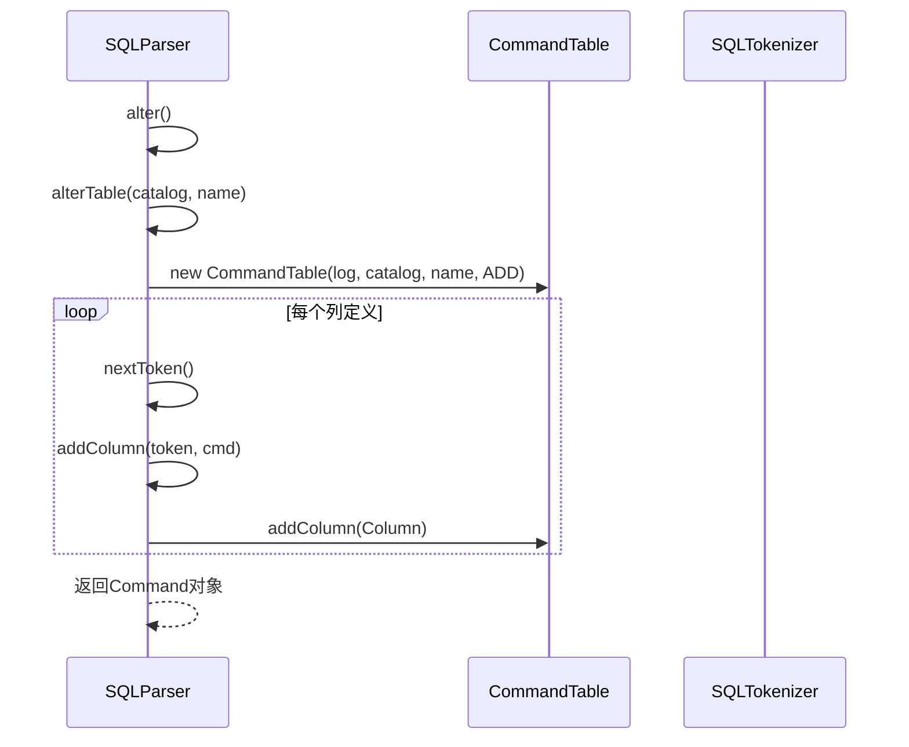
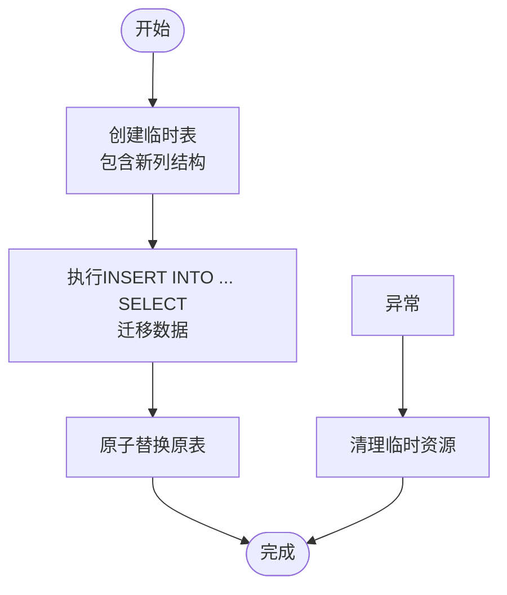

# ALTER TABLE语句

<cite>
**本文档引用的文件**  
- [CommandTable.java](file://src/main/java/io/leavesfly/smallsql/rdb/command/ddl/CommandTable.java)
- [SQLParser.java](file://src/main/java/io/leavesfly/smallsql/rdb/sql/SQLParser.java)
- [SQLTokenizer.java](file://src/main/java/io/leavesfly/smallsql/rdb/sql/parser/SQLTokenizer.java)
- [TestAlterTable.java](file://src/test/java/io/leavesfly/smallsql/junit/sql/ddl/TestAlterTable.java)
</cite>

## 目录
1. [简介](#简介)
2. [语法结构](#语法结构)
3. [解析过程](#解析过程)
4. [执行机制](#执行机制)
5. [锁机制与事务处理](#锁机制与事务处理)
6. [SQL示例](#sql示例)
7. [性能与并发影响](#性能与并发影响)
8. [错误处理与约束维护](#错误处理与约束维护)

## 简介
ALTER TABLE语句用于修改现有数据库表的结构，主要支持添加列（ADD COLUMN）操作。该功能通过解析SQL语句、构建命令对象并执行表结构变更来实现。系统采用创建临时表、数据迁移和原子替换的策略确保操作的完整性和一致性。

## 语法结构
ALTER TABLE语句的基本语法格式为：
```
ALTER TABLE table_name ADD column_name data_type [DEFAULT value] [, ...]
```
支持一次添加多个列，各列定义之间用逗号分隔。每列可指定数据类型和默认值。

**Section sources**
- [SQLParser.java](file://src/main/java/io/leavesfly/smallsql/rdb/sql/SQLParser.java#L1217-L1292)

## 解析过程
SQLParser类负责解析ALTER TABLE语句。首先调用`alter()`方法识别ALTER关键字，然后根据后续标记判断操作类型。当遇到TABLE关键字时，调用`alterTable()`方法处理表修改操作。

`alterTable()`方法读取表名后，获取下一个标记以确定具体操作类型。目前仅支持ADD操作，对应SQLTokenizer.ADD常量。对于每个新增列，解析器读取列名和数据类型，并通过`addColumn()`方法将列定义添加到CommandTable对象中。



**Diagram sources**
- [SQLParser.java](file://src/main/java/io/leavesfly/smallsql/rdb/sql/SQLParser.java#L1217-L1292)
- [CommandTable.java](file://src/main/java/io/leavesfly/smallsql/rdb/command/ddl/CommandTable.java#L34-L70)

**Section sources**
- [SQLParser.java](file://src/main/java/io/leavesfly/smallsql/rdb/sql/SQLParser.java#L1217-L1292)

## 执行机制
CommandTable.executeImpl方法实现了ALTER TABLE的核心逻辑。其采用三步策略：创建新表、数据迁移、原子替换。

首先，系统获取原表的元数据，包括列定义、索引和外键约束。然后创建一个具有新结构的临时表（名称以#开头）。接着生成INSERT INTO ... SELECT语句，将原表所有数据复制到新表中。最后调用database.replaceTable()方法原子性地替换原表。

此方法确保了表结构变更的原子性，避免了直接修改表结构可能带来的数据不一致问题。



**Diagram sources**
- [CommandTable.java](file://src/main/java/io/leavesfly/smallsql/rdb/command/ddl/CommandTable.java#L72-L135)

**Section sources**
- [CommandTable.java](file://src/main/java/io/leavesfly/smallsql/rdb/command/ddl/CommandTable.java#L72-L135)

## 锁机制与事务处理
在执行ALTER TABLE操作时，系统会请求表级锁（TableLock），该锁在整个操作期间保持持有。通过调用oldTable.requestLock(con, SQLTokenizer.ALTER, -1)获取锁，确保操作的排他性。

为保证操作的原子性，整个过程被包裹在try-catch块中。若任何步骤失败，异常处理机制会清理创建的临时表和索引，防止残留资源。finally块确保无论成功或失败，都会释放表锁。

事务隔离级别会影响操作行为。在REPEATABLE_READ隔离级别下，已持有锁的事务会阻止ALTER TABLE操作；而在READ_COMMITTED级别下，可能会出现不同的并发行为。

**Section sources**
- [CommandTable.java](file://src/main/java/io/leavesfly/smallsql/rdb/command/ddl/CommandTable.java#L108-L135)
- [TestAlterTable.java](file://src/test/java/io/leavesfly/smallsql/junit/sql/ddl/TestAlterTable.java#L73-L107)

## SQL示例
```sql
-- 添加单个列
ALTER TABLE AlterTable ADD a VARCHAR(20);

-- 添加多个列，其中一个带默认值
ALTER TABLE AlterTable ADD a VARCHAR(20), b INT DEFAULT 25;
```
测试用例验证了添加列后表结构的正确性，包括列名、数据类型和默认值的设置。

**Section sources**
- [TestAlterTable.java](file://src/test/java/io/leavesfly/smallsql/junit/sql/ddl/TestAlterTable.java#L50-L71)

## 性能与并发影响
ALTER TABLE操作对性能有显著影响，因为它需要：
1. 创建新的表结构
2. 全表扫描和数据复制
3. 原子替换操作

操作期间会持有表级锁，阻止其他写操作，可能影响并发性能。对于大表，操作耗时较长，建议在低峰期执行。

## 错误处理与约束维护
系统提供了完善的错误处理机制。当添加列导致约束冲突时（如添加主键导致多主键冲突），会抛出相应的SQLException。外键约束在表替换过程中被正确维护，确保引用完整性。

测试用例验证了错误场景的处理，如尝试添加第二个主键时会抛出异常，保证了数据库的完整性约束。

**Section sources**
- [TestAlterTable2.java](file://src/test/java/io/leavesfly/smallsql/junit/sql/ddl/TestAlterTable2.java#L57-L84)