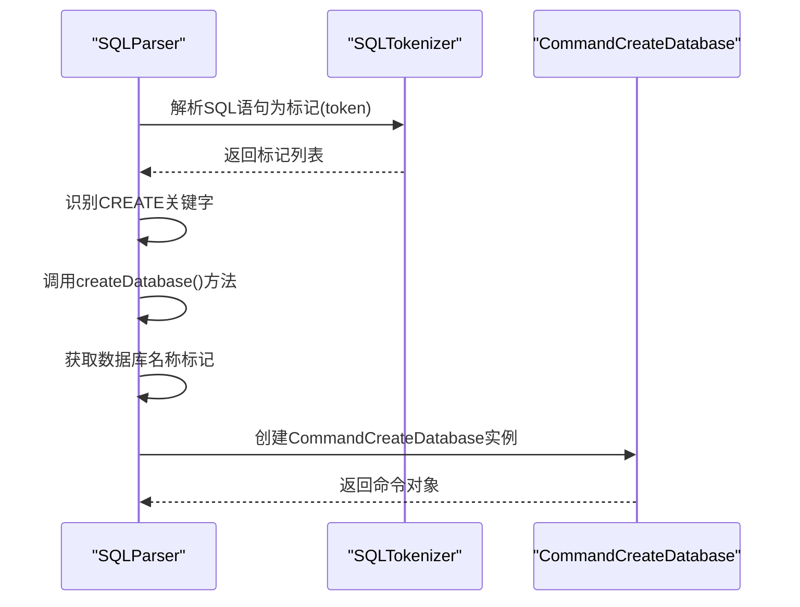
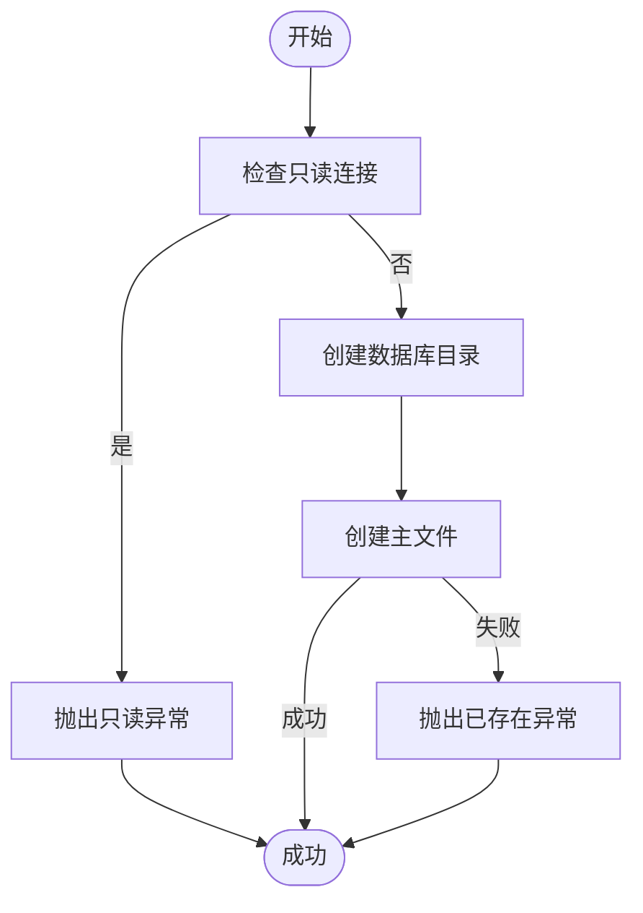
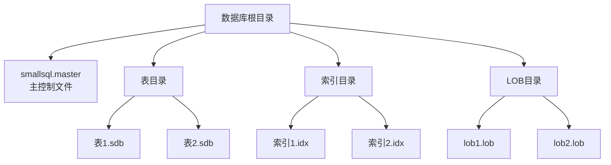
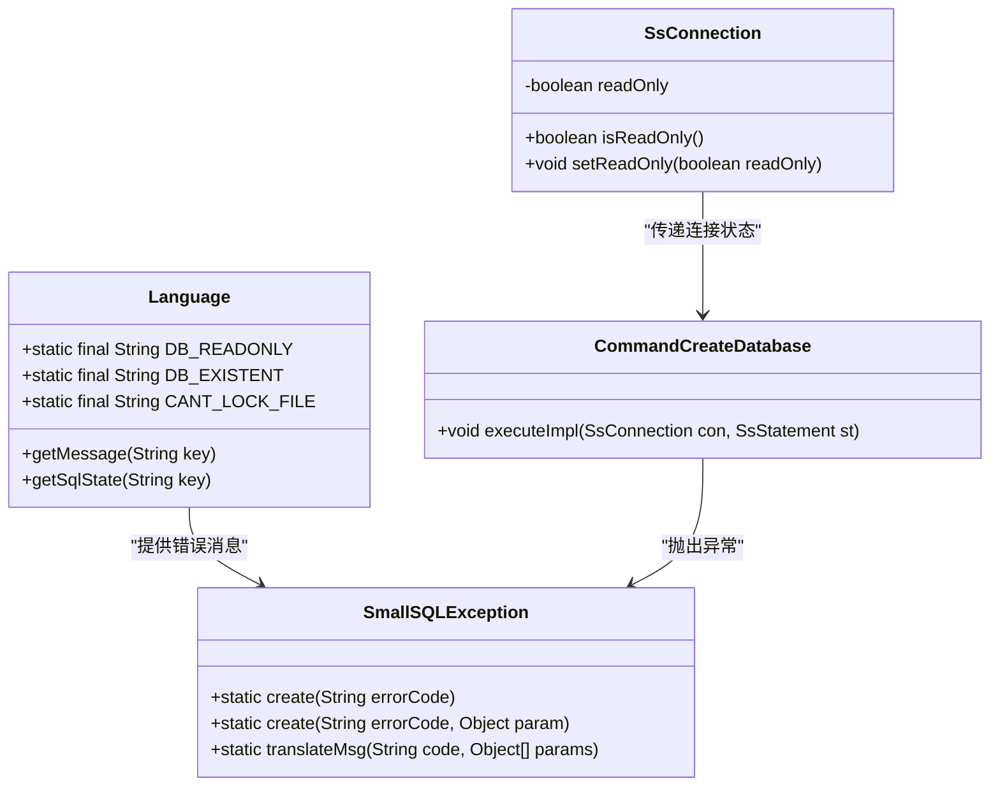

# CREATE DATABASE语句

<cite>
**本文档引用的文件**   
- [CommandCreateDatabase.java](file://src/main/java/io/leavesfly/smallsql/rdb/command/ddl/CommandCreateDatabase.java)
- [SQLParser.java](file://src/main/java/io/leavesfly/smallsql/rdb/sql/SQLParser.java)
- [SsConnection.java](file://src/main/java/io/leavesfly/smallsql/jdbc/SsConnection.java)
- [Utils.java](file://src/main/java/io/leavesfly/smallsql/util/Utils.java)
- [Language.java](file://src/main/java/io/leavesfly/smallsql/lang/Language.java)
</cite>

## 目录
1. [CREATE DATABASE语句语法](#create-database语句语法)
2. [SQLParser解析过程](#sqlparser解析过程)
3. [CommandCreateDatabase执行逻辑](#commandcreatedatabase执行逻辑)
4. [文件系统存储结构](#文件系统存储结构)
5. [权限与异常处理](#权限与异常处理)
6. [JDBC使用示例](#jdbc使用示例)

## CREATE DATABASE语句语法

CREATE DATABASE语句用于创建新的数据库。其基本语法格式为：

```sql
CREATE DATABASE database_name
```

其中`database_name`是数据库的名称，可以是相对路径或绝对路径。支持`file:`协议前缀，例如`file:mydatabase`。数据库名称将作为文件系统中的目录名称。

**语法说明**：
- `CREATE DATABASE`：创建数据库的关键字
- `database_name`：数据库名称，必须是有效的标识符
- 名称可以包含路径信息，用于指定数据库的存储位置
- 支持`file:`协议前缀，解析时会自动去除

**使用场景**：
- 初始化新的数据库实例
- 在指定路径创建数据库存储目录
- 为应用程序创建独立的数据存储空间

**Section sources**
- [SQLParser.java](file://src/main/java/io/leavesfly/smallsql/rdb/sql/SQLParser.java#L772-L803)

## SQLParser解析过程

SQLParser类负责将SQL语句字符串解析为可执行的命令对象。对于CREATE DATABASE语句，解析过程如下：



**解析步骤**：
1. SQLParser首先识别`CREATE`关键字，然后根据后续关键字确定具体操作类型
2. 当识别到`DATABASE`关键字时，调用`createDatabase()`私有方法
3. `createDatabase()`方法获取下一个标记作为数据库名称
4. 创建`CommandCreateDatabase`命令对象并返回

`createDatabase()`方法会检查是否有足够的表达式，如果没有则抛出语法错误。数据库名称从SQL标记中获取，并传递给`CommandCreateDatabase`构造函数。

**Diagram sources**
- [SQLParser.java](file://src/main/java/io/leavesfly/smallsql/rdb/sql/SQLParser.java#L772-L803)
- [CommandCreateDatabase.java](file://src/main/java/io/leavesfly/smallsql/rdb/command/ddl/CommandCreateDatabase.java#L15-L25)

**Section sources**
- [SQLParser.java](file://src/main/java/io/leavesfly/smallsql/rdb/sql/SQLParser.java#L772-L803)
- [CommandCreateDatabase.java](file://src/main/java/io/leavesfly/smallsql/rdb/command/ddl/CommandCreateDatabase.java#L15-L25)

## CommandCreateDatabase执行逻辑

CommandCreateDatabase类负责执行CREATE DATABASE语句的具体操作。其执行逻辑包括权限检查、目录创建和主文件创建。



**执行流程**：
1. 首先检查连接是否为只读模式，如果是则抛出异常
2. 创建数据库目录（如果不存在）
3. 在目录中创建主文件（smallsql.master）
4. 如果主文件已存在，则抛出数据库已存在异常

`executeImpl`方法是核心执行逻辑，接收`SsConnection`和`SsStatement`参数。它首先通过`con.isReadOnly()`检查连接的只读状态，如果为只读则使用`SmallSQLException.create(Language.DB_READONLY)`抛出异常。

数据库目录通过`new File(name)`创建，并调用`mkdirs()`方法创建所有必要的父目录。主文件通过`new File(dir, Utils.MASTER_FILENAME).createNewFile()`创建，如果文件已存在则返回false，此时会抛出`Language.DB_EXISTENT`异常。

**Diagram sources**
- [CommandCreateDatabase.java](file://src/main/java/io/leavesfly/smallsql/rdb/command/ddl/CommandCreateDatabase.java#L30-L45)
- [Utils.java](file://src/main/java/io/leavesfly/smallsql/util/Utils.java#L15)

**Section sources**
- [CommandCreateDatabase.java](file://src/main/java/io/leavesfly/smallsql/rdb/command/ddl/CommandCreateDatabase.java#L30-L45)
- [Utils.java](file://src/main/java/io/leavesfly/smallsql/util/Utils.java#L15)

## 文件系统存储结构

当执行CREATE DATABASE语句时，系统会在文件系统中创建相应的目录结构和文件。



**存储结构说明**：
- 数据库根目录：以数据库名称命名的目录
- `smallsql.master`：主控制文件，标识这是一个SmallSQL数据库
- `.sdb`文件：存储表和视图数据
- `.idx`文件：存储索引数据
- `.lob`文件：存储大对象数据

在`Utils.java`中定义了这些文件的扩展名常量：
- `MASTER_FILENAME = "smallsql.master"`
- `TABLE_VIEW_EXTENTION = ".sdb"`
- `IDX_EXTENTION = ".idx"`
- `LOB_EXTENTION = ".lob"`

数据库的物理存储结构是简单的文件系统目录，这使得数据库文件易于备份和迁移。主文件`smallsql.master`的存在用于标识目录是一个有效的SmallSQL数据库，防止意外操作非数据库目录。

**Diagram sources**
- [Utils.java](file://src/main/java/io/leavesfly/smallsql/util/Utils.java#L15-L20)
- [CommandCreateDatabase.java](file://src/main/java/io/leavesfly/smallsql/rdb/command/ddl/CommandCreateDatabase.java#L40)

**Section sources**
- [Utils.java](file://src/main/java/io/leavesfly/smallsql/util/Utils.java#L15-L20)

## 权限与异常处理

系统实现了完善的权限控制和异常处理机制，确保数据库操作的安全性和可靠性。



**权限控制**：
- 只读连接检查：通过`SsConnection.isReadOnly()`方法检查
- 文件系统权限：依赖操作系统的文件权限机制
- 单进程访问：通过文件锁防止多进程同时访问

**异常处理**：
- `DB_READONLY`：当在只读连接上执行创建操作时抛出
- `DB_EXISTENT`：当数据库已存在时抛出
- `CANT_LOCK_FILE`：当无法获取文件锁时抛出

错误消息在`Language.java`中定义为常量，并提供多语言支持。`SmallSQLException.create()`方法根据错误代码创建相应的异常对象。这种设计使得错误处理一致且易于维护。

**Diagram sources**
- [Language.java](file://src/main/java/io/leavesfly/smallsql/lang/Language.java#L34-L35)
- [SsConnection.java](file://src/main/java/io/leavesfly/smallsql/jdbc/SsConnection.java#L68)
- [CommandCreateDatabase.java](file://src/main/java/io/leavesfly/smallsql/rdb/command/ddl/CommandCreateDatabase.java#L30-L45)

**Section sources**
- [Language.java](file://src/main/java/io/leavesfly/smallsql/lang/Language.java#L34-L35)
- [SsConnection.java](file://src/main/java/io/leavesfly/smallsql/jdbc/SsConnection.java#L68)
- [CommandCreateDatabase.java](file://src/main/java/io/leavesfly/smallsql/rdb/command/ddl/CommandCreateDatabase.java#L30-L45)

## JDBC使用示例

通过JDBC接口执行CREATE DATABASE语句的示例如下：

```java
// 创建数据库连接属性
Properties props = new Properties();
props.setProperty("dbpath", "mydatabase");
props.setProperty("create", "true");

// 建立数据库连接
Connection conn = DriverManager.getConnection("jdbc:smallsql:", props);

// 创建Statement对象
Statement stmt = conn.createStatement();

// 执行CREATE DATABASE语句
try {
    stmt.execute("CREATE DATABASE mydatabase");
    System.out.println("数据库创建成功");
} catch (SQLException e) {
    System.err.println("数据库创建失败: " + e.getMessage());
}

// 关闭连接
stmt.close();
conn.close();
```

**连接参数说明**：
- `dbpath`：数据库路径
- `create`：是否允许创建数据库
- `readonly`：是否以只读模式打开
- `locale`：设置语言环境

在连接属性中设置`create=true`允许自动创建数据库。如果数据库已存在，则`CREATE DATABASE`语句会失败并抛出异常。通过捕获`SQLException`可以处理各种可能的错误情况，如权限不足、磁盘空间不足等。

**Section sources**
- [SsConnection.java](file://src/main/java/io/leavesfly/smallsql/jdbc/SsConnection.java#L100-L110)
- [CommandCreateDatabase.java](file://src/main/java/io/leavesfly/smallsql/rdb/command/ddl/CommandCreateDatabase.java#L30-L45)