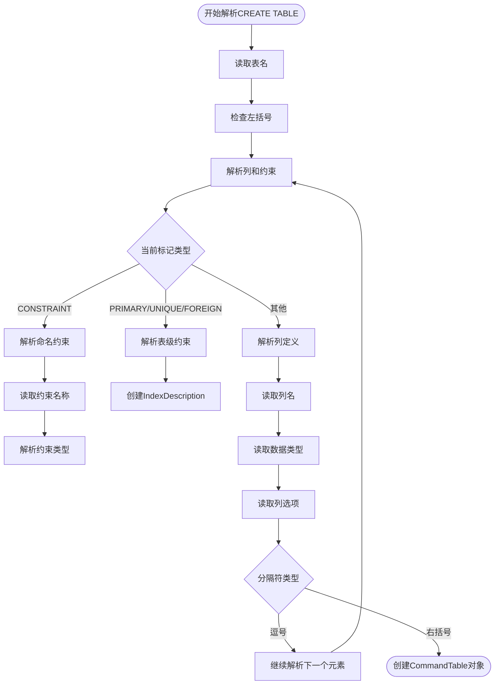
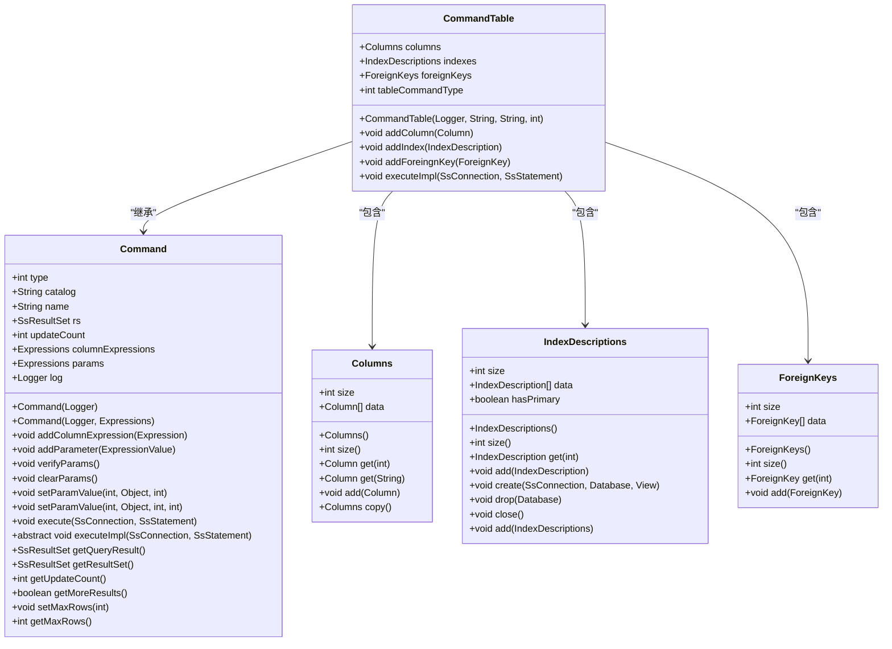
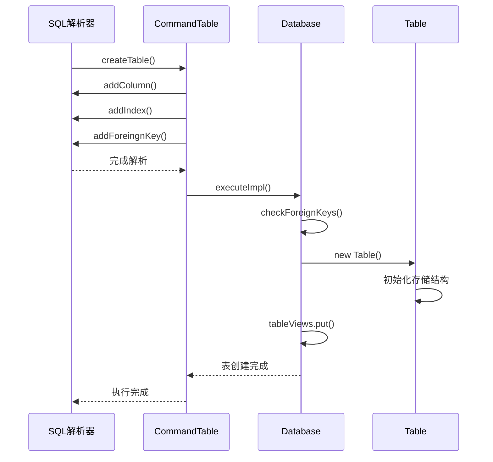

# CREATE TABLE语句

<cite>
**本文档引用的文件**  
- [SQLParser.java](file://src/main/java/io/leavesfly/smallsql/rdb/sql/SQLParser.java)
- [CommandTable.java](file://src/main/java/io/leavesfly/smallsql/rdb/command/ddl/CommandTable.java)
- [Database.java](file://src/main/java/io/leavesfly/smallsql/rdb/engine/Database.java)
- [Column.java](file://src/main/java/io/leavesfly/smallsql/rdb/engine/table/Column.java)
- [Columns.java](file://src/main/java/io/leavesfly/smallsql/rdb/engine/table/Columns.java)
- [IndexDescriptions.java](file://src/main/java/io/leavesfly/smallsql/rdb/engine/index/IndexDescriptions.java)
- [ForeignKeys.java](file://src/main/java/io/leavesfly/smallsql/rdb/engine/table/ForeignKeys.java)
</cite>

## 目录
1. [CREATE TABLE语法详解](#create-table语法详解)
2. [SQLParser解析流程](#sqlparser解析流程)
3. [CommandTable类结构分析](#commandtable类结构分析)
4. [表结构内部表示](#表结构内部表示)
5. [约束处理机制](#约束处理机制)
6. [执行流程分析](#执行流程分析)
7. [SQL示例](#sql示例)

## CREATE TABLE语法详解

`CREATE TABLE`语句用于在数据库中创建新表。该语句的基本语法结构包括表名定义、列定义和约束定义三个主要部分。列定义包含列名、数据类型以及可选的列约束（如NOT NULL、DEFAULT等）。约束定义可以是列级约束，也可以是表级约束，包括主键（PRIMARY KEY）、唯一性（UNIQUE）和外键（FOREIGN KEY）等。

在列定义中，数据类型决定了该列可以存储的数据种类，如整数（INT）、字符串（VARCHAR）等。每个数据类型可能还需要指定精度和标度，例如`DECIMAL(10,2)`表示总共10位数字，其中2位是小数。列约束用于限制列中数据的取值范围和特性，NOT NULL约束确保该列不能存储空值，DEFAULT约束为该列提供默认值。

表级约束允许在多个列上定义约束条件。主键约束确保指定列或列组合的值在表中唯一且不为空，通常用于标识表中的每一行。唯一性约束与主键类似，但允许空值的存在。外键约束建立了表与表之间的关联，确保一个表中的列值必须在另一个表的对应列中存在。

**Section sources**
- [SQLParser.java](file://src/main/java/io/leavesfly/smallsql/rdb/sql/SQLParser.java#L137-L2527)

## SQLParser解析流程

`SQLParser`类负责将SQL语句字符串解析为相应的命令对象。当解析`CREATE TABLE`语句时，`createTable()`方法首先读取表名，然后进入循环处理表定义中的各个元素。解析过程从左括号开始，逐个处理列定义和约束定义，直到遇到右括号为止。

在解析过程中，如果遇到`CONSTRAINT`关键字，则表示接下来是带名称的约束定义。否则，解析器会尝试将当前标记识别为列名。对于列定义，`addColumn()`方法被调用，该方法会读取列名、数据类型以及后续的列选项，如DEFAULT、IDENTITY、NULL/NOT NULL等。这些选项按顺序处理，直到遇到逗号或右括号。

对于约束定义，`index()`方法被调用以解析主键、唯一性或外键约束。外键约束的解析需要额外处理`REFERENCES`子句，读取被引用表的名称和列列表。解析器会创建相应的`IndexDescription`对象来表示约束，并将其添加到命令对象中。整个解析过程通过状态机的方式进行，根据当前标记的类型决定下一步的解析动作。



**Diagram sources**
- [SQLParser.java](file://src/main/java/io/leavesfly/smallsql/rdb/sql/SQLParser.java#L137-L2527)

**Section sources**
- [SQLParser.java](file://src/main/java/io/leavesfly/smallsql/rdb/sql/SQLParser.java#L137-L2527)

## CommandTable类结构分析

`CommandTable`类是`CREATE TABLE`语句的命令对象，它封装了表定义的所有信息。该类包含三个核心集合：`columns`用于存储列定义，`indexes`用于存储索引描述，`foreignKeys`用于存储外键约束。这些集合分别由`Columns`、`IndexDescriptions`和`ForeignKeys`类实现，它们都是类型化的数组列表，提供了类型安全的集合操作。

`CommandTable`类提供了`addColumn()`、`addIndex()`和`addForeingnKey()`方法来向相应的集合中添加元素。`addColumn()`方法在添加列之前会检查列名是否已存在，如果存在则抛出异常，这确保了列名的唯一性。`addIndex()`方法在添加主键约束时会检查是否已存在主键，因为一个表只能有一个主键。`foreignKeys`集合则简单地存储外键约束，不进行重复检查。

`CommandTable`类继承自`Command`抽象类，实现了`executeImpl()`方法。该方法根据命令类型（创建或添加）调用相应的数据库操作。对于创建表的操作，它会获取数据库实例并调用`createTable()`方法。`CommandTable`对象在解析阶段被构建，包含了完整的表定义信息，然后在执行阶段被用来创建实际的表结构。



**Diagram sources**
- [CommandTable.java](file://src/main/java/io/leavesfly/smallsql/rdb/command/ddl/CommandTable.java#L0-L155)
- [Columns.java](file://src/main/java/io/leavesfly/smallsql/rdb/engine/table/Columns.java#L0-L140)
- [IndexDescriptions.java](file://src/main/java/io/leavesfly/smallsql/rdb/engine/index/IndexDescriptions.java#L0-L147)
- [ForeignKeys.java](file://src/main/java/io/leavesfly/smallsql/rdb/engine/table/ForeignKeys.java#L0-L76)

**Section sources**
- [CommandTable.java](file://src/main/java/io/leavesfly/smallsql/rdb/command/ddl/CommandTable.java#L0-L155)

## 表结构内部表示

表结构的内部表示由多个类协同完成。`Column`类表示单个列的元数据，包含列名、数据类型、精度、标度、是否可空、是否自增等属性。`Columns`类是一个类型化的数组列表，用于存储表中所有列的定义。它提供了按索引和按名称查找列的方法，以及添加列和复制列集合的功能。

`IndexDescription`类表示索引或约束的描述，包含约束名称、表名、约束类型、表达式列表和列名列表。`IndexDescriptions`类是一个类型化的数组列表，用于存储表中所有索引描述。它在添加主键约束时会检查是否已存在主键，确保一个表只能有一个主键。`ForeignKey`类表示外键约束，包含外键表名、外键索引描述、主键表名和主键索引描述。`ForeignKeys`类是一个类型化的数组列表，用于存储表中所有外键约束。

这些类共同构成了表的元数据模型。`Column`类的实例存储了列的详细信息，包括数据类型和约束。`Columns`集合按顺序存储了表中所有列的定义。`IndexDescriptions`集合存储了所有索引和约束的描述，包括主键、唯一性和外键。`ForeignKeys`集合存储了所有外键约束，建立了表与表之间的关联。这种分层的结构使得表的元数据可以被高效地存储和查询。

**Section sources**
- [Column.java](file://src/main/java/io/leavesfly/smallsql/rdb/engine/table/Column.java#L0-L191)
- [Columns.java](file://src/main/java/io/leavesfly/smallsql/rdb/engine/table/Columns.java#L0-L140)
- [IndexDescriptions.java](file://src/main/java/io/leavesfly/smallsql/rdb/engine/index/IndexDescriptions.java#L0-L147)
- [ForeignKeys.java](file://src/main/java/io/leavesfly/smallsql/rdb/engine/table/ForeignKeys.java#L0-L76)

## 约束处理机制

约束处理机制在`SQLParser`和`CommandTable`类中实现。当解析器遇到约束定义时，会调用`index()`方法创建`IndexDescription`对象。对于主键和唯一性约束，`index()`方法会读取列列表并创建相应的索引描述。对于外键约束，解析器会额外处理`REFERENCES`子句，读取被引用表的名称和列列表，并创建主键和外键的索引描述。

`IndexDescriptions`类在添加索引描述时会进行验证。当添加主键约束时，它会检查是否已存在主键，如果已存在则抛出异常。这确保了每个表只能有一个主键。`addColumn()`方法在添加列时会检查列名是否已存在，如果存在则抛出异常，这确保了列名的唯一性。这些验证机制在解析阶段就捕获了潜在的错误，避免了在执行阶段出现数据不一致的问题。

外键约束的处理更为复杂。`ForeignKey`类存储了外键和主键的索引描述，建立了两个表之间的关联。在创建表时，数据库会检查被引用的表是否存在，并且被引用的列是否具有适当的约束（如主键或唯一性）。这种检查确保了引用完整性，防止了孤立的外键值。约束处理机制通过在多个层次上进行验证，确保了表定义的正确性和数据的完整性。

**Section sources**
- [SQLParser.java](file://src/main/java/io/leavesfly/smallsql/rdb/sql/SQLParser.java#L137-L2527)
- [CommandTable.java](file://src/main/java/io/leavesfly/smallsql/rdb/command/ddl/CommandTable.java#L0-L155)
- [IndexDescriptions.java](file://src/main/java/io/leavesfly/smallsql/rdb/engine/index/IndexDescriptions.java#L0-L147)

## 执行流程分析

`CREATE TABLE`语句的执行流程始于`CommandTable`对象的`executeImpl()`方法。该方法首先根据表名获取数据库实例，然后根据命令类型调用相应的操作。对于创建表的操作，它会调用`Database`类的`createTable()`方法，传入表名、列集合、索引描述集合和外键约束集合。

`Database`类的`createTable()`方法首先检查外键约束的有效性，确保被引用的表存在。然后，它创建一个新的`Table`对象，传入数据库实例、连接、表名、列集合、索引描述集合和外键约束集合。`Table`对象的构造函数会初始化表的存储结构，包括数据文件和索引文件。最后，新的表对象被添加到数据库的表视图映射中，使得它可以通过表名被访问。

整个执行流程是原子的，确保了表创建操作的完整性。如果在创建过程中发生任何错误，整个操作都会回滚，不会留下部分创建的表。这种设计保证了数据库的一致性状态。执行流程通过将解析和执行分离，实现了关注点的分离，使得代码更易于维护和扩展。



**Diagram sources**
- [CommandTable.java](file://src/main/java/io/leavesfly/smallsql/rdb/command/ddl/CommandTable.java#L0-L155)
- [Database.java](file://src/main/java/io/leavesfly/smallsql/rdb/engine/Database.java#L0-L564)
- [Table.java](file://src/main/java/io/leavesfly/smallsql/rdb/engine/Table.java#L0-L100)

**Section sources**
- [CommandTable.java](file://src/main/java/io/leavesfly/smallsql/rdb/command/ddl/CommandTable.java#L0-L155)
- [Database.java](file://src/main/java/io/leavesfly/smallsql/rdb/engine/Database.java#L304-L326)

## SQL示例

以下是一些`CREATE TABLE`语句的示例，展示了各种约束的定义方式：

```sql
-- 基本表创建，包含主键和默认值
CREATE TABLE users (
    id INT PRIMARY KEY,
    name VARCHAR(50) NOT NULL,
    email VARCHAR(100) UNIQUE,
    created_date DATE DEFAULT CURRENT_DATE
);

-- 包含复合主键的表
CREATE TABLE order_items (
    order_id INT,
    product_id INT,
    quantity INT,
    PRIMARY KEY (order_id, product_id)
);

-- 包含外键约束的表
CREATE TABLE orders (
    id INT PRIMARY KEY,
    user_id INT,
    order_date DATE,
    FOREIGN KEY (user_id) REFERENCES users(id)
);

-- 包含命名约束的表
CREATE TABLE products (
    id INT,
    name VARCHAR(100),
    price DECIMAL(10,2),
    CONSTRAINT pk_products PRIMARY KEY (id),
    CONSTRAINT uk_product_name UNIQUE (name),
    CONSTRAINT chk_price CHECK (price > 0)
);
```

这些示例展示了`CREATE TABLE`语句的各种用法。第一个示例创建了一个包含主键、非空约束、唯一性约束和默认值的表。第二个示例展示了如何定义复合主键，即由多个列组成的主键。第三个示例展示了外键约束的使用，建立了`orders`表和`users`表之间的关联。最后一个示例展示了如何为约束指定名称，这在管理和引用约束时非常有用。

**Section sources**
- [TestTokenizer.java](file://src/test/java/io/leavesfly/smallsql/junit/sql/TestTokenizer.java#L75-L84)