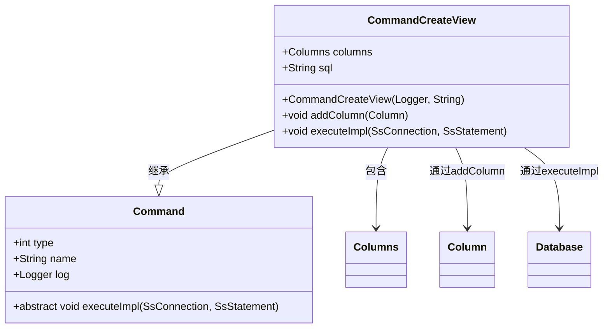
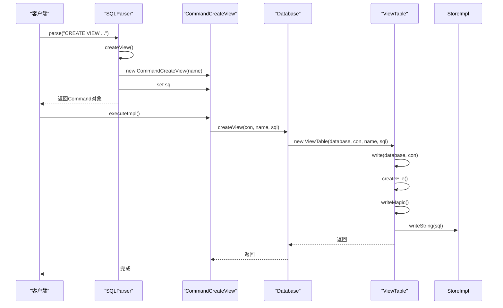
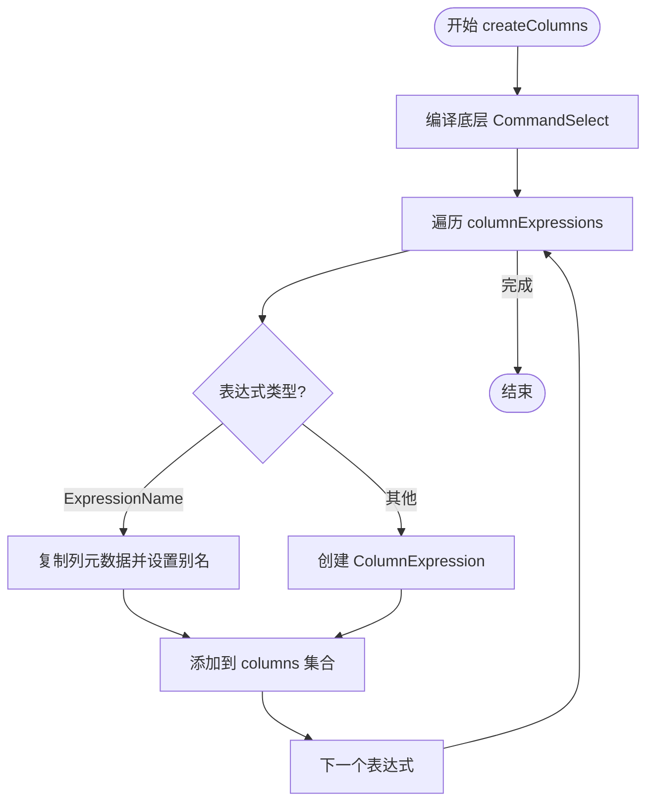

# CREATE VIEW语句

<cite>
**本文档中引用的文件**   
- [CommandCreateView.java](file://src/main/java/io/leavesfly/smallsql/rdb/command/ddl/CommandCreateView.java)
- [Database.java](file://src/main/java/io/leavesfly/smallsql/rdb/engine/Database.java)
- [View.java](file://src/main/java/io/leavesfly/smallsql/rdb/engine/View.java)
- [ViewTable.java](file://src/main/java/io/leavesfly/smallsql/rdb/engine/ViewTable.java)
- [SQLParser.java](file://src/main/java/io/leavesfly/smallsql/rdb/sql/SQLParser.java)
</cite>

## 目录
1. [介绍](#介绍)
2. [CREATE VIEW语法解析](#create-view语法解析)
3. [CommandCreateView命令对象](#commandcreateview命令对象)
4. [视图元数据存储与持久化](#视图元数据存储与持久化)
5. [视图列结构推导](#视图列结构推导)
6. [SQL示例](#sql示例)
7. [安全性与性能影响](#安全性与性能影响)

## 介绍
CREATE VIEW语句用于在数据库中创建虚拟表，该虚拟表基于一个SELECT查询的结果集。视图不存储实际数据，而是存储查询定义，当访问视图时，数据库引擎会执行底层查询并返回结果。这种机制提供了数据抽象、简化复杂查询和增强安全性的能力。本文档详细阐述了CREATE VIEW语句的语法解析、命令对象构建、元数据存储以及查询重写机制。

## CREATE VIEW语法解析
SQLParser类中的createView()方法负责解析CREATE VIEW语句。该方法首先通过nextIdentifier()获取视图名称，然后验证AS关键字的存在。接着，它从当前SQL语句的剩余部分提取完整的SELECT查询字符串，并将其存储在CommandCreateView对象的sql字段中。为了验证查询的语法正确性，解析器会调用select()方法对查询进行预解析。此过程确保了在创建视图之前，其定义的查询是有效的。

**Section sources**
- [SQLParser.java](file://src/main/java/io/leavesfly/smallsql/rdb/sql/SQLParser.java#L137-L2527)

## CommandCreateView命令对象
CommandCreateView类继承自Command基类，代表一个创建视图的命令。它包含两个核心成员：columns集合和sql字符串。columns集合用于存储视图的列定义，这些定义是从底层查询的结果集中推导出来的。sql字符串则保存了创建视图所基于的完整SELECT查询。executeImpl方法是命令执行的核心，它通过调用SsConnection的getDatabase()方法获取当前数据库实例，然后调用Database.createView()方法来完成视图的创建。



**Diagram sources **
- [CommandCreateView.java](file://src/main/java/io/leavesfly/smallsql/rdb/command/ddl/CommandCreateView.java#L1-L68)

**Section sources**
- [CommandCreateView.java](file://src/main/java/io/leavesfly/smallsql/rdb/command/ddl/CommandCreateView.java#L1-L68)

## 视图元数据存储与持久化
视图的元数据存储由Database类和ViewTable类协同完成。当executeImpl方法调用Database.createView()时，会创建一个新的ViewTable实例。ViewTable的构造函数负责将视图的元数据（包括视图名称和SQL查询字符串）写入一个以".ssv"为扩展名的文件中。该文件以特定的二进制格式存储，文件头包含MAGIC_VIEW标识和版本号，后续部分则存储SQL查询字符串和其他可能的附加信息。这种持久化机制确保了视图定义在数据库重启后依然存在。



**Diagram sources **
- [Database.java](file://src/main/java/io/leavesfly/smallsql/rdb/engine/Database.java#L328-L332)
- [ViewTable.java](file://src/main/java/io/leavesfly/smallsql/rdb/engine/ViewTable.java#L1-L157)

**Section sources**
- [Database.java](file://src/main/java/io/leavesfly/smallsql/rdb/engine/Database.java#L328-L332)
- [ViewTable.java](file://src/main/java/io/leavesfly/smallsql/rdb/engine/ViewTable.java#L1-L157)

## 视图列结构推导
视图的列结构是通过分析其底层SELECT查询的结果集来动态推导的。当ViewTable对象被创建时，它会调用createColumns()方法。该方法首先编译底层的CommandSelect命令，然后遍历查询的列表达式列表（columnExpressions）。对于每个表达式，如果它是一个简单的列引用（ExpressionName），则直接复制该列的元数据并应用别名；如果是一个复杂的表达式（如函数或计算），则创建一个ColumnExpression对象来表示该列。这个过程确保了视图的列定义与查询结果完全一致。



**Diagram sources **
- [ViewTable.java](file://src/main/java/io/leavesfly/smallsql/rdb/engine/ViewTable.java#L1-L157)

**Section sources**
- [ViewTable.java](file://src/main/java/io/leavesfly/smallsql/rdb/engine/ViewTable.java#L1-L157)

## SQL示例
以下SQL示例展示了如何创建一个基于复杂查询的视图。该视图名为"SalesSummary"，它聚合了销售数据，计算每个产品的总销售额和平均单价。

```sql
CREATE VIEW SalesSummary AS 
SELECT 
    p.ProductName,
    SUM(s.Quantity) AS TotalQuantity,
    AVG(s.UnitPrice) AS AveragePrice,
    SUM(s.Quantity * s.UnitPrice) AS TotalRevenue
FROM 
    Products p
    INNER JOIN Sales s ON p.ProductID = s.ProductID
GROUP BY 
    p.ProductName
ORDER BY 
    TotalRevenue DESC;
```

## 安全性与性能影响
视图在数据库安全和性能方面具有双重影响。从安全性角度看，视图可以作为数据访问的抽象层，允许用户查询视图而无需直接访问底层表，从而实现行级或列级的数据访问控制。然而，视图的性能影响取决于其定义的复杂性。简单视图通常性能开销很小，但包含复杂JOIN、GROUP BY或子查询的视图在每次访问时都需要重新执行底层查询，可能导致性能瓶颈。因此，对于频繁访问的复杂视图，应考虑使用物化视图（如果数据库支持）或优化底层查询。