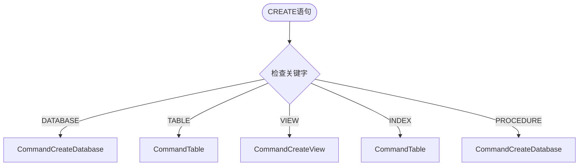
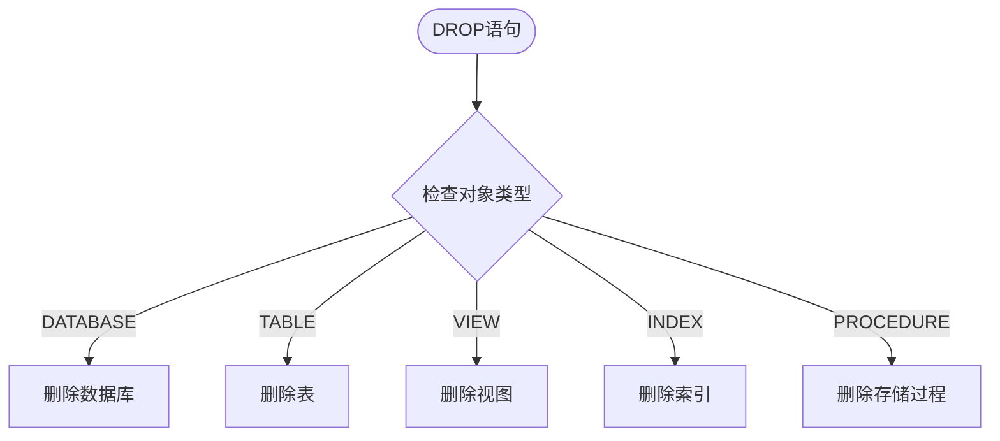
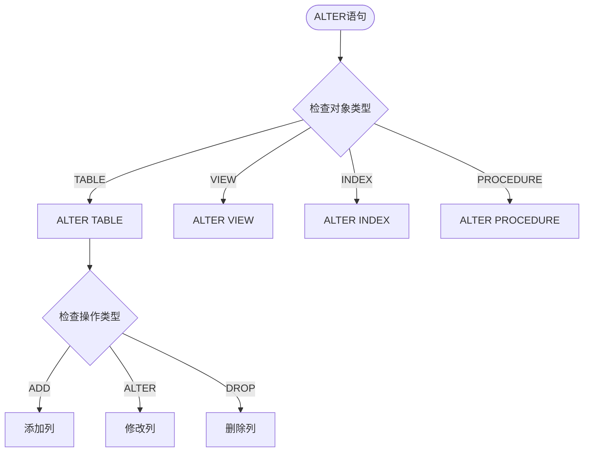
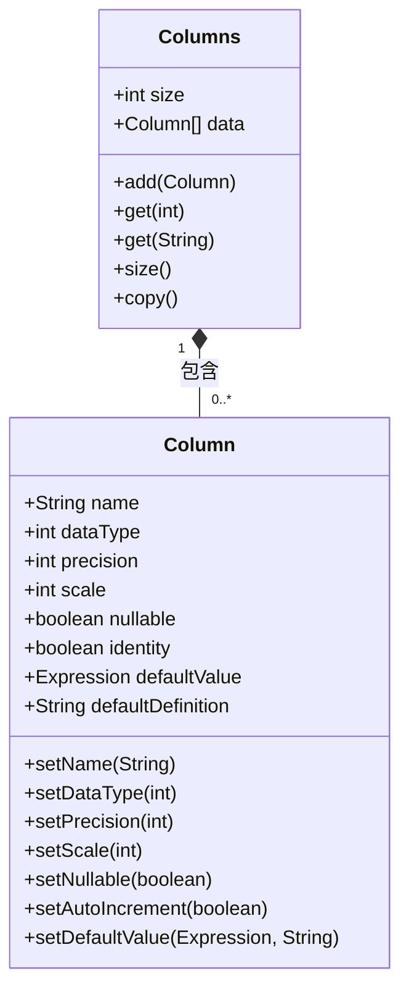
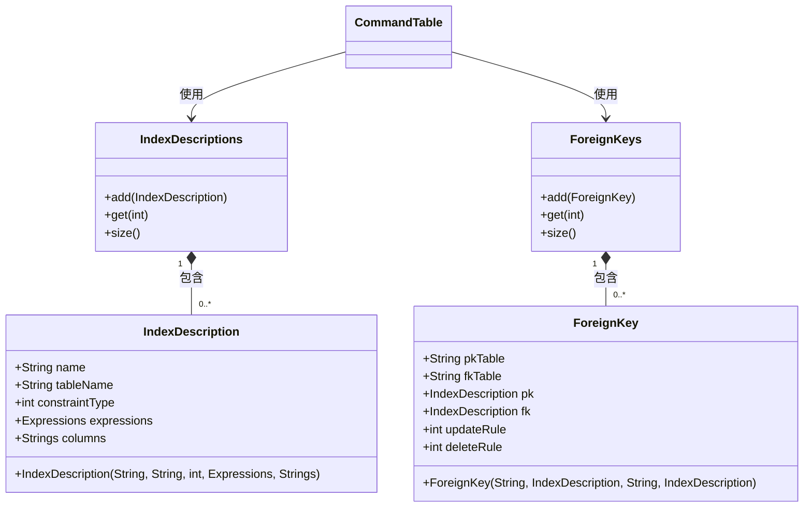
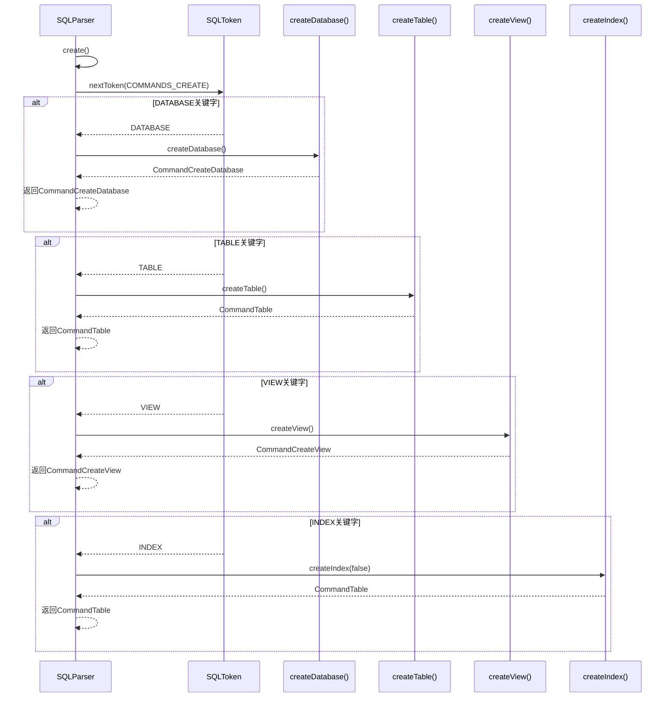
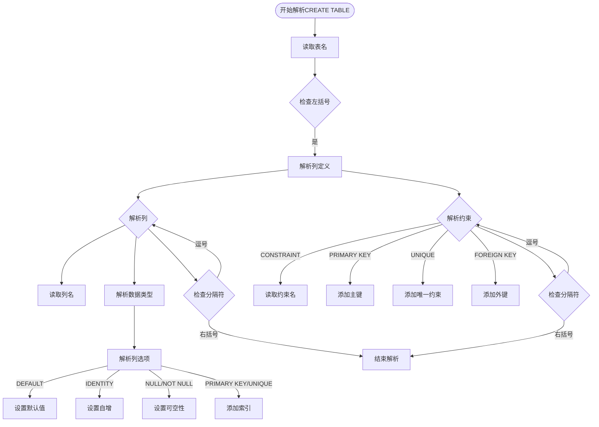
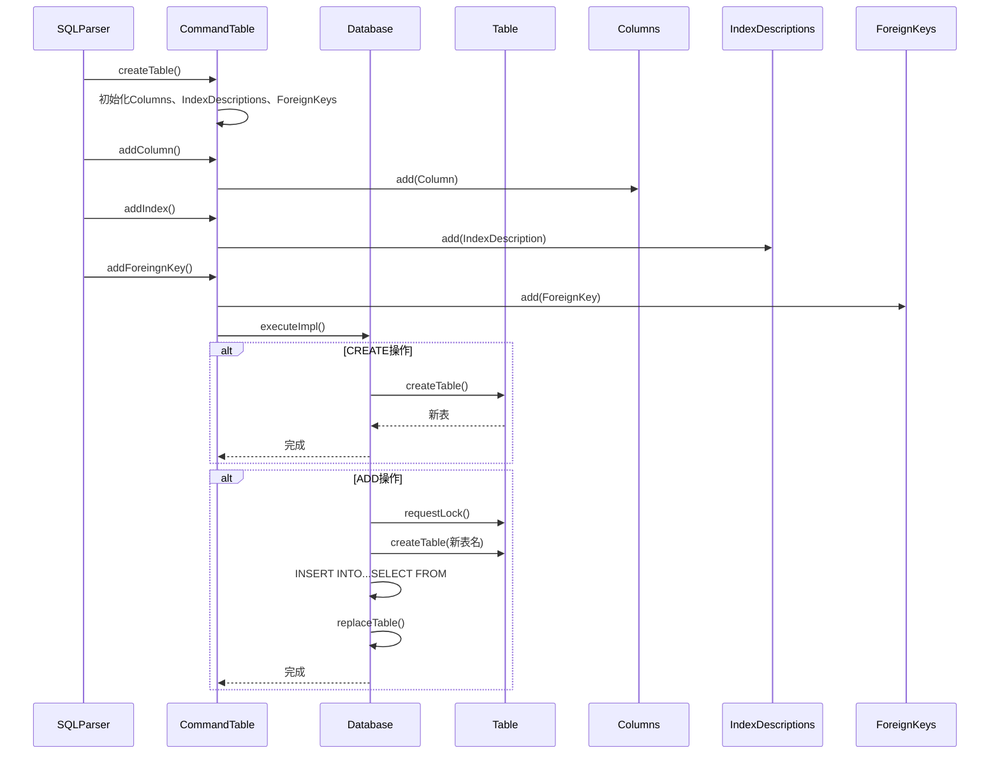
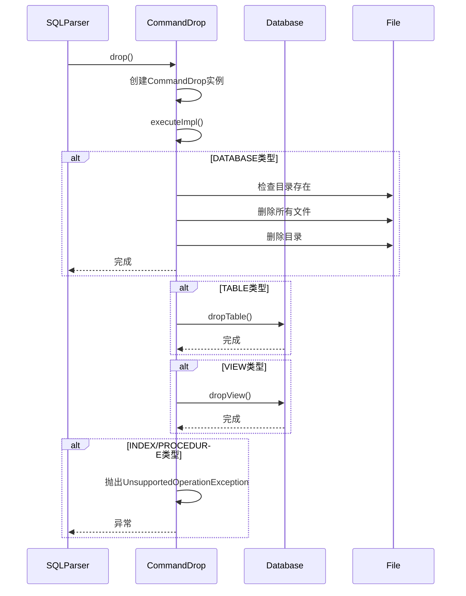

# DDL语句支持

<cite>
**本文档中引用的文件**  
- [SQLParser.java](file://src/main/java/io/leavesfly/smallsql/rdb/sql/SQLParser.java)
- [CommandCreateDatabase.java](file://src/main/java/io/leavesfly/smallsql/rdb/command/ddl/CommandCreateDatabase.java)
- [CommandTable.java](file://src/main/java/io/leavesfly/smallsql/rdb/command/ddl/CommandTable.java)
- [CommandDrop.java](file://src/main/java/io/leavesfly/smallsql/rdb/command/ddl/CommandDrop.java)
- [CommandCreateView.java](file://src/main/java/io/leavesfly/smallsql/rdb/command/ddl/CommandCreateView.java)
- [Column.java](file://src/main/java/io/leavesfly/smallsql/rdb/engine/table/Column.java)
- [Columns.java](file://src/main/java/io/leavesfly/smallsql/rdb/engine/table/Columns.java)
- [ForeignKey.java](file://src/main/java/io/leavesfly/smallsql/rdb/engine/table/ForeignKey.java)
</cite>

## 目录
1. [简介](#简介)
2. [DDL语句语法结构](#ddl语句语法结构)
3. [表结构定义](#表结构定义)
4. [SQLParser解析机制](#sqlparser解析机制)
5. [命令执行实现](#命令执行实现)
6. [实际SQL示例](#实际sql示例)

## 简介
SmallSQL支持完整的数据定义语言（DDL）功能，允许用户创建和管理数据库对象。本文档详细说明了CREATE DATABASE、CREATE TABLE、CREATE VIEW、DROP和ALTER TABLE等DDL语句的语法结构、使用方式和内部实现机制。通过分析SQLParser的解析流程和相关命令类的执行逻辑，全面展示SmallSQL如何处理各种DDL操作。

## DDL语句语法结构

### CREATE语句
SmallSQL的CREATE语句支持创建数据库、表、视图、索引和存储过程等对象。SQLParser通过create()方法根据不同的关键字分发到相应的实现类。



**Diagram sources**
- [SQLParser.java](file://src/main/java/io/leavesfly/smallsql/rdb/sql/SQLParser.java#L1000-L1020)

**Section sources**
- [SQLParser.java](file://src/main/java/io/leavesfly/smallsql/rdb/sql/SQLParser.java#L1000-L1050)

### DROP语句
DROP语句用于删除数据库对象，支持删除数据库、表、视图、索引和存储过程。



**Diagram sources**
- [SQLParser.java](file://src/main/java/io/leavesfly/smallsql/rdb/sql/SQLParser.java#L1500-L1530)

**Section sources**
- [SQLParser.java](file://src/main/java/io/leavesfly/smallsql/rdb/sql/SQLParser.java#L1500-L1550)
- [CommandDrop.java](file://src/main/java/io/leavesfly/smallsql/rdb/command/ddl/CommandDrop.java#L20-L30)

### ALTER语句
ALTER语句用于修改现有数据库对象，目前主要支持ALTER TABLE操作。



**Diagram sources**
- [SQLParser.java](file://src/main/java/io/leavesfly/smallsql/rdb/sql/SQLParser.java#L1550-L1600)

**Section sources**
- [SQLParser.java](file://src/main/java/io/leavesfly/smallsql/rdb/sql/SQLParser.java#L1550-L1650)

## 表结构定义

### 列类型定义
SmallSQL支持多种数据类型，包括数值型、字符型、日期时间型等。Column类用于表示表中的列，包含数据类型、精度、标度等属性。



**Diagram sources**
- [Column.java](file://src/main/java/io/leavesfly/smallsql/rdb/engine/table/Column.java#L30-L190)
- [Columns.java](file://src/main/java/io/leavesfly/smallsql/rdb/engine/table/Columns.java#L20-L140)

**Section sources**
- [Column.java](file://src/main/java/io/leavesfly/smallsql/rdb/engine/table/Column.java#L30-L190)
- [Columns.java](file://src/main/java/io/leavesfly/smallsql/rdb/engine/table/Columns.java#L20-L140)

### 约束定义
表结构支持主键、唯一约束、外键等约束定义。IndexDescription类用于表示索引和约束，ForeignKey类用于表示外键关系。



**Diagram sources**
- [IndexDescription.java](file://src/main/java/io/leavesfly/smallsql/rdb/engine/index/IndexDescription.java)
- [ForeignKey.java](file://src/main/java/io/leavesfly/smallsql/rdb/engine/table/ForeignKey.java#L20-L55)

**Section sources**
- [IndexDescription.java](file://src/main/java/io/leavesfly/smallsql/rdb/engine/index/IndexDescription.java)
- [ForeignKey.java](file://src/main/java/io/leavesfly/smallsql/rdb/engine/table/ForeignKey.java#L20-L55)

## SQLParser解析机制

### create()方法分发机制
SQLParser的create()方法是DDL语句解析的核心，根据不同的关键字分发到相应的创建方法。



**Diagram sources**
- [SQLParser.java](file://src/main/java/io/leavesfly/smallsql/rdb/sql/SQLParser.java#L1000-L1050)

**Section sources**
- [SQLParser.java](file://src/main/java/io/leavesfly/smallsql/rdb/sql/SQLParser.java#L1000-L1050)

### 表定义解析流程
CREATE TABLE语句的解析流程包括列定义和约束定义两个主要部分。



**Diagram sources**
- [SQLParser.java](file://src/main/java/io/leavesfly/smallsql/rdb/sql/SQLParser.java#L850-L950)

**Section sources**
- [SQLParser.java](file://src/main/java/io/leavesfly/smallsql/rdb/sql/SQLParser.java#L850-L950)

## 命令执行实现

### CommandTable类处理逻辑
CommandTable类负责处理表的创建和修改操作，包括列定义和约束设置。



**Diagram sources**
- [CommandTable.java](file://src/main/java/io/leavesfly/smallsql/rdb/command/ddl/CommandTable.java#L50-L150)

**Section sources**
- [CommandTable.java](file://src/main/java/io/leavesfly/smallsql/rdb/command/ddl/CommandTable.java#L50-L150)

### CommandDrop类删除功能
CommandDrop类实现了数据库对象的删除功能，根据不同对象类型执行相应的删除操作。



**Diagram sources**
- [CommandDrop.java](file://src/main/java/io/leavesfly/smallsql/rdb/command/ddl/CommandDrop.java#L30-L80)

**Section sources**
- [CommandDrop.java](file://src/main/java/io/leavesfly/smallsql/rdb/command/ddl/CommandDrop.java#L30-L80)

## 实际SQL示例

### 创建数据库
```sql
CREATE DATABASE mydb;
```

### 创建带约束的表
```sql
CREATE TABLE employees (
    id INTEGER PRIMARY KEY,
    name VARCHAR(50) NOT NULL,
    email VARCHAR(100) UNIQUE,
    salary DECIMAL(10,2) DEFAULT 0.00,
    department_id INTEGER,
    FOREIGN KEY (department_id) REFERENCES departments(id)
);
```

### 创建视图
```sql
CREATE VIEW employee_summary AS 
SELECT id, name, salary, department_id 
FROM employees 
WHERE salary > 5000;
```

### 删除数据库对象
```sql
DROP TABLE employees;
DROP VIEW employee_summary;
DROP DATABASE mydb;
```

### 修改表结构
```sql
ALTER TABLE employees ADD COLUMN phone VARCHAR(20);
```

**Section sources**
- [TestCreateDropDB.java](file://src/test/java/io/leavesfly/smallsql/junit/sql/ddl/TestCreateDropDB.java)
- [TestAlterTable.java](file://src/test/java/io/leavesfly/smallsql/junit/sql/ddl/TestAlterTable.java)