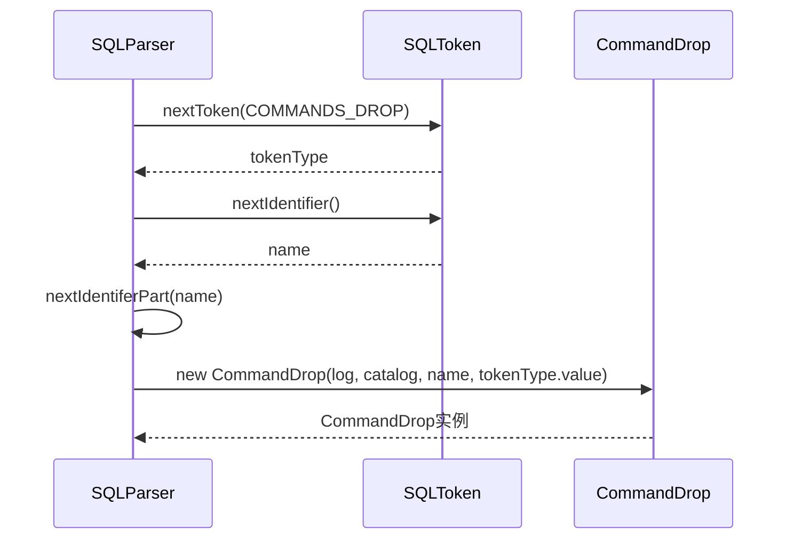
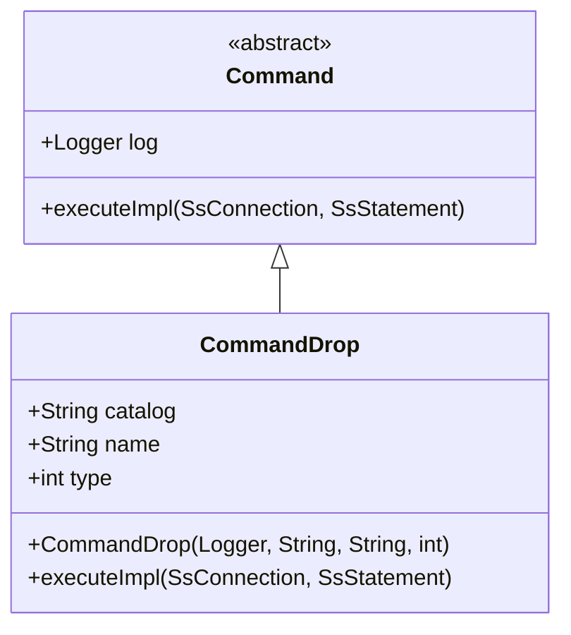
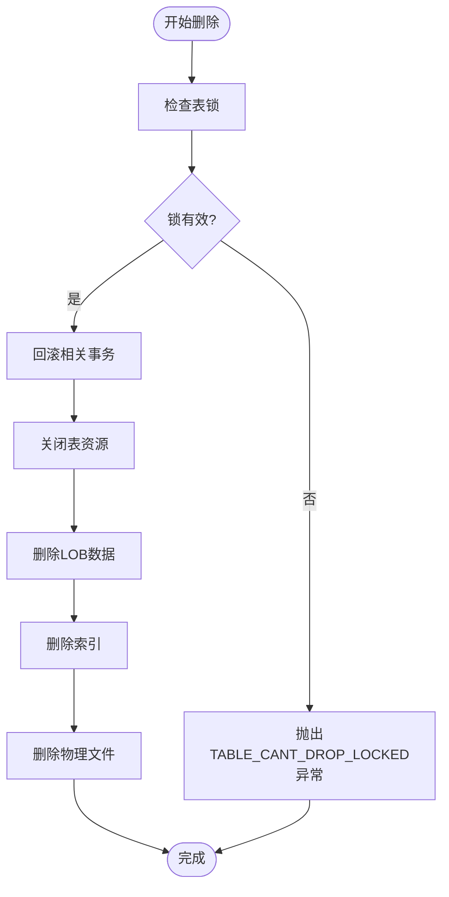
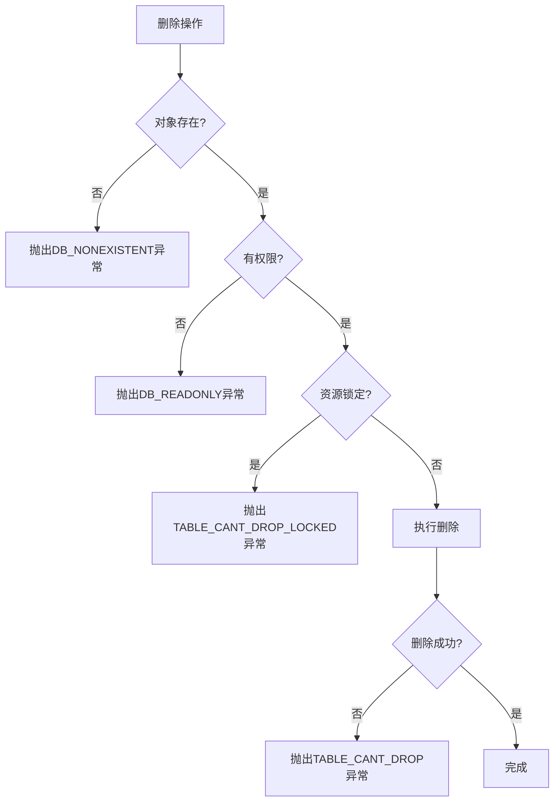
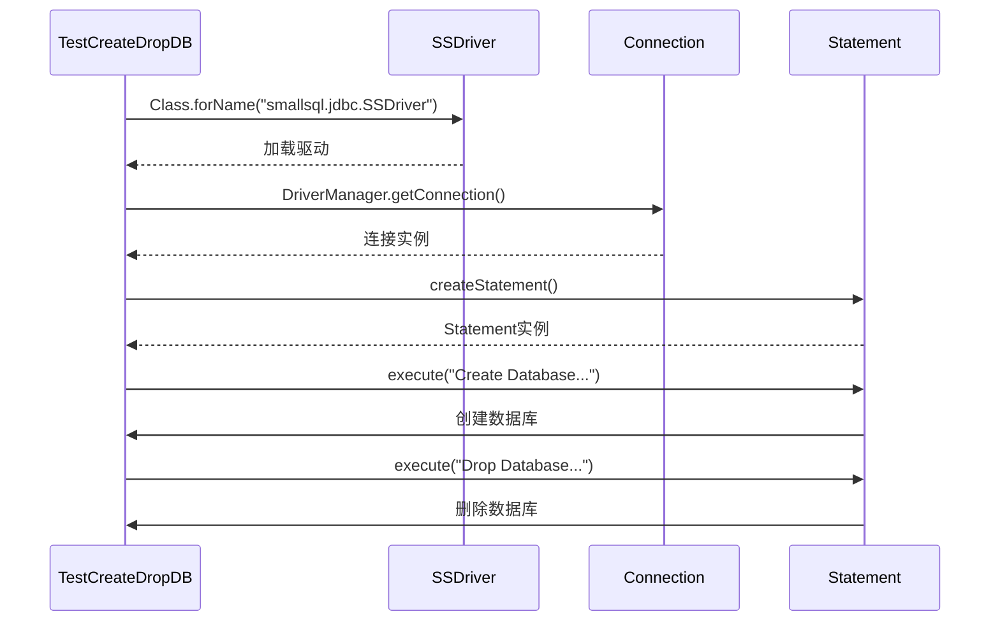

# DROP语句

<cite>
**本文档引用的文件**
- [CommandDrop.java](file://src/main/java/io/leavesfly/smallsql/rdb/command/ddl/CommandDrop.java)
- [SQLParser.java](file://src/main/java/io/leavesfly/smallsql/rdb/sql/SQLParser.java)
- [Database.java](file://src/main/java/io/leavesfly/smallsql/rdb/engine/Database.java)
- [Table.java](file://src/main/java/io/leavesfly/smallsql/rdb/engine/Table.java)
- [View.java](file://src/main/java/io/leavesfly/smallsql/rdb/engine/View.java)
- [ViewTable.java](file://src/main/java/io/leavesfly/smallsql/rdb/engine/ViewTable.java)
- [TestCreateDropDB.java](file://src/test/java/io/leavesfly/smallsql/junit/sql/ddl/TestCreateDropDB.java)
</cite>

## 目录
1. [简介](#简介)
2. [DROP语句语法](#drop语句语法)
3. [SQLParser中的drop方法](#sqlparser中的drop方法)
4. [CommandDrop类实现](#commanddrop类实现)
5. [对象删除执行流程](#对象删除执行流程)
6. [事务与外键约束](#事务与外键约束)
7. [异常处理](#异常处理)
8. [测试用例](#测试用例)

## 简介
DROP语句用于从数据库中删除各种数据库对象，包括数据库、表、视图等。本文档详细分析了SmallSQL数据库系统中DROP语句的实现机制，包括语法解析、命令分发、执行流程和异常处理等核心组件。通过深入分析SQLParser、CommandDrop等关键类的实现，揭示了DROP操作如何安全地从元数据中移除对象引用并清理相关资源。

## DROP语句语法
DROP语句支持删除多种数据库对象，基本语法结构如下：

```sql
-- 删除数据库
DROP DATABASE database_name;

-- 删除表
DROP TABLE table_name;

-- 删除视图
DROP VIEW view_name;
```

其中，`database_name`可以是数据库的路径或名称，`table_name`和`view_name`是表或视图的名称。系统支持通过点号分隔的两部分名称，如`database.table`，以指定特定数据库中的表。

**Section sources**
- [SQLParser.java](file://src/main/java/io/leavesfly/smallsql/rdb/sql/SQLParser.java#L137-L2527)

## SQLParser中的drop方法
SQLParser类的`drop()`方法负责解析DROP语句并创建相应的CommandDrop命令对象。该方法首先读取DROP关键字后的对象类型，然后解析对象名称，最后根据对象类型创建CommandDrop实例。



**Diagram sources**
- [SQLParser.java](file://src/main/java/io/leavesfly/smallsql/rdb/sql/SQLParser.java#L2325-L2358)

**Section sources**
- [SQLParser.java](file://src/main/java/io/leavesfly/smallsql/rdb/sql/SQLParser.java#L2325-L2358)

## CommandDrop类实现
CommandDrop类继承自Command基类，负责处理各种DROP操作。该类通过`executeImpl`方法根据对象类型分发到不同的删除逻辑。



**Diagram sources**
- [CommandDrop.java](file://src/main/java/io/leavesfly/smallsql/rdb/command/ddl/CommandDrop.java#L0-L84)

**Section sources**
- [CommandDrop.java](file://src/main/java/io/leavesfly/smallsql/rdb/command/ddl/CommandDrop.java#L0-L84)

## 对象删除执行流程
CommandDrop的`executeImpl`方法根据对象类型执行相应的删除操作：

1. **数据库删除**：验证数据库目录存在且包含主文件，然后删除目录中所有文件并移除目录
2. **表删除**：调用Database.dropTable方法删除表
3. **视图删除**：调用Database.dropView方法删除视图

对于表的删除，系统首先检查表锁，然后回滚所有指向该表的事务，关闭相关资源，最后删除物理文件。



**Diagram sources**
- [CommandDrop.java](file://src/main/java/io/leavesfly/smallsql/rdb/command/ddl/CommandDrop.java#L28-L68)
- [Table.java](file://src/main/java/io/leavesfly/smallsql/rdb/engine/Table.java#L173-L188)
- [Database.java](file://src/main/java/io/leavesfly/smallsql/rdb/engine/Database.java#L285-L304)

**Section sources**
- [CommandDrop.java](file://src/main/java/io/leavesfly/smallsql/rdb/command/ddl/CommandDrop.java#L28-L68)
- [Table.java](file://src/main/java/io/leavesfly/smallsql/rdb/engine/Table.java#L173-L188)
- [Database.java](file://src/main/java/io/leavesfly/smallsql/rdb/engine/Database.java#L285-L304)

## 事务与外键约束
DROP操作在执行时会考虑事务和外键约束的影响：

- **事务处理**：删除表时会调用`con.rollbackFile(raFile)`回滚所有指向该表的事务，确保数据一致性
- **外键约束**：虽然当前实现中没有显式检查外键依赖，但通过表锁机制防止在有外键引用时删除被引用的表
- **级联删除**：系统支持级联删除相关资源，如删除表时会同时删除其索引和LOB数据

当删除操作涉及多个文件时，系统按特定顺序执行删除，确保不会留下孤立的文件。

**Section sources**
- [Table.java](file://src/main/java/io/leavesfly/smallsql/rdb/engine/Table.java#L173-L188)
- [IndexDescriptions.java](file://src/main/java/io/leavesfly/smallsql/rdb/engine/index/IndexDescriptions.java#L127-L131)
- [ViewTable.java](file://src/main/java/io/leavesfly/smallsql/rdb/engine/ViewTable.java#L127-L132)

## 异常处理
系统实现了完善的异常处理机制来处理各种错误情况：

- **对象不存在**：删除不存在的数据库或表时抛出相应异常
- **权限不足**：在只读数据库上执行删除操作时抛出DB_READONLY异常
- **资源锁定**：当表被其他连接锁定时，无法删除并抛出TABLE_CANT_DROP_LOCKED异常
- **文件系统错误**：文件删除失败时抛出相应异常

这些异常通过SmallSQLException.create方法创建，提供详细的错误信息。



**Diagram sources**
- [CommandDrop.java](file://src/main/java/io/leavesfly/smallsql/rdb/command/ddl/CommandDrop.java#L30-L35)
- [Table.java](file://src/main/java/io/leavesfly/smallsql/rdb/engine/Table.java#L173-L188)

**Section sources**
- [CommandDrop.java](file://src/main/java/io/leavesfly/smallsql/rdb/command/ddl/CommandDrop.java#L30-L35)
- [Table.java](file://src/main/java/io/leavesfly/smallsql/rdb/engine/Table.java#L173-L188)

## 测试用例
系统提供了测试用例验证DROP语句的正确性，包括创建后立即删除数据库的完整流程。



**Diagram sources**
- [TestCreateDropDB.java](file://src/test/java/io/leavesfly/smallsql/junit/sql/ddl/TestCreateDropDB.java#L0-L64)

**Section sources**
- [TestCreateDropDB.java](file://src/test/java/io/leavesfly/smallsql/junit/sql/ddl/TestCreateDropDB.java#L0-L64)