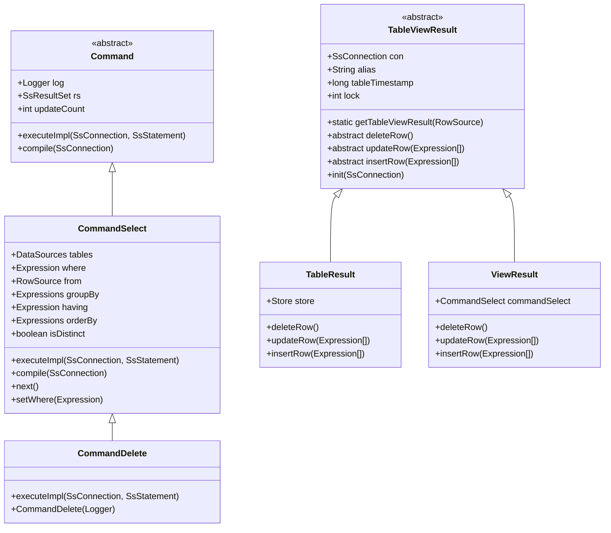
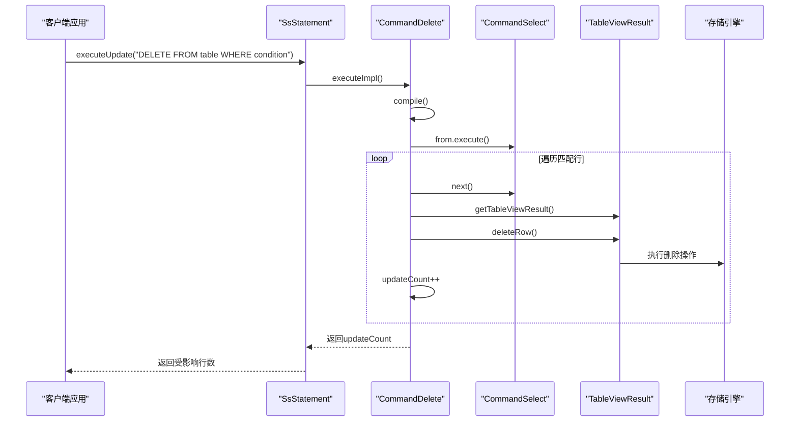
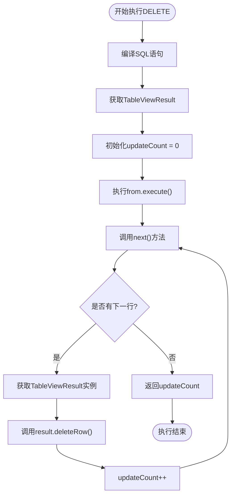
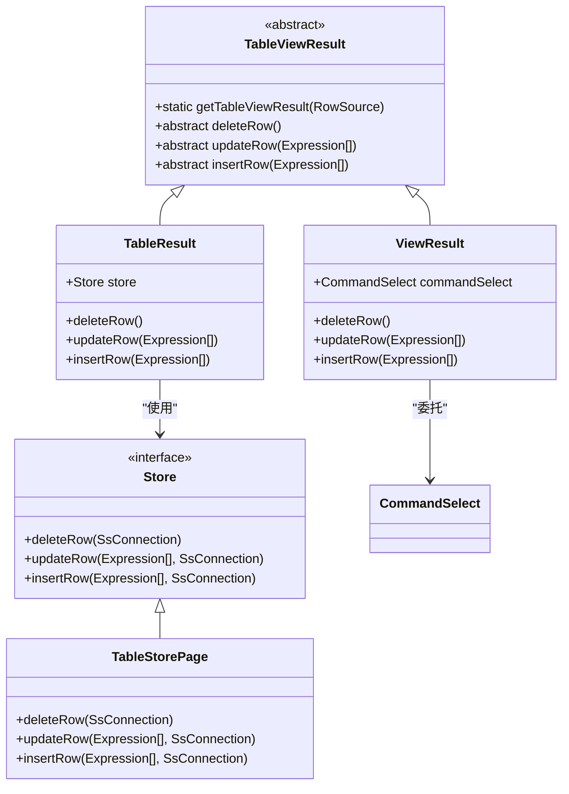
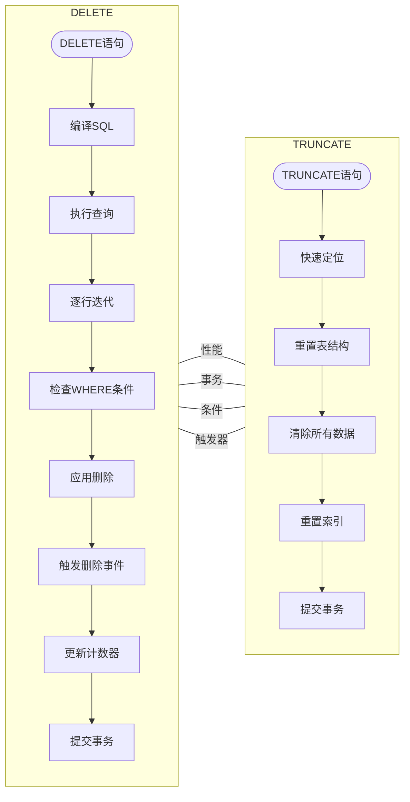

# DELETE语句支持

<cite>
**本文档中引用的文件**   
- [CommandDelete.java](file://src/main/java/io/leavesfly/smallsql/rdb/command/dml/CommandDelete.java)
- [CommandSelect.java](file://src/main/java/io/leavesfly/smallsql/rdb/command/dql/CommandSelect.java)
- [TableViewResult.java](file://src/main/java/io/leavesfly/smallsql/rdb/engine/selector/result/TableViewResult.java)
- [TableResult.java](file://src/main/java/io/leavesfly/smallsql/rdb/engine/selector/result/TableResult.java)
- [ViewResult.java](file://src/main/java/io/leavesfly/smallsql/rdb/engine/selector/result/ViewResult.java)
- [SQLParser.java](file://src/main/java/io/leavesfly/smallsql/rdb/sql/SQLParser.java)
- [SQLTokenizer.java](file://src/main/java/io/leavesfly/smallsql/rdb/sql/parser/SQLTokenizer.java)
</cite>

## 目录
1. [简介](#简介)
2. [核心架构分析](#核心架构分析)
3. [CommandDelete类实现](#commanddelete类实现)
4. [执行流程详解](#执行流程详解)
5. [存储引擎删除机制](#存储引擎删除机制)
6. [DELETE与TRUNCATE对比](#delete与truncate对比)
7. [最佳实践](#最佳实践)
8. [结论](#结论)

## 简介
本文档深入分析SmallSQL数据库中DELETE语句的实现机制，重点解析`CommandDelete`类如何继承`CommandSelect`的查询执行框架来实现高效的行删除操作。文档将详细说明DELETE语句的执行流程、存储引擎层面的删除机制，以及与TRUNCATE语句的本质区别，为开发者提供全面的技术参考和最佳实践指导。

## 核心架构分析



**图示来源**
- [CommandDelete.java](file://src/main/java/io/leavesfly/smallsql/rdb/command/dml/CommandDelete.java#L45-L65)
- [CommandSelect.java](file://src/main/java/io/leavesfly/smallsql/rdb/command/dql/CommandSelect.java#L61-L587)
- [TableViewResult.java](file://src/main/java/io/leavesfly/smallsql/rdb/engine/selector/result/TableViewResult.java#L52-L126)

**本节来源**
- [CommandDelete.java](file://src/main/java/io/leavesfly/smallsql/rdb/command/dml/CommandDelete.java#L1-L66)
- [CommandSelect.java](file://src/main/java/io/leavesfly/smallsql/rdb/command/dql/CommandSelect.java#L1-L587)

## CommandDelete类实现

`CommandDelete`类通过继承`CommandSelect`类实现了DELETE语句的精简而高效的实现。这种设计充分利用了查询执行框架，避免了代码重复，体现了良好的软件设计原则。



**图示来源**
- [CommandDelete.java](file://src/main/java/io/leavesfly/smallsql/rdb/command/dml/CommandDelete.java#L45-L65)
- [CommandSelect.java](file://src/main/java/io/leavesfly/smallsql/rdb/command/dql/CommandSelect.java#L61-L587)

**本节来源**
- [CommandDelete.java](file://src/main/java/io/leavesfly/smallsql/rdb/command/dml/CommandDelete.java#L45-L65)

## 执行流程详解

`CommandDelete`的执行流程充分复用了`CommandSelect`的查询执行框架，通过WHERE条件定位待删除的行，然后逐个删除。



`executeImpl()`方法的核心流程如下：
1. 调用`compile(con)`方法编译SQL语句，解析表结构、WHERE条件等
2. 通过`TableViewResult.getTableViewResult(from)`获取目标表视图
3. 初始化`updateCount`计数器为0
4. 调用`from.execute()`执行查询计划
5. 使用`while(next())`迭代器遍历所有匹配的行
6. 对每一行调用`result.deleteRow()`执行删除操作
7. 每次删除后递增`updateCount`计数器
8. 返回最终的受影响行数

**图示来源**
- [CommandDelete.java](file://src/main/java/io/leavesfly/smallsql/rdb/command/dml/CommandDelete.java#L55-L63)
- [CommandSelect.java](file://src/main/java/io/leavesfly/smallsql/rdb/command/dql/CommandSelect.java#L300-L315)

**本节来源**
- [CommandDelete.java](file://src/main/java/io/leavesfly/smallsql/rdb/command/dml/CommandDelete.java#L55-L63)

## 存储引擎删除机制

DELETE操作在存储引擎层面的实现依赖于`TableViewResult`抽象类及其具体实现，确保了对表和视图的一致性处理。



`TableViewResult.getTableViewResult()`静态方法是删除操作的关键入口点：
- 如果`RowSource`是`Where`实例，则获取其内部的源
- 如果`RowSource`是`TableViewResult`实例，则直接返回
- 否则抛出只读异常

对于表的删除操作，`TableResult.deleteRow()`方法直接委托给`Store`对象：
```java
@Override
public final void deleteRow() throws SQLException {
    store.deleteRow(con);
    store = new StoreNull(store.getNextPagePos());
}
```

对于视图的删除操作，`ViewResult.deleteRow()`方法委托给`CommandSelect`：
```java
public void deleteRow() throws SQLException {
    commandSelect.deleteRow(con);
}
```

**图示来源**
- [TableViewResult.java](file://src/main/java/io/leavesfly/smallsql/rdb/engine/selector/result/TableViewResult.java#L52-L126)
- [TableResult.java](file://src/main/java/io/leavesfly/smallsql/rdb/engine/selector/result/TableResult.java#L116-L120)
- [ViewResult.java](file://src/main/java/io/leavesfly/smallsql/rdb/engine/selector/result/ViewResult.java#L104-L106)

**本节来源**
- [TableViewResult.java](file://src/main/java/io/leavesfly/smallsql/rdb/engine/selector/result/TableViewResult.java#L52-L126)

## DELETE与TRUNCATE对比

DELETE和TRUNCATE虽然都能删除数据，但在实现机制和使用场景上有本质区别。



| 特性 | DELETE | TRUNCATE |
|------|--------|----------|
| **实现机制** | 逐行删除，可带WHERE条件 | 整体清除，重置表结构 |
| **事务支持** | 完全支持，可回滚 | 通常不支持回滚 |
| **性能** | 相对较慢，逐行操作 | 非常快，整体操作 |
| **WHERE条件** | 支持条件删除 | 不支持条件，删除所有数据 |
| **触发器** | 触发DELETE触发器 | 通常不触发触发器 |
| **自增列** | 不重置自增计数器 | 重置自增计数器 |
| **锁粒度** | 行级锁 | 表级锁 |
| **日志记录** | 记录每行的删除操作 | 只记录表级别的操作 |

在SmallSQL中，TRUNCATE语句通过`SQLTokenizer.TRUNCATE`常量(1023)标识，而DELETE语句通过`SQLTokenizer.DELETE`常量(201)标识，两者在语法解析阶段就被区分开来。

**图示来源**
- [SQLTokenizer.java](file://src/main/java/io/leavesfly/smallsql/rdb/sql/parser/SQLTokenizer.java#L411-L411)
- [SQLTokenizer.java](file://src/main/java/io/leavesfly/smallsql/rdb/sql/parser/SQLTokenizer.java#L712-L712)

**本节来源**
- [SQLTokenizer.java](file://src/main/java/io/leavesfly/smallsql/rdb/sql/parser/SQLTokenizer.java#L411-L411)

## 最佳实践

### 条件删除最佳实践
1. **使用索引优化WHERE条件**：确保WHERE子句中的列有适当的索引，以提高行定位效率
2. **避免全表扫描**：尽量使用主键或唯一索引进行删除操作
3. **批量删除**：对于大量数据删除，考虑分批执行以减少事务日志压力

```sql
-- 推荐：使用主键删除
DELETE FROM users WHERE id = 123;

-- 推荐：使用索引列删除
DELETE FROM orders WHERE status = 'CANCELLED' AND created_date < '2023-01-01';

-- 避免：全表扫描删除
DELETE FROM large_table WHERE non_indexed_column = 'value';
```

### 全表删除最佳实践
1. **小数据量使用DELETE**：当需要保留自增计数器或触发器时
2. **大数据量使用TRUNCATE**：当需要快速清空表且不关心自增计数器时
3. **考虑外键约束**：TRUNCATE可能受外键约束限制，需先处理相关表

### 删除性能优化
1. **事务管理**：对于大量删除操作，适当控制事务大小
2. **索引维护**：删除大量数据后，考虑重建索引以优化性能
3. **分批处理**：将大删除操作分解为多个小操作，减少锁竞争

```java
// Java代码示例：分批删除
public void batchDelete(Connection conn, String tableName, String condition, int batchSize) throws SQLException {
    String sql = "DELETE FROM " + tableName + " WHERE " + condition + " LIMIT " + batchSize;
    try (PreparedStatement pstmt = conn.prepareStatement(sql)) {
        int totalDeleted = 0;
        int deleted;
        do {
            deleted = pstmt.executeUpdate();
            totalDeleted += deleted;
            // 提交事务，释放资源
            conn.commit();
        } while (deleted == batchSize);
        System.out.println("总共删除了 " + totalDeleted + " 行");
    }
}
```

**本节来源**
- [CommandDelete.java](file://src/main/java/io/leavesfly/smallsql/rdb/command/dml/CommandDelete.java#L55-L63)
- [CommandSelect.java](file://src/main/java/io/leavesfly/smallsql/rdb/command/dql/CommandSelect.java#L61-L587)

## 结论
SmallSQL的DELETE语句实现通过继承`CommandSelect`类，巧妙地复用了查询执行框架，实现了高效且精简的删除操作。`CommandDelete`类利用`TableViewResult.getTableViewResult()`获取目标表视图，并通过`from.execute()`和`next()`迭代器遍历待删除行，最后调用`result.deleteRow()`在存储引擎层面执行删除操作，同时递增`updateCount`计数器。

与TRUNCATE语句相比，DELETE支持WHERE条件过滤，可以精确删除满足条件的行，但性能相对较低。开发者应根据具体需求选择合适的删除方式：对于条件删除，使用DELETE语句；对于全表清空，优先考虑TRUNCATE语句以获得更好的性能。

通过理解DELETE语句的内部实现机制，开发者可以更好地优化删除操作，提高数据库性能，避免常见的性能陷阱。