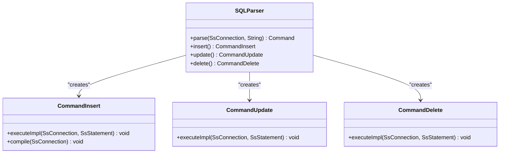

# DML语句支持

<cite>
**本文档中引用的文件**   
- [CommandInsert.java](file://src/main/java/io/leavesfly/smallsql/rdb/command/dml/CommandInsert.java)
- [CommandUpdate.java](file://src/main/java/io/leavesfly/smallsql/rdb/command/dml/CommandUpdate.java)
- [CommandDelete.java](file://src/main/java/io/leavesfly/smallsql/rdb/command/dml/CommandDelete.java)
- [SQLParser.java](file://src/main/java/io/leavesfly/smallsql/rdb/sql/SQLParser.java)
</cite>

## 目录
1. [INSERT语句](#insert语句)
2. [UPDATE语句](#update语句)
3. [DELETE语句](#delete语句)
4. [SQL解析器实现](#sql解析器实现)

## INSERT语句

INSERT语句用于向数据库表中插入新记录。该语句支持两种主要语法形式：一种是明确指定列名列表和对应的值，另一种是从SELECT查询结果中插入数据。

INSERT语句的基本语法结构包括表名、可选的列名列表以及VALUES子句或SELECT子句。当不指定列名时，系统会按照表中列的默认顺序来匹配值。在执行INSERT操作时，系统会验证列名是否存在于目标表中，并确保值的数量与列的数量相匹配。

对于包含列名列表的INSERT语句，语法如下：
```
INSERT INTO table_name (column1, column2, column3, ...) VALUES (value1, value2, value3, ...);
```

对于从SELECT语句插入数据的情况，语法如下：
```
INSERT INTO table_name (column1, column2, column3, ...) SELECT column1, column2, column3, ... FROM source_table WHERE condition;
```

在实现层面，INSERT操作通过CommandInsert类来处理。该类负责解析SQL语句并生成相应的命令对象，然后传递给存储引擎执行。当插入操作涉及到自动生成的键（如自增主键）时，系统还会记录这些生成的键值以供后续使用。

**Section sources**
- [CommandInsert.java](file://src/main/java/io/leavesfly/smallsql/rdb/command/dml/CommandInsert.java#L55-L207)

## UPDATE语句

UPDATE语句用于修改数据库表中已存在的记录。该语句需要指定目标表、要更新的列及其新值，并可以通过WHERE条件来筛选需要更新的行。

UPDATE语句的基本语法结构包括表名、SET子句用于指定要更新的列和值，以及可选的WHERE子句用于限定更新范围。如果没有WHERE子句，则会更新表中的所有行。

UPDATE语句的语法如下：
```
UPDATE table_name SET column1 = value1, column2 = value2, ... WHERE condition;
```

在实现层面，UPDATE操作通过CommandUpdate类来处理。该类首先解析SQL语句，确定要更新的表和列，然后根据WHERE条件筛选出需要更新的行。在执行更新操作时，系统会对涉及的表加写锁，以确保数据的一致性。更新操作是原子性的，即读取和写入操作在同一同步块中完成，防止并发修改导致的数据不一致问题。

**Section sources**
- [CommandUpdate.java](file://src/main/java/io/leavesfly/smallsql/rdb/command/dml/CommandUpdate.java#L49-L115)

## DELETE语句

DELETE语句用于从数据库表中删除记录。该语句通过FROM子句指定目标表，并使用WHERE条件来确定要删除的行。如果没有WHERE条件，则会删除表中的所有行。

DELETE语句的基本语法结构如下：
```
DELETE FROM table_name WHERE condition;
```

在实现层面，DELETE操作通过CommandDelete类来处理。该类继承自CommandSelect，利用SELECT语句的执行机制来定位需要删除的行。具体来说，系统会先编译并执行FROM子句，获取到需要删除的行的结果集，然后逐行调用deleteRow方法进行删除操作。

在执行DELETE操作时，系统会统计受影响的行数，并将其记录在updateCount变量中。这种设计使得DELETE语句既能精确删除特定行，也能清空整个表，提供了灵活的数据管理能力。

**Section sources**
- [CommandDelete.java](file://src/main/java/io/leavesfly/smallsql/rdb/command/dml/CommandDelete.java#L45-L65)

## SQL解析器实现

SQL解析器是数据库系统的核心组件之一，负责将SQL语句字符串解析为可执行的命令对象。在本系统中，SQLParser类承担了这一重要职责，能够处理各种SQL语句，包括SELECT、INSERT、UPDATE、DELETE等操作。

SQLParser类通过词法分析和语法分析两个阶段来解析SQL语句。首先，它使用SQLTokenizer将SQL语句分解为一系列标记（token），然后根据这些标记构建相应的命令对象。对于DML语句，解析器会创建对应的CommandInsert、CommandUpdate或CommandDelete对象，并设置相关属性。

在解析INSERT语句时，SQLParser会创建CommandInsert对象，并根据SQL语句中的列名列表和VALUES子句或SELECT子句来配置该对象。类似地，在解析UPDATE语句时，会创建CommandUpdate对象，并设置要更新的列和值；在解析DELETE语句时，会创建CommandDelete对象，并设置WHERE条件。

解析完成后，这些命令对象会被传递给存储引擎执行。整个解析过程确保了SQL语句的正确性和有效性，为后续的执行阶段奠定了基础。



**Diagram sources **
- [SQLParser.java](file://src/main/java/io/leavesfly/smallsql/rdb/sql/SQLParser.java#L137-L2527)
- [CommandInsert.java](file://src/main/java/io/leavesfly/smallsql/rdb/command/dml/CommandInsert.java#L55-L207)
- [CommandUpdate.java](file://src/main/java/io/leavesfly/smallsql/rdb/command/dml/CommandUpdate.java#L49-L115)
- [CommandDelete.java](file://src/main/java/io/leavesfly/smallsql/rdb/command/dml/CommandDelete.java#L45-L65)

**Section sources**
- [SQLParser.java](file://src/main/java/io/leavesfly/smallsql/rdb/sql/SQLParser.java#L137-L2527)