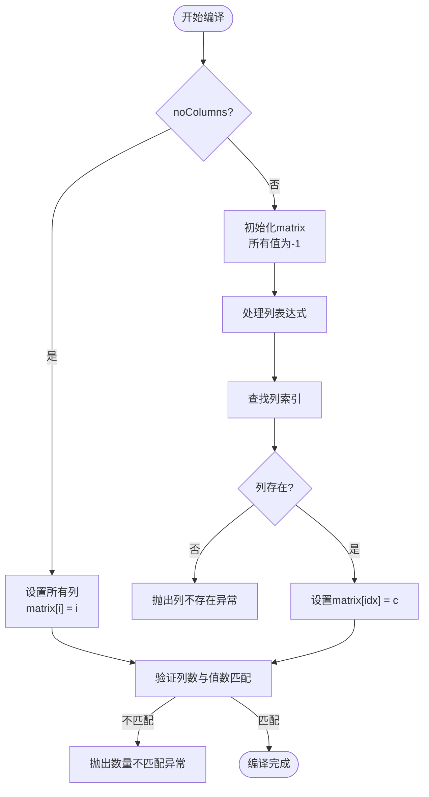
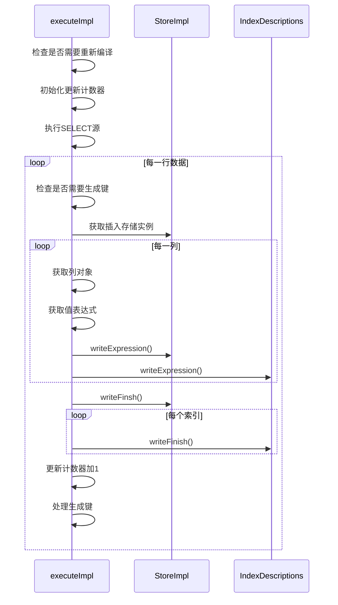
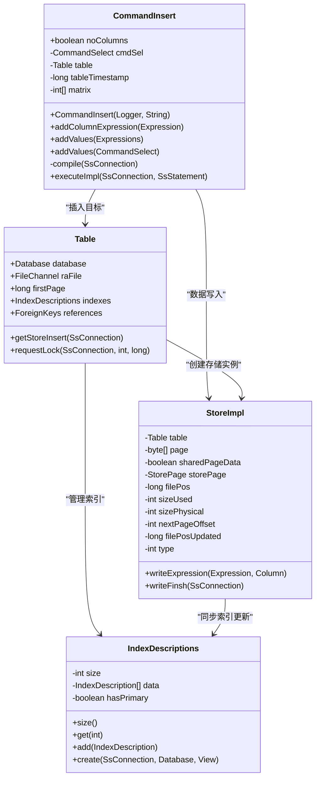

# INSERT语句支持

<cite>
**本文档引用的文件**
- [CommandInsert.java](file://src/main/java/io/leavesfly/smallsql/rdb/command/dml/CommandInsert.java)
- [StoreImpl.java](file://src/main/java/io/leavesfly/smallsql/rdb/engine/store/StoreImpl.java)
- [Table.java](file://src/main/java/io/leavesfly/smallsql/rdb/engine/Table.java)
- [IndexDescriptions.java](file://src/main/java/io/leavesfly/smallsql/rdb/engine/index/IndexDescriptions.java)
</cite>

## 目录
1. [简介](#简介)
2. [INSERT语法形式](#insert语法形式)
3. [noColumns标志位解析](#nocolumns标志位解析)
4. [列与值的映射构建](#列与值的映射构建)
5. [编译阶段验证](#编译阶段验证)
6. [执行流程分析](#执行流程分析)
7. [完整示例](#完整示例)

## 简介
本文档详细阐述了SmallSQL数据库系统中INSERT语句的实现机制，重点分析CommandInsert类的核心功能。文档将深入解析INSERT语句的两种语法形式、列映射机制、编译验证逻辑以及执行流程，并提供包含自增主键和生成键获取的完整示例。

## INSERT语法形式
INSERT语句在SmallSQL中支持两种语法形式：

1. **带列名列表的插入**：显式指定要插入数据的列名，允许按任意顺序提供值
2. **默认顺序插入**：不指定列名，值按表中列的物理顺序依次插入

这两种语法形式通过CommandInsert类中的noColumns标志位进行区分处理，确保了语法的灵活性和数据插入的准确性。

**Section sources**
- [CommandInsert.java](file://src/main/java/io/leavesfly/smallsql/rdb/command/dml/CommandInsert.java#L55-L207)

## noColumns标志位解析
noColumns标志位是CommandInsert类中的一个布尔字段，用于标识INSERT语句是否包含列名列表。当INSERT语句采用"INSERT INTO table VALUES(...)"形式时，noColumns被设置为true；当采用"INSERT INTO table (col1, col2) VALUES(...)"形式时，noColumns被设置为false。

在解析阶段，该标志位决定了后续的处理逻辑：
- 当noColumns为true时，系统假定值列表按表中列的物理顺序排列
- 当noColumns为false时，系统需要根据指定的列名建立列到值的映射关系

**Section sources**
- [CommandInsert.java](file://src/main/java/io/leavesfly/smallsql/rdb/command/dml/CommandInsert.java#L55-L57)

## 列与值的映射构建
addColumnExpression()和addValues()方法共同构建了列与值的映射关系，这是INSERT语句执行的核心机制。

### addColumnExpression方法
该方法用于添加列表达式，同时检查重复列名。当向columnExpressions列表添加列时，会先检查该列是否已存在，若存在则抛出重复列名异常。

### addValues方法
该方法有两种重载形式：
1. 接收Expressions对象，创建CommandSelect实例
2. 直接接收CommandSelect实例

matrix数组在列映射中起着关键作用，它是一个整型数组，长度等于表中列的数量。数组的索引对应表中列的物理位置，值则表示该列在INSERT语句中的位置：
- 当值为-1时，表示该列没有在INSERT语句中指定，将使用默认值
- 当值为非负数时，表示该列在INSERT语句中的位置

**Section sources**
- [CommandInsert.java](file://src/main/java/io/leavesfly/smallsql/rdb/command/dml/CommandInsert.java#L70-L85)

## 编译阶段验证
compile()方法在解析阶段后执行，负责验证和建立必要的引用链接。该方法执行以下关键验证：

### 数量匹配验证
- 检查列数量与值数量是否匹配
- 当noColumns为true时，验证值数量是否等于表中列的总数
- 当noColumns为false时，验证指定列的数量与值的数量是否相等

### 重复列名检查
通过遍历columnExpressions列表，确保没有重复的列名被指定，维护数据完整性。

### 列索引映射建立
建立matrix数组的映射关系：
- 当noColumns为true时，matrix[i] = i，表示按物理顺序映射
- 当noColumns为false时，通过table.findColumnIdx()查找列在表中的物理位置，并在matrix数组中建立映射

**Diagram sources**
- [CommandInsert.java](file://src/main/java/io/leavesfly/smallsql/rdb/command/dml/CommandInsert.java#L90-L140)

## 执行流程分析
executeImpl()方法实现了INSERT语句的执行流程，主要包括以下步骤：

### 数据写入流程
通过StoreImpl.writeExpression()方法逐列写入数据：
1. 获取表的插入存储实例
2. 遍历matrix数组，对每一列进行处理
3. 根据matrix[c]的值决定使用指定值还是默认值
4. 调用writeExpression()将值写入存储

### 索引同步更新
在写入每列数据后，同时更新相关索引：

**Diagram sources**
- [CommandInsert.java](file://src/main/java/io/leavesfly/smallsql/rdb/command/dml/CommandInsert.java#L142-L207)
- [StoreImpl.java](file://src/main/java/io/leavesfly/smallsql/rdb/engine/store/StoreImpl.java#L697-L852)

## 完整示例
以下示例展示了包含自增主键处理、默认值填充和生成键获取的完整INSERT操作：

**Diagram sources**
- [CommandInsert.java](file://src/main/java/io/leavesfly/smallsql/rdb/command/dml/CommandInsert.java#L55-L207)
- [StoreImpl.java](file://src/main/java/io/leavesfly/smallsql/rdb/engine/store/StoreImpl.java#L0-L1606)
- [Table.java](file://src/main/java/io/leavesfly/smallsql/rdb/engine/Table.java#L0-L608)
- [IndexDescriptions.java](file://src/main/java/io/leavesfly/smallsql/rdb/engine/index/IndexDescriptions.java#L0-L147)