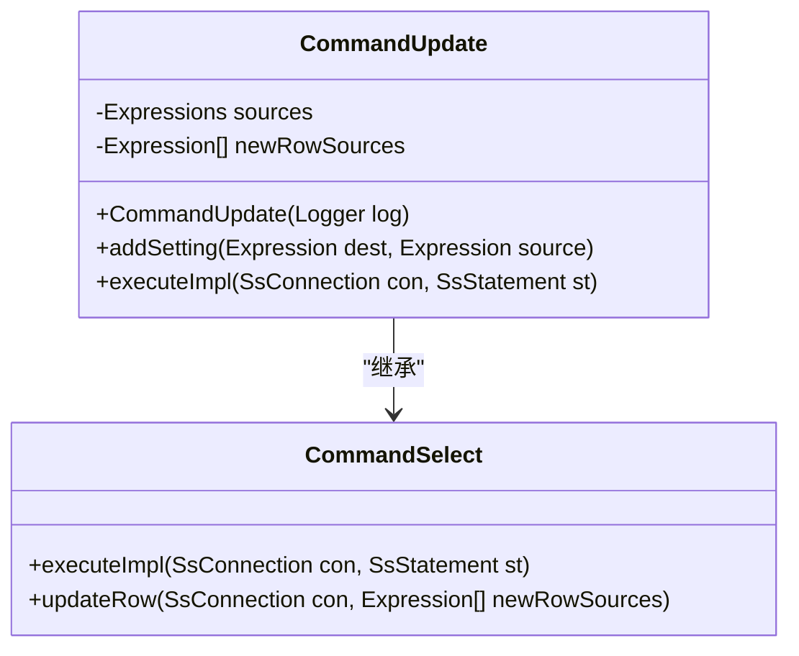
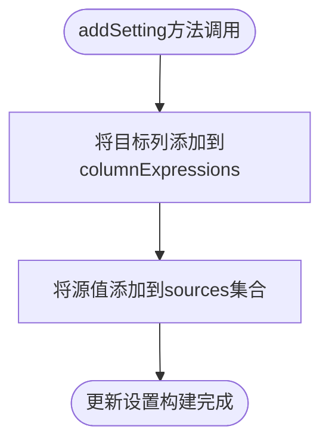
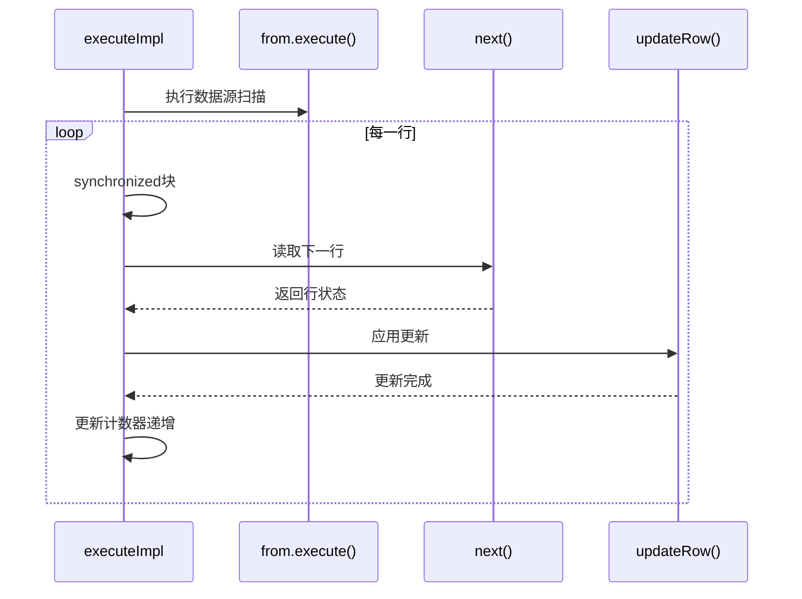
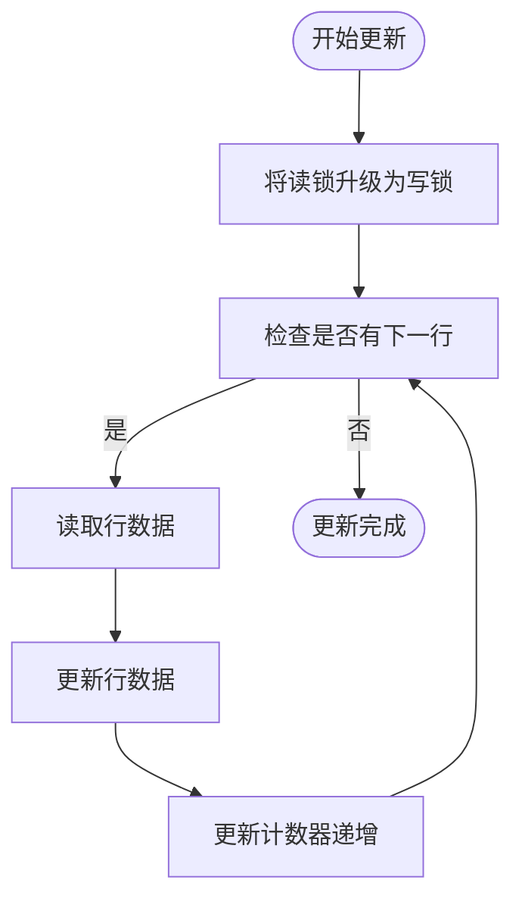
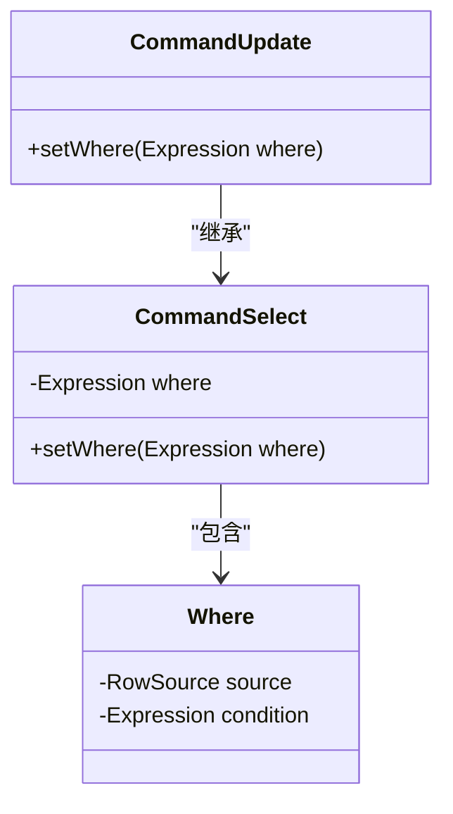
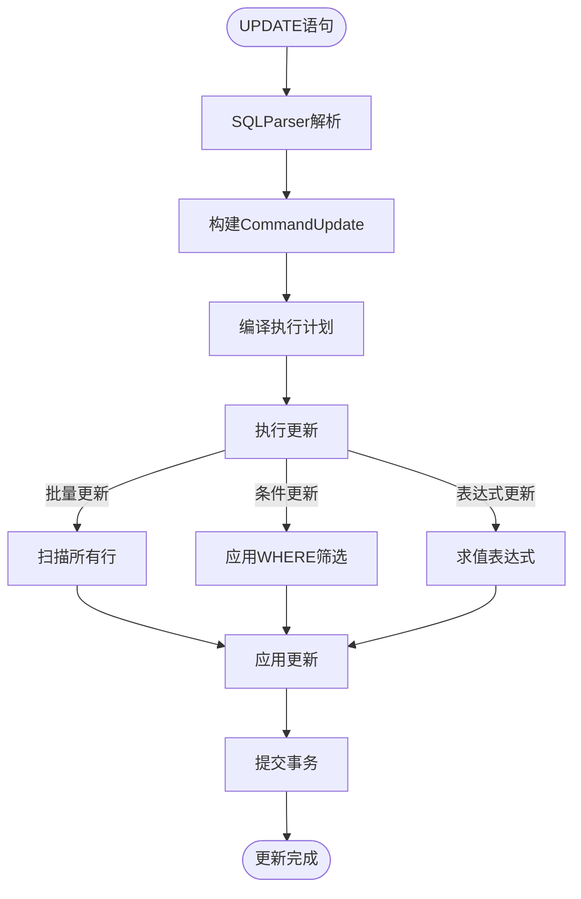

# UPDATE语句支持

<cite>
**本文档引用的文件**
- [CommandUpdate.java](file://src/main/java/io/leavesfly/smallsql/rdb/command/dml/CommandUpdate.java)
- [CommandSelect.java](file://src/main/java/io/leavesfly/smallsql/rdb/command/dql/CommandSelect.java)
- [DataSource.java](file://src/main/java/io/leavesfly/smallsql/rdb/engine/selector/DataSource.java)
- [ExpressionName.java](file://src/main/java/io/leavesfly/smallsql/rdb/sql/expression/ExpressionName.java)
- [Expressions.java](file://src/main/java/io/leavesfly/smallsql/rdb/sql/expression/Expressions.java)
- [SsConnection.java](file://src/main/java/io/leavesfly/smallsql/jdbc/SsConnection.java)
- [SQLParser.java](file://src/main/java/io/leavesfly/smallsql/rdb/sql/SQLParser.java)
- [TableResult.java](file://src/main/java/io/leavesfly/smallsql/rdb/engine/selector/result/TableResult.java)
</cite>

## 目录
1. [CommandUpdate类设计与实现](#commandupdate类设计与实现)
2. [addSetting()方法工作机制](#addsetting方法工作机制)
3. [executeImpl()执行流程分析](#executeimpl执行流程分析)
4. [锁升级与脏写防护](#锁升级与脏写防护)
5. [WHERE条件筛选实现](#where条件筛选实现)
6. [典型更新用例](#典型更新用例)

## CommandUpdate类设计与实现

`CommandUpdate`类继承自`CommandSelect`，专门用于处理SQL UPDATE语句的执行。该类通过继承复用SELECT命令的查询功能，同时扩展了更新操作所需的核心组件。

类中定义了两个关键字段：`sources`集合用于存储更新值的表达式，`newRowSources`数组用于在执行阶段传递更新值。这种设计将更新操作分解为两个阶段：编译阶段收集更新信息，执行阶段应用更新。

**图示来源**
- [CommandUpdate.java](file://src/main/java/io/leavesfly/smallsql/rdb/command/dml/CommandUpdate.java#L49-L115)
- [CommandSelect.java](file://src/main/java/io/leavesfly/smallsql/rdb/command/dql/CommandSelect.java#L61-L587)

**本节来源**
- [CommandUpdate.java](file://src/main/java/io/leavesfly/smallsql/rdb/command/dml/CommandUpdate.java#L49-L115)

## addSetting()方法工作机制

`addSetting()`方法负责接收UPDATE语句中的列-值对，并将其分别存储到`columnExpressions`和`sources`两个集合中。该方法实现了更新设置的构建过程，将目标列和源值表达式进行配对管理。

当调用`addSetting(dest, source)`时，目标列表达式被添加到父类的`columnExpressions`集合中，而源值表达式则被添加到`sources`集合中。这种分离存储的设计确保了在后续执行阶段能够正确地将更新值与目标列进行匹配。

**图示来源**
- [CommandUpdate.java](file://src/main/java/io/leavesfly/smallsql/rdb/command/dml/CommandUpdate.java#L75-L85)

**本节来源**
- [CommandUpdate.java](file://src/main/java/io/leavesfly/smallsql/rdb/command/dml/CommandUpdate.java#L75-L85)

## executeImpl()执行流程分析

`executeImpl()`方法是UPDATE语句执行的核心，它通过`synchronized`块确保行读取与写入的原子性。该方法首先将`sources`集合中的表达式合并到`columnExpressions`中进行编译，然后创建`newRowSources`数组用于传递更新值。

执行流程从`from.execute()`开始，触发数据源扫描。随后，通过循环调用`next()`方法迭代数据源中的每一行。在`synchronized`块中，先调用`next()`读取下一行，然后调用`updateRow()`应用更新，确保读写操作的原子性。

**图示来源**
- [CommandUpdate.java](file://src/main/java/io/leavesfly/smallsql/rdb/command/dml/CommandUpdate.java#L90-L115)
- [CommandSelect.java](file://src/main/java/io/leavesfly/smallsql/rdb/command/dql/CommandSelect.java#L330-L345)

**本节来源**
- [CommandUpdate.java](file://src/main/java/io/leavesfly/smallsql/rdb/command/dml/CommandUpdate.java#L90-L115)

## 锁升级与脏写防护

UPDATE操作中的锁升级机制通过将读锁转换为写锁来防止脏写。在`executeImpl()`方法中，通过遍历`columnExpressions`集合，获取每个表达式的`DataSource`，并将`TableResult`的锁模式设置为`SQLTokenizer.UPDATE`。

这种锁升级逻辑确保了在更新过程中，即使某个更新值依赖于当前读取的值，也能保证数据的一致性。通过在连接监视器上同步，确保了读取和写入操作的原子性，防止了并发更新导致的数据竞争。

**图示来源**
- [CommandUpdate.java](file://src/main/java/io/leavesfly/smallsql/rdb/command/dml/CommandUpdate.java#L100-L115)
- [TableResult.java](file://src/main/java/io/leavesfly/smallsql/rdb/engine/selector/result/TableResult.java#L125-L149)

**本节来源**
- [CommandUpdate.java](file://src/main/java/io/leavesfly/smallsql/rdb/command/dml/CommandUpdate.java#L100-L115)

## WHERE条件筛选实现

WHERE条件筛选通过`CommandSelect`基类的`setWhere()`方法实现。在SQL解析阶段，`SQLParser.update()`方法会识别WHERE子句，并将其表达式传递给`CommandUpdate`实例。

筛选逻辑在`compile()`方法中完成，通过将WHERE条件包装为`Where`对象并设置为`from`属性，实现了对数据源的过滤。在执行阶段，只有满足WHERE条件的行才会被`next()`方法返回，从而实现条件更新。

**图示来源**
- [SQLParser.java](file://src/main/java/io/leavesfly/smallsql/rdb/sql/SQLParser.java#L600-L625)
- [CommandSelect.java](file://src/main/java/io/leavesfly/smallsql/rdb/command/dql/CommandSelect.java#L500-L505)

**本节来源**
- [SQLParser.java](file://src/main/java/io/leavesfly/smallsql/rdb/sql/SQLParser.java#L600-L625)

## 典型更新用例

### 批量更新
批量更新通过一次UPDATE语句修改多行数据。系统通过`from.execute()`触发数据源扫描，然后在循环中逐行应用更新，直到`next()`返回false。

### 条件更新
条件更新使用WHERE子句筛选目标行。只有满足条件的行才会被`next()`方法返回，并在`synchronized`块中被更新。

### 表达式更新
表达式更新允许在SET子句中使用复杂表达式。源值表达式存储在`sources`集合中，在`updateRow()`调用时被求值并应用到目标列。

**图示来源**
- [CommandUpdate.java](file://src/main/java/io/leavesfly/smallsql/rdb/command/dml/CommandUpdate.java#L90-L115)
- [SQLParser.java](file://src/main/java/io/leavesfly/smallsql/rdb/sql/SQLParser.java#L580-L625)

**本节来源**
- [CommandUpdate.java](file://src/main/java/io/leavesfly/smallsql/rdb/command/dml/CommandUpdate.java#L90-L115)
- [SQLParser.java](file://src/main/java/io/leavesfly/smallsql/rdb/sql/SQLParser.java#L580-L625)