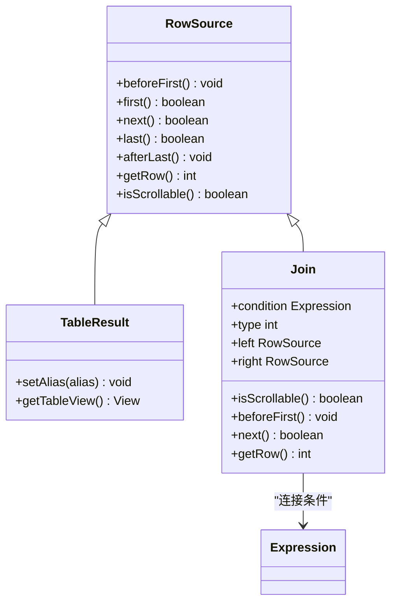
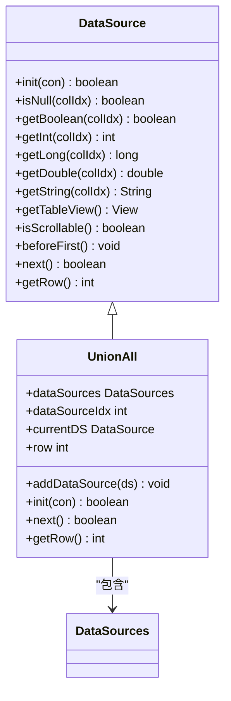
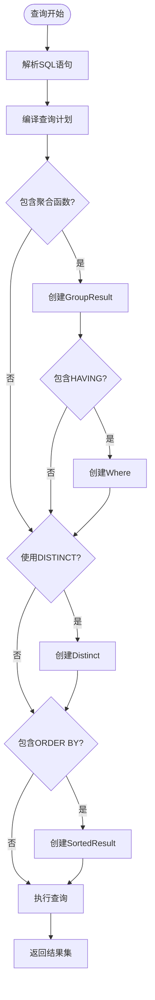
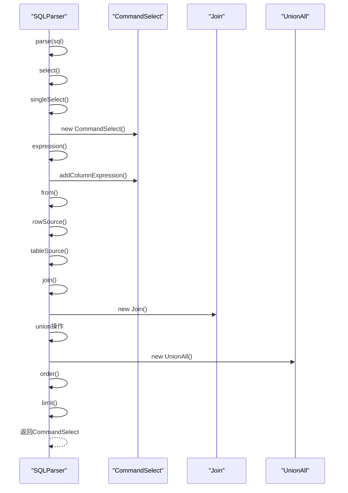

# DQL语句支持

<cite>
**本文档中引用的文件**
- [CommandSelect.java](file://src/main/java/io/leavesfly/smallsql/rdb/command/dql/CommandSelect.java)
- [SQLParser.java](file://src/main/java/io/leavesfly/smallsql/rdb/sql/SQLParser.java)
- [Join.java](file://src/main/java/io/leavesfly/smallsql/rdb/engine/selector/multioper/Join.java)
- [UnionAll.java](file://src/main/java/io/leavesfly/smallsql/rdb/engine/selector/multioper/UnionAll.java)
- [Command.java](file://src/main/java/io/leavesfly/smallsql/rdb/command/Command.java)
</cite>

## 目录
1. [SELECT语句语法结构](#select语句语法结构)
2. [单表查询与多表连接](#单表查询与多表连接)
3. [UNION操作](#union操作)
4. [复杂查询示例](#复杂查询示例)
5. [SQL解析机制](#sql解析机制)
6. [查询执行流程](#查询执行流程)

## SELECT语句语法结构

DQL（数据查询语言）的核心是SELECT语句，用于从数据库中检索数据。SELECT语句的完整语法结构包含多个组成部分，每个部分都有特定的功能和语义。

SELECT语句的基本结构包括投影列表（SELECT子句）、FROM子句、WHERE条件、GROUP BY分组、HAVING筛选、ORDER BY排序和LIMIT限制等。投影列表指定要检索的列或表达式，FROM子句指定数据源，WHERE条件用于过滤行，GROUP BY用于分组聚合，HAVING用于过滤分组结果，ORDER BY用于排序，LIMIT用于限制返回的行数。

在smallsql实现中，这些语法结构通过CommandSelect类的属性来表示。CommandSelect类包含tables（数据源列表）、where（WHERE条件表达式）、groupBy（GROUP BY表达式列表）、having（HAVING条件表达式）、orderBy（ORDER BY表达式列表）和maxRows（最大行数限制）等属性，这些属性共同构成了SELECT语句的完整语法树。

**Section sources**
- [CommandSelect.java](file://src/main/java/io/leavesfly/smallsql/rdb/command/dql/CommandSelect.java#L61-L587)

## 单表查询与多表连接

单表查询是最基本的查询形式，直接从单个表中检索数据。在smallsql中，单表查询通过TableResult或ViewResult实现，这些类实现了RowSource接口，提供了数据访问的基本功能。

多表连接（JOIN）用于从多个相关表中检索数据。smallsql支持多种连接类型，包括INNER JOIN、LEFT JOIN、RIGHT JOIN和FULL JOIN。连接操作通过Join类实现，该类继承自RowSource，表示两个数据源的连接结果。

Join类的实现包含left和right两个属性，分别表示连接的左表和右表。连接条件通过condition属性存储，这是一个Expression对象，表示ON子句中的条件表达式。连接类型通过type属性表示，使用常量CROSS_JOIN、INNER_JOIN、LEFT_JOIN、FULL_JOIN和RIGHT_JOIN来区分不同的连接类型。

在执行连接操作时，smallsql首先执行左表和右表的查询，然后根据连接类型和连接条件生成结果集。对于INNER JOIN，只有满足连接条件的行才会被包含在结果中；对于LEFT JOIN，左表的所有行都会被包含，右表不匹配的行用NULL填充；对于FULL JOIN，两个表的所有行都会被包含，不匹配的行用NULL填充。

**Diagram sources**
- [Join.java](file://src/main/java/io/leavesfly/smallsql/rdb/engine/selector/multioper/Join.java#L30-L463)
- [CommandSelect.java](file://src/main/java/io/leavesfly/smallsql/rdb/command/dql/CommandSelect.java#L61-L587)

**Section sources**
- [Join.java](file://src/main/java/io/leavesfly/smallsql/rdb/engine/selector/multioper/Join.java#L30-L463)
- [CommandSelect.java](file://src/main/java/io/leavesfly/smallsql/rdb/command/dql/CommandSelect.java#L61-L587)

## UNION操作

UNION操作用于合并两个或多个SELECT语句的结果集。smallsql通过UnionAll类实现UNION和UNION ALL操作。UNION操作会去除重复行，而UNION ALL保留所有行，包括重复行。

UnionAll类实现了DataSource接口，可以作为数据源参与查询。它包含一个dataSources列表，存储所有要合并的数据源。在执行时，UnionAll会依次执行每个数据源的查询，并将结果按顺序合并。

UNION操作要求所有参与合并的SELECT语句具有相同数量和类型的列。在smallsql中，这一约束在init方法中检查。如果列数不匹配，会抛出异常。UnionAll的实现还支持滚动结果集，允许在合并结果中前后移动。

UNION和UNION ALL的语义差异主要体现在去重处理上。UNION需要对结果集进行排序和去重，而UNION ALL直接合并结果。在smallsql中，UNION的去重功能可以通过结合Distinct类实现，而UNION ALL直接使用UnionAll类。

**Diagram sources**
- [UnionAll.java](file://src/main/java/io/leavesfly/smallsql/rdb/engine/selector/multioper/UnionAll.java#L30-L240)
- [DataSources.java](file://src/main/java/io/leavesfly/smallsql/rdb/engine/selector/DataSources.java)

**Section sources**
- [UnionAll.java](file://src/main/java/io/leavesfly/smallsql/rdb/engine/selector/multioper/UnionAll.java#L30-L240)

## 复杂查询示例

复杂查询通常涉及聚合函数、子查询和表达式计算。smallsql支持多种聚合函数，如COUNT、SUM、AVG、MAX和MIN，这些函数在查询编译时被识别和处理。

聚合函数的处理在CommandSelect的compile方法中实现。当检测到聚合函数时，isAggregateFunction标志被设置，这会影响查询的执行计划。如果查询包含GROUP BY或HAVING子句，或者使用了聚合函数，查询会被标记为分组查询，通过GroupResult类处理。

子查询在smallsql中作为表达式的一部分处理。ExpressionInSelect类用于处理IN子查询，它将子查询的结果与外部查询的条件进行比较。子查询可以出现在SELECT、FROM、WHERE和HAVING子句中，提供灵活的数据检索能力。

表达式计算支持算术运算、逻辑运算和函数调用。ExpressionArithmetic类处理算术和逻辑运算，ExpressionFunction类处理函数调用。表达式树的构建和优化在compile阶段完成，确保查询执行的高效性。

**Diagram sources**
- [CommandSelect.java](file://src/main/java/io/leavesfly/smallsql/rdb/command/dql/CommandSelect.java#L100-L300)

**Section sources**
- [CommandSelect.java](file://src/main/java/io/leavesfly/smallsql/rdb/command/dql/CommandSelect.java#L100-L300)

## SQL解析机制

SQL解析是将SQL语句转换为可执行查询计划的过程。smallsql通过SQLParser类实现SQL解析。SQLParser首先将SQL语句分解为标记（token），然后根据语法规则构建语法树。

SELECT语句的解析从select方法开始。该方法首先调用singleSelect解析单个SELECT单元，然后处理UNION操作，最后处理ORDER BY和LIMIT子句。singleSelect方法处理SELECT关键字后的所有内容，包括DISTINCT、ALL、TOP等前缀，以及投影列表和FROM子句。

在解析过程中，SQLParser使用递归下降解析技术。对于复杂的语法结构，如表达式和子查询，使用专门的解析方法。expression方法处理所有类型的表达式，包括常量、列引用、算术运算、函数调用等。from方法解析FROM子句，处理表引用和连接操作。

解析结果是一个Command对象，对于SELECT语句是CommandSelect对象。CommandSelect对象包含了查询的所有信息，可以被编译和执行。解析过程还负责语法检查，对于无效的SQL语句抛出相应的异常。

**Diagram sources**
- [SQLParser.java](file://src/main/java/io/leavesfly/smallsql/rdb/sql/SQLParser.java#L137-L2527)
- [CommandSelect.java](file://src/main/java/io/leavesfly/smallsql/rdb/command/dql/CommandSelect.java)

**Section sources**
- [SQLParser.java](file://src/main/java/io/leavesfly/smallsql/rdb/sql/SQLParser.java#L137-L2527)

## 查询执行流程

查询执行是将编译后的查询计划转换为实际结果集的过程。在smallsql中，查询执行通过CommandSelect的executeImpl方法启动。该方法首先调用compile方法编译查询计划，然后执行数据检索。

编译过程将逻辑查询计划转换为物理执行计划。compile方法处理所有表达式，建立列引用与实际数据源的连接。对于投影列表中的*，会扩展为所有列的引用。WHERE、GROUP BY、HAVING和ORDER BY子句中的表达式也会被编译和优化。

执行过程从from属性开始，这是一个RowSource对象。RowSource提供了统一的数据访问接口，包括beforeFirst、next、getRow等方法。查询执行时，从第一行开始，逐行处理，直到没有更多行。

结果集通过SsResultSet类提供给客户端。SsResultSet包装了CommandSelect，提供了JDBC ResultSet接口的实现。客户端可以通过标准的JDBC方法访问查询结果，如getString、getInt等。

查询执行还支持更新操作，如updateRow、insertRow和deleteRow。这些操作通过CommandSelect的相应方法实现，允许在结果集上进行数据修改。

**Section sources**
- [CommandSelect.java](file://src/main/java/io/leavesfly/smallsql/rdb/command/dql/CommandSelect.java#L300-L587)
- [SsResultSet.java](file://src/main/java/io/leavesfly/smallsql/jdbc/SsResultSet.java)