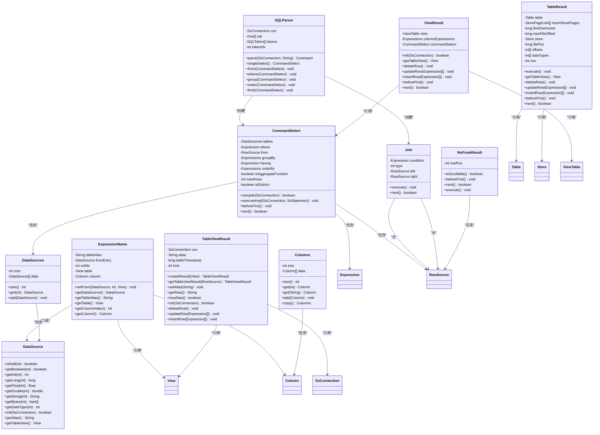

# SELECT语句语法

<cite>
**本文档中引用的文件**  
- [CommandSelect.java](file://src/main/java/io/leavesfly/smallsql/rdb/command/dql/CommandSelect.java)
- [SQLParser.java](file://src/main/java/io/leavesfly/smallsql/rdb/sql/SQLParser.java)
- [Join.java](file://src/main/java/io/leavesfly/smallsql/rdb/engine/selector/multioper/Join.java)
- [DataSource.java](file://src/main/java/io/leavesfly/smallsql/rdb/engine/selector/DataSource.java)
- [ExpressionName.java](file://src/main/java/io/leavesfly/smallsql/rdb/sql/expression/ExpressionName.java)
- [DataSources.java](file://src/main/java/io/leavesfly/smallsql/rdb/engine/selector/DataSources.java)
- [TableViewResult.java](file://src/main/java/io/leavesfly/smallsql/rdb/engine/selector/result/TableViewResult.java)
- [TableResult.java](file://src/main/java/io/leavesfly/smallsql/rdb/engine/selector/result/TableResult.java)
- [ViewResult.java](file://src/main/java/io/leavesfly/smallsql/rdb/engine/selector/result/ViewResult.java)
- [NoFromResult.java](file://src/main/java/io/leavesfly/smallsql/rdb/engine/selector/result/NoFromResult.java)
- [Columns.java](file://src/main/java/io/leavesfly/smallsql/rdb/engine/table/Columns.java)
</cite>

## 目录
1. [SELECT语句语法结构](#select语句语法结构)
2. [单表与多表查询](#单表与多表查询)
3. [列别名与通配符](#列别名与通配符)
4. [SQLParser解析流程](#sqlparser解析流程)
5. [CommandSelect对象构建](#commandselect对象构建)
6. [核心组件关系图](#核心组件关系图)

## SELECT语句语法结构

SmallSQL中的SELECT语句遵循标准SQL语法结构，包含多个核心组成部分：投影列表（列选择）、FROM子句（数据源）、WHERE条件过滤、GROUP BY分组聚合、HAVING筛选分组结果、ORDER BY排序以及LIMIT限制返回行数。这些子句按照特定顺序组合，形成完整的查询语句。

SELECT语句的基本结构如下：
- **投影列表**：指定要查询的列，支持列名、表达式和聚合函数
- **FROM子句**：定义查询的数据源，可以是表、视图或子查询
- **WHERE子句**：用于过滤行数据，基于条件表达式
- **GROUP BY子句**：对数据进行分组，通常与聚合函数一起使用
- **HAVING子句**：对分组后的结果进行筛选
- **ORDER BY子句**：指定结果集的排序方式
- **LIMIT子句**：限制返回的行数

这些子句的解析和处理在SQLParser类中通过不同的方法实现，每个子句都有对应的解析函数，如`from()`、`where()`、`group()`等。

**Section sources**
- [SQLParser.java](file://src/main/java/io/leavesfly/smallsql/rdb/sql/SQLParser.java#L137-L2527)

## 单表与多表查询

SmallSQL支持单表查询和多表连接查询。单表查询仅涉及一个数据源，而多表查询通过JOIN操作将多个表关联起来。在多表查询中，需要特别注意列的歧义性问题，当多个表包含同名列时，必须使用表别名或表名前缀来明确指定列的来源。

对于多表连接，SmallSQL实现了多种连接类型，包括INNER JOIN、LEFT JOIN、RIGHT JOIN和FULL JOIN。连接操作在Join类中实现，通过left和right字段维护左右两个数据源的引用。连接条件通过condition字段存储，该字段是一个Expression对象，表示ON子句中的条件表达式。

在执行多表查询时，系统会创建一个JoinScroll对象来处理连接逻辑，根据连接类型和条件逐行匹配数据。对于INNER JOIN，只有满足连接条件的行才会被返回；对于OUTER JOIN，即使右表没有匹配的行，左表的行也会被保留。

**Section sources**
- [Join.java](file://src/main/java/io/leavesfly/smallsql/rdb/engine/selector/multioper/Join.java#L0-L463)
- [CommandSelect.java](file://src/main/java/io/leavesfly/smallsql/rdb/command/dql/CommandSelect.java#L0-L587)

## 列别名与通配符

在SELECT语句中，可以使用AS关键字为列定义别名，这在查询结果中会显示为新的列名。别名的定义在ExpressionName类中通过setAlias()方法实现。当解析到AS关键字时，SQLParser会读取后续的标识符作为别名，并将其设置到对应的表达式对象上。

通配符（*）用于选择所有列。当使用`SELECT *`时，系统会遍历所有数据源，将每个表的所有列添加到投影列表中。如果指定了表别名（如`table.*`），则只选择该表的所有列。通配符的处理在CommandSelect类的compile()方法中实现，通过compileAdd_All_Table_Columns()方法将所有列添加到columnExpressions列表中。

列别名和通配符的使用提高了查询的灵活性和可读性。别名可以简化复杂的表达式显示，而通配符则避免了手动列出所有列的繁琐操作。在实际应用中，建议在生产环境中谨慎使用通配符，因为它可能导致性能问题和结果集结构的不确定性。

**Section sources**
- [ExpressionName.java](file://src/main/java/io/leavesfly/smallsql/rdb/sql/expression/ExpressionName.java#L0-L247)
- [CommandSelect.java](file://src/main/java/io/leavesfly/smallsql/rdb/command/dql/CommandSelect.java#L0-L587)

## SQLParser解析流程

SQLParser类的singleSelect()方法负责解析基本的SELECT结构。该方法首先处理SELECT关键字后的前缀关键字，如DISTINCT、ALL和TOP。这些关键字会影响查询的行为和结果集的大小。

解析流程从读取下一个标记开始，通过switch语句判断标记类型。对于DISTINCT关键字，设置CommandSelect对象的isDistinct标志；对于TOP关键字，读取后续的数字作为最大行数限制。这些前缀关键字的处理完成后，进入列列表的解析阶段。

在列列表解析中，系统逐个读取表达式，将其添加到columnExpressions列表中。每个表达式都可能包含别名定义，通过AS关键字指定。当遇到FROM关键字时，调用from()方法解析数据源。如果没有FROM子句，则创建一个NoFromResult对象作为数据源。

整个解析过程采用递归下降的方法，每个语法结构都有对应的解析方法。这种设计使得代码结构清晰，易于维护和扩展。解析完成后，返回一个完整的CommandSelect对象，该对象包含了查询的所有信息。

**Section sources**
- [SQLParser.java](file://src/main/java/io/leavesfly/smallsql/rdb/sql/SQLParser.java#L137-L2527)

## CommandSelect对象构建

CommandSelect对象的构建过程在compile()方法中完成。该方法首先初始化数据源，然后处理投影列表中的每个表达式。对于通配符（*），系统会将其展开为所有列的列表；对于普通列名，会建立列与数据源之间的链接。

在处理WHERE、HAVING、GROUP BY和ORDER BY子句时，系统会调用相应的编译方法，将表达式与数据源关联起来。这些表达式在执行时会被求值，用于过滤、分组和排序。对于包含聚合函数的查询，系统会创建GroupResult对象来处理分组逻辑。

最终的执行计划通过一系列装饰器模式的对象构建。例如，如果查询包含WHERE条件，则创建Where对象包装原始数据源；如果需要排序，则创建SortedResult对象。这种设计使得查询执行过程模块化，每个操作都是对数据源的包装。

CommandSelect对象还负责管理结果集的游标操作，如beforeFirst()、next()等。这些方法委托给内部的RowSource对象处理，实现了结果集的遍历功能。

**Section sources**
- [CommandSelect.java](file://src/main/java/io/leavesfly/smallsql/rdb/command/dql/CommandSelect.java#L0-L587)

## 核心组件关系图

**Diagram sources**
- [CommandSelect.java](file://src/main/java/io/leavesfly/smallsql/rdb/command/dql/CommandSelect.java#L0-L587)
- [SQLParser.java](file://src/main/java/io/leavesfly/smallsql/rdb/sql/SQLParser.java#L137-L2527)
- [Join.java](file://src/main/java/io/leavesfly/smallsql/rdb/engine/selector/multioper/Join.java#L0-L463)
- [DataSource.java](file://src/main/java/io/leavesfly/smallsql/rdb/engine/selector/DataSource.java#L0-L101)
- [ExpressionName.java](file://src/main/java/io/leavesfly/smallsql/rdb/sql/expression/ExpressionName.java#L0-L247)
- [DataSources.java](file://src/main/java/io/leavesfly/smallsql/rdb/engine/selector/DataSources.java#L0-L62)
- [TableViewResult.java](file://src/main/java/io/leavesfly/smallsql/rdb/engine/selector/result/TableViewResult.java#L0-L127)
- [TableResult.java](file://src/main/java/io/leavesfly/smallsql/rdb/engine/selector/result/TableResult.java#L0-L419)
- [ViewResult.java](file://src/main/java/io/leavesfly/smallsql/rdb/engine/selector/result/ViewResult.java#L0-L260)
- [NoFromResult.java](file://src/main/java/io/leavesfly/smallsql/rdb/engine/selector/result/NoFromResult.java#L0-L147)
- [Columns.java](file://src/main/java/io/leavesfly/smallsql/rdb/engine/table/Columns.java#L0-L140)