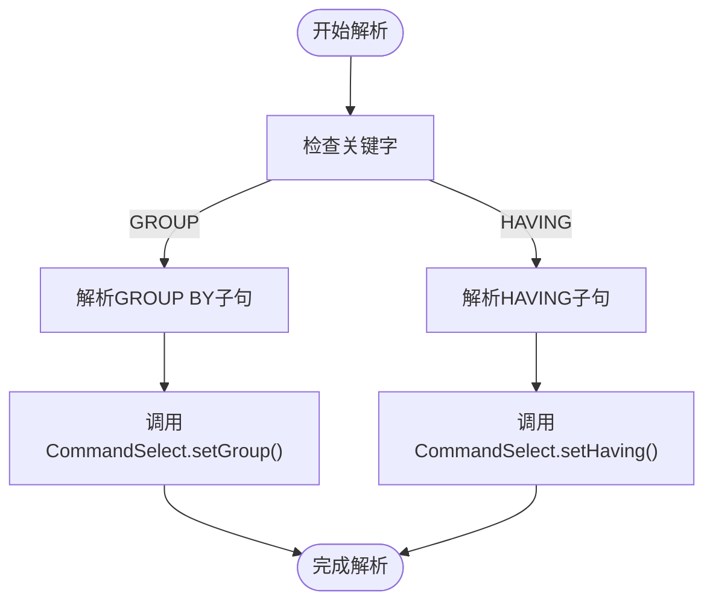
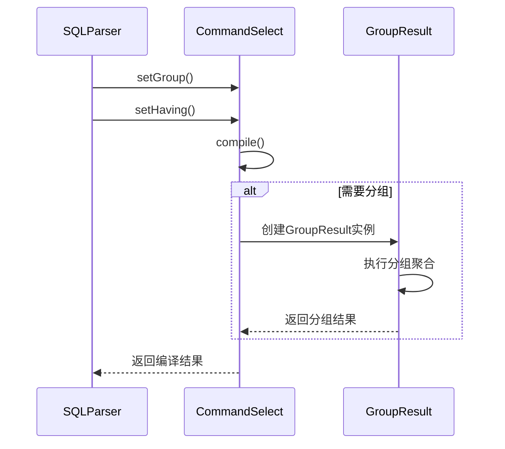
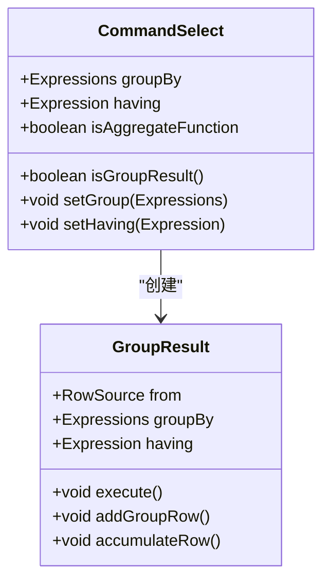
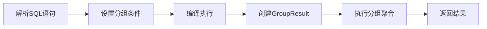

# 分组与筛选（GROUP BY和HAVING子句）

<cite>
**本文档引用文件**   
- [SQLParser.java](file://src/main/java/io/leavesfly/smallsql/rdb/sql/SQLParser.java)
- [CommandSelect.java](file://src/main/java/io/leavesfly/smallsql/rdb/command/dql/CommandSelect.java)
- [GroupResult.java](file://src/main/java/io/leavesfly/smallsql/rdb/engine/selector/multioper/GroupResult.java)
- [SQLTokenizer.java](file://src/main/java/io/leavesfly/smallsql/rdb/sql/parser/SQLTokenizer.java)
</cite>

## 目录
1. [分组与筛选概述](#分组与筛选概述)
2. [语法解析实现](#语法解析实现)
3. [执行逻辑分析](#执行逻辑分析)
4. [聚合函数处理](#聚合函数处理)
5. [示例分析](#示例分析)

## 分组与筛选概述

GROUP BY和HAVING子句是SQL查询中用于数据聚合和筛选的重要组成部分。GROUP BY子句用于按指定列对数据进行分组，而HAVING子句则用于对分组后的结果进行条件筛选。这两个子句通常与聚合函数（如COUNT、SUM、AVG、MAX、MIN）一起使用，以实现复杂的统计分析功能。

在SmallSQL数据库系统中，这些功能的实现主要涉及SQLParser类的解析过程和CommandSelect类的执行逻辑。当解析器遇到GROUP BY和HAVING关键字时，会调用相应的解析方法来处理这些子句，并将结果存储在CommandSelect对象中。

**Section sources**
- [SQLParser.java](file://src/main/java/io/leavesfly/smallsql/rdb/sql/SQLParser.java#L744-L770)
- [CommandSelect.java](file://src/main/java/io/leavesfly/smallsql/rdb/command/dql/CommandSelect.java#L61-L587)

## 语法解析实现

SQLParser类负责解析SQL语句并生成相应的命令对象。当解析器遇到SELECT语句时，会调用select()方法进行处理。在解析过程中，如果遇到GROUP BY关键字，会调用group()方法；如果遇到HAVING关键字，则会调用having()方法。

**Diagram sources**
- [SQLParser.java](file://src/main/java/io/leavesfly/smallsql/rdb/sql/SQLParser.java#L744-L770)

**Section sources**
- [SQLParser.java](file://src/main/java/io/leavesfly/smallsql/rdb/sql/SQLParser.java#L744-L770)

## 执行逻辑分析

CommandSelect类的compile()方法是执行分组和筛选逻辑的核心。该方法首先检查是否需要编译，然后处理SELECT子句中的各个表达式。在处理完WHERE、ORDER BY等子句后，会检查是否需要进行分组操作。

**Diagram sources**
- [CommandSelect.java](file://src/main/java/io/leavesfly/smallsql/rdb/command/dql/CommandSelect.java#L61-L587)
- [GroupResult.java](file://src/main/java/io/leavesfly/smallsql/rdb/engine/selector/multioper/GroupResult.java#L53-L283)

**Section sources**
- [CommandSelect.java](file://src/main/java/io/leavesfly/smallsql/rdb/command/dql/CommandSelect.java#L61-L587)

## 聚合函数处理

在SmallSQL中，常见的聚合函数包括COUNT、SUM、AVG、MAX和MIN。这些函数的处理逻辑主要在Expression类的子类中实现。当解析器遇到聚合函数时，会创建相应的Expression对象，并将其添加到表达式列表中。

isGroupResult()方法用于判断结果集是否为分组结果。该方法通过检查groupBy、having和isAggregateFunction三个条件来确定是否需要进行分组操作。如果任一条件为真，则返回true，表示需要创建GroupResult对象。

**Diagram sources**
- [CommandSelect.java](file://src/main/java/io/leavesfly/smallsql/rdb/command/dql/CommandSelect.java#L61-L587)
- [GroupResult.java](file://src/main/java/io/leavesfly/smallsql/rdb/engine/selector/multioper/GroupResult.java#L53-L283)

**Section sources**
- [CommandSelect.java](file://src/main/java/io/leavesfly/smallsql/rdb/command/dql/CommandSelect.java#L61-L587)
- [GroupResult.java](file://src/main/java/io/leavesfly/smallsql/rdb/engine/selector/multioper/GroupResult.java#L53-L283)

## 示例分析

以下是一个典型的分组查询示例：SELECT dept, COUNT(*) FROM employees GROUP BY dept HAVING COUNT(*) > 5。这个查询首先按部门对员工进行分组，然后统计每个部门的员工数量，并筛选出员工数量大于5的部门。

在SmallSQL中，这个查询的执行流程如下：
1. SQLParser解析SQL语句，识别出GROUP BY和HAVING子句
2. 调用CommandSelect.setGroup()和setHaving()方法设置分组条件
3. 在compile()方法中创建GroupResult对象来实现分组聚合操作
4. 执行分组和筛选，返回最终结果

**Diagram sources**
- [SQLParser.java](file://src/main/java/io/leavesfly/smallsql/rdb/sql/SQLParser.java#L744-L770)
- [CommandSelect.java](file://src/main/java/io/leavesfly/smallsql/rdb/command/dql/CommandSelect.java#L61-L587)

**Section sources**
- [SQLParser.java](file://src/main/java/io/leavesfly/smallsql/rdb/sql/SQLParser.java#L744-L770)
- [CommandSelect.java](file://src/main/java/io/leavesfly/smallsql/rdb/command/dql/CommandSelect.java#L61-L587)