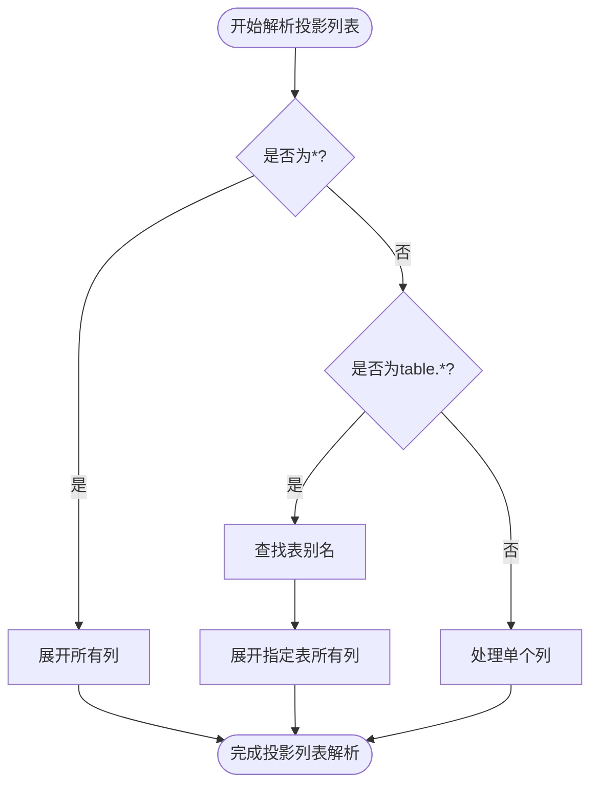
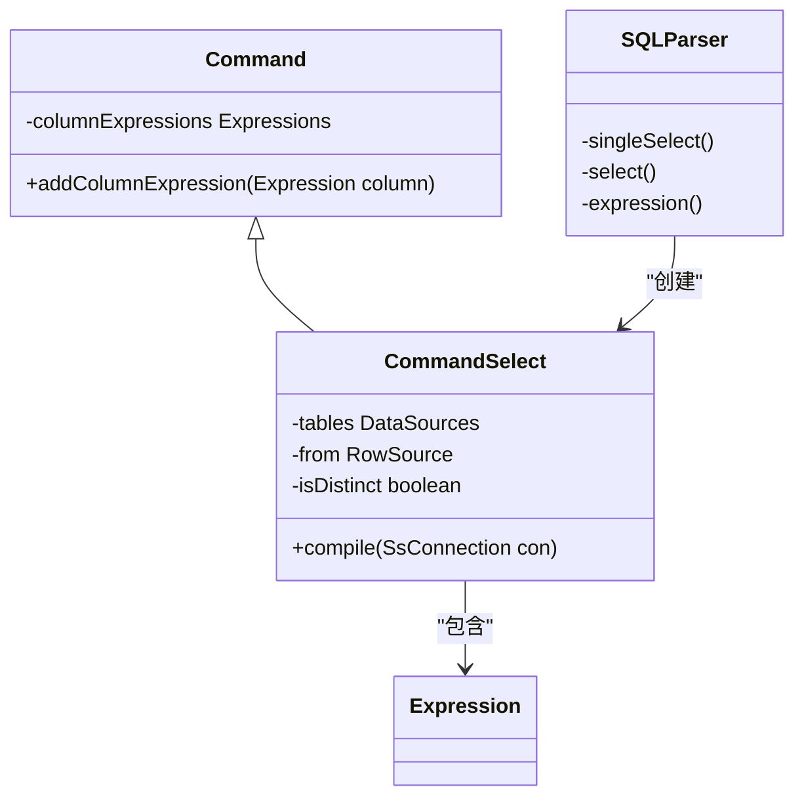
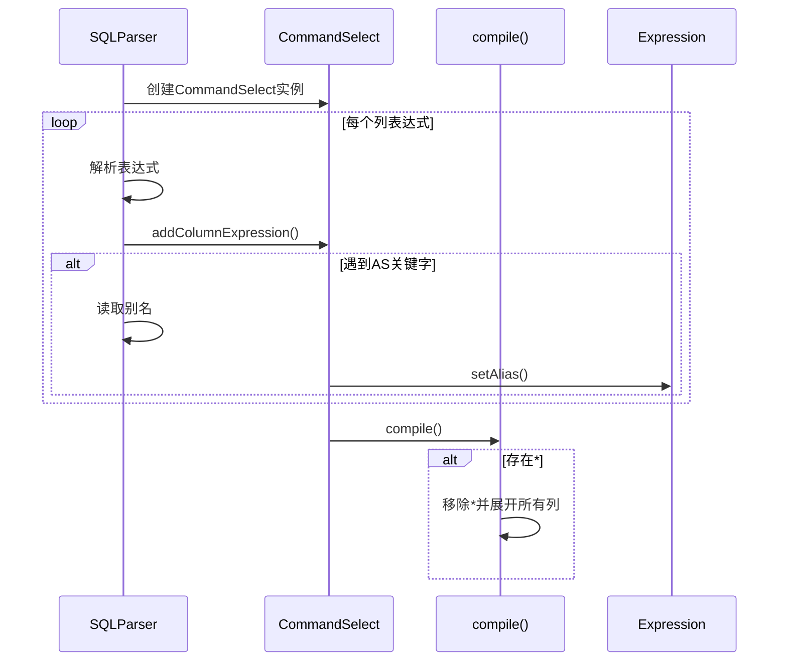

# 投影列表

<cite>
**本文档中引用的文件**
- [SQLParser.java](file://src/main/java/io/leavesfly/smallsql/rdb/sql/SQLParser.java)
- [CommandSelect.java](file://src/main/java/io/leavesfly/smallsql/rdb/command/dql/CommandSelect.java)
- [Command.java](file://src/main/java/io/leavesfly/smallsql/rdb/command/Command.java)
</cite>

## 目录
1. [投影列表语法](#投影列表语法)
2. [列别名定义](#列别名定义)
3. [通配符(*)的使用](#通配符的使用)
4. [代码实现机制](#代码实现机制)
5. [解析流程分析](#解析流程分析)

## 投影列表语法

SELECT语句的投影列表定义了查询结果中包含的列。支持单列选择和多列选择，列之间使用逗号分隔。基本语法结构如下：

- 单列选择：`SELECT col1 FROM table`
- 多列选择：`SELECT col1, col2 FROM table`
- 混合表达式：`SELECT col1, col2 + col3 FROM table`

在解析过程中，SQLParser类的singleSelect()方法负责处理投影列表的解析。该方法通过循环读取表达式并将其添加到CommandSelect对象中，直到遇到FROM关键字或语句结束。

**Section sources**
- [SQLParser.java](file://src/main/java/io/leavesfly/smallsql/rdb/sql/SQLParser.java#L137-L2527)

## 列别名定义

列别名通过AS关键字定义，用于为查询结果中的列指定替代名称。别名可以在ORDER BY和GROUP BY子句中引用。语法格式如下：

```sql
SELECT col1 AS alias1 FROM table
SELECT col1 AS alias1, col2 AS alias2 FROM table
```

在实现中，当解析器遇到AS关键字时，会读取后续的标识符作为别名，并通过Expression.setAlias()方法设置到相应的表达式对象上。如果没有显式定义别名，系统会自动生成如"col1"、"col2"等默认别名。

**Section sources**
- [SQLParser.java](file://src/main/java/io/leavesfly/smallsql/rdb/sql/SQLParser.java#L137-L2527)
- [CommandSelect.java](file://src/main/java/io/leavesfly/smallsql/rdb/command/dql/CommandSelect.java#L61-L587)

## 通配符的使用

通配符*用于选择表中的所有列，其使用规则在单表和多表查询中有所不同：

- 单表查询：`SELECT * FROM table` 选择指定表的所有列
- 多表查询：`SELECT table.* FROM table` 选择特定表的所有列
- 多表联合：`SELECT * FROM table1, table2` 选择所有表的列

当遇到*时，系统会将其展开为具体的列名列表。对于`table.*`形式，会查找对应表别名并展开该表的所有列；对于`*`形式，则展开所有FROM子句中表的全部列。



**Diagram sources**
- [CommandSelect.java](file://src/main/java/io/leavesfly/smallsql/rdb/command/dql/CommandSelect.java#L61-L587)

## 代码实现机制

投影列表的实现主要涉及三个核心类：SQLParser、CommandSelect和Command。SQLParser负责语法解析，CommandSelect管理SELECT命令的状态，Command提供基础功能。

Command类定义了addColumnExpression()方法，用于向命令对象添加列表达式。CommandSelect继承自Command，并重写了相关方法以支持SELECT语句的特殊需求。



**Diagram sources**
- [Command.java](file://src/main/java/io/leavesfly/smallsql/rdb/command/Command.java#L81-L83)
- [CommandSelect.java](file://src/main/java/io/leavesfly/smallsql/rdb/command/dql/CommandSelect.java#L61-L587)

## 解析流程分析

投影列表的解析流程始于SQLParser.singleSelect()方法，该方法循环处理每个列表达式。对于每个表达式，首先调用expression()方法解析表达式本身，然后调用CommandSelect.addColumnExpression()将其添加到列表中。

当遇到*时，CommandSelect.compile()方法会在编译阶段处理通配符的展开。该方法会遍历所有数据源，对于每个表调用compileAdd_All_Table_Columns()方法，将表的所有列添加到投影列表中。

整个流程体现了典型的解析-编译两阶段架构：第一阶段由SQLParser完成语法解析，构建初步的表达式树；第二阶段由CommandSelect.compile()完成语义分析和查询计划生成。



**Diagram sources**
- [SQLParser.java](file://src/main/java/io/leavesfly/smallsql/rdb/sql/SQLParser.java#L137-L2527)
- [CommandSelect.java](file://src/main/java/io/leavesfly/smallsql/rdb/command/dql/CommandSelect.java#L61-L587)