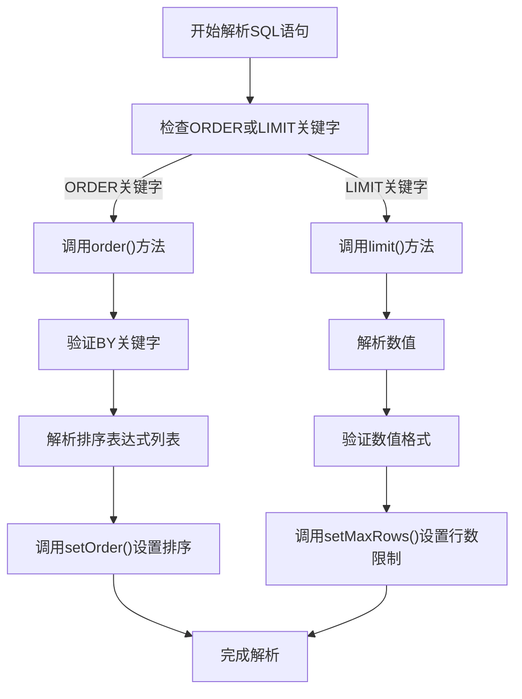
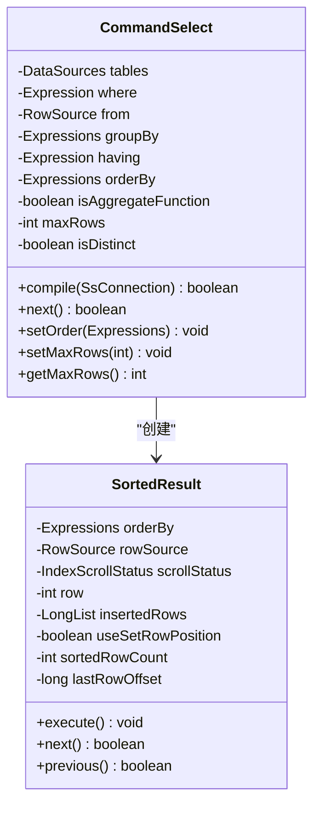
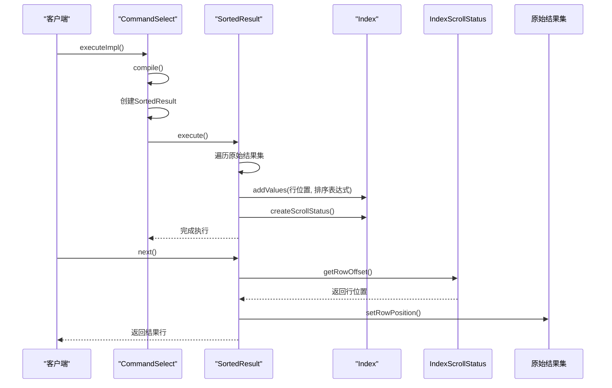

# 排序与限制（ORDER BY和LIMIT子句）

<cite>
**本文档引用的文件**   
- [SQLParser.java](file://src/main/java/io/leavesfly/smallsql/rdb/sql/SQLParser.java)
- [CommandSelect.java](file://src/main/java/io/leavesfly/smallsql/rdb/command/dql/CommandSelect.java)
- [SortedResult.java](file://src/main/java/io/leavesfly/smallsql/rdb/engine/selector/multioper/SortedResult.java)
</cite>

## 目录
1. [ORDER BY子句详解](#order-by子句详解)
2. [LIMIT子句详解](#limit子句详解)
3. [排序与限制查询示例](#排序与限制查询示例)
4. [SQL解析器实现分析](#sql解析器实现分析)
5. [命令选择类内部机制](#命令选择类内部机制)
6. [排序结果实现分析](#排序结果实现分析)

## ORDER BY子句详解

ORDER BY子句用于对查询结果集进行排序。该子句允许按一个或多个列进行升序（ASC）或降序（DESC）排序。在SQLParser类中，`order()`方法负责解析ORDER BY子句，通过调用`expressionTokenList()`方法获取排序表达式列表，并将结果传递给CommandSelect对象的`setOrder()`方法进行设置。

NULL值的排序行为遵循标准SQL规范，具体排序位置取决于数据库实现。在本系统中，NULL值在升序排序时位于结果集的开头，在降序排序时位于结果集的末尾。

**Section sources**
- [SQLParser.java](file://src/main/java/io/leavesfly/smallsql/rdb/sql/SQLParser.java#L2380-L2387)

## LIMIT子句详解

LIMIT子句用于限制查询返回的行数。该子句通过解析一个整数值来确定最大返回行数。系统还支持TOP关键字作为替代语法，用于实现相同的功能。在SQLParser类中，`limit()`方法负责解析LIMIT子句，将解析得到的整数值传递给CommandSelect对象的`setMaxRows()`方法进行设置。

**Section sources**
- [SQLParser.java](file://src/main/java/io/leavesfly/smallsql/rdb/sql/SQLParser.java#L2389-L2400)

## 排序与限制查询示例

以下是一些常见的排序与限制查询示例：

- `SELECT * FROM table ORDER BY name ASC`：按name列升序排列结果集
- `SELECT TOP 10 * FROM table ORDER BY id DESC`：返回按id列降序排列的前10行记录
- `SELECT * FROM table ORDER BY column1 ASC, column2 DESC`：先按column1升序排列，再按column2降序排列

这些查询语句通过SQLParser进行解析，分别调用`order()`和`limit()`方法处理排序和限制条件。

**Section sources**
- [TestOrderBy.java](file://src/test/java/io/leavesfly/smallsql/junit/sql/dql/TestOrderBy.java#L145-L467)

## SQL解析器实现分析

SQLParser类中的`order()`和`limit()`方法实现了对ORDER BY和LIMIT子句的解析。`order()`方法首先验证BY关键字的存在，然后调用`expressionTokenList()`方法解析排序表达式列表。在解析过程中，如果遇到DESC或ASC关键字，会相应地设置表达式的别名。

`limit()`方法则负责解析限制行数，将字符串形式的数值转换为整数类型，并处理可能的格式错误。两个方法都通过调用CommandSelect对象的相应setter方法来设置解析结果。

**Diagram sources **
- [SQLParser.java](file://src/main/java/io/leavesfly/smallsql/rdb/sql/SQLParser.java#L2380-L2400)

**Section sources**
- [SQLParser.java](file://src/main/java/io/leavesfly/smallsql/rdb/sql/SQLParser.java#L2380-L2400)

## 命令选择类内部机制

CommandSelect类在`compile()`方法中实现了排序和限制的核心逻辑。当检测到存在排序条件时，会创建SortedResult对象来包装原始结果集，从而实现排序功能。对于行数限制，通过`next()`方法中的`maxRows`字段检查来实现。

`next()`方法在每次获取下一行时都会检查当前行号是否已达到`maxRows`限制，如果达到则返回false，从而停止结果集的进一步遍历。`last()`和`absolute()`等方法也会考虑`maxRows`的限制。

**Diagram sources **
- [CommandSelect.java](file://src/main/java/io/leavesfly/smallsql/rdb/command/dql/CommandSelect.java#L61-L587)

**Section sources**
- [CommandSelect.java](file://src/main/java/io/leavesfly/smallsql/rdb/command/dql/CommandSelect.java#L61-L587)

## 排序结果实现分析

SortedResult类实现了结果集的排序功能。在`execute()`方法中，系统遍历原始结果集的所有行，使用Index类收集每行的排序键值和行位置。然后创建IndexScrollStatus对象来管理排序后的行位置索引。

`next()`和`previous()`方法通过scrollStatus对象来定位下一行或上一行的物理位置，实现了有序遍历。`getRow()`方法返回当前逻辑行号，考虑了插入行和排序的影响。

**Diagram sources **
- [SortedResult.java](file://src/main/java/io/leavesfly/smallsql/rdb/engine/selector/multioper/SortedResult.java#L47-L306)

**Section sources**
- [SortedResult.java](file://src/main/java/io/leavesfly/smallsql/rdb/engine/selector/multioper/SortedResult.java#L47-L306)