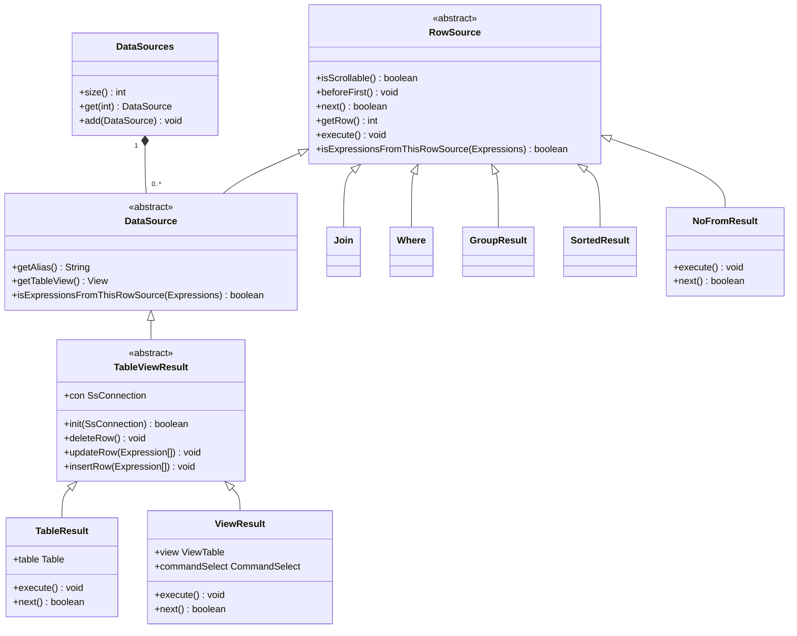
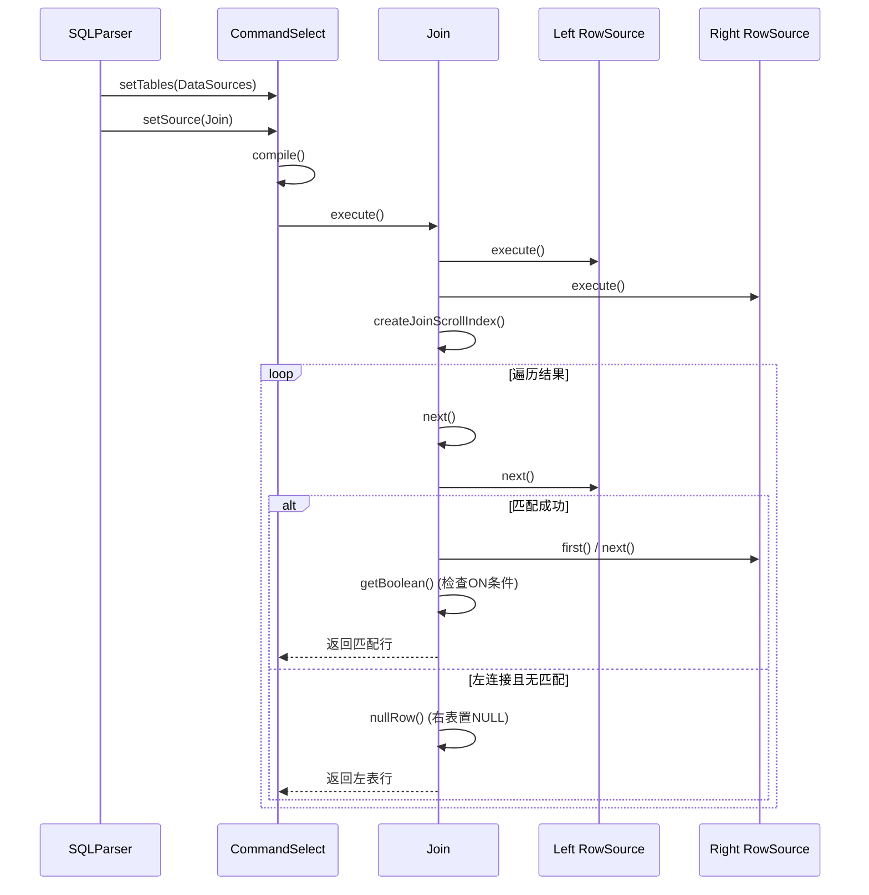
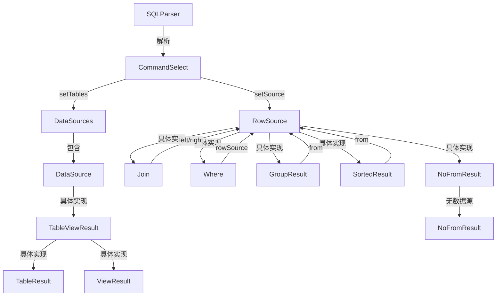

# 数据源（FROM子句）

<cite>
**本文档中引用的文件**  
- [CommandSelect.java](file://src/main/java/io/leavesfly/smallsql/rdb/command/dql/CommandSelect.java)
- [SQLParser.java](file://src/main/java/io/leavesfly/smallsql/rdb/sql/SQLParser.java)
- [DataSource.java](file://src/main/java/io/leavesfly/smallsql/rdb/engine/selector/DataSource.java)
- [DataSources.java](file://src/main/java/io/leavesfly/smallsql/rdb/engine/selector/DataSources.java)
- [Join.java](file://src/main/java/io/leavesfly/smallsql/rdb/engine/selector/multioper/Join.java)
- [RowSource.java](file://src/main/java/io/leavesfly/smallsql/rdb/engine/RowSource.java)
- [TableViewResult.java](file://src/main/java/io/leavesfly/smallsql/rdb/engine/selector/result/TableViewResult.java)
- [ViewResult.java](file://src/main/java/io/leavesfly/smallsql/rdb/engine/selector/result/ViewResult.java)
- [TableResult.java](file://src/main/java/io/leavesfly/smallsql/rdb/engine/selector/result/TableResult.java)
- [NoFromResult.java](file://src/main/java/io/leavesfly/smallsql/rdb/engine/selector/result/NoFromResult.java)
</cite>

## 目录
1. [简介](#简介)
2. [FROM子句语法与语义](#from子句语法与语义)
3. [表别名与列引用](#表别名与列引用)
4. [查询示例](#查询示例)
5. [SQL解析与数据源构建](#sql解析与数据源构建)
6. [数据源对象模型](#数据源对象模型)
7. [表连接机制](#表连接机制)
8. [核心类关系图](#核心类关系图)
9. [总结](#总结)

## 简介
本文档详细阐述了SmallSQL数据库系统中FROM子句的实现机制。FROM子句是SQL SELECT语句的核心组成部分，负责定义查询的数据源。文档将深入分析单表查询、多表连接查询的语法结构，解释表别名的使用规则，并从源码层面解析SQLParser如何将SQL文本解析为DataSources对象，以及CommandSelect如何设置和管理这些数据源。同时，文档将重点介绍Join类在实现表连接操作中的核心作用及其与RowSource接口的关系。

## FROM子句语法与语义
FROM子句用于指定SELECT语句要查询的一个或多个数据源（表或视图）。其基本语法结构如下：

```sql
SELECT column_list FROM table_source [,...]
```

- **单表查询**：`FROM table_name` 指定一个单一的数据源。
- **多表连接查询**：`FROM table1 JOIN table2 ON condition` 指定两个或多个通过特定条件连接的数据源。
- **交叉连接**：`FROM table1, table2` 或 `FROM table1 CROSS JOIN table2` 产生两个表的笛卡尔积。

在SmallSQL中，FROM子句的语义由`RowSource`接口及其众多实现类来承载。`RowSource`是一个抽象类，定义了遍历数据行所需的所有方法，如`next()`、`first()`、`beforeFirst()`等。任何可以作为FROM子句数据源的实体都必须继承此类。

**Section sources**
- [RowSource.java](file://src/main/java/io/leavesfly/smallsql/rdb/engine/RowSource.java#L1-L189)

## 表别名与列引用
表别名（Table Alias）是为FROM子句中的表或视图指定的临时名称，它简化了SQL语句的编写，特别是在多表连接查询中避免了列名的歧义。

### 定义与使用规则
表别名通过`AS`关键字（可选）在表名后定义：
```sql
SELECT * FROM table_name AS alias_name
```
在SmallSQL的解析器中，表别名的处理逻辑位于`SQLParser`类中。当解析到一个表名时，解析器会检查其后是否跟有`AS`关键字或直接跟一个标识符，如果存在，则将其作为该表的别名。

### 列引用中的表前缀
在SELECT列表、WHERE条件等子句中，可以通过`table_alias.column_name`的形式来引用特定表中的列。这在多表查询中至关重要，因为不同表可能包含同名的列。

在`CommandSelect.compile()`方法中，`compileLinkExpressionName()`函数负责解析这种带前缀的列名。它会遍历`DataSources`列表，查找与给定别名匹配的`DataSource`，然后在对应的表中定位列索引，从而建立列名与实际数据源之间的链接。

**Section sources**
- [SQLParser.java](file://src/main/java/io/leavesfly/smallsql/rdb/sql/SQLParser.java#L0-L799)
- [CommandSelect.java](file://src/main/java/io/leavesfly/smallsql/rdb/command/dql/CommandSelect.java#L0-L587)

## 查询示例
以下是一些基础和复杂的查询示例，展示了FROM子句的不同用法：

### 基础查询
```sql
-- 查询单个表的所有列
SELECT * FROM employees;

-- 查询单个表并使用表别名
SELECT * FROM employees AS emp;
```

### 复杂查询
```sql
-- 内连接查询
SELECT * FROM employees e INNER JOIN departments d ON e.dept_id = d.id;

-- 左外连接查询
SELECT * FROM employees e LEFT JOIN projects p ON e.id = p.emp_id;

-- 多表连接
SELECT * FROM table1 t1 JOIN table2 t2 ON t1.id = t2.t1_id JOIN table3 t3 ON t2.id = t3.t2_id;
```

## SQL解析与数据源构建
SQL语句的解析和执行是一个分阶段的过程，FROM子句的处理是其中的关键环节。

### from() 方法解析
`SQLParser.from()`方法（在`SQLParser.java`中）负责解析FROM子句。它会循环读取SQL标记，识别出表名或视图名，并调用`rowSource()`方法来创建对应的`RowSource`对象。这些对象随后被添加到`DataSources`列表中。

### 构建DataSources对象
`DataSources`是一个简单的容器类，用于存储所有在FROM子句中声明的数据源。它内部使用一个`DataSource`数组来管理这些数据源。`DataSource`是`RowSource`的抽象子类，代表一个具体的数据源条目。

### CommandSelect的设置方法
`CommandSelect`类提供了两个关键方法来设置数据源：
- `setTables(DataSources from)`：此方法将解析得到的`DataSources`对象赋值给`CommandSelect`的`tables`字段。这个列表在后续的编译阶段被用来解析列名和建立链接。
- `setSource(RowSource join)`：此方法将最终构建好的`RowSource`树（可能是一个`Join`对象，也可能是一个简单的`TableResult`）赋值给`from`字段。这个`RowSource`树代表了整个查询的数据访问路径。

在`CommandSelect.compile()`方法中，系统会遍历`tables`列表，初始化每个`DataSource`，并根据`SELECT *`等语法扩展列列表，最终构建出完整的执行计划。

**Section sources**
- [CommandSelect.java](file://src/main/java/io/leavesfly/smallsql/rdb/command/dql/CommandSelect.java#L0-L587)
- [DataSources.java](file://src/main/java/io/leavesfly/smallsql/rdb/engine/selector/DataSources.java#L0-L62)
- [DataSource.java](file://src/main/java/io/leavesfly/smallsql/rdb/engine/selector/DataSource.java#L0-L101)

## 数据源对象模型
SmallSQL通过一个层次化的对象模型来表示和管理数据源。其核心是`RowSource`基类，所有具体的数据源类型都继承自它。



**Diagram sources**
- [RowSource.java](file://src/main/java/io/leavesfly/smallsql/rdb/engine/RowSource.java#L1-L189)
- [DataSource.java](file://src/main/java/io/leavesfly/smallsql/rdb/engine/selector/DataSource.java#L1-L101)
- [DataSources.java](file://src/main/java/io/leavesfly/smallsql/rdb/engine/selector/DataSources.java#L1-L62)
- [TableViewResult.java](file://src/main/java/io/leavesfly/smallsql/rdb/engine/selector/result/TableViewResult.java#L1-L127)
- [TableResult.java](file://src/main/java/io/leavesfly/smallsql/rdb/engine/selector/result/TableResult.java#L1-L419)
- [ViewResult.java](file://src/main/java/io/leavesfly/smallsql/rdb/engine/selector/result/ViewResult.java#L1-L260)
- [NoFromResult.java](file://src/main/java/io/leavesfly/smallsql/rdb/engine/selector/result/NoFromResult.java#L1-L147)

## 表连接机制
表连接是SQL查询中最复杂的操作之一，SmallSQL通过`Join`类来实现。

### Join类的核心作用
`Join`类是`RowSource`的一个具体实现，专门用于处理两个`RowSource`（`left`和`right`）之间的连接。它持有一个`condition`表达式，即ON子句中的条件。

`Join`类的核心是其内部的`JoinScroll`类，它实现了连接的遍历逻辑。根据连接类型（`INNER_JOIN`, `LEFT_JOIN`等），`JoinScroll`会以不同的方式组合左右两个数据源的行。例如，在`LEFT_JOIN`中，即使右表没有匹配的行，左表的行也会被保留，并将右表的列置为NULL。

### 与RowSource接口的关系
`Join`类完全遵循`RowSource`接口的契约。这意味着一个`Join`对象本身就是一个`RowSource`，可以被当作一个单一的数据源来使用。这种设计使得连接操作可以无限嵌套，例如`A JOIN (B JOIN C ON ...) ON ...`。`CommandSelect`无需关心`from`字段指向的是一个简单的表还是一个复杂的连接树，它只需要调用`RowSource`定义的统一接口即可。



**Diagram sources**
- [Join.java](file://src/main/java/io/leavesfly/smallsql/rdb/engine/selector/multioper/Join.java#L1-L463)
- [CommandSelect.java](file://src/main/java/io/leavesfly/smallsql/rdb/command/dql/CommandSelect.java#L1-L587)
- [RowSource.java](file://src/main/java/io/leavesfly/smallsql/rdb/engine/RowSource.java#L1-L189)

## 核心类关系图
以下Mermaid图展示了FROM子句相关核心类之间的关系。



**Diagram sources**
- [SQLParser.java](file://src/main/java/io/leavesfly/smallsql/rdb/sql/SQLParser.java#L1-L799)
- [CommandSelect.java](file://src/main/java/io/leavesfly/smallsql/rdb/command/dql/CommandSelect.java#L1-L587)
- [DataSources.java](file://src/main/java/io/leavesfly/smallsql/rdb/engine/selector/DataSources.java#L1-L62)
- [DataSource.java](file://src/main/java/io/leavesfly/smallsql/rdb/engine/selector/DataSource.java#L1-L101)
- [RowSource.java](file://src/main/java/io/leavesfly/smallsql/rdb/engine/RowSource.java#L1-L189)
- [Join.java](file://src/main/java/io/leavesfly/smallsql/rdb/engine/selector/multioper/Join.java#L1-L463)

## 总结
SmallSQL通过一个精心设计的面向对象模型来处理FROM子句。`SQLParser`负责将SQL文本解析为`DataSources`列表和`RowSource`树。`CommandSelect`利用`setTables()`和`setSource()`方法将这些解析结果整合到查询命令中。`Join`类作为`RowSource`的具体实现，承担了表连接的核心逻辑，其内部的`JoinScroll`机制能够高效地处理各种连接类型。整个系统通过`RowSource`接口的统一性，实现了从简单单表查询到复杂多表连接查询的无缝支持，为数据库的查询执行提供了坚实的基础。

**Section sources**
- [CommandSelect.java](file://src/main/java/io/leavesfly/smallsql/rdb/command/dql/CommandSelect.java#L0-L587)
- [SQLParser.java](file://src/main/java/io/leavesfly/smallsql/rdb/sql/SQLParser.java#L0-L799)
- [Join.java](file://src/main/java/io/leavesfly/smallsql/rdb/engine/selector/multioper/Join.java#L0-L463)