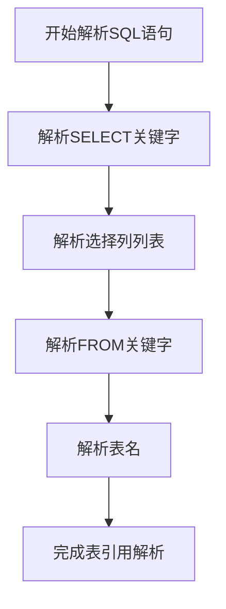
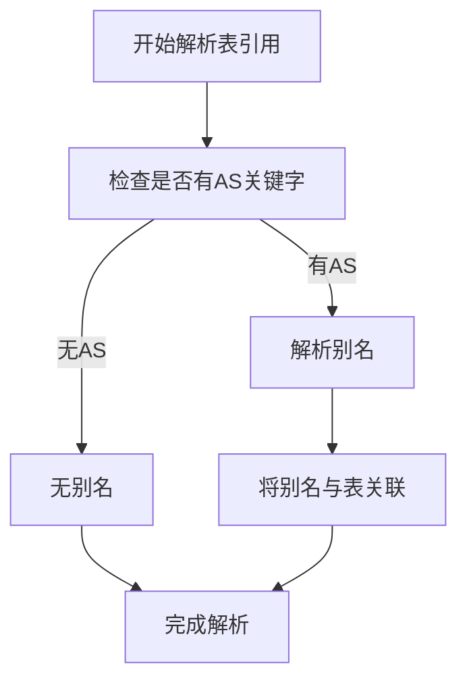
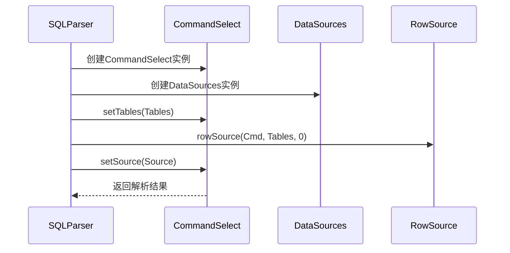
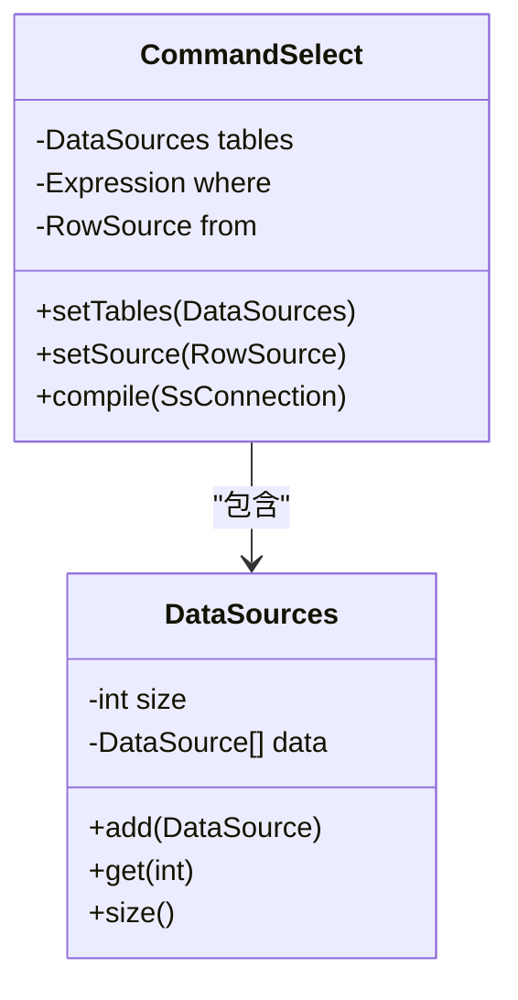
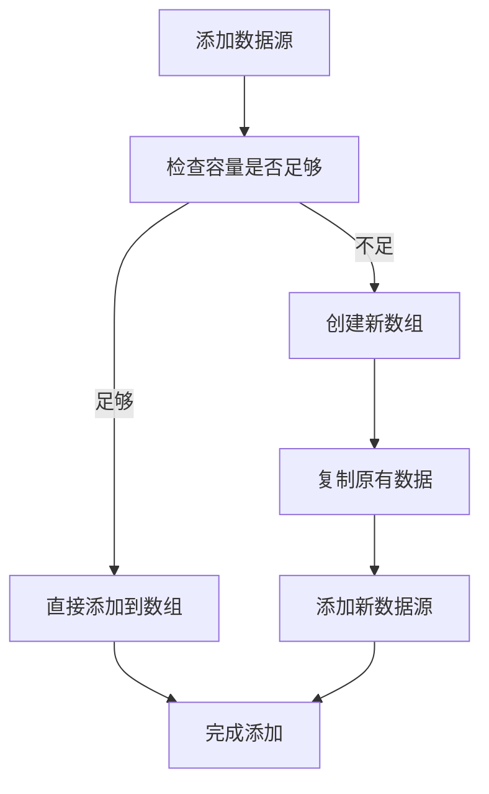
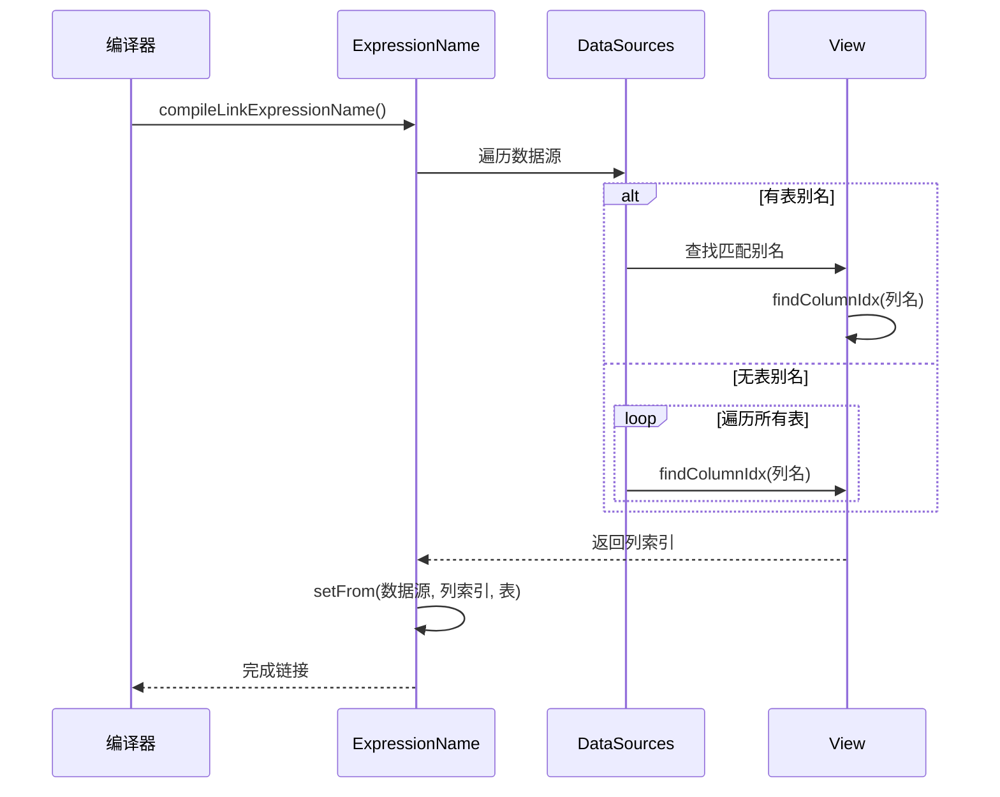

# 表引用

<cite>
**本文档中引用的文件**   
- [SQLParser.java](file://src/main/java/io/leavesfly/smallsql/rdb/sql/SQLParser.java)
- [CommandSelect.java](file://src/main/java/io/leavesfly/smallsql/rdb/command/dql/CommandSelect.java)
- [DataSources.java](file://src/main/java/io/leavesfly/smallsql/rdb/engine/selector/DataSources.java)
</cite>

## 目录
1. [简介](#简介)
2. [基本语法结构](#基本语法结构)
3. [表别名的使用](#表别名的使用)
4. [SQLParser类的from方法](#sqlparser类的from方法)
5. [CommandSelect.setTables方法](#commandselectsettables方法)
6. [DataSources类的内部实现](#datasources类的内部实现)
7. [表引用与列引用的关联](#表引用与列引用的关联)
8. [查询示例](#查询示例)

## 简介
本文档详细阐述了SmallSQL数据库系统中FROM子句的单表引用机制。文档全面覆盖了基本语法结构、表别名处理、核心解析方法以及数据结构的内部实现。重点分析了SQLParser类如何解析表引用，CommandSelect类如何设置表源，以及DataSources类如何管理多个数据源。同时，文档还解释了在编译阶段如何建立表与列的链接关系。

**Section sources**
- [SQLParser.java](file://src/main/java/io/leavesfly/smallsql/rdb/sql/SQLParser.java#L1-L50)
- [CommandSelect.java](file://src/main/java/io/leavesfly/smallsql/rdb/command/dql/CommandSelect.java#L1-L50)

## 基本语法结构
在SmallSQL中，FROM子句用于指定查询的数据源表。最基本的语法结构是`SELECT * FROM table_name`，其中`table_name`是数据库中存在的表名。该语法结构允许用户从指定的表中检索所有列的数据。

解析器首先识别SELECT关键字，然后处理选择列表（如`*`或具体的列名），最后通过FROM关键字定位到数据源。当解析器遇到FROM关键字后，它会调用专门的方法来处理后续的表引用，确保能够正确地将SQL语句中的表名映射到实际的数据库表对象。

**Diagram sources **
- [SQLParser.java](file://src/main/java/io/leavesfly/smallsql/rdb/sql/SQLParser.java#L137-L2527)

**Section sources**
- [SQLParser.java](file://src/main/java/io/leavesfly/smallsql/rdb/sql/SQLParser.java#L137-L2527)

## 表别名的使用
在SQL查询中，可以为表指定别名以简化引用或避免歧义。语法格式为`SELECT * FROM table_name AS alias`或简写为`SELECT * FROM table_name alias`。别名在查询的其他部分（如WHERE、ORDER BY子句）中可以用来限定列名。

当解析器遇到AS关键字时，它会将紧随其后的标识符识别为表的别名，并将其与对应的表名关联起来。这种机制允许在复杂的查询中使用简短的别名来引用表，提高了SQL语句的可读性和编写效率。

**Diagram sources **
- [SQLParser.java](file://src/main/java/io/leavesfly/smallsql/rdb/sql/SQLParser.java#L137-L2527)

**Section sources**
- [SQLParser.java](file://src/main/java/io/leavesfly/smallsql/rdb/sql/SQLParser.java#L137-L2527)

## SQLParser类的from方法
`SQLParser`类中的`from()`方法负责解析FROM子句并处理单个表引用。该方法首先创建一个`DataSources`对象，然后将其设置到`CommandSelect`命令对象中。接着，它调用`rowSource()`方法来解析实际的表源。

`from()`方法的执行流程如下：首先创建`DataSources`实例，然后通过`setTables()`方法将其与`CommandSelect`命令关联。之后，它调用`rowSource()`方法来解析表名、处理别名，并将解析得到的`RowSource`对象设置到命令中。这个过程确保了查询命令能够正确地引用到数据源表。

**Diagram sources **
- [SQLParser.java](file://src/main/java/io/leavesfly/smallsql/rdb/sql/SQLParser.java#L137-L2527)

**Section sources**
- [SQLParser.java](file://src/main/java/io/leavesfly/smallsql/rdb/sql/SQLParser.java#L137-L2527)

## CommandSelect.setTables方法
`CommandSelect.setTables()`方法用于设置查询命令的表源。该方法接收一个`DataSources`对象作为参数，并将其赋值给命令内部的`tables`字段。这个`tables`字段是一个`DataSources`类型的私有变量，用于存储查询所涉及的所有数据源。

当执行`setTables()`方法时，它不仅设置了表源的引用，还为后续的编译和执行阶段做好了准备。在编译阶段，系统会遍历`tables`中的每个数据源，初始化它们并建立与列引用的链接。这个方法是连接SQL解析和查询执行的关键环节。

**Diagram sources **
- [CommandSelect.java](file://src/main/java/io/leavesfly/smallsql/rdb/command/dql/CommandSelect.java#L61-L587)
- [DataSources.java](file://src/main/java/io/leavesfly/smallsql/rdb/engine/selector/DataSources.java#L38-L61)

**Section sources**
- [CommandSelect.java](file://src/main/java/io/leavesfly/smallsql/rdb/command/dql/CommandSelect.java#L61-L587)

## DataSources类的内部实现
`DataSources`类是用于管理多个数据源的核心数据结构。它采用动态数组的方式来存储`DataSource`对象，初始容量为4个元素。当添加的数据源数量超过当前数组容量时，它会自动扩容，新容量为原容量的两倍。

该类提供了三个主要方法：`size()`返回当前数据源的数量，`get(int idx)`根据索引获取指定的数据源，`add(DataSource table)`将新的数据源添加到列表中。`add()`方法实现了自动扩容机制，当数组空间不足时，会创建一个新的、容量更大的数组，并将原有数据复制过去。

**Diagram sources **
- [DataSources.java](file://src/main/java/io/leavesfly/smallsql/rdb/engine/selector/DataSources.java#L38-L61)

**Section sources**
- [DataSources.java](file://src/main/java/io/leavesfly/smallsql/rdb/engine/selector/DataSources.java#L38-L61)

## 表引用与列引用的关联
在编译阶段，系统通过`compileLinkExpressionName()`方法建立表与列的链接关系。该方法首先检查列引用是否包含表别名，如果有，则在`tables`列表中查找匹配的别名；如果没有，则在所有表中搜索该列名。

当找到匹配的列时，系统会调用`ExpressionName.setFrom()`方法，将数据源、列索引和表对象信息设置到表达式中。如果在多个表中找到同名列，则会抛出列名歧义异常；如果找不到匹配的列，则会抛出列名无效异常。这个链接过程确保了查询执行时能够准确地定位到具体的数据。

**Diagram sources **
- [CommandSelect.java](file://src/main/java/io/leavesfly/smallsql/rdb/command/dql/CommandSelect.java#L224-L268)

**Section sources**
- [CommandSelect.java](file://src/main/java/io/leavesfly/smallsql/rdb/command/dql/CommandSelect.java#L224-L268)

## 查询示例
以下是一些常见的查询示例，展示了不同情况下的表引用用法：

1. **基础查询**：`SELECT * FROM users` - 从users表中选择所有列。
2. **带别名的查询**：`SELECT * FROM users AS u` - 为users表指定别名u。
3. **列限定查询**：`SELECT u.name FROM users AS u` - 使用别名限定列名。
4. **复杂查询**：`SELECT u.name, o.order_date FROM users AS u, orders AS o WHERE u.id = o.user_id` - 多表连接查询。

这些示例展示了从简单到复杂的各种表引用场景，体现了系统对不同SQL语法的完整支持。

**Section sources**
- [SQLParser.java](file://src/main/java/io/leavesfly/smallsql/rdb/sql/SQLParser.java#L137-L2527)
- [CommandSelect.java](file://src/main/java/io/leavesfly/smallsql/rdb/command/dql/CommandSelect.java#L61-L587)