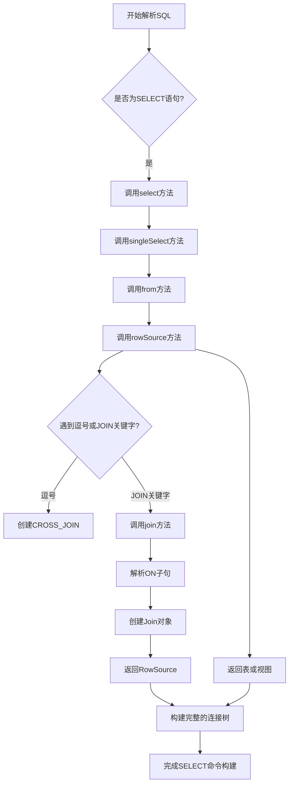
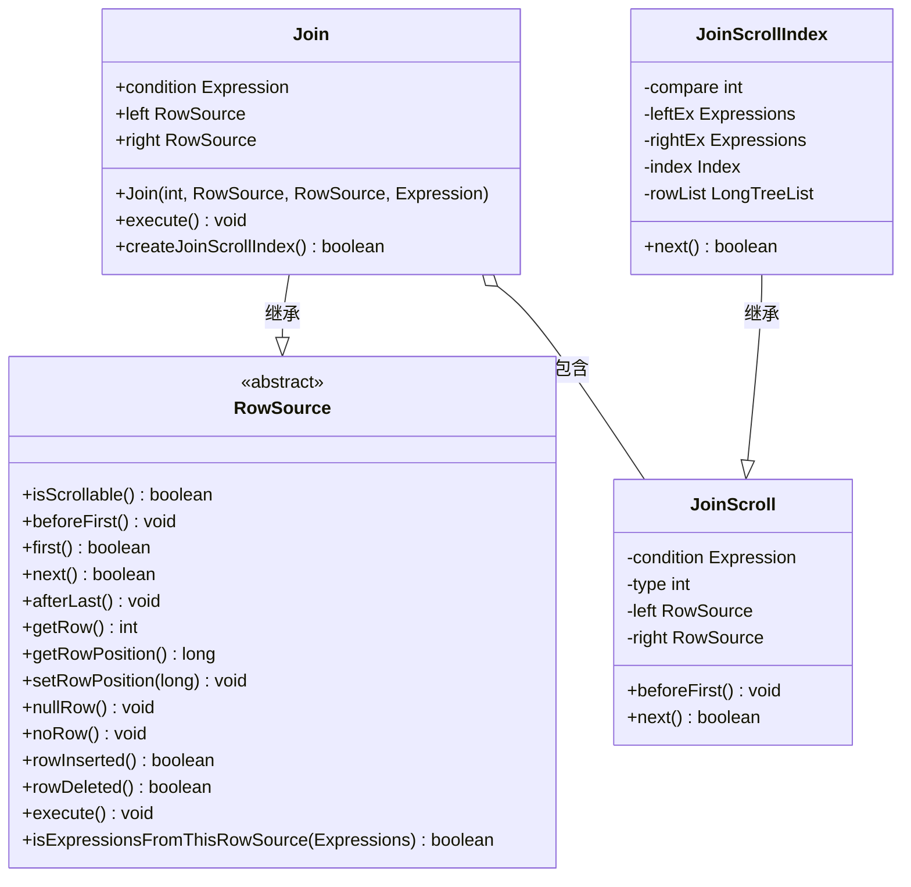

# 连接操作

<cite>
**本文档中引用的文件**   
- [Join.java](file://src/main/java/io/leavesfly/smallsql/rdb/engine/selector/multioper/Join.java)
- [CommandSelect.java](file://src/main/java/io/leavesfly/smallsql/rdb/command/dql/CommandSelect.java)
- [SQLParser.java](file://src/main/java/io/leavesfly/smallsql/rdb/sql/SQLParser.java)
- [RowSource.java](file://src/main/java/io/leavesfly/smallsql/rdb/engine/RowSource.java)
- [SQLTokenizer.java](file://src/main/java/io/leavesfly/smallsql/rdb/sql/parser/SQLTokenizer.java)
</cite>

## 目录
1. [连接类型与语法](#连接类型与语法)
2. [SQL解析与连接构建](#sql解析与连接构建)
3. [Join类核心实现](#join类核心实现)
4. [连接优化策略](#连接优化策略)
5. [嵌套连接处理](#嵌套连接处理)
6. [执行流程与结果集生成](#执行流程与结果集生成)
7. [查询示例](#查询示例)

## 连接类型与语法

该数据库系统支持多种连接类型，包括内连接（INNER JOIN）、左外连接（LEFT JOIN）、右外连接（RIGHT JOIN）、全外连接（FULL JOIN）和交叉连接（CROSS JOIN）。这些连接类型通过FROM子句中的JOIN关键字和相应的连接条件来定义。连接条件在ON子句中指定，用于确定如何将两个表的行进行匹配。交叉连接不使用ON子句，它会产生两个表的笛卡尔积。内连接只返回两个表中匹配的行，而外连接则会保留一个或两个表中的所有行，对于不匹配的行，来自另一个表的列将填充为NULL值。

**Section sources**
- [SQLParser.java](file://src/main/java/io/leavesfly/smallsql/rdb/sql/SQLParser.java#L137-L2527)
- [Join.java](file://src/main/java/io/leavesfly/smallsql/rdb/engine/selector/multioper/Join.java#L44-L463)

## SQL解析与连接构建

SQLParser类负责解析SQL语句并构建相应的命令对象。当解析到FROM子句时，它会调用`rowSource`方法来处理表或视图的引用。该方法能够识别逗号分隔的表列表，并将其转换为交叉连接（CROSS_JOIN）。对于显式的JOIN语法，`rowSource`方法会调用`join`方法，根据不同的JOIN关键字（如INNER JOIN、LEFT JOIN等）创建相应类型的Join对象。`join`方法会解析ON子句中的连接条件表达式，并将其作为参数传递给Join构造函数。整个解析过程是递归的，能够处理复杂的嵌套连接结构。



**Diagram sources **
- [SQLParser.java](file://src/main/java/io/leavesfly/smallsql/rdb/sql/SQLParser.java#L137-L2527)

**Section sources**
- [SQLParser.java](file://src/main/java/io/leavesfly/smallsql/rdb/sql/SQLParser.java#L137-L2527)

## Join类核心实现

Join类是连接操作的核心实现，它继承自RowSource抽象类，表示一个行源。Join对象包含三个主要属性：`left`和`right`，分别表示连接的左、右两个数据源；`condition`，表示ON子句中的连接条件表达式。连接类型通过一个整型字段`type`来表示，其值由`CROSS_JOIN`、`INNER_JOIN`等常量定义。Join类通过组合模式实现了递归的数据结构，允许构建复杂的嵌套连接。在执行阶段，Join对象会调用其`execute`方法，该方法会递归地执行左右两个子数据源，并根据连接类型和条件选择最优的连接算法。



**Diagram sources **
- [Join.java](file://src/main/java/io/leavesfly/smallsql/rdb/engine/selector/multioper/Join.java#L44-L463)
- [RowSource.java](file://src/main/java/io/leavesfly/smallsql/rdb/engine/RowSource.java#L51-L189)

**Section sources**
- [Join.java](file://src/main/java/io/leavesfly/smallsql/rdb/engine/selector/multioper/Join.java#L44-L463)

## 连接优化策略

系统实现了基于索引的连接优化策略，通过`createJoinScrollIndex`方法来创建`JoinScrollIndex`对象。该优化策略目前仅支持内连接（INNER_JOIN）和等值连接（EQUALS）条件。当连接条件是等值比较时，系统会尝试在右表上创建一个索引，该索引以连接条件中的右表列为键。在执行连接时，`JoinScrollIndex`会遍历左表的每一行，然后使用索引快速查找右表中匹配的行，从而避免了对右表的全表扫描。如果无法创建索引优化，则会回退到默认的嵌套循环连接算法（`JoinScroll`）。这种优化策略显著提高了等值连接的性能，尤其是在右表较大的情况下。

```mermaid
sequenceDiagram
participant Parser as SQLParser
participant Select as CommandSelect
participant Join as Join
participant Optimizer as createJoinScrollIndex
participant Index as JoinScrollIndex
participant Loop as JoinScroll
Parser->>Select : 解析SQL并构建CommandSelect
Select->>Join : 调用compileJoin进行编译
Join->>Optimizer : 调用createJoinScrollIndex
alt 可以创建索引
Optimizer->>Index : 创建JoinScrollIndex实例
Index->>Index : 在右表上创建索引
Index->>Join : 返回索引连接算法
else 无法创建索引
Optimizer->>Loop : 创建JoinScroll实例
Loop->>Join : 返回循环连接算法
end
Join->>Select : 完成连接对象构建
```

**Diagram sources **
- [Join.java](file://src/main/java/io/leavesfly/smallsql/rdb/engine/selector/multioper/Join.java#L44-L463)

**Section sources**
- [Join.java](file://src/main/java/io/leavesfly/smallsql/rdb/engine/selector/multioper/Join.java#L44-L463)

## 嵌套连接处理

CommandSelect类的`compileJoin`方法负责处理嵌套连接。该方法采用递归方式遍历整个连接树。当`from`字段是一个Join对象时，`compile`方法会调用`compileJoin`。`compileJoin`首先会编译当前连接的条件表达式，然后检查左、右子节点是否也是Join对象，如果是，则递归地调用自身进行编译。这种递归处理确保了无论连接结构多么复杂，所有连接条件和子连接都能被正确解析和编译。最终，整个连接结构被构建成一个树形的RowSource对象，其中叶子节点是具体的表或视图，内部节点是Join对象。

**Section sources**
- [CommandSelect.java](file://src/main/java/io/leavesfly/smallsql/rdb/command/dql/CommandSelect.java#L61-L587)

## 执行流程与结果集生成

连接操作的执行流程始于CommandSelect的`executeImpl`方法。该方法首先调用`compile`方法完成整个查询的编译，然后调用`from.execute()`启动执行。对于Join对象，`execute`方法会先递归执行其左右子数据源，然后根据连接类型选择合适的`JoinScroll`实现。`JoinScroll`的`next`方法实现了连接逻辑的核心迭代过程。对于内连接，它会遍历左表的每一行，并为每一行在右表中查找匹配的行。对于外连接，它还需要处理不匹配的情况，确保左表或右表的所有行都能被返回。最终，通过调用`next`方法，结果集被一行一行地生成并返回给客户端。

**Section sources**
- [CommandSelect.java](file://src/main/java/io/leavesfly/smallsql/rdb/command/dql/CommandSelect.java#L61-L587)
- [Join.java](file://src/main/java/io/leavesfly/smallsql/rdb/engine/selector/multioper/Join.java#L44-L463)

## 查询示例

以下是一些连接查询的示例：

1.  **简单内连接**:
    ```sql
    SELECT * FROM table1 INNER JOIN table2 ON table1.id = table2.id;
    ```
    此查询返回`table1`和`table2`中`id`列值相等的所有行。

2.  **复杂嵌套连接**:
    ```sql
    SELECT * FROM table1 
    LEFT JOIN (table2 INNER JOIN table3 ON table2.id = table3.id) 
    ON table1.id = table2.id;
    ```
    此查询首先执行`table2`和`table3`的内连接，然后将结果与`table1`进行左外连接。这会返回`table1`中的所有行，以及与内连接结果匹配的行。

**Section sources**
- [SQLParser.java](file://src/main/java/io/leavesfly/smallsql/rdb/sql/SQLParser.java#L137-L2527)
- [Join.java](file://src/main/java/io/leavesfly/smallsql/rdb/engine/selector/multioper/Join.java#L44-L463)