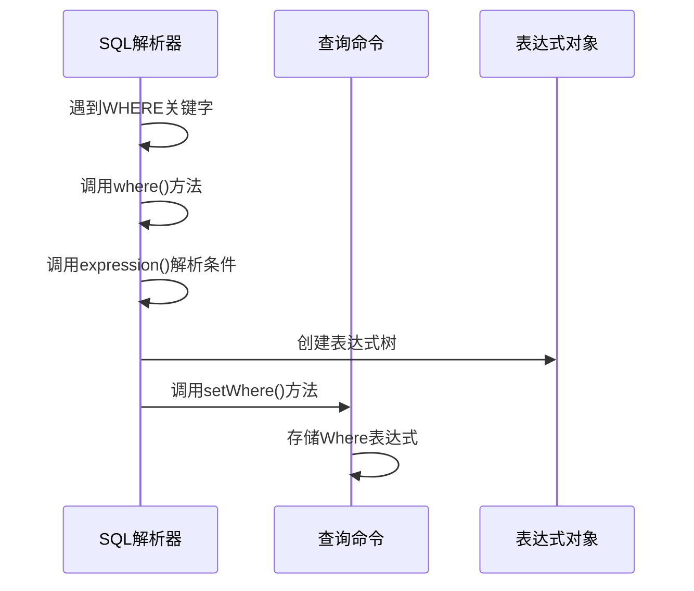
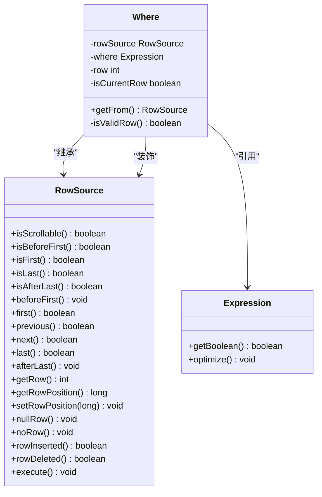

# 条件过滤（WHERE子句）

<cite>
**本文档引用的文件**   
- [SQLParser.java](file://src/main/java/io/leavesfly/smallsql/rdb/sql/SQLParser.java)
- [CommandSelect.java](file://src/main/java/io/leavesfly/smallsql/rdb/command/dql/CommandSelect.java)
- [Where.java](file://src/main/java/io/leavesfly/smallsql/rdb/engine/selector/multioper/Where.java)
</cite>

## 目录
1. [条件表达式语法与操作符](#条件表达式语法与操作符)
2. [表达式树构建机制](#表达式树构建机制)
3. [WHERE子句解析流程](#where子句解析流程)
4. [行级过滤执行机制](#行级过滤执行机制)
5. [查询示例](#查询示例)

## 条件表达式语法与操作符

条件表达式是SQL查询中用于筛选数据的核心语法结构。系统支持多种比较操作符、逻辑操作符以及特殊操作符，用于构建复杂的过滤条件。

### 比较操作符
支持以下基本比较操作符：
- 等于（=）
- 不等于（<>）
- 大于（>）
- 小于（<）
- 大于等于（>=）
- 小于等于（<=）

这些操作符可用于数值、字符串和日期时间类型的比较。

### 逻辑操作符
逻辑操作符用于组合多个条件表达式：
- AND：逻辑与，所有条件必须同时成立
- OR：逻辑或，任一条件成立即可
- NOT：逻辑非，对条件结果取反

逻辑操作符遵循标准的优先级规则，NOT优先级最高，其次是AND，最后是OR。

### 特殊操作符
系统还支持以下特殊操作符：
- IN：判断值是否在指定集合中
- BETWEEN：判断值是否在指定范围内
- LIKE：模式匹配，支持通配符匹配

这些操作符在解析时会被转换为相应的表达式对象，用于后续的条件评估。

**Section sources**
- [SQLParser.java](file://src/main/java/io/leavesfly/smallsql/rdb/sql/SQLParser.java#L1600-L2399)

## 表达式树构建机制

条件表达式的解析过程采用递归下降解析方法，将文本形式的SQL条件转换为内存中的表达式树结构。

### 常量与列引用
表达式树的基本节点包括常量值和列引用。常量值如数字、字符串等直接创建ExpressionValue对象，列引用则创建ExpressionName对象，并关联到具体的表和列。

### 函数调用
函数调用表达式由函数名和参数列表组成。解析器会根据函数名创建相应的ExpressionFunction对象，并将参数表达式作为子节点添加到函数节点下。

### 组合表达式
复杂的条件表达式通过操作符将简单表达式组合而成。每个操作符对应一个ExpressionArithmetic节点，该节点包含左操作数、右操作数和操作类型。这种树形结构能够准确表示表达式的层次关系和运算优先级。

**Section sources**
- [SQLParser.java](file://src/main/java/io/leavesfly/smallsql/rdb/sql/SQLParser.java#L1600-L2399)

## WHERE子句解析流程

WHERE子句的解析由SQLParser类的where()方法完成，该方法负责将SQL文本中的条件部分转换为可执行的表达式对象。

### 解析入口
当解析器遇到WHERE关键字时，会调用where()方法。该方法接收CommandSelect对象作为参数，用于设置解析结果。

### 表达式解析
解析器调用expression()方法递归解析条件表达式。该方法根据当前标记的类型选择相应的解析策略，处理各种操作符和表达式类型。

### 结果设置
解析完成后，将生成的Expression对象通过CommandSelect.setWhere()方法设置到查询命令中。这一步建立了语法解析结果与执行逻辑之间的连接。



**Diagram sources **
- [SQLParser.java](file://src/main/java/io/leavesfly/smallsql/rdb/sql/SQLParser.java#L2300-L2350)
- [CommandSelect.java](file://src/main/java/io/leavesfly/smallsql/rdb/command/dql/CommandSelect.java#L500-L520)

## 行级过滤执行机制

WHERE子句的执行机制基于装饰器模式实现，通过包装执行链来实现行级数据过滤。

### 编译阶段
在CommandSelect.compile()方法中，系统检查是否存在Where表达式。如果存在，则创建Where对象并将其作为新的数据源。

### 执行链包装
Where对象继承自RowSource，实现了标准的数据访问接口。它将原始的数据源作为内部成员，在遍历数据时对每一行应用过滤条件。

### 条件评估
在遍历过程中，Where对象调用表达式的getBoolean()方法评估当前行是否满足条件。只有当条件返回true时，该行才会被包含在结果集中。



**Diagram sources **
- [CommandSelect.java](file://src/main/java/io/leavesfly/smallsql/rdb/command/dql/CommandSelect.java#L100-L150)
- [Where.java](file://src/main/java/io/leavesfly/smallsql/rdb/engine/selector/multioper/Where.java#L40-L50)

## 查询示例

以下是一些常见的WHERE子句使用示例：

### 基本条件查询
```sql
SELECT * FROM table WHERE id = 1
```
此查询返回表中id列等于1的所有行。

### 模式匹配查询
```sql
SELECT * FROM table WHERE name LIKE 'A%'
```
此查询返回name列以字母A开头的所有行，%是通配符，表示任意字符序列。

### 组合条件查询
```sql
SELECT * FROM table WHERE age > 18 AND status = 'active'
```
此查询返回年龄大于18且状态为active的所有行，使用AND操作符组合两个条件。

### 范围查询
```sql
SELECT * FROM table WHERE date BETWEEN '2023-01-01' AND '2023-12-31'
```
此查询返回日期在2023年内的所有行，使用BETWEEN操作符指定范围。

**Section sources**
- [SQLParser.java](file://src/main/java/io/leavesfly/smallsql/rdb/sql/SQLParser.java#L2300-L2350)