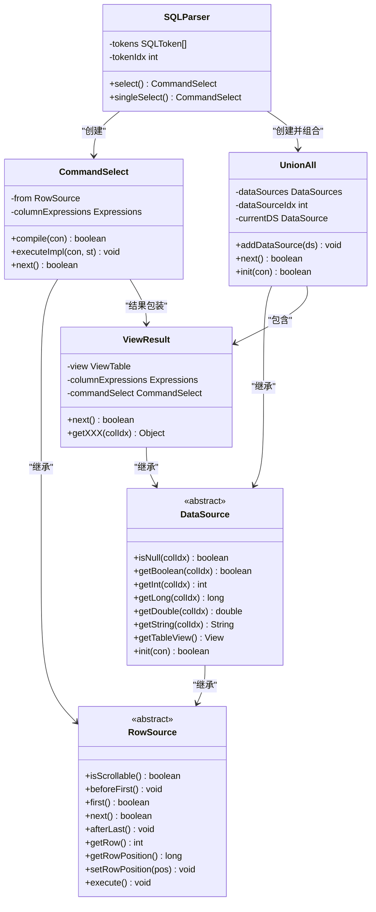
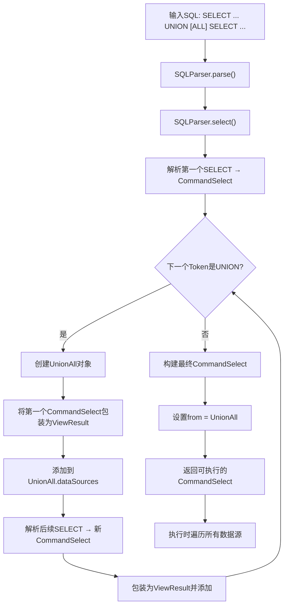

# 联合操作

<cite>
**本文档中引用的文件**  
- [SQLParser.java](file://src/main/java/io/leavesfly/smallsql/rdb/sql/SQLParser.java)
- [UnionAll.java](file://src/main/java/io/leavesfly/smallsql/rdb/engine/selector/multioper/UnionAll.java)
- [ViewResult.java](file://src/main/java/io/leavesfly/smallsql/rdb/engine/selector/result/ViewResult.java)
- [CommandSelect.java](file://src/main/java/io/leavesfly/smallsql/rdb/command/dql/CommandSelect.java)
- [DataSource.java](file://src/main/java/io/leavesfly/smallsql/rdb/engine/selector/DataSource.java)
- [RowSource.java](file://src/main/java/io/leavesfly/smallsql/rdb/engine/RowSource.java)
</cite>

## 目录
1. [简介](#简介)
2. [UNION与UNION ALL语义差异](#union与union-all语义差异)
3. [语法结构与使用示例](#语法结构与使用示例)
4. [查询执行计划构建流程](#查询执行计划构建流程)
5. [核心组件分析](#核心组件分析)
6. [类关系与数据流图](#类关系与数据流图)
7. [总结](#总结)

## 简介
本文档全面介绍SmallSQL数据库系统中`UNION`和`UNION ALL`操作的使用方法及其语义差异。详细说明如何通过`UNION`关键字将多个`SELECT`查询结果集合并为一个统一的结果集，并解释其去重机制。同时，阐述`UNION ALL`保留所有行（包括重复行）的特性。文档还将深入分析SQL解析器如何识别`UNION`关键字并构建相应的执行计划，涵盖从语法解析到最终查询执行的完整流程。

## UNION与UNION ALL语义差异

`UNION`和`UNION ALL`是SQL中用于合并两个或多个`SELECT`语句结果集的操作符，它们在处理重复数据方面具有本质区别：

- **UNION**：合并结果集后自动去除重复行。这意味着如果多个查询返回相同的记录，最终结果中只保留一条。该操作隐含了去重逻辑，通常涉及排序或哈希处理以识别重复项。
- **UNION ALL**：简单地将所有查询的结果集连接在一起，不进行任何去重操作。因此，即使存在完全相同的行，也会全部保留在最终结果中。

由于`UNION`需要额外的去重步骤，其执行开销通常高于`UNION ALL`。在明确不需要去重或数据本身无重复的情况下，推荐使用`UNION ALL`以获得更好的性能。

## 语法结构与使用示例

### 基本语法
```sql
SELECT column_list FROM table1
UNION [ALL]
SELECT column_list FROM table2;
```

### 实用示例

#### 示例1：合并不同表的数据
假设有一个员工管理系统，包含`fulltime_employees`和`parttime_employees`两张表，均含有`name`和`department`字段。要获取所有员工名单（去重）：
```sql
SELECT name, department FROM fulltime_employees
UNION
SELECT name, department FROM parttime_employees;
```

若允许重复（例如某人同时在两部门兼职），则使用：
```sql
SELECT name, department FROM fulltime_employees
UNION ALL
SELECT name, department FROM parttime_employees;
```

#### 示例2：相同表的不同条件查询
查询销售额大于10000或小于100的订单：
```sql
SELECT order_id, amount FROM orders WHERE amount > 10000
UNION ALL
SELECT order_id, amount FROM orders WHERE amount < 100;
```
此处使用`UNION ALL`因为两个条件互斥，不可能产生重复行，无需额外去重开销。

## 查询执行计划构建流程

当SQL解析器遇到包含`UNION`的查询时，会按照以下流程构建执行计划：

1. **初始SELECT解析**：首先解析第一个`SELECT`语句，创建一个`CommandSelect`对象。
2. **检测UNION关键字**：在解析完第一个`SELECT`后，检查后续标记是否为`UNION`。
3. **创建UnionAll容器**：若检测到`UNION`，则实例化一个`UnionAll`对象作为结果集的容器。
4. **添加数据源**：将第一个`SELECT`的结果包装为`ViewResult`并添加到`UnionAll`中。
5. **递归解析后续SELECT**：继续解析`UNION`后的`SELECT`语句，并将其结果同样包装为`ViewResult`添加至`UnionAll`。
6. **构建最终执行链**：`UnionAll`作为`RowSource`的实现，管理多个`ViewResult`的数据源，按顺序迭代返回结果。

此过程确保了多个查询结果能够被统一管理和遍历，形成单一的结果流。

## 核心组件分析

### SQLParser.select() 方法分析
`SQLParser`类中的`select()`方法负责解析`SELECT`语句，其核心逻辑如下：

- 首先调用`singleSelect()`解析单个`SELECT`语句，生成`CommandSelect`对象。
- 检查后续标记是否为`UNION`，若是，则进入循环处理。
- 在每次循环中，创建`UnionAll`实例，并将当前`CommandSelect`的结果包装为`ViewResult`加入其中。
- 继续解析下一个`SELECT`语句，并将其结果也加入`UnionAll`。
- 最终返回一个以`UnionAll`为数据源的顶层`CommandSelect`对象。

该方法通过迭代方式处理多个`UNION`连接的查询，动态构建复合查询结构。

**Section sources**
- [SQLParser.java](file://src/main/java/io/leavesfly/smallsql/rdb/sql/SQLParser.java#L700-L750)

### UnionAll 类分析
`UnionAll`类是`DataSource`的子类，实现了多数据源的联合访问。其关键特性包括：

- **数据源管理**：内部维护一个`DataSources`列表，用于存储所有参与`UNION`操作的`DataSource`（如`ViewResult`）。
- **迭代机制**：`next()`方法首先尝试从当前数据源获取下一行；若当前数据源已耗尽，则切换到下一个数据源。
- **元数据一致性**：在`init()`阶段验证所有数据源的列数是否一致，确保结果集结构统一。
- **位置追踪**：通过`getRowPosition()`和`setRowPosition()`支持行位置的标记与恢复，便于结果集导航。

`UnionAll`作为物理执行层的核心组件，屏蔽了多源数据的复杂性，对外提供统一的`RowSource`接口。

**Section sources**
- [UnionAll.java](file://src/main/java/io/leavesfly/smallsql/rdb/engine/selector/multioper/UnionAll.java#L30-L100)

### ViewResult 类分析
`ViewResult`类封装了一个`CommandSelect`的执行结果，使其能够作为`DataSource`被`UnionAll`等操作符使用。其主要职责包括：

- **结果包装**：在构造函数中接收`CommandSelect`对象，并初始化对应的`ViewTable`。
- **数据代理**：实现`DataSource`接口，将`getXXX()`系列方法调用委托给内部`CommandSelect`的`columnExpressions`。
- **导航控制**：将`RowSource`的导航方法（如`next()`、`first()`）转发给`CommandSelect`，实现结果集的遍历。
- **执行协调**：在`execute()`方法中触发底层`CommandSelect`的执行流程。

`ViewResult`起到了桥梁作用，使得任意`SELECT`查询都能无缝集成到更复杂的查询计划中。

**Section sources**
- [ViewResult.java](file://src/main/java/io/leavesfly/smallsql/rdb/engine/selector/result/ViewResult.java#L50-L80)

## 类关系与数据流图



**Diagram sources**
- [SQLParser.java](file://src/main/java/io/leavesfly/smallsql/rdb/sql/SQLParser.java#L700-L750)
- [UnionAll.java](file://src/main/java/io/leavesfly/smallsql/rdb/engine/selector/multioper/UnionAll.java#L30-L100)
- [ViewResult.java](file://src/main/java/io/leavesfly/smallsql/rdb/engine/selector/result/ViewResult.java#L50-L80)
- [CommandSelect.java](file://src/main/java/io/leavesfly/smallsql/rdb/command/dql/CommandSelect.java#L100-L150)
- [DataSource.java](file://src/main/java/io/leavesfly/smallsql/rdb/engine/selector/DataSource.java#L20-L50)
- [RowSource.java](file://src/main/java/io/leavesfly/smallsql/rdb/engine/RowSource.java#L30-L60)



**Diagram sources**
- [SQLParser.java](file://src/main/java/io/leavesfly/smallsql/rdb/sql/SQLParser.java#L700-L750)
- [UnionAll.java](file://src/main/java/io/leavesfly/smallsql/rdb/engine/selector/multioper/UnionAll.java#L30-L100)
- [ViewResult.java](file://src/main/java/io/leavesfly/smallsql/rdb/engine/selector/result/ViewResult.java#L50-L80)

## 总结
本文档系统地介绍了SmallSQL中`UNION`和`UNION ALL`的操作机制。通过分析`SQLParser`、`UnionAll`、`ViewResult`等核心类的协作关系，揭示了从SQL文本解析到执行计划构建的完整流程。理解这些内部机制有助于开发者更高效地使用联合操作，优化查询性能，并深入掌握数据库查询引擎的工作原理。