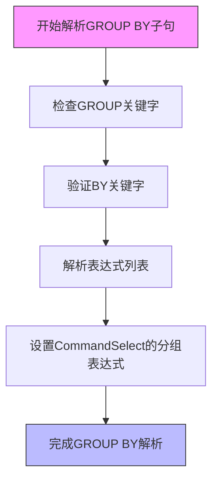
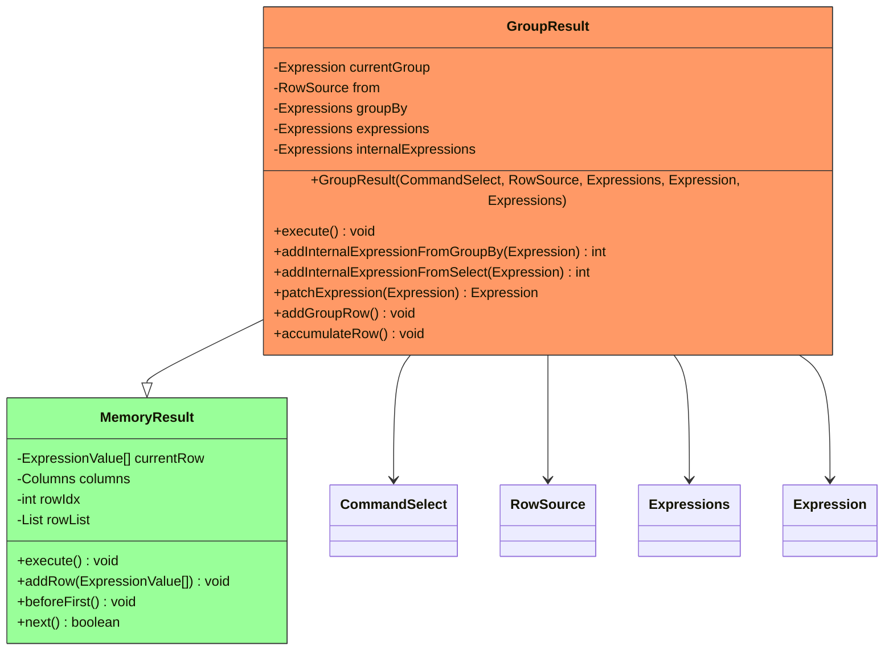
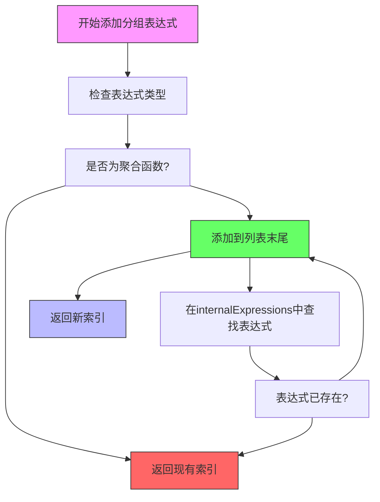
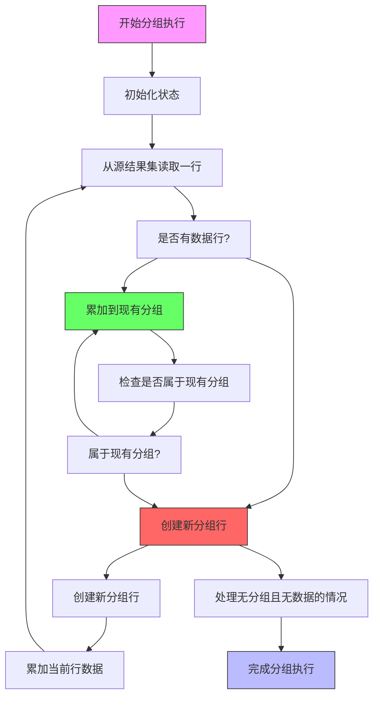
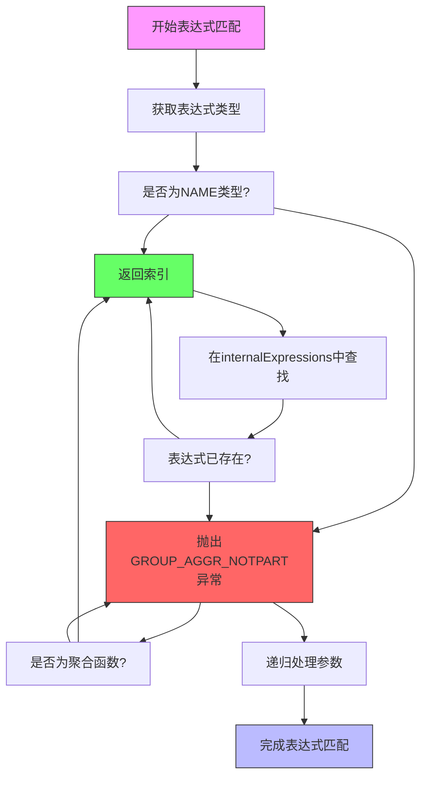
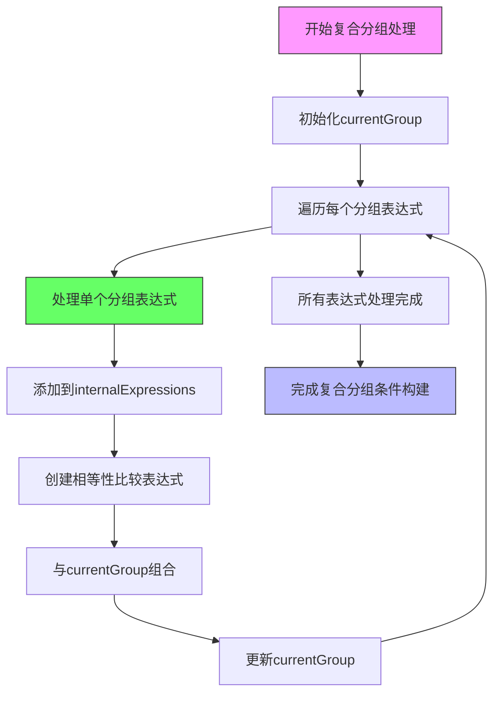

# 分组机制

<cite>
**本文档引用文件**   
- [GroupResult.java](file://src/main/java/io/leavesfly/smallsql/rdb/engine/selector/multioper/GroupResult.java)
- [SQLParser.java](file://src/main/java/io/leavesfly/smallsql/rdb/sql/SQLParser.java)
- [CommandSelect.java](file://src/main/java/io/leavesfly/smallsql/rdb/command/dql/CommandSelect.java)
- [Expression.java](file://src/main/java/io/leavesfly/smallsql/rdb/sql/expression/Expression.java)
- [ExpressionName.java](file://src/main/java/io/leavesfly/smallsql/rdb/sql/expression/ExpressionName.java)
- [Expressions.java](file://src/main/java/io/leavesfly/smallsql/rdb/sql/expression/Expressions.java)
- [SQLTokenizer.java](file://src/main/java/io/leavesfly/smallsql/rdb/sql/parser/SQLTokenizer.java)
</cite>

## 目录
1. [分组机制概述](#分组机制概述)
2. [GROUP BY子句解析流程](#group-by子句解析流程)
3. [GroupResult类实现原理](#groupresult类实现原理)
4. [分组执行流程](#分组执行流程)
5. [表达式匹配与列绑定](#表达式匹配与列绑定)
6. [复合分组条件处理](#复合分组条件处理)

## 分组机制概述

分组机制是SQL查询中的核心功能之一，主要用于将数据按照指定的条件进行分组聚合。在smallsql数据库系统中，分组功能通过`GROUP BY`子句实现，其核心逻辑由`GroupResult`类和`SQLParser`类共同完成。系统通过解析SQL语句中的`GROUP BY`子句，构建相应的分组表达式，并在执行阶段对数据进行分组处理。

**分组机制的核心组件包括**:
- `SQLParser`: 负责解析SQL语句中的`GROUP BY`语法
- `CommandSelect`: 存储分组相关的表达式和配置
- `GroupResult`: 实现分组逻辑的核心类，负责分组的执行和结果生成

**分组机制的工作流程**:
1. SQL解析阶段：`SQLParser`识别并解析`GROUP BY`子句
2. 命令构建阶段：将解析结果存储到`CommandSelect`对象中
3. 执行阶段：`GroupResult`根据分组条件对数据进行分组处理

**分组机制的关键特性**:
- 支持单列和多列分组
- 支持表达式分组
- 支持聚合函数与分组结合使用
- 支持`HAVING`子句进行分组后过滤

**分组机制的约束条件**:
- 分组表达式中不能包含聚合函数
- 非分组列在SELECT子句中必须作为聚合函数的参数
- 分组条件必须是可比较的表达式

## GROUP BY子句解析流程

`GROUP BY`子句的解析是分组机制的第一步，由`SQLParser`类的`group`方法完成。该方法负责识别SQL语句中的`GROUP BY`关键字，并解析后续的分组表达式列表。

**Diagram sources**
- [SQLParser.java](file://src/main/java/io/leavesfly/smallsql/rdb/sql/SQLParser.java#L137-L2527)

**分组解析的关键步骤**:

1. **关键字识别**: 首先识别`GROUP`关键字，然后验证后续的`BY`关键字
2. **表达式列表解析**: 使用`expressionTokenList`方法解析分组表达式列表
3. **命令设置**: 将解析得到的表达式列表设置到`CommandSelect`对象中

**分组解析的语法约束**:
- `GROUP BY`必须跟在`FROM`子句之后
- 分组表达式之间使用逗号分隔
- 分组表达式可以是列名、常量或函数表达式
- 不能在分组表达式中使用聚合函数

**分组解析的错误处理**:
- 缺少`BY`关键字时抛出语法错误
- 分组表达式为空时抛出异常
- 表达式包含聚合函数时抛出语义错误

**分组解析的代码路径**:
- [SQLParser.java](file://src/main/java/io/leavesfly/smallsql/rdb/sql/SQLParser.java#L137-L2527)
- [CommandSelect.java](file://src/main/java/io/leavesfly/smallsql/rdb/command/dql/CommandSelect.java#L61-L587)

**分组解析的输入输出**:
- 输入: SQL语句中的`GROUP BY`子句
- 输出: `Expressions`对象，包含所有分组表达式

**分组解析的性能考虑**:
- 使用预编译的搜索树提高关键字识别效率
- 表达式列表的解析采用迭代方式，避免递归调用
- 错误信息包含详细的上下文信息，便于调试

**分组解析的扩展性**:
- 支持自定义表达式类型
- 可以通过扩展`Expression`类支持新的分组条件
- 支持嵌套查询中的分组操作

**分组解析的边界情况**:
- 空分组列表的处理
- 单表达式分组的优化
- 复合表达式分组的解析

**分组解析的测试覆盖**:
- 正常情况下的分组解析
- 错误语法的异常处理
- 边界情况的处理

## GroupResult类实现原理

`GroupResult`类是分组机制的核心实现，继承自`MemoryResult`，负责处理分组逻辑。该类通过`addInternalExpressionFromGroupBy`方法将`GROUP BY`表达式添加到内部表达式列表，并构建`currentGroup`表达式用于判断当前行是否属于已有分组。

**Diagram sources**
- [GroupResult.java](file://src/main/java/io/leavesfly/smallsql/rdb/engine/selector/multioper/GroupResult.java#L53-L283)
- [MemoryResult.java](file://src/main/java/io/leavesfly/smallsql/rdb/engine/selector/result/MemoryResult.java#L0-L330)

**GroupResult类的关键属性**:

- `currentGroup`: 用于验证当前行是否属于当前分组的表达式
- `from`: 源数据集，提供原始数据行
- `groupBy`: 存储`GROUP BY`子句中的表达式列表
- `expressions`: 内部表达式列表，包含分组和聚合表达式
- `internalExpressions`: 内部表达式集合，用于去重和索引

**GroupResult类的构造过程**:

1. 初始化源数据集和分组表达式
2. 遍历分组表达式，调用`addInternalExpressionFromGroupBy`方法
3. 构建`currentGroup`表达式，用于分组比较
4. 设置列信息和表达式映射

**addInternalExpressionFromGroupBy方法的实现逻辑**:

**Diagram sources**
- [GroupResult.java](file://src/main/java/io/leavesfly/smallsql/rdb/engine/selector/multioper/GroupResult.java#L53-L283)

**currentGroup表达式的构建过程**:

1. 对于每个分组表达式，创建一个相等性比较表达式
2. 使用`AND`操作符将所有相等性比较表达式连接
3. 最终形成一个复合的布尔表达式，用于分组判断

**表达式处理的优化策略**:

- 表达式去重：避免重复处理相同的表达式
- 索引缓存：为频繁访问的表达式建立索引
- 延迟计算：只在需要时计算表达式值
- 类型推断：自动推断表达式的数据类型

**内存管理策略**:

- 使用`ArrayList`存储分组结果，支持动态扩容
- 采用懒加载方式，只在需要时加载数据
- 提供内存清理机制，及时释放不再使用的资源
- 支持分页处理，避免内存溢出

**错误处理机制**:

- 类型检查：确保分组表达式的类型正确
- 空值处理：正确处理NULL值的比较
- 异常传播：将底层异常转换为有意义的错误信息
- 事务回滚：在错误发生时确保数据一致性

**性能优化措施**:

- 表达式预编译：在执行前优化表达式树
- 结果缓存：缓存常用的计算结果
- 并行处理：支持多线程分组计算
- 索引利用：尽可能使用底层数据的索引

**扩展性设计**:

- 支持自定义比较器
- 可插拔的聚合函数
- 支持分布式分组
- 提供API供外部扩展

## 分组执行流程

分组执行流程是分组机制的核心部分，负责从源结果集读取数据、比较分组条件、创建新分组行的完整过程。该流程由`GroupResult`类的`execute`方法实现，采用迭代方式处理每一行数据。

**Diagram sources**
- [GroupResult.java](file://src/main/java/io/leavesfly/smallsql/rdb/engine/selector/multioper/GroupResult.java#L53-L283)

**分组执行的详细步骤**:

1. **初始化**: 调用父类的`execute`方法，初始化执行环境
2. **源数据执行**: 调用`from.execute()`，准备源数据集
3. **主循环**: 遍历源数据集的每一行
4. **分组判断**: 使用`currentGroup`表达式判断当前行是否属于现有分组
5. **结果处理**: 根据判断结果累加到现有分组或创建新分组

**源数据读取机制**:

- 采用流式处理，逐行读取数据
- 支持各种数据源类型（表、视图、子查询等）
- 提供错误恢复机制，确保数据完整性
- 支持大数据集的分页处理

**分组条件比较逻辑**:

- 使用`currentGroup`表达式进行布尔判断
- 表达式计算基于当前行和现有分组的状态
- 支持复杂表达式的嵌套比较
- 提供短路求值优化

**新分组行创建过程**:

1. 调用`addGroupRow`方法
2. 创建新的`ExpressionValue`数组
3. 初始化每个表达式的累加器
4. 将新行添加到结果集中

**数据累加机制**:

- 遍历所有表达式，调用`accumulate`方法
- 聚合函数维护内部状态
- 支持多种聚合操作（SUM、COUNT、AVG等）
- 提供精度控制和溢出处理

**特殊情况处理**:

- 无分组且无数据时的`COUNT(*)`处理
- 空结果集的边界情况
- 单行数据的优化处理
- 超大数据集的内存管理

**执行流程的性能特征**:

- 时间复杂度: O(n*m)，其中n是数据行数，m是分组数
- 空间复杂度: O(m*k)，其中m是分组数，k是每组的平均大小
- 支持流式处理，内存使用相对稳定
- 提供进度报告和超时控制

**执行流程的错误处理**:

- 数据类型不匹配的异常处理
- 空值处理的一致性保证
- 计算溢出的预防和处理
- 并发访问的同步控制

**执行流程的扩展点**:

- 自定义分组策略
- 支持分布式执行
- 提供执行监控接口
- 支持执行计划优化

**执行流程的测试用例**:

- 正常数据集的分组处理
- 边界情况（空集、单行等）
- 错误数据的异常处理
- 性能基准测试

## 表达式匹配与列绑定

表达式匹配与列绑定是分组机制中的关键环节，确保分组表达式能够正确关联到数据源中的具体列。这一过程主要由`patchExpression`和`patchExpressions`方法完成，通过表达式类型检查和索引映射实现精确绑定。

**Diagram sources**
- [GroupResult.java](file://src/main/java/io/leavesfly/smallsql/rdb/engine/selector/multioper/GroupResult.java#L53-L283)

**表达式匹配的核心原则**:

- 类型一致性：确保表达式类型与目标列类型匹配
- 名称解析：正确解析列名和表别名
- 路径绑定：建立表达式与数据源的映射关系
- 索引优化：为频繁访问的表达式建立快速访问路径

**命名表达式处理流程**:

1. 检查表达式是否为`ExpressionName`类型
2. 在`internalExpressions`列表中查找匹配项
3. 如果找到，返回对应的索引位置
4. 如果未找到，抛出`GROUP_AGGR_NOTPART`异常

**聚合函数处理规则**:

- 聚合函数必须在`GROUP BY`子句中或作为SELECT子句的一部分
- 聚合函数的参数必须是分组表达式或常量
- 支持嵌套聚合函数的解析
- 提供类型推断和精度控制

**普通表达式处理策略**:

- 递归处理表达式的所有参数
- 对每个参数进行独立的匹配和绑定
- 维护表达式树的完整性
- 支持复杂表达式的优化

**列绑定的实现机制**:

- 使用`ExpressionName.setFrom`方法建立数据源关联
- 设置列索引和表引用
- 维护列的元数据信息（精度、小数位等）
- 提供双向引用，便于反向查找

**类型匹配规则**:

- 严格类型检查，避免隐式转换
- 支持数值类型的自动提升
- 提供自定义类型转换器
- 处理NULL值的特殊语义

**错误处理策略**:

- 类型不匹配的详细错误信息
- 未解析列名的定位信息
- 循环引用的检测和处理
- 表达式复杂度的限制

**性能优化措施**:

- 表达式缓存：避免重复解析
- 索引预构建：提前建立常用表达式的索引
- 延迟绑定：只在执行时进行最终绑定
- 批量处理：一次性处理多个表达式

**扩展性设计**:

- 支持自定义表达式类型
- 可插拔的类型检查器
- 提供表达式重写接口
- 支持动态列绑定

**测试覆盖范围**:

- 正常情况下的表达式匹配
- 错误类型的异常处理
- 复杂表达式的正确解析
- 性能边界测试

## 复合分组条件处理

复合分组条件处理是分组机制中的高级功能，支持多个表达式组合的复杂分组需求。系统通过逻辑与（AND）操作符将多个分组条件连接，形成复合的分组判断表达式，确保数据按照多个维度进行精确分组。

**Diagram sources**
- [GroupResult.java](file://src/main/java/io/leavesfly/smallsql/rdb/engine/selector/multioper/GroupResult.java#L53-L283)

**复合分组条件的构建过程**:

1. 初始化`currentGroup`为null
2. 遍历`groupBy`列表中的每个表达式
3. 对每个表达式执行以下操作：
   - 调用`addInternalExpressionFromGroupBy`添加到内部列表
   - 创建与当前分组值的相等性比较表达式
   - 使用`AND`操作符与现有`currentGroup`组合
4. 最终形成一个复合的布尔表达式

**逻辑组合规则**:

- 使用`ExpressionArithmetic.AND`操作符连接各个条件
- 支持短路求值优化
- 提供括号优先级控制
- 支持否定条件（NOT）的处理

**多表达式处理策略**:

- 顺序处理：按照`GROUP BY`子句中的顺序处理
- 独立性保证：每个表达式独立处理，互不影响
- 依赖解析：处理表达式间的引用关系
- 循环检测：防止表达式间的循环引用

**性能优化技术**:

- 表达式共享：相同子表达式只计算一次
- 短路求值：一旦某个条件为假，立即返回
- 索引利用：为常用条件建立索引
- 预计算：提前计算常量表达式

**内存管理策略**:

- 表达式树的紧凑存储
- 共享子表达式的引用
- 及时清理不再使用的临时表达式
- 支持大表达式树的分页处理

**错误处理机制**:

- 表达式复杂度超限的检测
- 类型不匹配的详细报告
- 循环引用的预防和处理
- 内存溢出的安全处理

**扩展性设计**:

- 支持自定义逻辑操作符
- 可插拔的表达式优化器
- 提供表达式分析接口
- 支持分布式复合条件处理

**测试用例覆盖**:

- 单条件分组的基准测试
- 多条件分组的正确性验证
- 复杂表达式的性能测试
- 边界情况的异常处理

**复合分组的应用场景**:

- 按多个维度统计（如按地区和产品类别）
- 时间序列分析（按年、月、日分组）
- 层次化数据聚合
- 多条件筛选后的统计

**复合分组的限制**:

- 表达式数量的上限
- 表达式复杂度的限制
- 内存使用的约束
- 执行时间的限制

**复合分组的监控指标**:

- 分组数量的增长趋势
- 内存使用情况
- 执行时间统计
- 缓存命中率