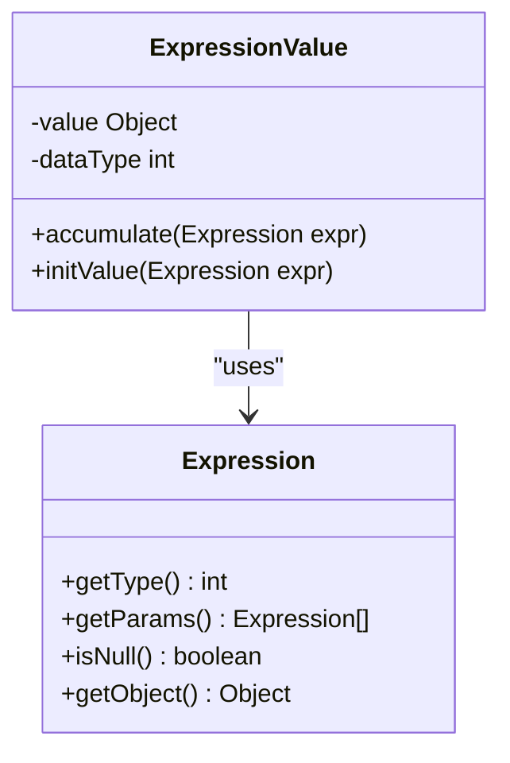
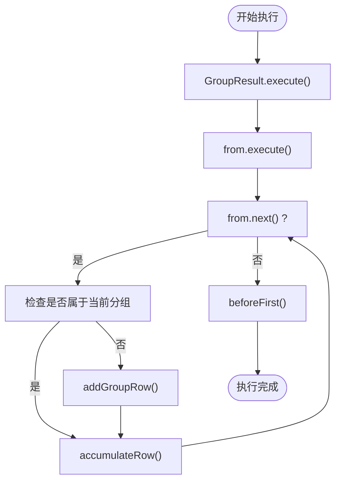
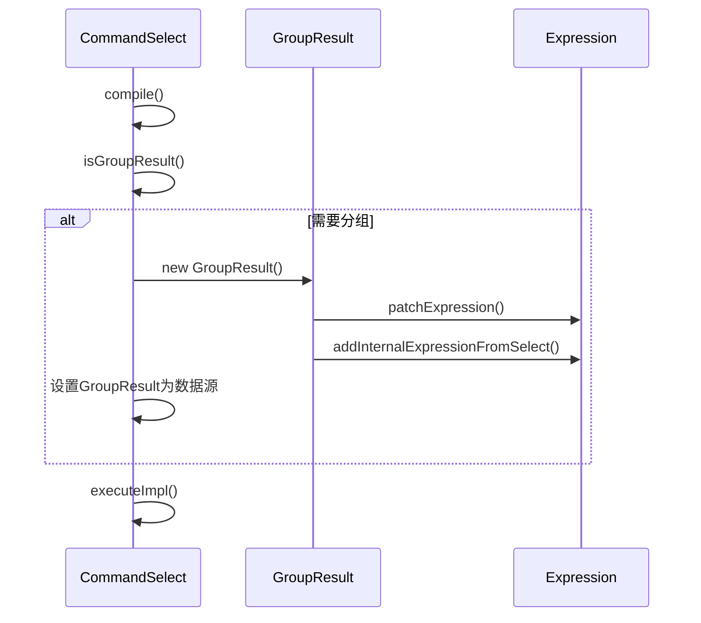

# 聚合与分组

<cite>
**本文档中引用的文件**  
- [CommandSelect.java](file://src/main/java/io/leavesfly/smallsql/rdb/command/dql/CommandSelect.java)
- [GroupResult.java](file://src/main/java/io/leavesfly/smallsql/rdb/engine/selector/multioper/GroupResult.java)
- [ExpressionValue.java](file://src/main/java/io/leavesfly/smallsql/rdb/sql/expression/ExpressionValue.java)
- [TestGroupBy.java](file://src/test/java/io/leavesfly/smallsql/junit/sql/dql/TestGroupBy.java)
</cite>

## 目录
1. [聚合与分组概述](#聚合与分组概述)
2. [GROUP BY 与 HAVING 子句详解](#group-by-与-having-子句详解)
3. [聚合函数实现原理](#聚合函数实现原理)
4. [分组执行流程分析](#分组执行流程分析)
5. [复杂查询示例](#复杂查询示例)
6. [CommandSelect 分组逻辑解析](#commandselect-分组逻辑解析)
7. [测试用例分析](#测试用例分析)

## 聚合与分组概述

聚合与分组是SQL查询中的核心功能，用于对数据集进行统计分析。通过GROUP BY子句可以将结果集按一个或多个列进行分组，然后使用COUNT、SUM、AVG、MAX、MIN等聚合函数对每个分组进行统计计算。HAVING子句用于过滤分组后的结果，与WHERE子句不同，WHERE是在分组前过滤行，而HAVING是在分组后过滤组。

**Section sources**
- [CommandSelect.java](file://src/main/java/io/leavesfly/smallsql/rdb/command/dql/CommandSelect.java#L61-L100)

## GROUP BY 与 HAVING 子句详解

GROUP BY子句用于将结果集按指定列进行分组。当查询中包含GROUP BY时，SELECT列表中的非聚合列必须出现在GROUP BY子句中。HAVING子句用于对分组后的结果进行筛选，它作用于分组后的聚合结果，而WHERE子句作用于分组前的原始数据。

例如，查询每个部门员工数量大于5的部门：`SELECT department, COUNT(*) FROM employees GROUP BY department HAVING COUNT(*) > 5`。在这个查询中，首先按department列进行分组，然后计算每个分组的员工数量，最后使用HAVING子句筛选出员工数量大于5的部门。

**Section sources**
- [CommandSelect.java](file://src/main/java/io/leavesfly/smallsql/rdb/command/dql/CommandSelect.java#L200-L250)

## 聚合函数实现原理

聚合函数的实现基于ExpressionValue类中的accumulate方法。该方法根据不同的聚合类型（COUNT、SUM、MAX、MIN等）对表达式值进行累积计算。COUNT函数统计非空值的数量，SUM函数对数值进行累加，MAX和MIN函数分别找出最大值和最小值。



**Diagram sources**
- [ExpressionValue.java](file://src/main/java/io/leavesfly/smallsql/rdb/sql/expression/ExpressionValue.java#L115-L314)

**Section sources**
- [ExpressionValue.java](file://src/main/java/io/leavesfly/smallsql/rdb/sql/expression/ExpressionValue.java#L115-L314)

## 分组执行流程分析

分组执行流程由GroupResult类实现。当查询包含GROUP BY、HAVING或聚合函数时，CommandSelect会创建GroupResult对象。GroupResult继承自MemoryResult，它将分组结果存储在内存中。

执行流程如下：首先执行底层数据源的查询，然后逐行处理结果。对于每一行，检查是否属于当前分组，如果属于则累积到当前分组，否则创建新分组并累积。accumulateRow方法负责将当前行的值累积到各个聚合函数中。



**Diagram sources**
- [GroupResult.java](file://src/main/java/io/leavesfly/smallsql/rdb/engine/selector/multioper/GroupResult.java#L53-L283)

**Section sources**
- [GroupResult.java](file://src/main/java/io/leavesfly/smallsql/rdb/engine/selector/multioper/GroupResult.java#L53-L283)

## 复杂查询示例

以下是一些包含聚合函数和分组的复杂查询示例：

```sql
-- 按部门分组，计算每个部门的员工数量
SELECT department, COUNT(*) FROM employees GROUP BY department

-- 按部门和职位分组，计算每个组合的平均工资
SELECT department, position, AVG(salary) FROM employees GROUP BY department, position

-- 按部门分组，筛选员工数量大于5的部门
SELECT department, COUNT(*) FROM employees GROUP BY department HAVING COUNT(*) > 5

-- 使用表达式进行分组
SELECT SUM(salary), name+'a' FROM employees GROUP BY name+'a' ORDER BY name+'a'
```

这些查询展示了如何使用GROUP BY进行多列分组、使用HAVING进行分组后筛选，以及在分组中使用表达式。

**Section sources**
- [TestGroupBy.java](file://src/test/java/io/leavesfly/smallsql/junit/sql/dql/TestGroupBy.java#L100-L200)

## CommandSelect 分组逻辑解析

CommandSelect类中的isGroupResult()方法用于判断查询是否涉及分组。该方法检查三个条件：是否存在GROUP BY子句、是否存在HAVING子句、是否包含聚合函数。如果任一条件为真，则返回true，表示需要进行分组处理。

在compile方法中，如果isGroupResult()返回true，则创建GroupResult对象并将其设置为数据源。同时，如果存在HAVING子句，还会创建额外的Where对象进行过滤。这种设计确保了分组逻辑在查询编译阶段就被正确处理。



**Diagram sources**
- [CommandSelect.java](file://src/main/java/io/leavesfly/smallsql/rdb/command/dql/CommandSelect.java#L61-L587)

**Section sources**
- [CommandSelect.java](file://src/main/java/io/leavesfly/smallsql/rdb/command/dql/CommandSelect.java#L61-L587)

## 测试用例分析

测试用例TestGroupBy验证了各种分组查询的正确性。测试涵盖了COUNT、SUM、MAX、MIN等聚合函数，以及GROUP BY、HAVING、ORDER BY等子句的组合使用。测试用例还验证了NULL值处理、表达式分组、视图分组等边界情况。

测试用例的设计确保了分组功能的正确性和稳定性。通过多个循环执行相同的查询，验证了查询的可重复性和结果的一致性。测试还验证了元数据的正确性，确保分组查询的列名、别名等信息正确返回。

**Section sources**
- [TestGroupBy.java](file://src/test/java/io/leavesfly/smallsql/junit/sql/dql/TestGroupBy.java#L0-L381)