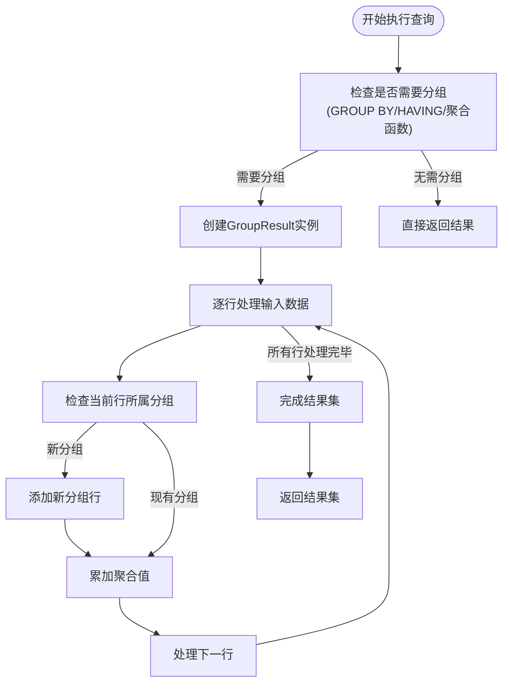
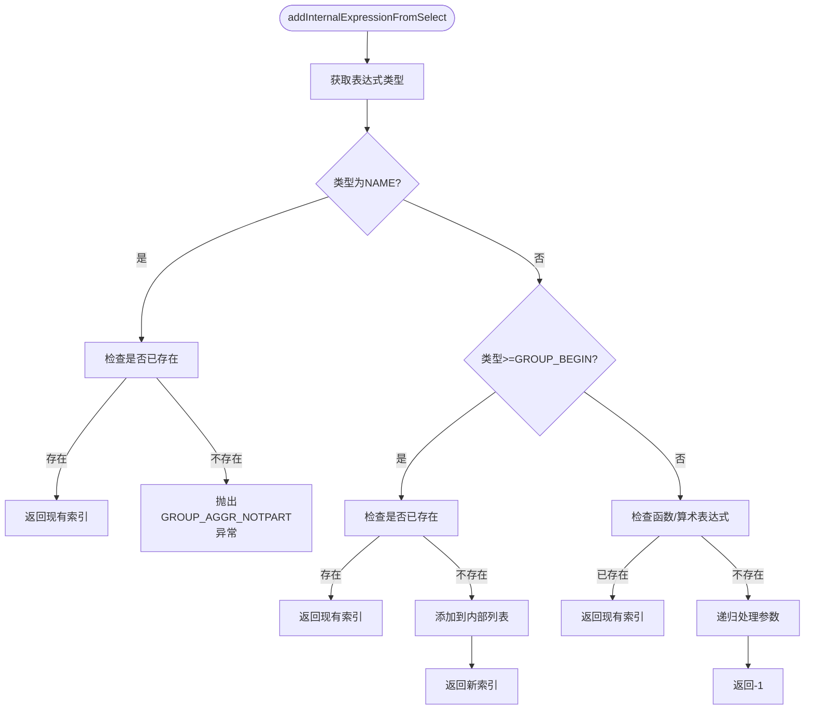
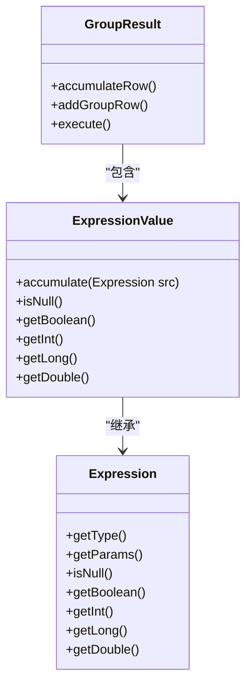
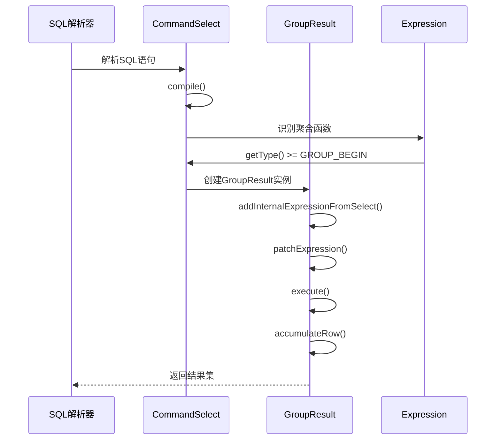
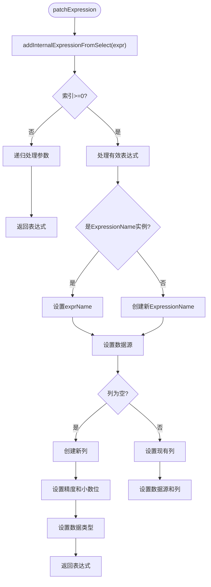

# 聚合函数支持

<cite>
**本文档引用的文件**  
- [GroupResult.java](file://src/main/java/io/leavesfly/smallsql/rdb/engine/selector/multioper/GroupResult.java)
- [Expression.java](file://src/main/java/io/leavesfly/smallsql/rdb/sql/expression/Expression.java)
- [CommandSelect.java](file://src/main/java/io/leavesfly/smallsql/rdb/command/dql/CommandSelect.java)
- [ExpressionName.java](file://src/main/java/io/leavesfly/smallsql/rdb/sql/expression/ExpressionName.java)
- [Expressions.java](file://src/main/java/io/leavesfly/smallsql/rdb/sql/expression/Expressions.java)
</cite>

## 目录
1. [简介](#简介)
2. [聚合函数处理机制](#聚合函数处理机制)
3. [GroupResult类核心方法分析](#groupresult类核心方法分析)
4. [Expression类型与GROUP_BEGIN常量关系](#expression类型与group_begin常量关系)
5. [聚合函数在SQL子句中的使用示例](#聚合函数在sql子句中的使用示例)
6. [patchExpression方法解析](#patchexpression方法解析)

## 简介
本文档详细说明了SmallSQL数据库系统中COUNT、SUM、AVG、MAX、MIN等聚合函数在分组查询中的实现机制。重点分析了GroupResult类如何处理聚合函数表达式，以及Expression类的类型系统如何支持聚合操作。文档还提供了聚合函数在SELECT、HAVING和ORDER BY子句中的具体使用示例。

## 聚合函数处理机制
SmallSQL通过GroupResult类实现分组查询和聚合函数计算。当SQL查询包含GROUP BY子句、HAVING条件或聚合函数时，系统会创建GroupResult实例来处理结果集的分组和聚合计算。

聚合函数的处理流程如下：
1. 在查询编译阶段识别聚合函数
2. 构建内部表达式列表
3. 对每个输入行进行分组判断
4. 累加计算聚合值
5. 生成最终的分组结果



**图表来源**
- [GroupResult.java](file://src/main/java/io/leavesfly/smallsql/rdb/engine/selector/multioper/GroupResult.java#L53-L283)
- [CommandSelect.java](file://src/main/java/io/leavesfly/smallsql/rdb/command/dql/CommandSelect.java#L50-L100)

**章节来源**
- [GroupResult.java](file://src/main/java/io/leavesfly/smallsql/rdb/engine/selector/multioper/GroupResult.java#L53-L283)
- [CommandSelect.java](file://src/main/java/io/leavesfly/smallsql/rdb/command/dql/CommandSelect.java#L50-L100)

## GroupResult类核心方法分析

### addInternalExpressionFromSelect方法
该方法负责处理来自SELECT子句的聚合函数表达式，将其添加到内部表达式列表中。



**图表来源**
- [GroupResult.java](file://src/main/java/io/leavesfly/smallsql/rdb/engine/selector/multioper/GroupResult.java#L100-L130)

**章节来源**
- [GroupResult.java](file://src/main/java/io/leavesfly/smallsql/rdb/engine/selector/multioper/GroupResult.java#L100-L130)

### accumulateRow方法
该方法对当前行的每个表达式进行累加计算，是聚合函数计算的核心。



**图表来源**
- [GroupResult.java](file://src/main/java/io/leavesfly/smallsql/rdb/engine/selector/multioper/GroupResult.java#L270-L283)
- [ExpressionValue.java](file://src/main/java/io/leavesfly/smallsql/rdb/sql/expression/ExpressionValue.java)

**章节来源**
- [GroupResult.java](file://src/main/java/io/leavesfly/smallsql/rdb/engine/selector/multioper/GroupResult.java#L270-L283)

## Expression类型与GROUP_BEGIN常量关系

### Expression类型系统
Expression类定义了常量来区分不同类型的表达式，其中聚合函数相关的常量如下：

```mermaid
classDiagram
class Expression {
+VALUE = 1
+NAME = 2
+FUNCTION = 3
+GROUP_BY = 11
+COUNT = 12
+SUM = 13
+FIRST = 14
+LAST = 15
+MIN = 16
+MAX = 17
+GROUP_BEGIN = GROUP_BY
+getType()
}
note right of Expression
GROUP_BEGIN常量值等于GROUP_BY(11)
所有聚合函数类型值均>=GROUP_BEGIN
用于判断是否为聚合函数
end note
```

**图表来源**
- [Expression.java](file://src/main/java/io/leavesfly/smallsql/rdb/sql/expression/Expression.java#L200-L246)

**章节来源**
- [Expression.java](file://src/main/java/io/leavesfly/smallsql/rdb/sql/expression/Expression.java#L200-L246)

### 类型判断逻辑
系统通过比较getType()返回值与GROUP_BEGIN常量来判断是否为聚合函数：

- `type >= Expression.GROUP_BEGIN`：表示是聚合函数或分组相关表达式
- `type == Expression.NAME`：表示是普通列名
- `type < Expression.GROUP_BEGIN`：表示是非聚合表达式

这种设计使得系统可以高效地识别和处理聚合函数。

## 聚合函数在SQL子句中的使用示例

### SELECT子句中的聚合函数
```sql
SELECT COUNT(*), SUM(salary), AVG(age), MAX(income), MIN(expense)
FROM employees 
GROUP BY department;
```

### HAVING子句中的聚合函数
```sql
SELECT department, AVG(salary) 
FROM employees 
GROUP BY department 
HAVING AVG(salary) > 50000;
```

### ORDER BY子句中的聚合函数
```sql
SELECT department, COUNT(*) as emp_count 
FROM employees 
GROUP BY department 
ORDER BY COUNT(*) DESC;
```



**图表来源**
- [CommandSelect.java](file://src/main/java/io/leavesfly/smallsql/rdb/command/dql/CommandSelect.java#L200-L300)
- [GroupResult.java](file://src/main/java/io/leavesfly/smallsql/rdb/engine/selector/multioper/GroupResult.java#L150-L200)

**章节来源**
- [CommandSelect.java](file://src/main/java/io/leavesfly/smallsql/rdb/command/dql/CommandSelect.java#L200-L300)

## patchExpression方法解析
patchExpression方法负责将外部表达式映射到内部数据源，是连接SQL表达式与实际数据的关键。

### 方法执行流程


### 不同聚合函数的处理差异
| 聚合函数 | 精度来源 | 小数位来源 | 数据类型 |
|---------|--------|---------|--------|
| MAX | 参数表达式 | 参数表达式 | 参数表达式 |
| MIN | 参数表达式 | 参数表达式 | 参数表达式 |
| SUM | 参数表达式 | 参数表达式 | 参数表达式 |
| FIRST | 参数表达式 | 参数表达式 | 参数表达式 |
| LAST | 参数表达式 | 参数表达式 | 参数表达式 |
| COUNT | 原始表达式 | 原始表达式 | INT |

**图表来源**
- [GroupResult.java](file://src/main/java/io/leavesfly/smallsql/rdb/engine/selector/multioper/GroupResult.java#L191-L232)

**章节来源**
- [GroupResult.java](file://src/main/java/io/leavesfly/smallsql/rdb/engine/selector/multioper/GroupResult.java#L191-L232)