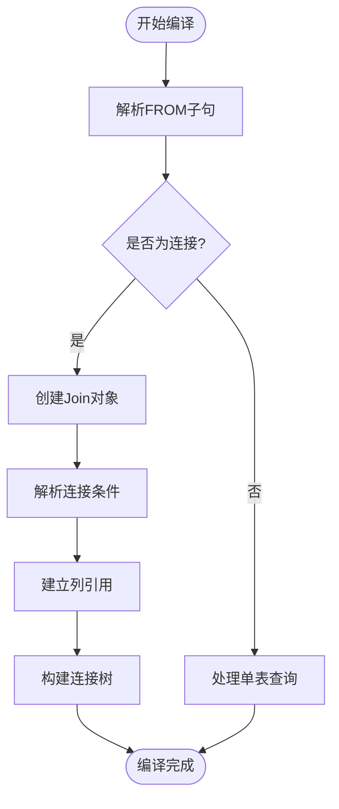
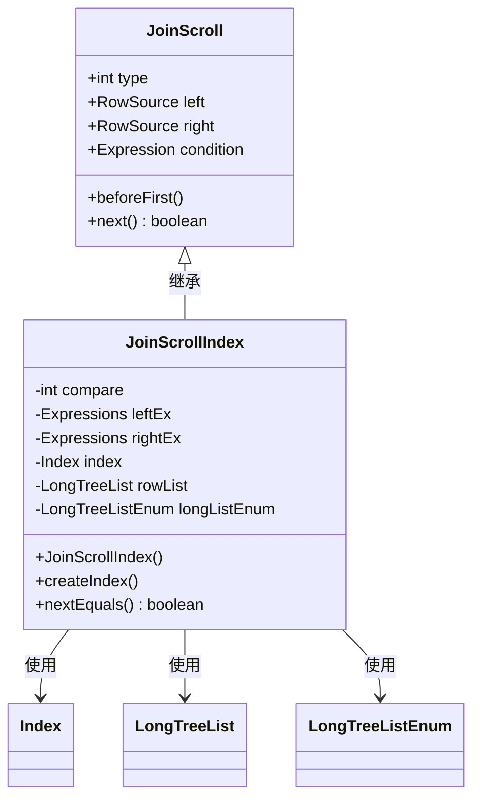
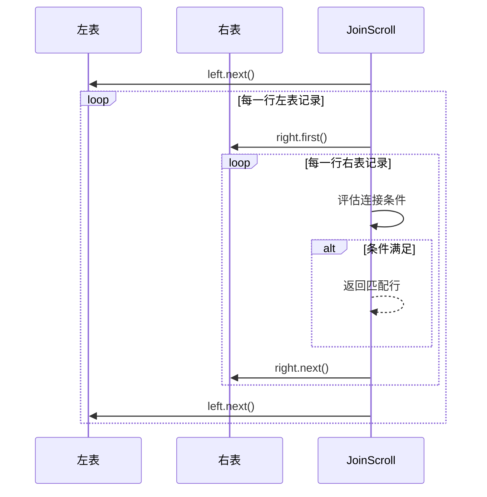

# 连接执行机制

<cite>
**本文档中引用的文件**  
- [CommandSelect.java](file://src/main/java/io/leavesfly/smallsql/rdb/command/dql/CommandSelect.java)
- [Join.java](file://src/main/java/io/leavesfly/smallsql/rdb/engine/selector/multioper/Join.java)
- [RowSource.java](file://src/main/java/io/leavesfly/smallsql/rdb/engine/RowSource.java)
- [Index.java](file://src/main/java/io/leavesfly/smallsql/rdb/engine/Index.java)
</cite>

## 目录
1. [连接执行流程概述](#连接执行流程概述)  
2. [SQL解析与Join对象构建](#sql解析与join对象构建)  
3. [Join执行策略选择机制](#join执行策略选择机制)  
4. [索引优化执行：JoinScrollIndex](#索引优化执行joinscrollindex)  
5. [回退执行策略：JoinScroll](#回退执行策略joinscroll)  
6. [性能对比与适用场景](#性能对比与适用场景)  
7. [行迭代与结果集生成](#行迭代与结果集生成)

## 连接执行流程概述

SmallSQL中的连接操作执行流程始于`CommandSelect.compile()`方法，该方法负责将SQL语句解析后的连接结构转换为`Join`对象。随后在`Join.execute()`方法中，系统尝试通过`createJoinScrollIndex()`创建基于索引的优化执行策略。若索引优化不可行，则回退至`JoinScroll`实现的嵌套循环算法。整个流程体现了从SQL语法解析到物理执行计划生成的完整过程，支持多种连接类型（如INNER JOIN、LEFT JOIN等）和复杂的连接条件。

**Section sources**  
- [CommandSelect.java](file://src/main/java/io/leavesfly/smallsql/rdb/command/dql/CommandSelect.java#L0-L587)
- [Join.java](file://src/main/java/io/leavesfly/smallsql/rdb/engine/selector/multioper/Join.java#L0-L463)

## SQL解析与Join对象构建

`CommandSelect.compile()`方法是连接操作的入口点。当SQL语句包含FROM子句时，该方法会初始化数据源列表（`DataSources`），并遍历所有表或视图条目进行编译。对于连接操作，`from`字段被设置为`Join`实例，其左右子节点分别代表连接的两个数据源。编译过程中，系统会解析连接条件（`ON`子句），并通过`compileLinkExpression()`建立表达式与表列之间的关联。最终，`Join`对象被构建成一个树形结构，每个节点代表一个连接操作，支持级联连接（如A JOIN B JOIN C）。



**Diagram sources**  
- [CommandSelect.java](file://src/main/java/io/leavesfly/smallsql/rdb/command/dql/CommandSelect.java#L0-L587)

**Section sources**  
- [CommandSelect.java](file://src/main/java/io/leavesfly/smallsql/rdb/command/dql/CommandSelect.java#L0-L587)

## Join执行策略选择机制

`Join.execute()`方法负责选择最优的执行策略。首先执行左右子节点的`execute()`方法，确保数据源已准备好。随后调用`createJoinScrollIndex()`尝试创建基于索引的执行器。若索引优化成功，`scroll`字段被设置为`JoinScrollIndex`实例；否则，系统回退至`JoinScroll`实现的嵌套循环算法。该机制优先考虑等值连接（`EQUALS`操作）的索引优化，并支持复合条件（通过`AND`连接的多个等值条件）。目前仅对`INNER_JOIN`类型实现索引优化，其他连接类型（如`LEFT_JOIN`、`FULL_JOIN`）直接使用嵌套循环。

```mermaid
flowchart TD
ExecuteJoin([Join.execute()]) --> ExecuteLeft["执行左子节点"]
ExecuteLeft --> ExecuteRight["执行右子节点"]
ExecuteRight --> TryIndex["尝试createJoinScrollIndex()"]
TryIndex --> IndexPossible{"索引优化可行?"}
IndexPossible --> |是| UseIndex["使用JoinScrollIndex"]
IndexPossible --> |否| UseNestedLoop["使用JoinScroll"]
UseIndex --> SetScroll["设置scroll字段"]
UseNestedLoop --> SetScroll
SetScroll --> End([执行器准备就绪])
```

**Diagram sources**  
- [Join.java](file://src/main/java/io/leavesfly/smallsql/rdb/engine/selector/multioper/Join.java#L0-L463)

**Section sources**  
- [Join.java](file://src/main/java/io/leavesfly/smallsql/rdb/engine/selector/multioper/Join.java#L0-L463)

## 索引优化执行：JoinScrollIndex

`JoinScrollIndex`是`JoinScroll`的子类，实现了基于索引的连接优化。其核心思想是为右表构建内存索引，将连接操作从O(N×M)降为O(N×logM)。索引构建过程在`createIndex()`中完成：遍历右表所有行，将其连接键的值和行位置（`rowPosition`）存入`Index`结构。执行时，对于左表的每一行，通过`index.findRows()`快速定位匹配的右表行。若找到单个匹配行，则直接定位；若找到多个匹配行，则使用`LongTreeListEnum`进行迭代。该策略显著提升了等值连接的性能，尤其适用于大表连接小表的场景。



**Diagram sources**  
- [Join.java](file://src/main/java/io/leavesfly/smallsql/rdb/engine/selector/multioper/Join.java#L0-L463)
- [Index.java](file://src/main/java/io/leavesfly/smallsql/rdb/engine/Index.java#L0-L553)

**Section sources**  
- [Join.java](file://src/main/java/io/leavesfly/smallsql/rdb/engine/selector/multioper/Join.java#L0-L463)

## 回退执行策略：JoinScroll

当无法使用索引优化时，系统回退至`JoinScroll`实现的嵌套循环算法。该算法采用双重循环结构：外层遍历左表，内层遍历右表。对于每一对行组合，评估连接条件（`condition.getBoolean()`），若满足则返回该行。`JoinScroll`还处理了`CROSS_JOIN`（笛卡尔积）和`OUTER_JOIN`（外连接）的特殊情况。在外连接中，若右表无匹配行，则调用`right.nullRow()`生成空行。该算法的时间复杂度为O(N×M)，适用于小表连接或非等值连接场景。



**Diagram sources**  
- [Join.java](file://src/main/java/io/leavesfly/smallsql/rdb/engine/selector/multioper/Join.java#L0-L463)

**Section sources**  
- [Join.java](file://src/main/java/io/leavesfly/smallsql/rdb/engine/selector/multioper/Join.java#L0-L463)

## 性能对比与适用场景

| 执行策略 | 时间复杂度 | 空间复杂度 | 适用场景 | 限制条件 |
|--------|---------|---------|--------|--------|
| JoinScrollIndex | O(N×logM) | O(M) | 大表连接小表的等值连接 | 仅支持INNER_JOIN和等值条件 |
| JoinScroll | O(N×M) | O(1) | 小表连接、非等值连接、外连接 | 无特殊限制 |

`JoinScrollIndex`通过牺牲O(M)的内存空间，将时间复杂度从O(N×M)降低到O(N×logM)，在右表较大时性能提升显著。而`JoinScroll`作为通用算法，适用于所有连接类型，但性能随表大小呈平方级增长。因此，系统优先尝试索引优化，仅在不满足条件时回退至嵌套循环，实现了性能与通用性的平衡。

**Section sources**  
- [Join.java](file://src/main/java/io/leavesfly/smallsql/rdb/engine/selector/multioper/Join.java#L0-L463)

## 行迭代与结果集生成

连接操作的行迭代通过`next()`方法实现。`Join`类维护一个`row`计数器和`isAfterLast`标志，确保结果集的正确遍历。每次调用`next()`时，委托给`scroll`执行器，并在到达末尾时调用`noRow()`清理状态。结果集生成遵循以下流程：首先执行`CommandSelect.executeImpl()`，触发`Join.execute()`创建执行器；然后通过`SsResultSet`包装`Join`对象，提供标准的JDBC结果集接口。用户通过`ResultSet.next()`逐行获取结果，每行数据由左右表的当前行合并而成。

```mermaid
flowchart LR
A[CommandSelect.executeImpl] --> B[Join.execute]
B --> C{createJoinScrollIndex?}
C --> |成功| D[JoinScrollIndex]
C --> |失败| E[JoinScroll]
D --> F[SsResultSet]
E --> F
F --> G[ResultSet.next()]
G --> H[返回合并行]
```

**Diagram sources**  
- [CommandSelect.java](file://src/main/java/io/leavesfly/smallsql/rdb/command/dql/CommandSelect.java#L0-L587)
- [Join.java](file://src/main/java/io/leavesfly/smallsql/rdb/engine/selector/multioper/Join.java#L0-L463)

**Section sources**  
- [CommandSelect.java](file://src/main/java/io/leavesfly/smallsql/rdb/command/dql/CommandSelect.java#L0-L587)
- [Join.java](file://src/main/java/io/leavesfly/smallsql/rdb/engine/selector/multioper/Join.java#L0-L463)