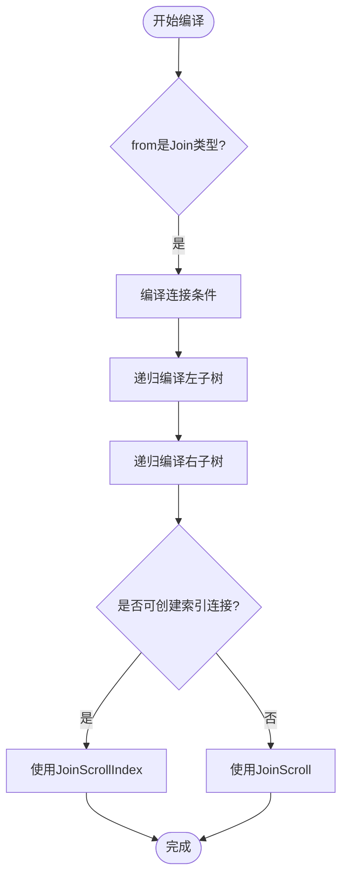

# 连接操作

<cite>
**本文档引用的文件**   
- [CommandSelect.java](file://src/main/java/io/leavesfly/smallsql/rdb/command/dql/CommandSelect.java)
- [Join.java](file://src/main/java/io/leavesfly/smallsql/rdb/engine/selector/multioper/Join.java)
- [SQLParser.java](file://src/main/java/io/leavesfly/smallsql/rdb/sql/SQLParser.java)
- [TestJoins.java](file://src/test/java/io/leavesfly/smallsql/junit/sql/dql/TestJoins.java)
</cite>

## 目录
1. [连接语法结构](#连接语法结构)
2. [连接条件与关联关系](#连接条件与关联关系)
3. [内连接与外连接示例](#内连接与外连接示例)
4. [连接执行计划构建](#连接执行计划构建)
5. [连接操作性能影响与最佳实践](#连接操作性能影响与最佳实践)

## 连接语法结构

SmallSQL支持多种连接类型，包括内连接（INNER JOIN）、左外连接（LEFT OUTER JOIN）、右外连接（RIGHT OUTER JOIN）和全外连接（FULL OUTER JOIN）。这些连接类型在SQL解析阶段通过`SQLParser`类进行处理。当解析器遇到JOIN关键字时，会根据后续的关键字确定连接类型，并创建相应的`Join`对象。

在`SQLParser.java`文件中，`rowSource`方法负责解析FROM子句中的连接操作。该方法通过检查SQL标记来识别不同类型的连接。例如，当遇到`INNER JOIN`时，会调用`join`方法并传入`Join.INNER_JOIN`类型参数；对于`LEFT JOIN`或`LEFT OUTER JOIN`，则传入`Join.LEFT_JOIN`类型参数。类似地，`RIGHT JOIN`和`FULL JOIN`也分别对应`Join.RIGHT_JOIN`和`Join.FULL_JOIN`。

值得注意的是，SmallSQL还支持使用大括号语法`{oj ...}`来表示外连接，这主要是为了兼容ODBC标准。此外，逗号分隔的表列表会被解析为交叉连接（CROSS JOIN），这是SQL-92标准之前的旧式语法。

**Section sources**
- [SQLParser.java](file://src/main/java/io/leavesfly/smallsql/rdb/sql/SQLParser.java#L137-L2527)

## 连接条件与关联关系

连接条件通过ON子句定义，用于指定两个表之间的关联关系。在SmallSQL中，连接条件被表示为一个`Expression`对象，存储在`Join`类的`condition`字段中。这个表达式通常是一个比较操作，如`a.id = b.a_id`，它定义了如何将左表和右表的行进行匹配。

在`Join.java`文件中，`Join`构造函数接收连接类型、左表源、右表源和连接条件作为参数。连接条件表达式在执行时会被求值，以确定哪些行应该被包含在结果集中。对于内连接，只有当连接条件为真时，才会返回匹配的行；而对于外连接，即使没有匹配的行，也会返回至少一个表中的所有行，并用NULL填充缺失的值。

连接条件不仅可以包含简单的等值比较，还可以包含复杂的布尔表达式，使用AND、OR等逻辑运算符组合多个条件。此外，SmallSQL支持在连接条件中使用任何有效的SQL表达式，包括函数调用和子查询，这为定义复杂的关联关系提供了灵活性。

**Section sources**
- [Join.java](file://src/main/java/io/leavesfly/smallsql/rdb/engine/selector/multioper/Join.java#L44-L463)

## 内连接与外连接示例

以下是一些典型的连接操作示例：

内连接示例：
```sql
SELECT a.*, b.* FROM table_a a INNER JOIN table_b b ON a.id = b.a_id
```
这个查询返回`table_a`和`table_b`中所有匹配的行。只有当`table_a`的`id`字段与`table_b`的`a_id`字段相等时，对应的行才会出现在结果集中。

左外连接示例：
```sql
SELECT a.*, b.* FROM table_a a LEFT OUTER JOIN table_b b ON a.id = b.a_id
```
这个查询返回`table_a`中的所有行，以及`table_b`中匹配的行。如果`table_a`中的某一行在`table_b`中没有匹配的行，则结果中对应的`table_b`列将被填充为NULL。

右外连接示例：
```sql
SELECT a.*, b.* FROM table_a a RIGHT OUTER JOIN table_b b ON a.id = b.a_id
```
这个查询与左外连接相反，返回`table_b`中的所有行，以及`table_a`中匹配的行。如果`table_b`中的某一行在`table_a`中没有匹配的行，则结果中对应的`table_a`列将被填充为NULL。

全外连接示例：
```sql
SELECT a.*, b.* FROM table_a a FULL OUTER JOIN table_b b ON a.id = b.a_id
```
这个查询返回两个表中的所有行，无论是否有匹配。没有匹配的行对应的另一表列将被填充为NULL。

**Section sources**
- [TestJoins.java](file://src/test/java/io/leavesfly/smallsql/junit/sql/dql/TestJoins.java#L0-L219)

## 连接执行计划构建

在SmallSQL中，`CommandSelect`类负责构建和执行SELECT查询的执行计划。当查询包含连接操作时，`CommandSelect`的`compile`方法会检查`from`字段是否为`Join`类型。如果是，则调用`compileJoin`方法来递归处理连接树结构。

`compileJoin`方法首先编译连接条件表达式，然后递归地编译左子树和右子树。这种递归处理方式允许构建复杂的连接树，例如`(A JOIN B) JOIN C`。在编译过程中，系统会解析所有列引用，将它们链接到相应的表和列索引，确保后续执行时能够正确访问数据。

执行计划的构建还包括优化步骤。例如，`createJoinScrollIndex`方法尝试为内连接创建基于索引的执行算法。如果连接条件是等值比较，并且相关列上有索引，系统会创建一个`Index`对象来加速查找过程。这通过在右表上构建索引，然后对左表的每一行在索引中查找匹配项来实现，从而避免了完整的嵌套循环。



**Diagram sources **
- [CommandSelect.java](file://src/main/java/io/leavesfly/smallsql/rdb/command/dql/CommandSelect.java#L61-L587)
- [Join.java](file://src/main/java/io/leavesfly/smallsql/rdb/engine/selector/multioper/Join.java#L44-L463)

**Section sources**
- [CommandSelect.java](file://src/main/java/io/leavesfly/smallsql/rdb/command/dql/CommandSelect.java#L61-L587)

## 连接操作性能影响与最佳实践

连接操作对查询性能有显著影响，特别是当处理大量数据时。SmallSQL目前主要使用嵌套循环算法作为默认的连接策略，这对于小数据集是有效的，但在大数据集上可能导致性能问题。虽然系统尝试为内连接创建基于索引的执行计划，但这种优化仅限于等值比较条件。

为了优化连接操作的性能，建议遵循以下最佳实践：
1. 尽量在连接条件中使用有索引的列，特别是等值比较。
2. 避免在连接条件中使用复杂的表达式或函数，因为这会阻止索引的使用。
3. 对于大表连接，考虑预先创建适当的索引。
4. 使用适当的连接类型，避免不必要的外连接，因为它们通常比内连接更耗时。
5. 在可能的情况下，先通过WHERE子句过滤数据，再进行连接，以减少参与连接的数据量。

此外，测试用例`TestJoins.java`中的断言验证了各种连接类型的行为和性能特征，为开发人员提供了实际的参考。这些测试不仅验证了功能正确性，还间接反映了不同连接类型在不同数据分布下的性能表现。

**Section sources**
- [Join.java](file://src/main/java/io/leavesfly/smallsql/rdb/engine/selector/multioper/Join.java#L44-L463)
- [TestJoins.java](file://src/test/java/io/leavesfly/smallsql/junit/sql/dql/TestJoins.java#L0-L219)