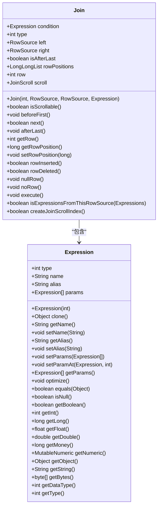
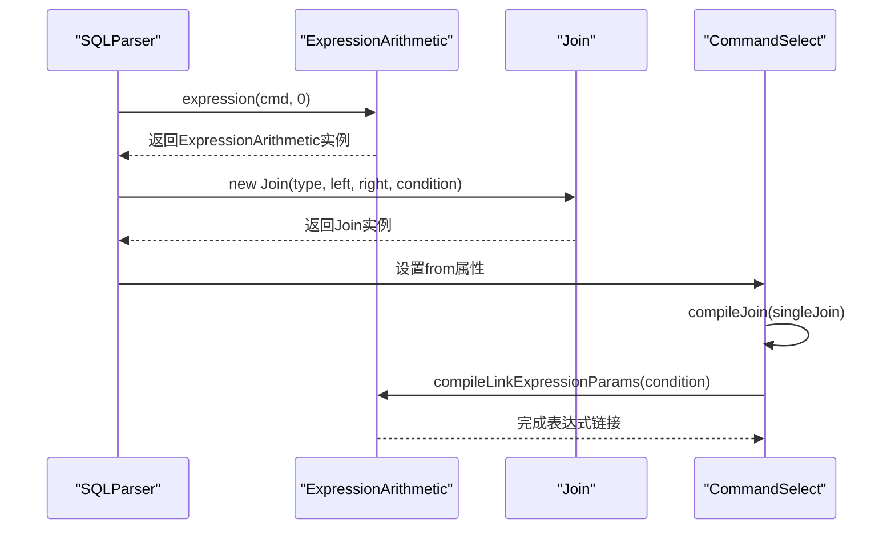
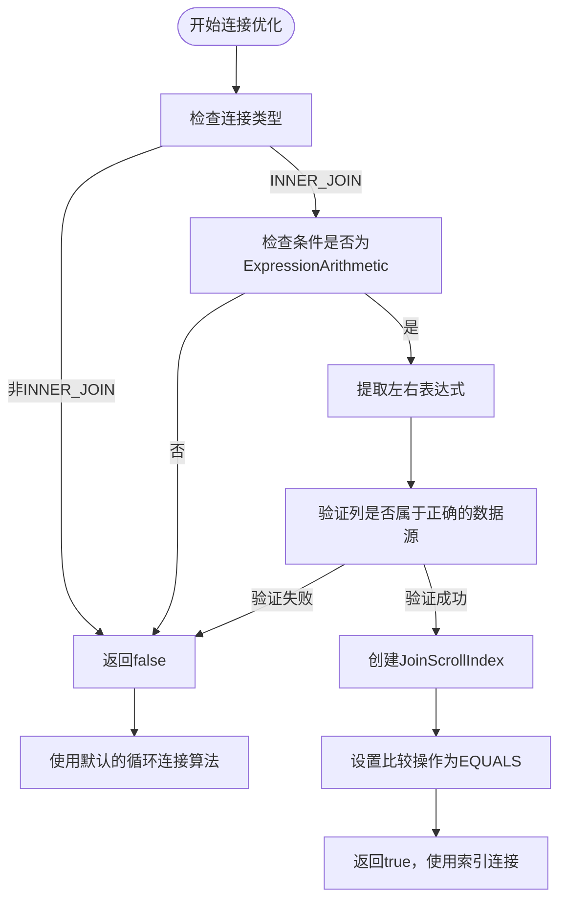
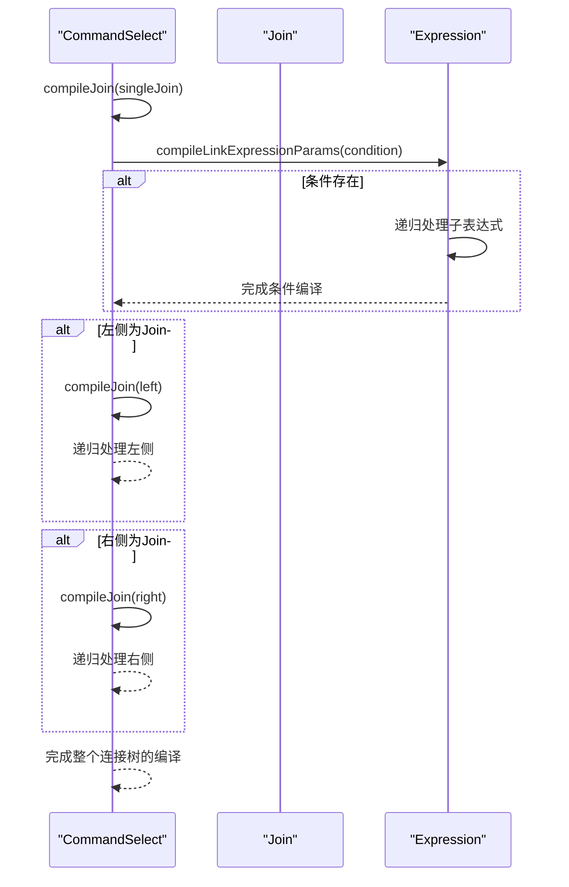
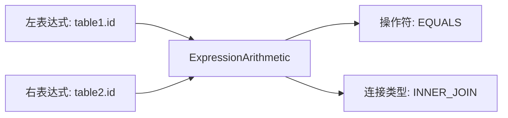
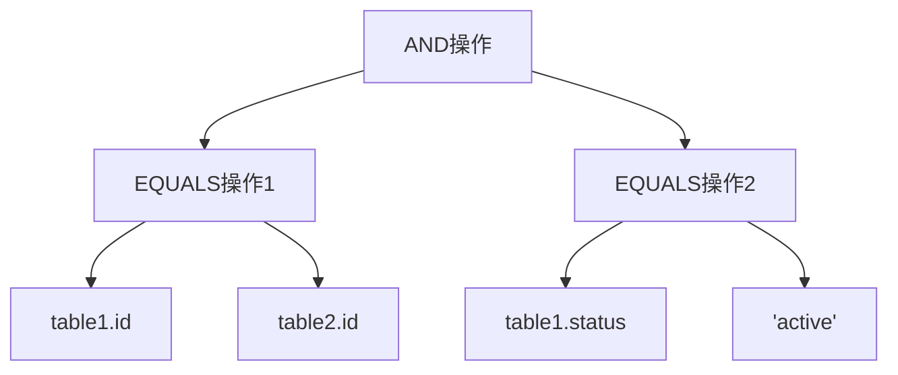
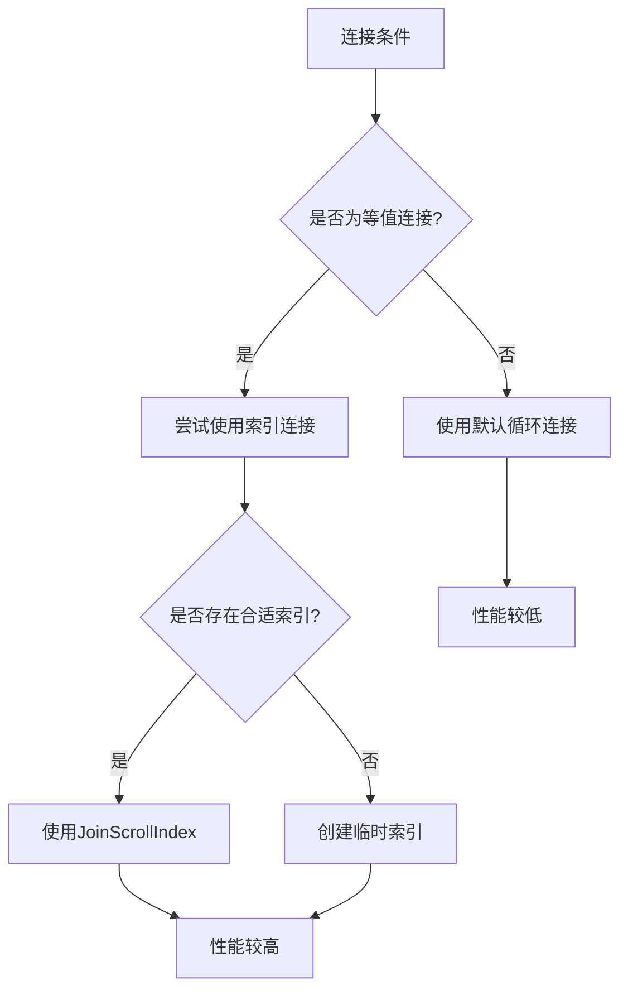

# 连接条件

<cite>
**本文档中引用的文件**  
- [Join.java](file://src/main/java/io/leavesfly/smallsql/rdb/engine/selector/multioper/Join.java)
- [CommandSelect.java](file://src/main/java/io/leavesfly/smallsql/rdb/command/dql/CommandSelect.java)
- [ExpressionArithmetic.java](file://src/main/java/io/leavesfly/smallsql/rdb/sql/expression/operator/ExpressionArithmetic.java)
- [SQLParser.java](file://src/main/java/io/leavesfly/smallsql/rdb/sql/SQLParser.java)
</cite>

## 目录
1. [连接条件实现机制](#连接条件实现机制)
2. [Join类中condition字段的处理](#join类中condition字段的处理)
3. [ExpressionArithmetic在连接条件中的应用](#expressionarithmetic在连接条件中的应用)
4. [EQUALS操作符的优化处理](#equals操作符的优化处理)
5. [复杂连接条件的编译过程](#复杂连接条件的编译过程)
6. [连接条件表达式构建示例](#连接条件表达式构建示例)
7. [连接条件对性能和执行计划的影响](#连接条件对性能和执行计划的影响)

## 连接条件实现机制

连接条件（ON子句）的实现机制基于`Join`类和`CommandSelect`类的协同工作。当SQL语句包含JOIN操作时，`SQLParser`会解析ON子句并创建相应的`ExpressionArithmetic`对象作为连接条件。该条件被存储在`Join`对象的`condition`字段中，并在查询执行时用于判断连接行的匹配性。

连接操作的执行流程始于`CommandSelect.compile()`方法，该方法会调用`compileJoin()`递归处理所有连接条件。对于每个`Join`对象，系统会根据连接类型（INNER JOIN、LEFT JOIN等）和连接条件来决定如何组合左右两个数据源的行。

**Section sources**
- [CommandSelect.java](file://src/main/java/io/leavesfly/smallsql/rdb/command/dql/CommandSelect.java#L61-L113)
- [SQLParser.java](file://src/main/java/io/leavesfly/smallsql/rdb/sql/SQLParser.java#L2226-L2260)

## Join类中condition字段的处理

`Join`类中的`condition`字段是连接条件的核心存储位置，其类型为`Expression`，通常为`ExpressionArithmetic`的实例。该字段在`Join`构造函数中初始化，存储了ON子句中定义的表达式。



**Diagram sources**
- [Join.java](file://src/main/java/io/leavesfly/smallsql/rdb/engine/selector/multioper/Join.java#L15-L40)
- [Expression.java](file://src/main/java/io/leavesfly/smallsql/rdb/sql/expression/Expression.java#L25-L246)

**Section sources**
- [Join.java](file://src/main/java/io/leavesfly/smallsql/rdb/engine/selector/multioper/Join.java#L15-L40)

## ExpressionArithmetic在连接条件中的应用

`ExpressionArithmetic`类在连接条件中扮演着关键角色，它实现了各种算术和逻辑操作符，包括等值连接（EQUALS）、不等连接（UNEQUALS）以及逻辑与（AND）等。当解析ON子句时，`SQLParser`会创建`ExpressionArithmetic`实例来表示连接条件。



**Diagram sources**
- [SQLParser.java](file://src/main/java/io/leavesfly/smallsql/rdb/sql/SQLParser.java#L2226-L2260)
- [ExpressionArithmetic.java](file://src/main/java/io/leavesfly/smallsql/rdb/sql/expression/operator/ExpressionArithmetic.java#L75-L115)
- [CommandSelect.java](file://src/main/java/io/leavesfly/smallsql/rdb/command/dql/CommandSelect.java#L196-L217)

**Section sources**
- [ExpressionArithmetic.java](file://src/main/java/io/leavesfly/smallsql/rdb/sql/expression/operator/ExpressionArithmetic.java#L75-L115)

## EQUALS操作符的优化处理

EQUALS操作符在连接条件中得到了特殊优化处理。当连接条件为等值连接时，系统会尝试创建基于索引的连接算法（`JoinScrollIndex`），这可以显著提高连接性能。



**Diagram sources**
- [Join.java](file://src/main/java/io/leavesfly/smallsql/rdb/engine/selector/multioper/Join.java#L200-L250)
- [ExpressionArithmetic.java](file://src/main/java/io/leavesfly/smallsql/rdb/sql/expression/operator/ExpressionArithmetic.java#L1057-L1083)

**Section sources**
- [Join.java](file://src/main/java/io/leavesfly/smallsql/rdb/engine/selector/multioper/Join.java#L200-L250)

## 复杂连接条件的编译过程

复杂连接条件（如多个AND连接的条件）通过`CommandSelect.compileJoin()`方法的递归调用机制进行编译。该方法会遍历整个连接树，对每个`Join`节点的条件表达式进行链接和优化。



**Diagram sources**
- [CommandSelect.java](file://src/main/java/io/leavesfly/smallsql/rdb/command/dql/CommandSelect.java#L196-L217)
- [Join.java](file://src/main/java/io/leavesfly/smallsql/rdb/engine/selector/multioper/Join.java#L30-L40)

**Section sources**
- [CommandSelect.java](file://src/main/java/io/leavesfly/smallsql/rdb/command/dql/CommandSelect.java#L196-L217)

## 连接条件表达式构建示例

连接条件表达式的构建涉及简单等值连接和复合条件连接两种主要形式。

### 简单等值连接示例

```sql
SELECT * FROM table1 INNER JOIN table2 ON table1.id = table2.id
```

对应的表达式构建过程：


### 复合条件连接示例

```sql
SELECT * FROM table1 INNER JOIN table2 ON table1.id = table2.id AND table1.status = 'active'
```

对应的表达式构建过程：


**Section sources**
- [SQLParser.java](file://src/main/java/io/leavesfly/smallsql/rdb/sql/SQLParser.java#L1487-L1521)
- [ExpressionArithmetic.java](file://src/main/java/io/leavesfly/smallsql/rdb/sql/expression/operator/ExpressionArithmetic.java#L560-L611)

## 连接条件对性能和执行计划的影响

连接条件的结构和内容对查询性能和执行计划有显著影响。等值连接条件可以利用索引进行优化，而非等值连接或复杂条件则可能导致全表扫描。



等值连接的优化优势在于：
1. 可以利用现有索引或创建临时索引
2. 减少需要比较的行数
3. 提高缓存效率
4. 降低I/O开销

而复杂连接条件（如包含OR、LIKE等操作符）则可能：
1. 无法使用索引优化
2. 需要更多的CPU计算资源
3. 导致更高的内存使用
4. 增加查询响应时间

**Section sources**
- [Join.java](file://src/main/java/io/leavesfly/smallsql/rdb/engine/selector/multioper/Join.java#L200-L250)
- [ExpressionArithmetic.java](file://src/main/java/io/leavesfly/smallsql/rdb/sql/expression/operator/ExpressionArithmetic.java#L560-L611)