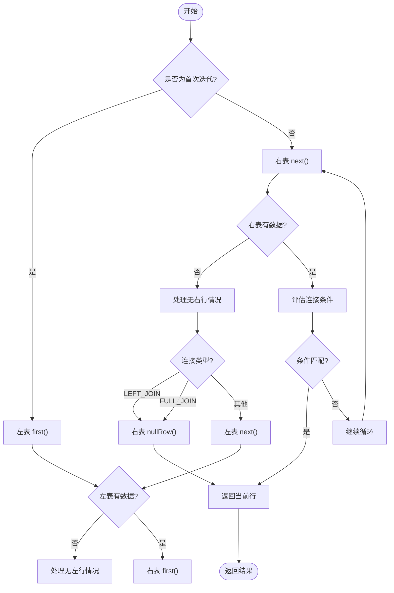
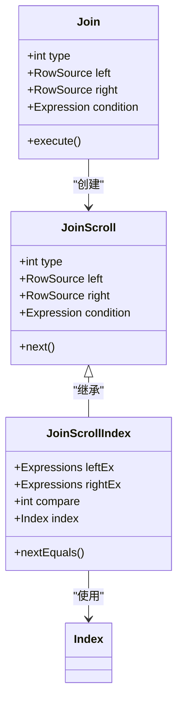
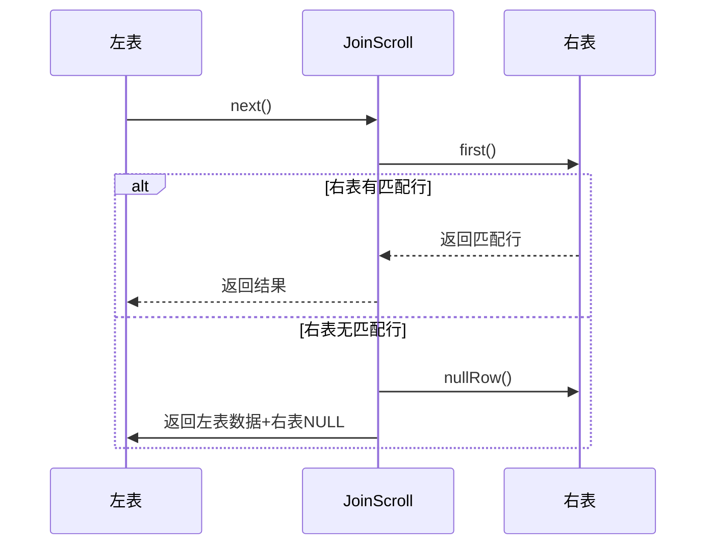

# 连接类型

<cite>
**本文档中引用的文件**  
- [Join.java](file://src/main/java/io/leavesfly/smallsql/rdb/engine/selector/multioper/Join.java)
- [TableResult.java](file://src/main/java/io/leavesfly/smallsql/rdb/engine/selector/result/TableResult.java)
- [Scrollable.java](file://src/main/java/io/leavesfly/smallsql/rdb/engine/selector/Scrollable.java)
- [StorePage.java](file://src/main/java/io/leavesfly/smallsql/rdb/engine/store/StorePage.java)
</cite>

## 目录
1. [连接类型概述](#连接类型概述)
2. [连接类型的语义与使用场景](#连接类型的语义与使用场景)
3. [连接执行逻辑分析](#连接执行逻辑分析)
4. [INNER_JOIN的优化机制](#inner_join的优化机制)
5. [LEFT_JOIN与FULL_JOIN的nullRow机制](#left_join与full_join的nullrow机制)
6. [SQL示例与执行结果说明](#sql示例与执行结果说明)
7. [总结](#总结)

## 连接类型概述

SmallSQL支持多种SQL连接类型，包括CROSS_JOIN、INNER_JOIN、LEFT_JOIN、RIGHT_JOIN和FULL_JOIN。这些连接类型在`Join.java`中通过常量定义，并通过`JoinScroll`及其子类`JoinScrollIndex`实现不同的执行逻辑。每种连接类型在查询结果中表现出不同的语义行为，尤其在外连接（LEFT_JOIN、RIGHT_JOIN、FULL_JOIN）中涉及空值填充机制。

**Section sources**  
- [Join.java](file://src/main/java/io/leavesfly/smallsql/rdb/engine/selector/multioper/Join.java#L450-L463)

## 连接类型的语义与使用场景

### CROSS_JOIN（交叉连接）
- **语义**：返回左表和右表的笛卡尔积，即所有可能的行组合。
- **使用场景**：当需要生成所有可能的组合时使用，通常用于数据生成或测试。

### INNER_JOIN（内连接）
- **语义**：仅返回满足连接条件的行，即左右表中匹配的记录。
- **使用场景**：最常见的连接类型，用于关联两个表中存在对应关系的数据。

### LEFT_JOIN（左外连接）
- **语义**：返回左表的所有行，若右表无匹配行，则右表字段填充为NULL。
- **使用场景**：当需要保留左表全部数据，同时关联右表信息时使用。

### RIGHT_JOIN（右外连接）
- **语义**：返回右表的所有行，若左表无匹配行，则左表字段填充为NULL。
- **使用场景**：与LEFT_JOIN对称，保留右表完整数据。

### FULL_JOIN（全外连接）
- **语义**：返回左表和右表的所有行，任一侧无匹配时，另一侧字段填充为NULL。
- **使用场景**：需要合并两个表的全部数据，无论是否匹配。

**Section sources**  
- [Join.java](file://src/main/java/io/leavesfly/smallsql/rdb/engine/selector/multioper/Join.java#L450-L463)

## 连接执行逻辑分析

连接操作的核心逻辑由`JoinScroll`类实现，其`next()`方法控制行的迭代过程。不同连接类型的执行逻辑差异主要体现在对不匹配行的处理方式上。



**Diagram sources**  
- [Join.java](file://src/main/java/io/leavesfly/smallsql/rdb/engine/selector/multioper/Join.java#L300-L440)

## INNER_JOIN的优化机制

SmallSQL对INNER_JOIN提供了基于索引的优化执行路径`JoinScrollIndex`。当连接条件为等值比较（EQUALS）且涉及索引列时，系统会自动创建`JoinScrollIndex`实例以提升性能。

### 优化触发条件：
1. 连接类型必须为INNER_JOIN
2. 连接条件为`ExpressionArithmetic.EQUALS`
3. 条件表达式中的列分别属于左右两个数据源

### 执行流程：
1. 在`createJoinScrollIndex()`中解析连接条件
2. 构建右表的临时索引（`Index`类）
3. 对左表每行，在索引中查找匹配的右表行位置
4. 通过`setRowPosition()`直接定位，避免全表扫描



**Diagram sources**  
- [Join.java](file://src/main/java/io/leavesfly/smallsql/rdb/engine/selector/multioper/Join.java#L200-L250)
- [Join.java](file://src/main/java/io/leavesfly/smallsql/rdb/engine/selector/multioper/Join.java#L252-L300)

## LEFT_JOIN与FULL_JOIN的nullRow机制

在外连接中，当一侧表无匹配行时，需将该侧数据源置为空行（null row），以保证结果集中保留另一侧的完整数据。

### nullRow()方法作用：
- 调用`left.nullRow()`和`right.nullRow()`将对应数据源置为空状态
- 重置当前行号`row = 0`
- 在`TableResult`中，`nullRow()`会将`store`设置为`Store.NULL`

### FULL_JOIN特殊处理：
- 使用`isFullNotValid[]`数组记录右表哪些行已被匹配
- 第一轮遍历后，遍历右表未匹配的行，左表置为null
- `fullReturnCounter`控制第二轮返回



**Diagram sources**  
- [Join.java](file://src/main/java/io/leavesfly/smallsql/rdb/engine/selector/multioper/Join.java#L150-L160)
- [TableResult.java](file://src/main/java/io/leavesfly/smallsql/rdb/engine/selector/result/TableResult.java#L200-L210)

## SQL示例与执行结果说明

### 示例1：INNER_JOIN
```sql
SELECT * FROM A INNER JOIN B ON A.id = B.a_id;
```
- **结果**：仅返回A和B中id匹配的行
- **行为**：不匹配的行被过滤

### 示例2：LEFT_JOIN
```sql
SELECT * FROM A LEFT JOIN B ON A.id = B.a_id;
```
- **结果**：返回A的所有行，B无匹配时字段为NULL
- **行为**：A表数据完整保留

### 示例3：FULL_JOIN
```sql
SELECT * FROM A FULL JOIN B ON A.id = B.a_id;
```
- **结果**：返回A和B的所有行，无匹配侧填充NULL
- **行为**：两表数据均完整保留

**Section sources**  
- [Join.java](file://src/main/java/io/leavesfly/smallsql/rdb/engine/selector/multioper/Join.java#L450-L463)

## 总结

SmallSQL通过`Join.java`中的`JoinScroll`机制实现了多种连接类型，其中INNER_JOIN支持基于索引的优化执行，而LEFT_JOIN和FULL_JOIN通过`nullRow()`机制处理外连接中的空值填充。开发者应根据数据完整性需求选择合适的连接类型，并在可能的情况下利用等值连接条件触发INNER_JOIN的索引优化。

**Section sources**  
- [Join.java](file://src/main/java/io/leavesfly/smallsql/rdb/engine/selector/multioper/Join.java#L1-L463)
- [TableResult.java](file://src/main/java/io/leavesfly/smallsql/rdb/engine/selector/result/TableResult.java#L1-L420)