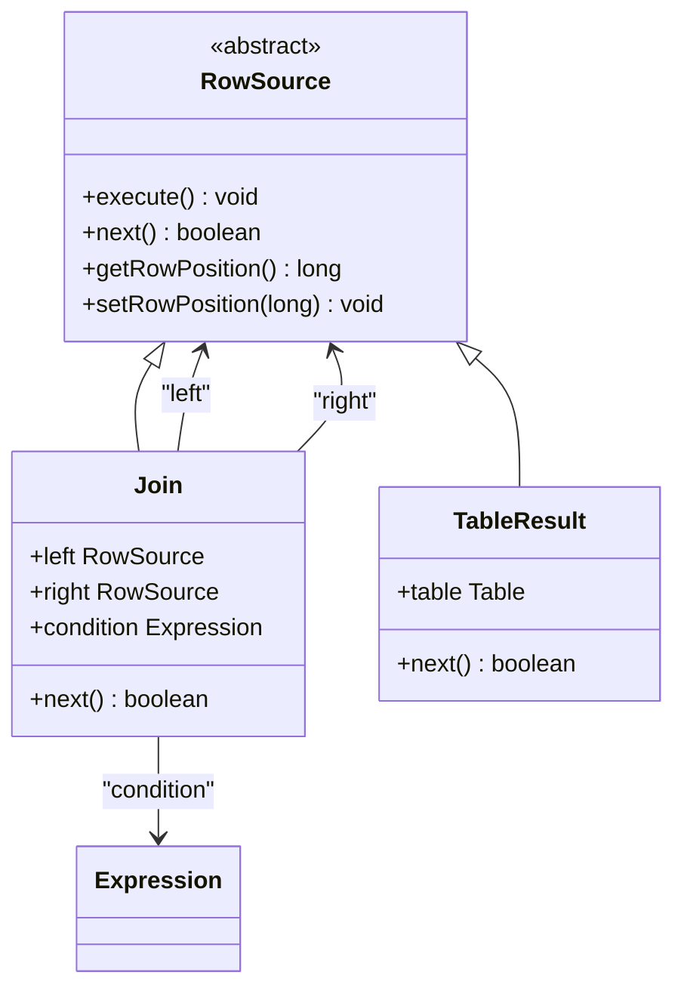
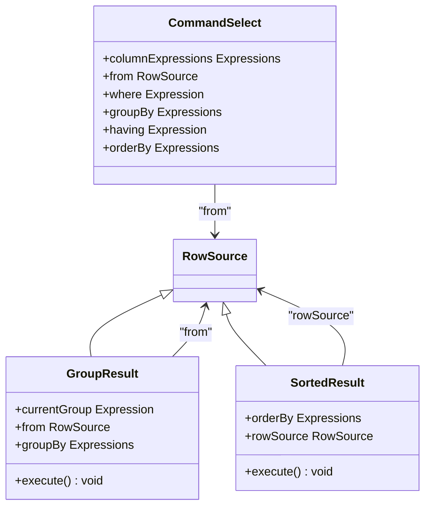

# SQL语法支持

<cite>
**本文档引用的文件**   
- [SQLParser.java](file://src/main/java/io/leavesfly/smallsql/rdb/sql/SQLParser.java)
- [SQLTokenizer.java](file://src/main/java/io/leavesfly/smallsql/rdb/sql/parser/SQLTokenizer.java)
- [CommandCreateDatabase.java](file://src/main/java/io/leavesfly/smallsql/rdb/command/ddl/CommandCreateDatabase.java)
- [CommandCreateView.java](file://src/main/java/io/leavesfly/smallsql/rdb/command/ddl/CommandCreateView.java)
- [CommandDrop.java](file://src/main/java/io/leavesfly/smallsql/rdb/command/ddl/CommandDrop.java)
- [CommandTable.java](file://src/main/java/io/leavesfly/smallsql/rdb/command/ddl/CommandTable.java)
- [CommandInsert.java](file://src/main/java/io/leavesfly/smallsql/rdb/command/dml/CommandInsert.java)
- [CommandUpdate.java](file://src/main/java/io/leavesfly/smallsql/rdb/command/dml/CommandUpdate.java)
- [CommandDelete.java](file://src/main/java/io/leavesfly/smallsql/rdb/command/dml/CommandDelete.java)
- [CommandSelect.java](file://src/main/java/io/leavesfly/smallsql/rdb/command/dql/CommandSelect.java)
- [Column.java](file://src/main/java/io/leavesfly/smallsql/rdb/engine/table/Column.java)
- [ForeignKey.java](file://src/main/java/io/leavesfly/smallsql/rdb/engine/table/ForeignKey.java)
- [DateTime.java](file://src/main/java/io/leavesfly/smallsql/rdb/sql/datatype/DateTime.java)
- [Money.java](file://src/main/java/io/leavesfly/smallsql/rdb/sql/datatype/Money.java)
- [Strings.java](file://src/main/java/io/leavesfly/smallsql/rdb/sql/datatype/Strings.java)
- [Join.java](file://src/main/java/io/leavesfly/smallsql/rdb/engine/selector/multioper/Join.java)
- [Where.java](file://src/main/java/io/leavesfly/smallsql/rdb/engine/selector/multioper/Where.java)
- [GroupResult.java](file://src/main/java/io/leavesfly/smallsql/rdb/engine/selector/multioper/GroupResult.java)
- [SortedResult.java](file://src/main/java/io/leavesfly/smallsql/rdb/engine/selector/multioper/SortedResult.java)
- [ExpressionFunctionRound.java](file://src/main/java/io/leavesfly/smallsql/rdb/sql/expression/function/numeric/ExpressionFunctionRound.java)
- [ExpressionFunctionSubstring.java](file://src/main/java/io/leavesfly/smallsql/rdb/sql/expression/function/string/ExpressionFunctionSubstring.java)
</cite>

## 目录
1. [SQL解析器工作原理](#sql解析器工作原理)
2. [DDL语句支持](#ddl语句支持)
3. [DML语句支持](#dml语句支持)
4. [DQL语句支持](#dql语句支持)
5. [数据类型支持](#数据类型支持)
6. [SQL标准兼容性](#sql标准兼容性)

## SQL解析器工作原理

SmallSQL的SQL解析器由`SQLParser`和`SQLTokenizer`两个核心组件构成。`SQLTokenizer`负责将原始SQL语句分解为一系列标记（Token），而`SQLParser`则根据这些标记构建语法树并生成相应的命令对象。

`SQLTokenizer`通过`parseSQL`方法将输入的SQL字符数组解析为`SQLToken`列表。它能够识别关键字、标识符、字符串、数字以及各种操作符，并处理单行注释（`--`）和多行注释（`/* */`）。解析过程是大小写不敏感的，所有字符在比较前都会转换为小写。

`SQLParser`的`parse`方法是解析的入口点。它首先调用`SQLTokenizer.parseSQL`获取标记列表，然后根据第一个标记的值（如`SELECT`, `INSERT`, `CREATE`等）分发到相应的解析方法。例如，遇到`SELECT`关键字时，会调用`select()`方法；遇到`CREATE`关键字时，会调用`create()`方法。解析器通过`nextToken()`和`previousToken()`方法在标记列表中前进和后退，以实现回溯。

解析器采用递归下降的方式，为每种SQL语句编写了专门的解析方法。例如，`select()`方法会依次解析`SELECT`子句、`FROM`子句、`WHERE`子句、`GROUP BY`子句、`HAVING`子句和`ORDER BY`子句。每个子句的解析都由独立的方法处理，如`from()`、`where()`、`group()`等。解析完成后，会生成一个对应的`Command`对象（如`CommandSelect`、`CommandInsert`），该对象封装了执行该SQL语句所需的所有信息。

**Section sources**
- [SQLParser.java](file://src/main/java/io/leavesfly/smallsql/rdb/sql/SQLParser.java#L137-L2527)
- [SQLTokenizer.java](file://src/main/java/io/leavesfly/smallsql/rdb/sql/parser/SQLTokenizer.java#L42-L964)

## DDL语句支持

### CREATE语句

SmallSQL支持`CREATE DATABASE`、`CREATE TABLE`和`CREATE VIEW`语句。

#### CREATE DATABASE
`CREATE DATABASE`语句用于创建一个新的数据库。其语法为：
```
CREATE DATABASE database_name
```
该语句会创建一个以`database_name`命名的目录，并在其中创建一个主文件（`master.dat`）。如果数据库已存在，则会抛出异常。

**Section sources**
- [CommandCreateDatabase.java](file://src/main/java/io/leavesfly/smallsql/rdb/command/ddl/CommandCreateDatabase.java#L0-L67)

#### CREATE TABLE
`CREATE TABLE`语句用于创建新表。其语法为：
```
CREATE TABLE table_name (
    column1 datatype [constraints],
    column2 datatype [constraints],
    ...
    [table_constraints]
)
```
支持的列约束包括`PRIMARY KEY`、`UNIQUE`和`FOREIGN KEY`。表约束可以在列定义之后指定。例如：
```
CREATE TABLE employees (
    id INT PRIMARY KEY,
    name VARCHAR(50) NOT NULL,
    department_id INT,
    FOREIGN KEY (department_id) REFERENCES departments(id)
)
```
`CREATE TABLE`语句的解析由`SQLParser.createTable()`方法处理，它会逐个解析列定义和约束，并将它们添加到`CommandTable`对象中。

**Section sources**
- [CommandTable.java](file://src/main/java/io/leavesfly/smallsql/rdb/command/ddl/CommandTable.java#L0-L155)
- [Column.java](file://src/main/java/io/leavesfly/smallsql/rdb/engine/table/Column.java#L0-L191)

#### CREATE VIEW
`CREATE VIEW`语句用于创建视图。其语法为：
```
CREATE VIEW view_name AS SELECT ...
```
视图的定义是一个`SELECT`查询。`SQLParser.createView()`方法会解析`AS`关键字后的`SELECT`语句，并将其作为视图的定义存储。

**Section sources**
- [CommandCreateView.java](file://src/main/java/io/leavesfly/smallsql/rdb/command/ddl/CommandCreateView.java#L0-L68)

### DROP语句

`DROP`语句用于删除数据库对象。其语法为：
```
DROP DATABASE|TABLE|VIEW object_name
```
`SQLParser.drop()`方法会根据对象类型（`DATABASE`、`TABLE`或`VIEW`）创建相应的`CommandDrop`对象。删除数据库会移除整个目录及其内容；删除表或视图会从数据库中移除该对象。

**Section sources**
- [CommandDrop.java](file://src/main/java/io/leavesfly/smallsql/rdb/command/ddl/CommandDrop.java#L0-L84)

### ALTER TABLE语句

目前，SmallSQL仅支持`ALTER TABLE ... ADD`语句，用于向现有表中添加新列。其语法为：
```
ALTER TABLE table_name ADD column_name datatype [constraints]
```
`SQLParser.alterTable()`方法会解析`ADD`关键字后的列定义，并将其添加到`CommandTable`对象中。执行时，系统会创建一个新表，将旧表的数据复制过去，然后替换旧表。

**Section sources**
- [CommandTable.java](file://src/main/java/io/leavesfly/smallsql/rdb/command/ddl/CommandTable.java#L0-L155)

## DML语句支持

### INSERT语句

`INSERT`语句用于向表中插入新行。支持两种语法：
```
INSERT INTO table_name (column1, column2, ...) VALUES (value1, value2, ...)
INSERT INTO table_name VALUES (value1, value2, ...)
```
`SQLParser.insert()`方法会解析表名和列名（如果指定），然后解析`VALUES`子句中的值列表。每个值都会被解析为一个`Expression`对象，并与相应的列关联。`CommandInsert`对象在执行时会将这些值写入表中。

**Section sources**
- [CommandInsert.java](file://src/main/java/io/leavesfly/smallsql/rdb/command/dml/CommandInsert.java#L0-L207)

### UPDATE语句

`UPDATE`语句用于修改表中的现有行。其语法为：
```
UPDATE table_name SET column1 = value1, column2 = value2, ... [WHERE condition]
```
`SQLParser.update()`方法会解析表名，然后循环解析`SET`子句中的赋值对。每个赋值的左侧必须是列名，右侧是一个表达式。`CommandUpdate`对象会将这些赋值应用到满足`WHERE`条件的行上。

**Section sources**
- [CommandUpdate.java](file://src/main/java/io/leavesfly/smallsql/rdb/command/dml/CommandUpdate.java#L0-L116)

### DELETE语句

`DELETE`语句用于从表中删除行。其语法为：
```
DELETE FROM table_name [WHERE condition]
```
`SQLParser.delete()`方法会解析表名和可选的`WHERE`子句。`CommandDelete`对象会删除满足`WHERE`条件的所有行。如果没有`WHERE`子句，则会删除表中的所有行。

**Section sources**
- [CommandDelete.java](file://src/main/java/io/leavesfly/smallsql/rdb/command/dml/CommandDelete.java#L0-L66)

## DQL语句支持

### SELECT语句

`SELECT`语句是SmallSQL中最复杂的DQL语句，支持完整的功能集。

#### 投影和筛选
基本的`SELECT`语句语法为：
```
SELECT column1, column2, ... FROM table_name [WHERE condition]
```
`SQLParser.select()`方法会解析`SELECT`子句中的列表达式，然后调用`from()`方法解析`FROM`子句。`WHERE`子句由`where()`方法解析，它会将条件表达式转换为一个`Expression`对象。

#### 连接（JOIN）
SmallSQL支持多种`JOIN`类型，包括`INNER JOIN`、`LEFT JOIN`、`RIGHT JOIN`和`FULL JOIN`。其语法为：
```
SELECT ... FROM table1 JOIN table2 ON condition
```
`SQLParser.join()`方法会解析`JOIN`类型和`ON`子句中的连接条件。`Join`类实现了连接逻辑，它会遍历左表和右表的行，并根据连接条件决定是否将它们组合在一起。



**Diagram sources**
- [Join.java](file://src/main/java/io/leavesfly/smallsql/rdb/engine/selector/multioper/Join.java#L0-L463)
- [Where.java](file://src/main/java/io/leavesfly/smallsql/rdb/engine/selector/multioper/Where.java#L0-L176)

#### 子查询
`SELECT`语句支持子查询，可以出现在`SELECT`、`FROM`、`WHERE`和`HAVING`子句中。例如：
```
SELECT * FROM table1 WHERE id IN (SELECT id FROM table2)
```
`SQLParser`在解析表达式时，如果遇到`SELECT`关键字，会递归调用`select()`方法来解析子查询。

#### 聚合函数
SmallSQL支持以下聚合函数：`COUNT`、`SUM`、`MIN`、`MAX`、`AVG`、`FIRST`和`LAST`。这些函数可以与`GROUP BY`和`HAVING`子句一起使用。例如：
```
SELECT department, COUNT(*) FROM employees GROUP BY department HAVING COUNT(*) > 5
```
`SQLParser.group()`方法会解析`GROUP BY`子句中的表达式列表。`GroupResult`类负责实现分组逻辑，它会将行按分组键分组，并为每个组计算聚合函数的值。



**Diagram sources**
- [CommandSelect.java](file://src/main/java/io/leavesfly/smallsql/rdb/command/dql/CommandSelect.java#L0-L587)
- [GroupResult.java](file://src/main/java/io/leavesfly/smallsql/rdb/engine/selector/multioper/GroupResult.java#L0-L284)
- [SortedResult.java](file://src/main/java/io/leavesfly/smallsql/rdb/engine/selector/multioper/SortedResult.java#L0-L307)

#### 排序（ORDER BY）
`ORDER BY`子句用于对结果集进行排序。其语法为：
```
SELECT ... ORDER BY column1 [ASC|DESC], column2 [ASC|DESC], ...
```
`SQLParser.order()`方法会解析排序表达式列表。`SortedResult`类负责实现排序逻辑，它会创建一个索引，根据排序键对行进行排序。

**Section sources**
- [CommandSelect.java](file://src/main/java/io/leavesfly/smallsql/rdb/command/dql/CommandSelect.java#L0-L587)

## 数据类型支持

SmallSQL支持多种SQL数据类型，包括数值类型、字符串类型、日期时间类型和二进制类型。

### 数值类型
- `TINYINT`、`SMALLINT`、`INT`、`BIGINT`：整数类型
- `REAL`、`FLOAT`、`DOUBLE`：浮点数类型
- `DECIMAL(p,s)`、`NUMERIC(p,s)`：定点数类型，`p`为精度，`s`为小数位数
- `MONEY`：货币类型，内部存储为长整型，小数点后4位

### 字符串类型
- `CHAR(n)`、`VARCHAR(n)`：定长和变长字符串，`n`为最大长度
- `TEXT`：长文本类型
- `NCHAR(n)`、`NVARCHAR(n)`：Unicode字符串类型

### 日期时间类型
- `DATE`：日期类型，格式为`yyyy-mm-dd`
- `TIME`：时间类型，格式为`hh:mm:ss`
- `TIMESTAMP`：时间戳类型，格式为`yyyy-mm-dd hh:mm:ss.nnn`

### 二进制类型
- `BINARY(n)`、`VARBINARY(n)`：定长和变长二进制数据
- `BLOB`：二进制大对象

数据类型的解析由`SQLParser.datatype()`方法处理。它会根据关键字确定数据类型，并解析精度和小数位数（如果适用）。

**Section sources**
- [Column.java](file://src/main/java/io/leavesfly/smallsql/rdb/engine/table/Column.java#L0-L191)
- [DateTime.java](file://src/main/java/io/leavesfly/smallsql/rdb/sql/datatype/DateTime.java#L0-L799)
- [Money.java](file://src/main/java/io/leavesfly/smallsql/rdb/sql/datatype/Money.java#L0-L142)

## SQL标准兼容性

SmallSQL旨在兼容SQL-92标准，同时支持一些常见的SQL方言特性。

### 支持的SQL标准特性
- 完整的`SELECT`语句语法，包括投影、筛选、连接、分组、聚合和排序
- 基本的DDL语句：`CREATE TABLE`、`DROP TABLE`、`ALTER TABLE ADD`
- 基本的DML语句：`INSERT`、`UPDATE`、`DELETE`
- 常用的标量函数和聚合函数

### 方言差异
- **标识符**：支持使用双引号（`"`）或方括号（`[]`）包围标识符，以包含特殊字符或保留字。
- **字符串**：支持使用单引号（`'`）包围字符串。字符串中的单引号可以通过两个单引号（`''`）进行转义。
- **注释**：支持单行注释（`--`）和多行注释（`/* */`）。
- **函数别名**：支持一些常见的函数别名，如`NOW()`等同于`CURRENT_TIMESTAMP`，`LEN()`等同于`LENGTH()`。
- **数据类型别名**：支持一些常见的数据类型别名，如`SERIAL`等同于`INT IDENTITY`，`DATETIME`等同于`TIMESTAMP`。

SmallSQL不支持一些高级SQL特性，如存储过程、触发器、复杂的窗口函数和递归查询。此外，`CREATE INDEX`和`CREATE PROCEDURE`语句虽然被解析，但尚未实现。

**Section sources**
- [SQLTokenizer.java](file://src/main/java/io/leavesfly/smallsql/rdb/sql/parser/SQLTokenizer.java#L42-L964)
- [SQLParser.java](file://src/main/java/io/leavesfly/smallsql/rdb/sql/SQLParser.java#L137-L2527)