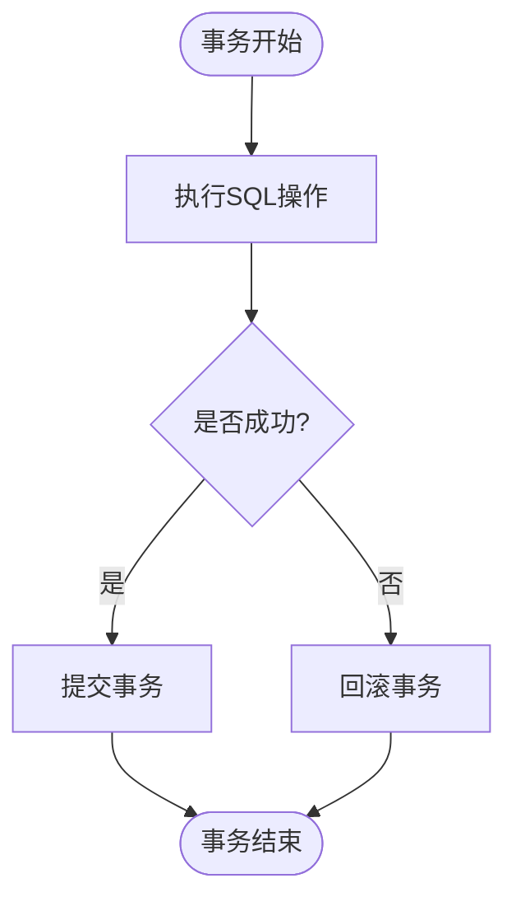
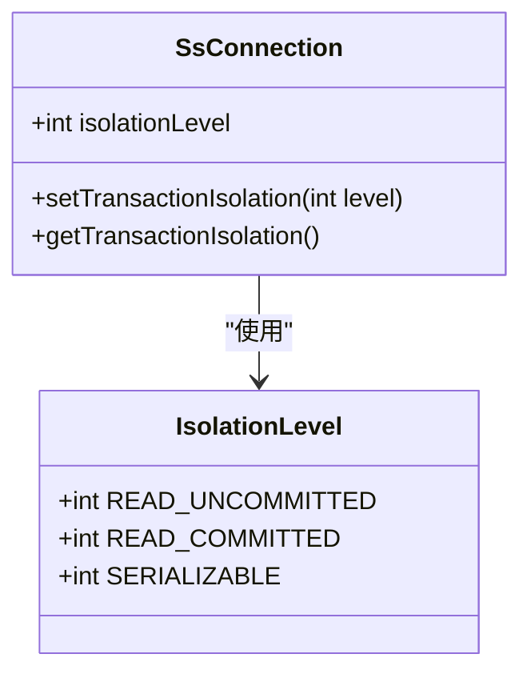
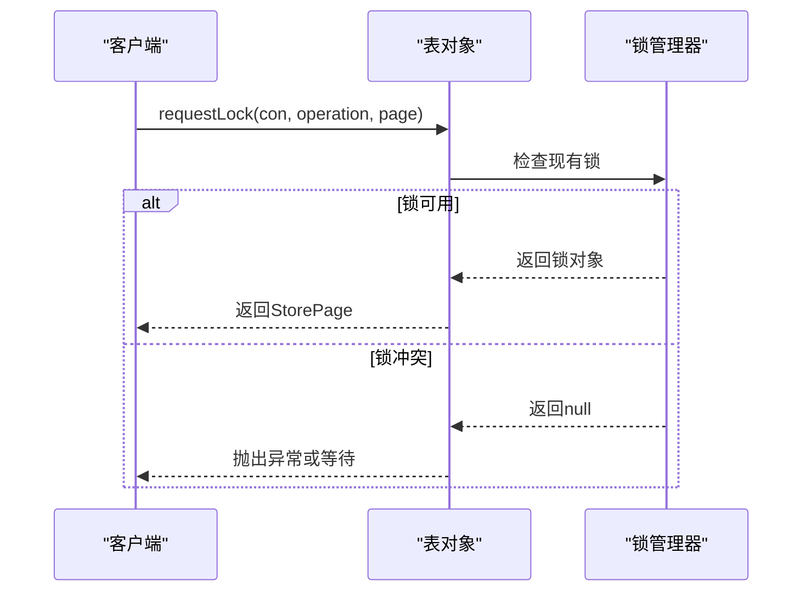
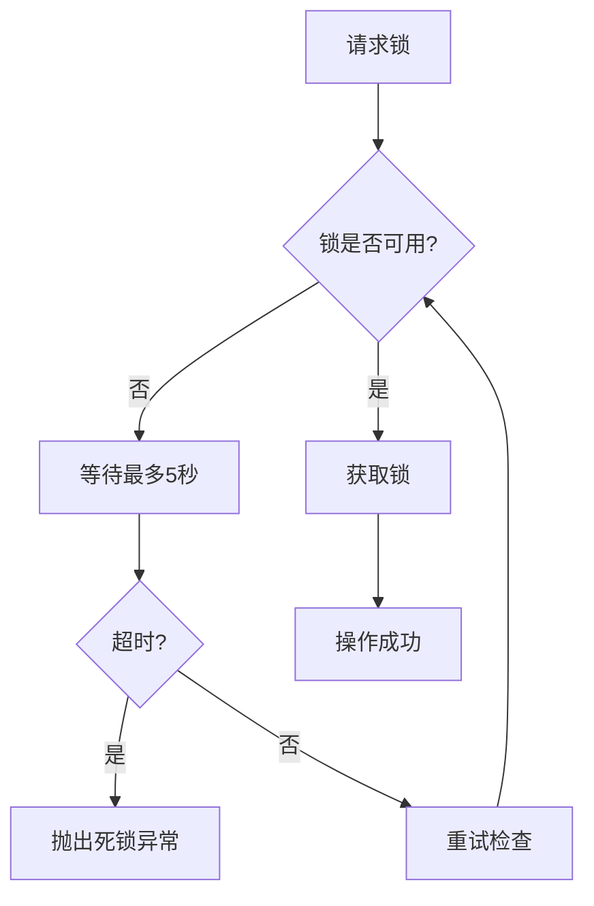

# 事务与并发控制

<cite>
**本文档引用的文件**  
- [SsConnection.java](file://src/main/java/io/leavesfly/smallsql/jdbc/SsConnection.java)
- [Table.java](file://src/main/java/io/leavesfly/smallsql/rdb/engine/Table.java)
- [TransactionStep.java](file://src/main/java/io/leavesfly/smallsql/rdb/engine/TransactionStep.java)
- [CommandSet.java](file://src/main/java/io/leavesfly/smallsql/rdb/command/ddl/CommandSet.java)
- [TestTransactions.java](file://src/test/java/io/leavesfly/smallsql/junit/sql/tpl/TestTransactions.java)
</cite>

## 目录
1. [ACID属性实现](#acid属性实现)  
2. [事务生命周期](#事务生命周期)  
3. [事务隔离级别](#事务隔离级别)  
4. [锁机制](#锁机制)  
5. [死锁检测与预防](#死锁检测与预防)  
6. [多线程环境下的连接与事务使用](#多线程环境下的连接与事务使用)  
7. [并发问题最佳实践](#并发问题最佳实践)

## ACID属性实现

SmallSQL通过事务日志和锁机制确保ACID属性的实现。原子性通过事务步骤（TransactionStep）的提交和回滚机制保证，所有操作要么全部成功，要么全部失败。一致性通过约束检查和事务边界维护。隔离性通过不同级别的锁和隔离机制实现。持久性通过将事务日志写入文件系统确保数据在系统崩溃后仍可恢复。

**Section sources**  
- [TransactionStep.java](file://src/main/java/io/leavesfly/smallsql/rdb/engine/TransactionStep.java#L35-L56)
- [SsConnection.java](file://src/main/java/io/leavesfly/smallsql/jdbc/SsConnection.java#L74-L715)

## 事务生命周期

事务的生命周期包括开始、执行、提交或回滚以及保存点管理。当连接的自动提交模式被禁用时，事务开始。通过`setAutoCommit(false)`方法可以显式开始一个事务。事务中的所有操作都会被记录在事务步骤列表中，直到调用`commit()`方法将所有更改持久化到数据库，或调用`rollback()`方法撤销所有未提交的更改。

**Diagram sources**  
- [SsConnection.java](file://src/main/java/io/leavesfly/smallsql/jdbc/SsConnection.java#L74-L715)

**Section sources**  
- [SsConnection.java](file://src/main/java/io/leavesfly/smallsql/jdbc/SsConnection.java#L74-L715)
- [TestTransactions.java](file://src/test/java/io/leavesfly/smallsql/junit/sql/tpl/TestTransactions.java#L150-L182)

## 事务隔离级别

SmallSQL支持多种事务隔离级别，包括READ_UNCOMMITTED、READ_COMMITTED和SERIALIZABLE。这些隔离级别通过不同的锁策略和可见性规则来实现。较低的隔离级别允许更高的并发性但可能导致脏读、不可重复读等问题，而较高的隔离级别提供更强的一致性保证但可能降低并发性能。

**Diagram sources**  
- [SsConnection.java](file://src/main/java/io/leavesfly/smallsql/jdbc/SsConnection.java#L74-L715)
- [CommandSet.java](file://src/main/java/io/leavesfly/smallsql/rdb/command/ddl/CommandSet.java#L34-L61)

**Section sources**  
- [SsConnection.java](file://src/main/java/io/leavesfly/smallsql/jdbc/SsConnection.java#L74-L715)
- [TestTransactions.java](file://src/test/java/io/leavesfly/smallsql/junit/sql/tpl/TestTransactions.java#L428-L461)

## 锁机制

SmallSQL实现了表级锁、行级锁和页级锁的混合机制。表级锁用于DDL操作和序列化事务，行级锁通过页级锁实现。锁的获取和释放通过`requestLock`和`freeLock`方法管理。锁升级和降级策略确保在不同操作间正确维护数据一致性。

**Diagram sources**  
- [Table.java](file://src/main/java/io/leavesfly/smallsql/rdb/engine/Table.java#L325-L376)
- [Table.java](file://src/main/java/io/leavesfly/smallsql/rdb/engine/Table.java#L526-L573)

**Section sources**  
- [Table.java](file://src/main/java/io/leavesfly/smallsql/rdb/engine/Table.java#L68-L99)
- [Table.java](file://src/main/java/io/leavesfly/smallsql/rdb/engine/Table.java#L325-L376)

## 死锁检测与预防

SmallSQL通过超时机制检测死锁。当一个锁请求无法在5秒内完成时，系统会抛出死锁异常。这种基于超时的检测方法简单有效，避免了复杂的循环检测算法。开发者应设计应用程序以最小化锁持有时间，从而降低死锁发生的概率。

**Diagram sources**  
- [Table.java](file://src/main/java/io/leavesfly/smallsql/rdb/engine/Table.java#L325-L376)

**Section sources**  
- [Table.java](file://src/main/java/io/leavesfly/smallsql/rdb/engine/Table.java#L325-L376)
- [TestTransactions.java](file://src/test/java/io/leavesfly/smallsql/junit/sql/tpl/TestTransactions.java#L493-L511)

## 多线程环境下的连接与事务使用

在多线程环境中，每个线程应使用独立的连接对象以避免竞争条件。连接对象本身不是线程安全的，因此不能在多个线程间共享。通过连接池管理可以有效地复用连接资源，同时确保线程安全。事务应在最短必要的时间内保持打开状态，以减少锁争用。

**Section sources**  
- [SsConnection.java](file://src/main/java/io/leavesfly/smallsql/jdbc/SsConnection.java#L74-L715)
- [TestTransactions.java](file://src/test/java/io/leavesfly/smallsql/junit/sql/tpl/TestTransactions.java#L493-L511)

## 并发问题最佳实践

为避免常见的并发问题，建议采用以下最佳实践：使用适当的隔离级别平衡一致性和性能；尽量缩短事务持续时间；避免在事务中进行用户交互；合理设计索引以减少锁范围；使用保存点实现部分回滚；定期监控和优化锁等待情况。

**Section sources**  
- [SsConnection.java](file://src/main/java/io/leavesfly/smallsql/jdbc/SsConnection.java#L74-L715)
- [Table.java](file://src/main/java/io/leavesfly/smallsql/rdb/engine/Table.java#L325-L376)
- [TestTransactions.java](file://src/test/java/io/leavesfly/smallsql/junit/sql/tpl/TestTransactions.java#L428-L461)