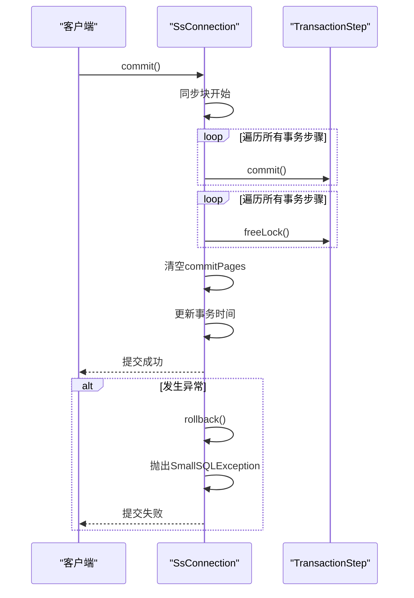
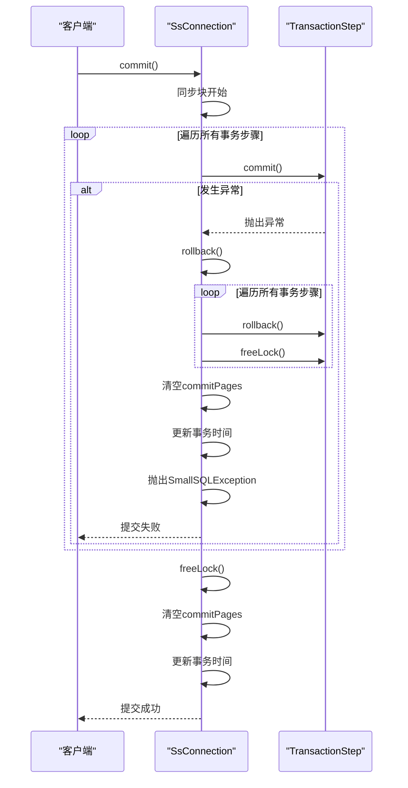
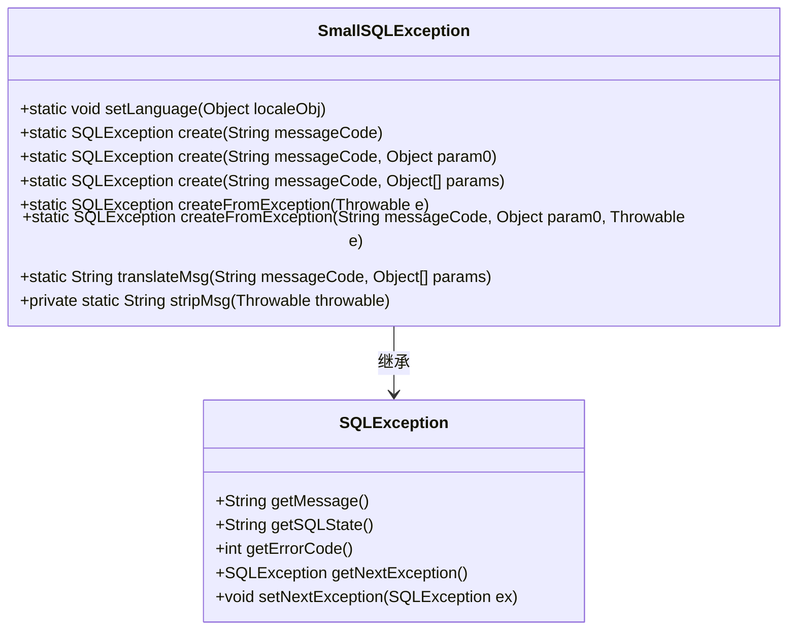
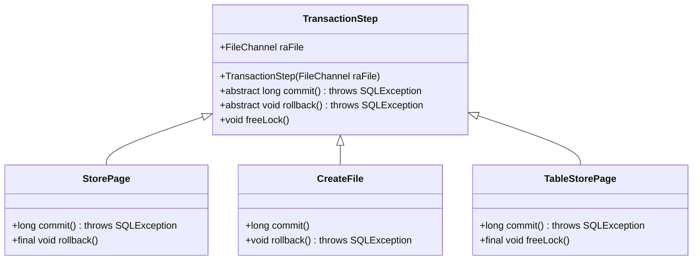
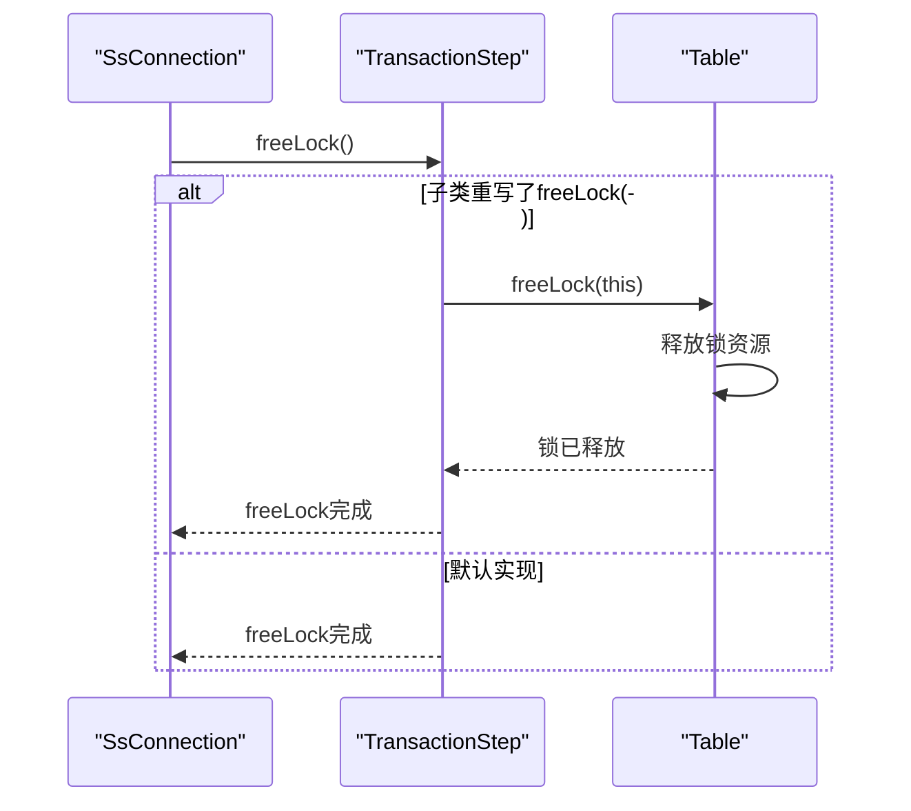

# 事务异常处理

<cite>
**本文档中引用的文件**  
- [SsConnection.java](file://src/main/java/io/leavesfly/smallsql/jdbc/SsConnection.java)
- [TransactionStep.java](file://src/main/java/io/leavesfly/smallsql/rdb/engine/TransactionStep.java)
- [SmallSQLException.java](file://src/main/java/io/leavesfly/smallsql/jdbc/SmallSQLException.java)
- [StorePage.java](file://src/main/java/io/leavesfly/smallsql/rdb/engine/store/StorePage.java)
- [CreateFile.java](file://src/main/java/io/leavesfly/smallsql/rdb/engine/store/CreateFile.java)
- [TableStorePage.java](file://src/main/java/io/leavesfly/smallsql/rdb/engine/store/TableStorePage.java)
</cite>

## 目录
1. [引言](#引言)
2. [事务提交中的异常处理机制](#事务提交中的异常处理机制)
3. [异常传播与回滚策略](#异常传播与回滚策略)
4. [SmallSQLException异常转换机制](#smallsqlsexception异常转换机制)
5. [TransactionStep抽象类的契约保证](#transactionstep抽象类的契约保证)
6. [freeLock()方法的实现与重写](#freelock方法的实现与重写)
7. [不同异常类型的处理方式](#不同异常类型的处理方式)
8. [调试建议与日志分析技巧](#调试建议与日志分析技巧)
9. [结论](#结论)

## 引言
SmallSQL 是一个轻量级的 Java 数据库管理系统，其事务处理机制设计精巧，确保了数据的一致性和完整性。本文档深入分析 SmallSQL 中事务异常处理的核心机制，重点关注 `commit()` 方法中 `try-catch` 块的设计意图、异常传播策略以及 `rollback()` 的自动触发机制。同时，探讨 `SmallSQLException.createFromException()` 方法在异常转换中的作用，分析 `TransactionStep` 抽象类的契约保证，以及 `freeLock()` 方法的默认实现与子类重写的必要性。最后，提供调试建议和日志分析技巧，帮助开发者定位事务相关的运行时问题。

## 事务提交中的异常处理机制
在 SmallSQL 中，事务的提交过程通过 `SsConnection.commit()` 方法实现。该方法采用 `try-catch` 块来捕获提交过程中可能发生的异常，确保在发生错误时能够进行适当的回滚操作。

**图示来源**  
- [SsConnection.java](file://src/main/java/io/leavesfly/smallsql/jdbc/SsConnection.java#L261-L283)

**本节来源**  
- [SsConnection.java](file://src/main/java/io/leavesfly/smallsql/jdbc/SsConnection.java#L261-L283)

## 异常传播与回滚策略
当事务提交过程中发生异常时，SmallSQL 会自动触发 `rollback()` 方法，确保数据的一致性。`SsConnection.commit()` 方法中的 `try-catch` 块捕获所有异常，并调用 `rollback()` 方法进行回滚。

**图示来源**  
- [SsConnection.java](file://src/main/java/io/leavesfly/smallsql/jdbc/SsConnection.java#L261-L283)
- [SsConnection.java](file://src/main/java/io/leavesfly/smallsql/jdbc/SsConnection.java#L324-L338)

**本节来源**  
- [SsConnection.java](file://src/main/java/io/leavesfly/smallsql/jdbc/SsConnection.java#L261-L283)
- [SsConnection.java](file://src/main/java/io/leavesfly/smallsql/jdbc/SsConnection.java#L324-L338)

## SmallSQLException异常转换机制
`SmallSQLException.createFromException()` 方法在异常转换中起着关键作用。它将底层异常（如 `IOException`）转换为 `SQLException`，并保留原始异常的堆栈信息，便于调试。

**图示来源**  
- [SmallSQLException.java](file://src/main/java/io/leavesfly/smallsql/jdbc/SmallSQLException.java#L1-L230)

**本节来源**  
- [SmallSQLException.java](file://src/main/java/io/leavesfly/smallsql/jdbc/SmallSQLException.java#L1-L230)

## TransactionStep抽象类的契约保证
`TransactionStep` 抽象类定义了事务步骤的基本契约，包括 `commit()` 和 `rollback()` 方法。这些方法确保了事务的原子性和一致性。

**图示来源**  
- [TransactionStep.java](file://src/main/java/io/leavesfly/smallsql/rdb/engine/TransactionStep.java#L41-L56)
- [StorePage.java](file://src/main/java/io/leavesfly/smallsql/rdb/engine/store/StorePage.java#L62-L83)
- [CreateFile.java](file://src/main/java/io/leavesfly/smallsql/rdb/engine/store/CreateFile.java#L61-L65)
- [TableStorePage.java](file://src/main/java/io/leavesfly/smallsql/rdb/engine/store/TableStorePage.java#L62-L73)

**本节来源**  
- [TransactionStep.java](file://src/main/java/io/leavesfly/smallsql/rdb/engine/TransactionStep.java#L41-L56)
- [StorePage.java](file://src/main/java/io/leavesfly/smallsql/rdb/engine/store/StorePage.java#L62-L83)
- [CreateFile.java](file://src/main/java/io/leavesfly/smallsql/rdb/engine/store/CreateFile.java#L61-L65)
- [TableStorePage.java](file://src/main/java/io/leavesfly/smallsql/rdb/engine/store/TableStorePage.java#L62-L73)

## freeLock()方法的实现与重写
`freeLock()` 方法的默认实现为空，但子类可以根据需要重写该方法，以释放特定的锁资源。例如，`TableStorePage` 类中的 `freeLock()` 方法会调用 `Table.freeLock()` 方法来释放表锁。

**图示来源**  
- [TransactionStep.java](file://src/main/java/io/leavesfly/smallsql/rdb/engine/TransactionStep.java#L51-L51)
- [TableStorePage.java](file://src/main/java/io/leavesfly/smallsql/rdb/engine/store/TableStorePage.java#L75-L77)
- [Table.java](file://src/main/java/io/leavesfly/smallsql/rdb/engine/Table.java#L529-L605)

**本节来源**  
- [TransactionStep.java](file://src/main/java/io/leavesfly/smallsql/rdb/engine/TransactionStep.java#L51-L51)
- [TableStorePage.java](file://src/main/java/io/leavesfly/smallsql/rdb/engine/store/TableStorePage.java#L75-L77)
- [Table.java](file://src/main/java/io/leavesfly/smallsql/rdb/engine/Table.java#L529-L605)

## 不同异常类型的处理方式
SmallSQL 能够处理多种异常类型，包括文件 I/O 错误、锁冲突等。每种异常类型都有相应的处理策略，确保系统的稳定性和数据的一致性。

- **文件 I/O 错误**：通过 `SmallSQLException.createFromException()` 方法将底层 I/O 异常转换为 `SQLException`，并记录详细的错误信息。
- **锁冲突**：在 `commit()` 和 `rollback()` 方法中，通过同步块和锁管理机制避免并发访问冲突，确保数据的一致性。

**本节来源**  
- [SsConnection.java](file://src/main/java/io/leavesfly/smallsql/jdbc/SsConnection.java#L261-L283)
- [StorePage.java](file://src/main/java/io/leavesfly/smallsql/rdb/engine/store/StorePage.java#L62-L83)
- [CreateFile.java](file://src/main/java/io/leavesfly/smallsql/rdb/engine/store/CreateFile.java#L70-L92)

## 调试建议与日志分析技巧
为了帮助开发者定位事务相关的运行时问题，以下是一些调试建议和日志分析技巧：

1. **启用日志记录**：在 `SsConnection` 构造函数中启用日志记录，以便捕获详细的事务操作信息。
2. **检查异常堆栈**：使用 `SmallSQLException.createFromException()` 方法捕获的异常堆栈信息，可以帮助定位问题的根源。
3. **分析日志文件**：定期检查日志文件，查找 `Commit` 和 `Rollback` 操作的记录，确保事务的正确执行。
4. **使用断点调试**：在 `commit()` 和 `rollback()` 方法中设置断点，逐步跟踪事务的执行过程，确保每一步都按预期进行。

**本节来源**  
- [SsConnection.java](file://src/main/java/io/leavesfly/smallsql/jdbc/SsConnection.java#L261-L283)
- [SmallSQLException.java](file://src/main/java/io/leavesfly/smallsql/jdbc/SmallSQLException.java#L1-L230)

## 结论
SmallSQL 的事务异常处理机制设计精巧，通过 `try-catch` 块捕获异常并自动触发 `rollback()` 方法，确保了数据的一致性和完整性。`SmallSQLException.createFromException()` 方法在异常转换中起着关键作用，保留了原始异常的堆栈信息，便于调试。`TransactionStep` 抽象类定义了事务步骤的基本契约，确保了事务的原子性和一致性。`freeLock()` 方法的默认实现为空，但子类可以根据需要重写该方法，以释放特定的锁资源。通过启用日志记录、检查异常堆栈、分析日志文件和使用断点调试，开发者可以有效地定位和解决事务相关的运行时问题。