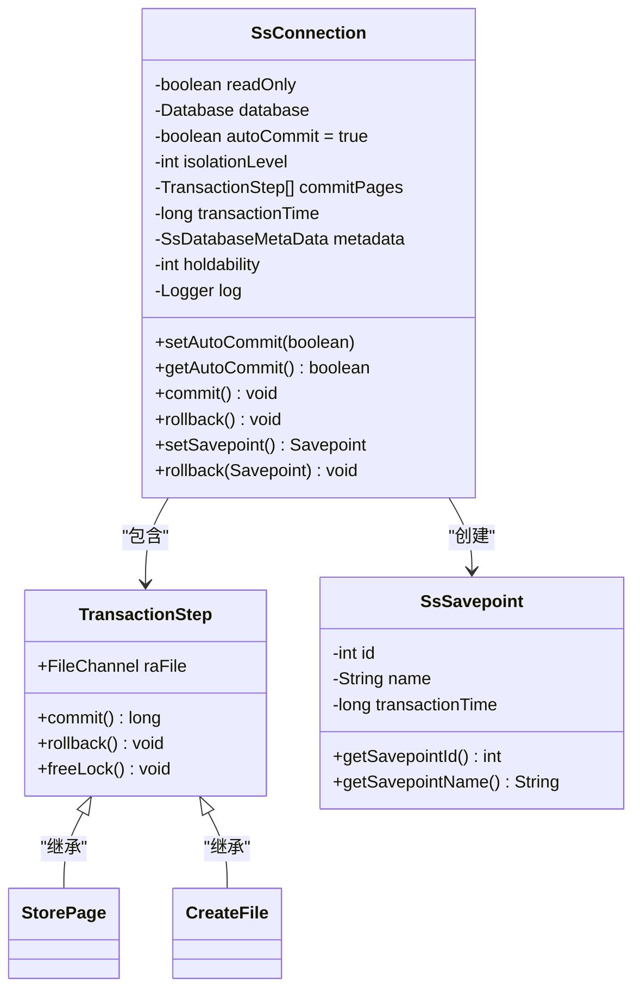
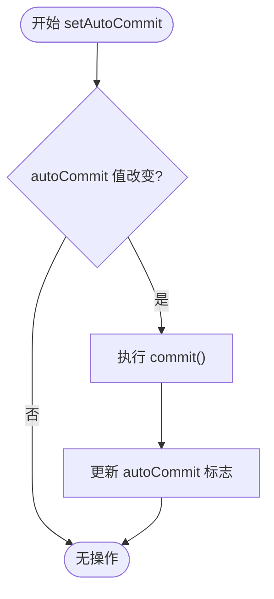
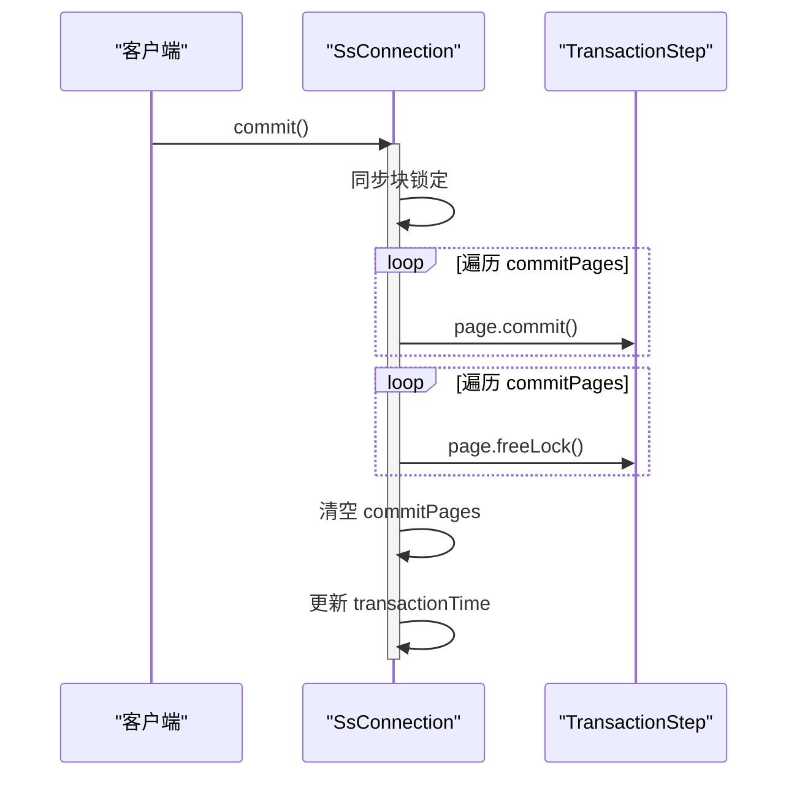
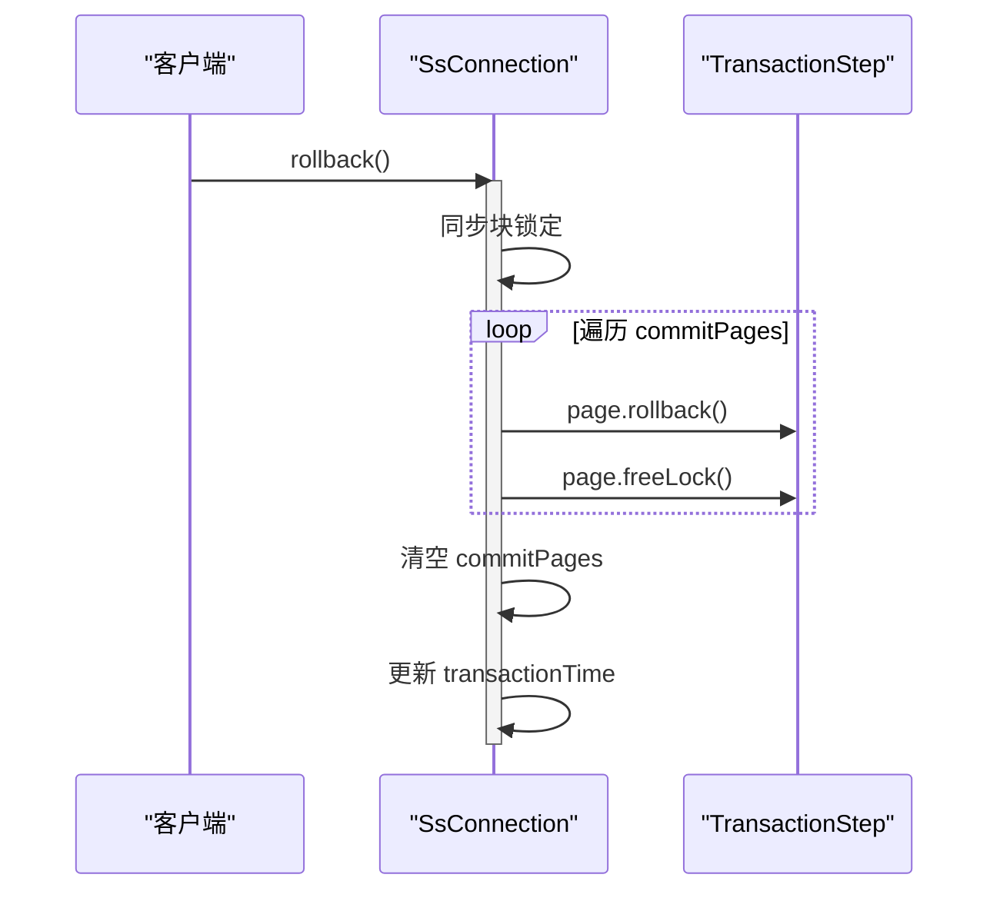
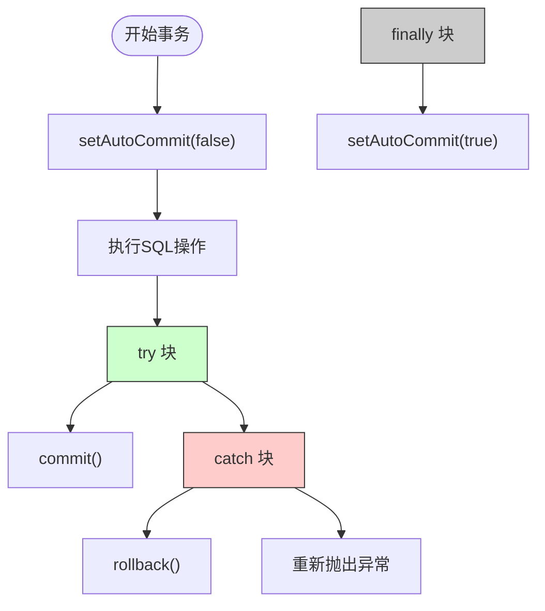

# 事务生命周期管理

<cite>
**本文档中引用的文件**  
- [SsConnection.java](file://src/main/java/io/leavesfly/smallsql/jdbc/SsConnection.java)
- [TransactionStep.java](file://src/main/java/io/leavesfly/smallsql/rdb/engine/TransactionStep.java)
- [SsSavepoint.java](file://src/main/java/io/leavesfly/smallsql/jdbc/statement/SsSavepoint.java)
</cite>

## 目录
1. [简介](#简介)
2. [事务生命周期核心机制](#事务生命周期核心机制)
3. [自动提交模式控制](#自动提交模式控制)
4. [提交与回滚实现流程](#提交与回滚实现流程)
5. [保存点管理与事务时间验证](#保存点管理与事务时间验证)
6. [多线程环境下的事务一致性](#多线程环境下的事务一致性)
7. [最佳实践与异常处理](#最佳实践与异常处理)
8. [结论](#结论)

## 简介
SmallSQL 是一个轻量级的 Java 数据库管理系统，其事务管理机制围绕 `SsConnection` 类构建。本文档深入分析 SmallSQL 中事务的完整生命周期，重点解析事务的启动、提交、回滚以及保存点管理机制。通过研究 `autoCommit` 属性、`commit()` 和 `rollback()` 方法的内部实现，揭示其如何保障数据一致性与并发安全。

**Section sources**
- [SsConnection.java](file://src/main/java/io/leavesfly/smallsql/jdbc/SsConnection.java#L76-L120)

## 事务生命周期核心机制
SmallSQL 的事务生命周期由 `SsConnection` 类中的多个关键字段协同管理。每个连接实例维护一个独立的事务上下文，通过 `commitPages` 列表记录所有待提交的事务步骤，确保原子性操作。



**Diagram sources**
- [SsConnection.java](file://src/main/java/io/leavesfly/smallsql/jdbc/SsConnection.java#L76-L120)
- [TransactionStep.java](file://src/main/java/io/leavesfly/smallsql/rdb/engine/TransactionStep.java#L35-L56)
- [SsSavepoint.java](file://src/main/java/io/leavesfly/smallsql/jdbc/statement/SsSavepoint.java#L30-L64)

**Section sources**
- [SsConnection.java](file://src/main/java/io/leavesfly/smallsql/jdbc/SsConnection.java#L76-L120)
- [TransactionStep.java](file://src/main/java/io/leavesfly/smallsql/rdb/engine/TransactionStep.java#L35-L56)

## 自动提交模式控制
`autoCommit` 属性是控制事务边界的开关，默认值为 `true`，表示每个 SQL 语句执行后立即提交。当设置为 `false` 时，开启显式事务控制，多个操作将被纳入同一事务中，直到显式调用 `commit()` 或 `rollback()`。



**Diagram sources**
- [SsConnection.java](file://src/main/java/io/leavesfly/smallsql/jdbc/SsConnection.java#L208-L254)

**Section sources**
- [SsConnection.java](file://src/main/java/io/leavesfly/smallsql/jdbc/SsConnection.java#L208-L254)

## 提交与回滚实现流程
`commit()` 和 `rollback()` 方法均使用同步块确保线程安全，防止并发修改事务状态。事务步骤的处理遵循严格的顺序，保障数据一致性。

### 提交流程


### 回滚流程


**Diagram sources**
- [SsConnection.java](file://src/main/java/io/leavesfly/smallsql/jdbc/SsConnection.java#L256-L283)
- [SsConnection.java](file://src/main/java/io/leavesfly/smallsql/jdbc/SsConnection.java#L310-L338)

**Section sources**
- [SsConnection.java](file://src/main/java/io/leavesfly/smallsql/jdbc/SsConnection.java#L256-L338)

## 保存点管理与事务时间验证
保存点（Savepoint）允许在事务中设置中间状态，支持部分回滚。`SsSavepoint` 类通过 `transactionTime` 字段验证保存点的有效性，防止跨事务使用。

### 保存点创建与回滚
```mermaid
flowchart TD
A([setSavepoint()]) --> B["创建 SsSavepoint 对象"]
B --> C["记录当前 commitPages.size()"]
C --> D["复制 transactionTime"]
D --> E([返回 Savepoint])
F([rollback(Savepoint)]) --> G{"是否 SsSavepoint?"}
G --> |否| H["抛出异常"]
G --> |是| I{"transactionTime 匹配?"}
I --> |否| J["抛出 SAVEPT_INVALID_TRANS"]
I --> |是| K["调用 rollback(savepointId)"]
K --> L["从 commitPages 移除并回滚"]
```

**Diagram sources**
- [SsConnection.java](file://src/main/java/io/leavesfly/smallsql/jdbc/SsConnection.java#L497-L543)
- [SsConnection.java](file://src/main/java/io/leavesfly/smallsql/jdbc/SsConnection.java#L545-L578)
- [SsSavepoint.java](file://src/main/java/io/leavesfly/smallsql/jdbc/statement/SsSavepoint.java#L30-L64)

**Section sources**
- [SsConnection.java](file://src/main/java/io/leavesfly/smallsql/jdbc/SsConnection.java#L497-L578)
- [SsSavepoint.java](file://src/main/java/io/leavesfly/smallsql/jdbc/statement/SsSavepoint.java#L30-L64)

## 多线程环境下的事务一致性
`SsConnection` 通过 `synchronized(getMonitor())` 确保事务操作的原子性。`getMonitor()` 返回连接实例本身，作为同步监视器，防止多个线程同时修改 `commitPages` 列表。

```mermaid
graph TD
A[线程1: commit()] --> B["获取连接监视器锁"]
B --> C["执行提交流程"]
C --> D["释放锁"]
E[线程2: rollback()] --> F["等待监视器锁"]
F --> G["获取锁后执行回滚"]
G --> H["释放锁"]
style B fill:#f9f,stroke:#333
style F fill:#f96,stroke:#333
```

**Diagram sources**
- [SsConnection.java](file://src/main/java/io/leavesfly/smallsql/jdbc/SsConnection.java#L256-L283)
- [SsConnection.java](file://src/main/java/io/leavesfly/smallsql/jdbc/SsConnection.java#L310-L338)

**Section sources**
- [SsConnection.java](file://src/main/java/io/leavesfly/smallsql/jdbc/SsConnection.java#L256-L338)

## 最佳实践与异常处理
### 正确的事务管理流程


### 连接关闭时的自动回滚
当调用 `close()` 方法时，系统会自动执行 `rollback()`，确保未提交的事务不会污染数据库状态。

```java
@Override
public void close() throws SQLException {
    rollback(); // 自动回滚未提交事务
    database = null;
    commitPages = null;
    Database.closeConnection(this);
}
```

**Section sources**
- [SsConnection.java](file://src/main/java/io/leavesfly/smallsql/jdbc/SsConnection.java#L340-L348)

## 结论
SmallSQL 通过 `SsConnection` 类实现了完整的事务生命周期管理。其核心机制包括：
- 使用 `autoCommit` 属性灵活切换自动提交与显式事务模式
- 通过 `commitPages` 列表集中管理事务步骤，确保原子性
- 在 `commit()` 和 `rollback()` 中使用同步块保障多线程安全
- 利用 `transactionTime` 验证保存点有效性，防止跨事务误用
- 在连接关闭时自动回滚，避免脏数据残留

该设计简洁高效，适用于嵌入式场景，为开发者提供了可靠的事务控制能力。