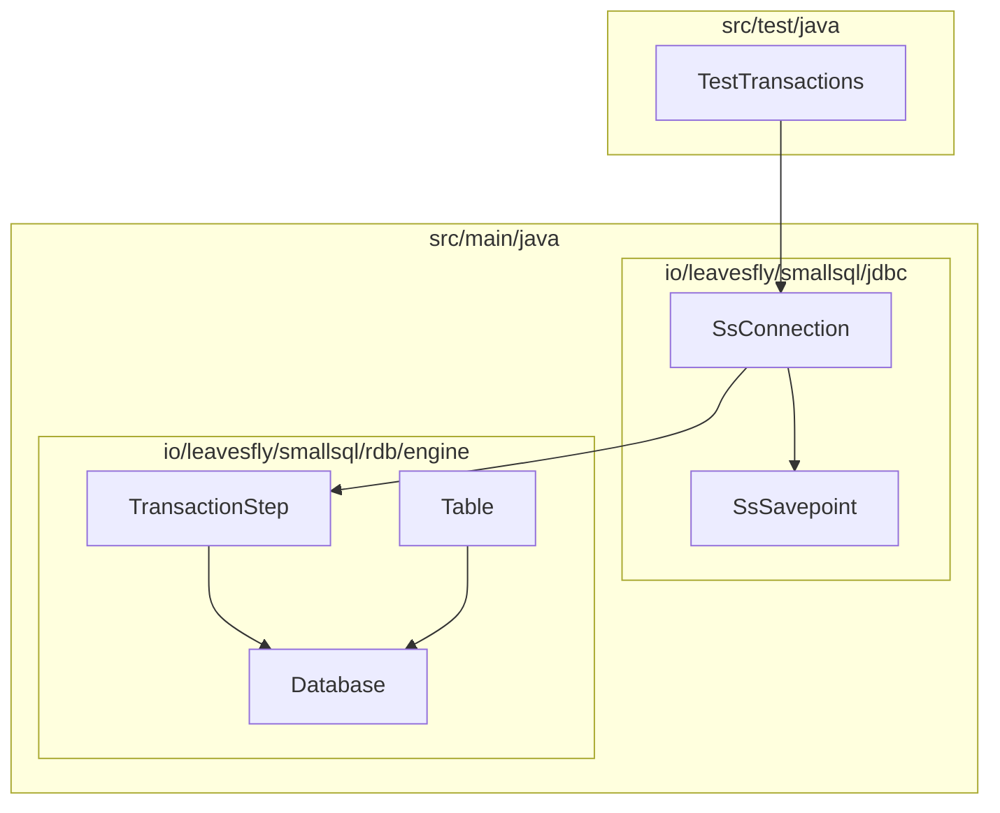
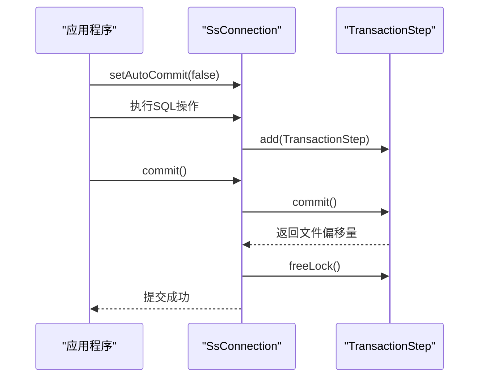
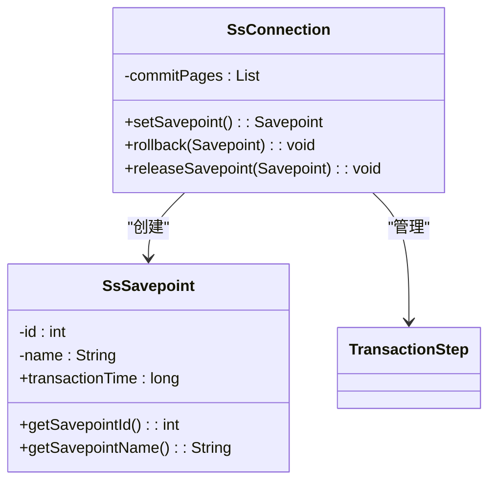
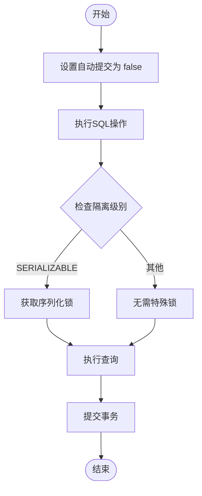
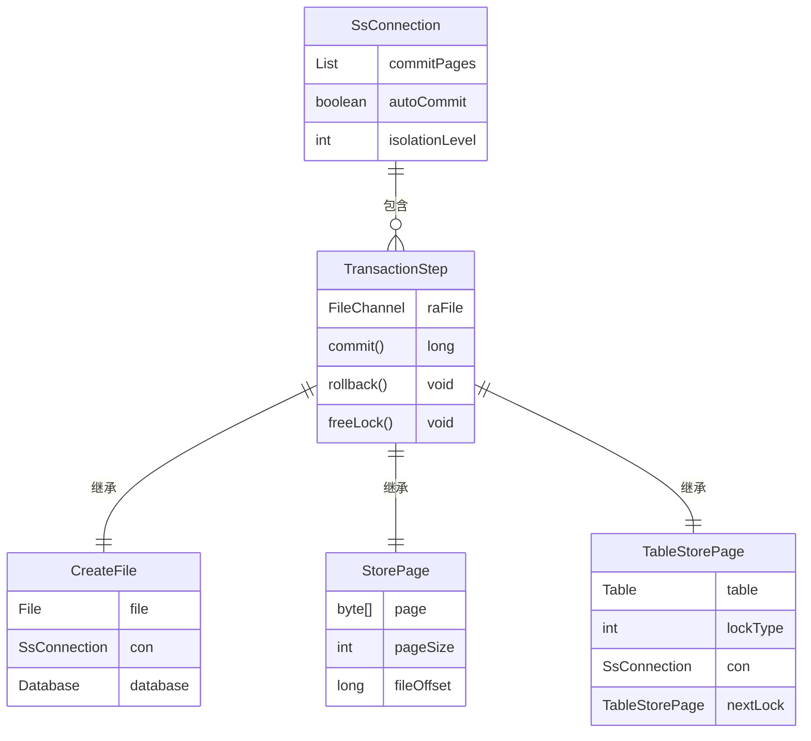

# 事务管理

<cite>
**本文档引用的文件**   
- [SsConnection.java](file://src/main/java/io/leavesfly/smallsql/jdbc/SsConnection.java)
- [SsSavepoint.java](file://src/main/java/io/leavesfly/smallsql/jdbc/statement/SsSavepoint.java)
- [TransactionStep.java](file://src/main/java/io/leavesfly/smallsql/rdb/engine/TransactionStep.java)
- [TestTransactions.java](file://src/test/java/io/leavesfly/smallsql/junit/sql/tpl/TestTransactions.java)
- [Database.java](file://src/main/java/io/leavesfly/smallsql/rdb/engine/Database.java)
- [Table.java](file://src/main/java/io/leavesfly/smallsql/rdb/engine/Table.java)
</cite>

## 目录
1. [简介](#简介)
2. [项目结构](#项目结构)
3. [核心组件](#核心组件)
4. [事务生命周期管理](#事务生命周期管理)
5. [保存点机制](#保存点机制)
6. [多线程环境下的事务隔离](#多线程环境下的事务隔离)
7. [事务恢复与持久化](#事务恢复与持久化)
8. [配置建议与常见问题排查](#配置建议与常见问题排查)
9. [结论](#结论)

## 简介
SmallSQL 是一个轻量级的 Java 数据库管理系统，支持完整的 ACID 事务特性。本文档详细阐述了 SmallSQL 中事务管理的实现机制，包括事务的生命周期控制、保存点管理、多线程隔离以及事务恢复等核心功能。通过分析 SsConnection、SsSavepoint 和 TransactionStep 等关键类的实现，深入解析了事务的提交、回滚、嵌套控制和持久化过程。文档还提供了多线程环境下的事务隔离示例和配置建议，帮助开发者正确使用事务功能，避免资源泄漏和并发问题。

## 项目结构
SmallSQL 的项目结构清晰地划分了不同功能模块。核心事务管理功能主要位于 `src/main/java/io/leavesfly/smallsql/jdbc` 和 `src/main/java/io/leavesfly/smallsql/rdb/engine` 目录下。`jdbc` 包包含了 JDBC 接口的实现，如 SsConnection 和 SsSavepoint，负责与应用程序交互。`rdb/engine` 包则包含了数据库引擎的核心实现，如 TransactionStep 和 Database，负责事务的底层处理和持久化。测试代码位于 `src/test/java/io/leavesfly/smallsql/junit/sql/tpl` 目录下，提供了丰富的事务测试用例。

**图表来源**
- [SsConnection.java](file://src/main/java/io/leavesfly/smallsql/jdbc/SsConnection.java)
- [TransactionStep.java](file://src/main/java/io/leavesfly/smallsql/rdb/engine/TransactionStep.java)
- [Database.java](file://src/main/java/io/leavesfly/smallsql/rdb/engine/Database.java)
- [Table.java](file://src/main/java/io/leavesfly/smallsql/rdb/engine/Table.java)
- [TestTransactions.java](file://src/test/java/io/leavesfly/smallsql/junit/sql/tpl/TestTransactions.java)

**章节来源**
- [SsConnection.java](file://src/main/java/io/leavesfly/smallsql/jdbc/SsConnection.java)
- [TransactionStep.java](file://src/main/java/io/leavesfly/smallsql/rdb/engine/TransactionStep.java)
- [Database.java](file://src/main/java/io/leavesfly/smallsql/rdb/engine/Database.java)
- [Table.java](file://src/main/java/io/leavesfly/smallsql/rdb/engine/Table.java)
- [TestTransactions.java](file://src/test/java/io/leavesfly/smallsql/junit/sql/tpl/TestTransactions.java)

## 核心组件
SmallSQL 的事务管理由多个核心组件协同工作。SsConnection 类实现了 JDBC 的 Connection 接口，是应用程序与数据库交互的入口，负责管理事务的自动提交模式、隔离级别和生命周期。SsSavepoint 类实现了 JDBC 的 Savepoint 接口，用于支持事务的嵌套控制和部分回滚。TransactionStep 类是事务持久化的基础，每个事务操作都会生成一个 TransactionStep 实例，记录在内存中，直到事务提交时才写入磁盘。Database 类管理数据库实例和连接，确保事务的原子性和一致性。

**章节来源**
- [SsConnection.java](file://src/main/java/io/leavesfly/smallsql/jdbc/SsConnection.java)
- [SsSavepoint.java](file://src/main/java/io/leavesfly/smallsql/jdbc/statement/SsSavepoint.java)
- [TransactionStep.java](file://src/main/java/io/leavesfly/smallsql/rdb/engine/TransactionStep.java)
- [Database.java](file://src/main/java/io/leavesfly/smallsql/rdb/engine/Database.java)

## 事务生命周期管理
事务的生命周期通过 SsConnection 类进行管理。默认情况下，连接处于自动提交模式（autoCommit=true），每个 SQL 语句都会立即提交。通过调用 `setAutoCommit(false)` 可以显式开启一个事务，后续的 SQL 操作将作为同一个事务的一部分。事务的提交和回滚分别通过 `commit()` 和 `rollback()` 方法实现。在提交过程中，SsConnection 会遍历 `commitPages` 列表，依次调用每个 TransactionStep 的 `commit()` 方法，将更改持久化到磁盘，然后释放锁并清空事务日志。如果在提交过程中发生异常，会自动触发回滚操作，确保数据的一致性。

**图表来源**
- [SsConnection.java](file://src/main/java/io/leavesfly/smallsql/jdbc/SsConnection.java#L256-L283)
- [TransactionStep.java](file://src/main/java/io/leavesfly/smallsql/rdb/engine/TransactionStep.java#L41-L56)

**章节来源**
- [SsConnection.java](file://src/main/java/io/leavesfly/smallsql/jdbc/SsConnection.java)
- [TransactionStep.java](file://src/main/java/io/leavesfly/smallsql/rdb/engine/TransactionStep.java)

## 保存点机制
保存点（Savepoint）机制允许在事务中设置中间点，实现部分回滚。通过调用 `setSavepoint()` 方法可以创建一个保存点，返回一个 SsSavepoint 对象。该对象记录了当前事务的大小和开始时间。回滚到指定保存点时，调用 `rollback(Savepoint)` 方法，SsConnection 会从 `commitPages` 列表中移除该保存点之后的所有 TransactionStep，并依次调用它们的 `rollback()` 方法。释放保存点通过 `releaseSavepoint()` 方法实现，该方法将保存点的事务时间置零，使其失效。SsSavepoint 类的设计确保了保存点只能在同一个事务中使用，防止跨事务的错误操作。

**图表来源**
- [SsSavepoint.java](file://src/main/java/io/leavesfly/smallsql/jdbc/statement/SsSavepoint.java#L40-L63)
- [SsConnection.java](file://src/main/java/io/leavesfly/smallsql/jdbc/SsConnection.java#L500-L530)

**章节来源**
- [SsSavepoint.java](file://src/main/java/io/leavesfly/smallsql/jdbc/statement/SsSavepoint.java)
- [SsConnection.java](file://src/main/java/io/leavesfly/smallsql/jdbc/SsConnection.java)

## 多线程环境下的事务隔离
在多线程环境下，SmallSQL 通过锁机制和事务隔离级别来保证数据的一致性。每个事务操作都需要获取相应的锁，如读锁、写锁或表锁。SsConnection 使用 `getMonitor()` 方法获取连接的监视器对象，确保同一时间只有一个线程可以执行事务操作。事务隔离级别通过 `setTransactionIsolation()` 方法设置，支持 READ_UNCOMMITTED、READ_COMMITTED、REPEATABLE_READ 和 SERIALIZABLE 等级别。在 SERIALIZABLE 模式下，事务会获取表的序列化锁，阻止其他事务对表进行修改，从而保证最高的隔离性。测试用例 TestTransactions.java 中的 `testReadSerialized()` 方法演示了如何在多线程环境中正确管理连接生命周期，避免资源泄漏。

**图表来源**
- [SsConnection.java](file://src/main/java/io/leavesfly/smallsql/jdbc/SsConnection.java#L350-L370)
- [TestTransactions.java](file://src/test/java/io/leavesfly/smallsql/junit/sql/tpl/TestTransactions.java#L428-L461)

**章节来源**
- [SsConnection.java](file://src/main/java/io/leavesfly/smallsql/jdbc/SsConnection.java)
- [TestTransactions.java](file://src/test/java/io/leavesfly/smallsql/junit/sql/tpl/TestTransactions.java)

## 事务恢复与持久化
事务的恢复和持久化由 TransactionStep 类及其子类实现。每个事务操作，如创建文件、插入数据或更新索引，都会生成一个对应的 TransactionStep 实例。这些实例被添加到 SsConnection 的 `commitPages` 列表中，形成一个事务日志。当事务提交时，SsConnection 会遍历该列表，调用每个 TransactionStep 的 `commit()` 方法，将更改写入磁盘。如果事务被回滚，`rollback()` 方法会被调用，撤销所有未提交的更改。TransactionStep 的 `freeLock()` 方法用于释放事务持有的锁。这种设计确保了事务的原子性和持久性，即使在系统崩溃的情况下，也可以通过重放事务日志来恢复数据。

**图表来源**
- [TransactionStep.java](file://src/main/java/io/leavesfly/smallsql/rdb/engine/TransactionStep.java#L35-L56)
- [SsConnection.java](file://src/main/java/io/leavesfly/smallsql/jdbc/SsConnection.java#L74-L715)
- [CreateFile.java](file://src/main/java/io/leavesfly/smallsql/rdb/engine/store/CreateFile.java#L35-L95)
- [StorePage.java](file://src/main/java/io/leavesfly/smallsql/rdb/engine/store/StorePage.java#L35-L90)
- [Table.java](file://src/main/java/io/leavesfly/smallsql/rdb/engine/Table.java#L35-L90)

**章节来源**
- [TransactionStep.java](file://src/main/java/io/leavesfly/smallsql/rdb/engine/TransactionStep.java)
- [SsConnection.java](file://src/main/java/io/leavesfly/smallsql/jdbc/SsConnection.java)
- [CreateFile.java](file://src/main/java/io/leavesfly/smallsql/rdb/engine/store/CreateFile.java)
- [StorePage.java](file://src/main/java/io/leavesfly/smallsql/rdb/engine/store/StorePage.java)
- [Table.java](file://src/main/java/io/leavesfly/smallsql/rdb/engine/Table.java)

## 配置建议与常见问题排查
在使用 SmallSQL 的事务功能时，建议根据应用需求合理设置事务隔离级别。对于读多写少的场景，可以使用 READ_COMMITTED 级别以提高并发性能；对于需要强一致性的场景，则应使用 SERIALIZABLE 级别。为了避免死锁，应尽量减少事务的持有时间，并按固定顺序访问资源。常见的异常包括事务超时和保存点无效。事务超时通常是由于长时间持有锁导致的，可以通过优化查询性能或调整超时设置来解决。保存点无效异常（SAVEPT_INVALID_TRANS）表明保存点与当前事务不匹配，通常是因为在不同的事务中使用了同一个保存点对象。正确的做法是在同一个事务中创建和使用保存点。

**章节来源**
- [SsConnection.java](file://src/main/java/io/leavesfly/smallsql/jdbc/SsConnection.java)
- [SsSavepoint.java](file://src/main/java/io/leavesfly/smallsql/jdbc/statement/SsSavepoint.java)
- [TestTransactions.java](file://src/test/java/io/leavesfly/smallsql/junit/sql/tpl/TestTransactions.java)

## 结论
SmallSQL 通过 SsConnection、SsSavepoint 和 TransactionStep 等核心组件，实现了完整的 ACID 事务特性。其事务管理机制设计合理，既保证了数据的一致性和持久性，又提供了灵活的隔离级别和保存点功能。在多线程环境下，通过锁机制和事务隔离级别有效防止了并发问题。开发者应根据具体需求合理配置事务参数，遵循最佳实践，以充分发挥 SmallSQL 的事务管理能力。