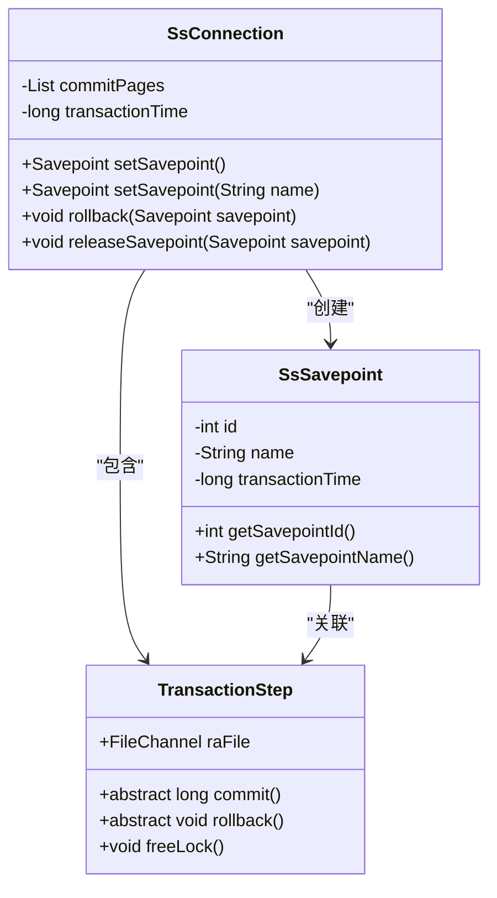
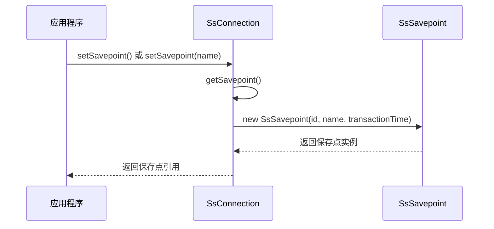
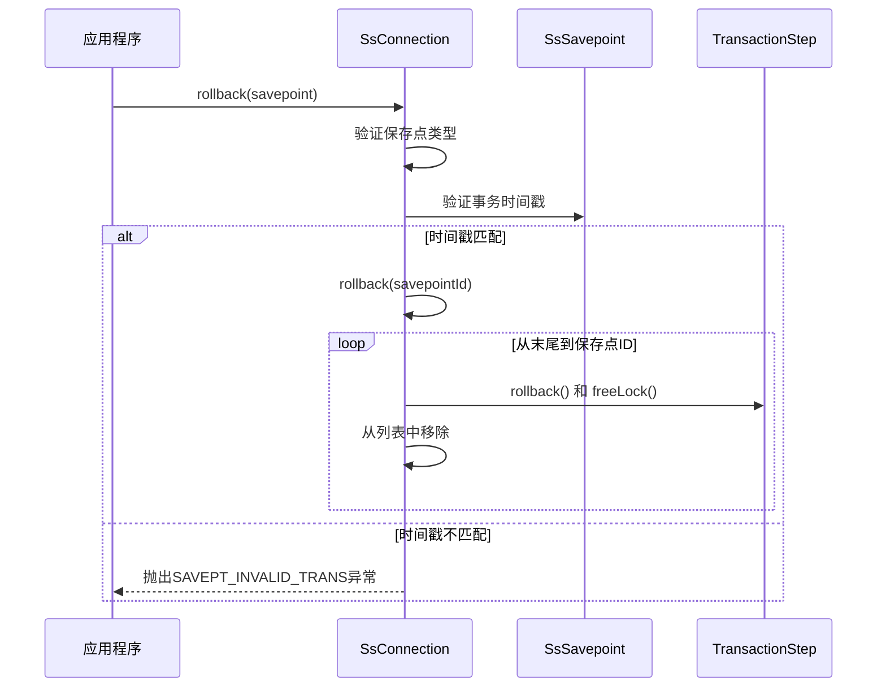
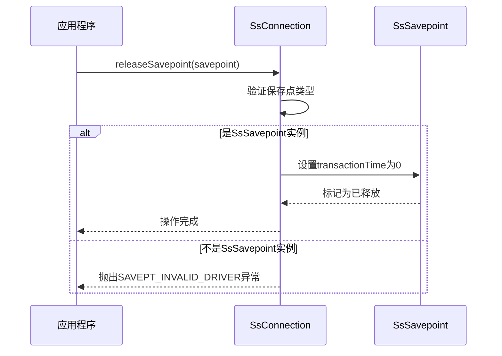
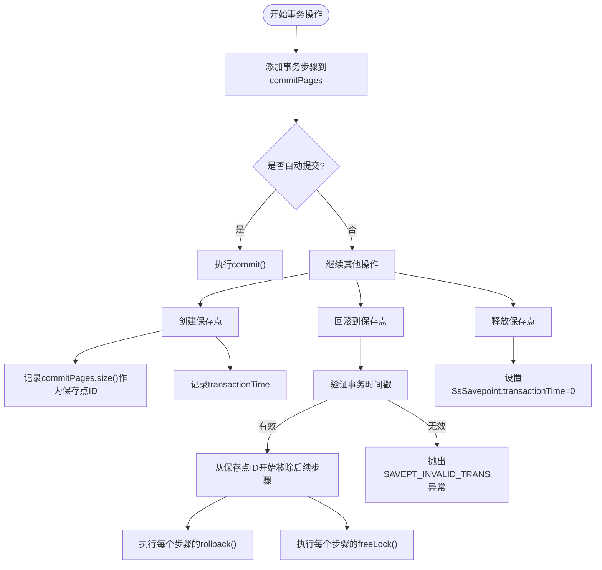
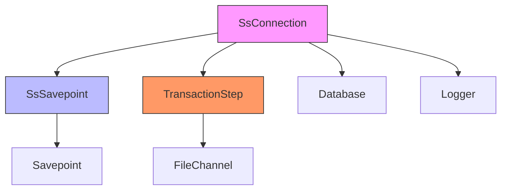

# 保存点管理

<cite>
**本文档引用的文件**
- [SsSavepoint.java](file://src/main/java/io/leavesfly/smallsql/jdbc/statement/SsSavepoint.java)
- [SsConnection.java](file://src/main/java/io/leavesfly/smallsql/jdbc/SsConnection.java)
- [TransactionStep.java](file://src/main/java/io/leavesfly/smallsql/rdb/engine/TransactionStep.java)
</cite>

## 目录
1. [引言](#引言)
2. [核心组件](#核心组件)
3. [架构概述](#架构概述)
4. [详细组件分析](#详细组件分析)
5. [依赖分析](#依赖分析)
6. [性能考虑](#性能考虑)
7. [故障排除指南](#故障排除指南)
8. [结论](#结论)

## 引言
本文档详细阐述了SmallSQL数据库系统中保存点管理机制的设计与实现。重点分析了SsSavepoint类的设计原理及其与SsConnection类的协作机制，深入探讨了事务控制中的关键操作，包括保存点的创建、回滚和释放。通过分析相关类的交互关系和方法实现，为开发者提供了对嵌套事务控制机制的全面理解。

## 核心组件
本节分析保存点管理的核心组件，包括SsSavepoint类和SsConnection类的关键属性与方法。SsSavepoint类实现了JDBC的Savepoint接口，用于表示事务中的特定保存点；SsConnection类则负责管理事务状态和保存点操作。TransactionStep抽象类定义了事务步骤的基本行为，是事务回滚和提交操作的基础。

**核心组件**
- [SsSavepoint.java](file://src/main/java/io/leavesfly/smallsql/jdbc/statement/SsSavepoint.java#L1-L65)
- [SsConnection.java](file://src/main/java/io/leavesfly/smallsql/jdbc/SsConnection.java#L74-L715)
- [TransactionStep.java](file://src/main/java/io/leavesfly/smallsql/rdb/engine/TransactionStep.java#L1-L57)

## 架构概述
保存点管理机制的架构基于SsConnection类维护的事务步骤列表和SsSavepoint类表示的保存点标识。当执行数据库操作时，相关的事务步骤被添加到commitPages列表中。保存点通过记录当前事务步骤列表的大小来标识其位置，并通过事务时间戳确保保存点的有效性。



**图示来源**
- [SsConnection.java](file://src/main/java/io/leavesfly/smallsql/jdbc/SsConnection.java#L74-L715)
- [SsSavepoint.java](file://src/main/java/io/leavesfly/smallsql/jdbc/statement/SsSavepoint.java#L1-L65)
- [TransactionStep.java](file://src/main/java/io/leavesfly/smallsql/rdb/engine/TransactionStep.java#L1-L57)

## 详细组件分析
本节深入分析保存点管理的关键组件及其交互机制，重点阐述保存点的创建、回滚和释放操作的实现细节。

### SsSavepoint类分析
SsSavepoint类是JDBC Savepoint接口的具体实现，用于表示事务中的特定保存点。该类通过保存点ID、名称和事务时间戳三个关键属性来标识和验证保存点的有效性。

```mermaid
classDiagram
class SsSavepoint {
-int id
-String name
-long transactionTime
+SsSavepoint(int id, String name, long transactionTime)
+int getSavepointId()
+String getSavepointName()
}
note right of SsSavepoint
id : 保存点对应的事务步骤列表索引
name : 保存点的名称可为空
transactionTime : 创建保存点时的事务时间戳
end note
```

**图示来源**
- [SsSavepoint.java](file://src/main/java/io/leavesfly/smallsql/jdbc/statement/SsSavepoint.java#L1-L65)

### SsConnection类的保存点操作分析
SsConnection类提供了保存点管理的核心方法，包括setSavepoint()、rollback(Savepoint)和releaseSavepoint()。这些方法协同工作，实现了完整的保存点管理功能。

#### 保存点创建流程


**图示来源**
- [SsConnection.java](file://src/main/java/io/leavesfly/smallsql/jdbc/SsConnection.java#L650-L660)
- [SsSavepoint.java](file://src/main/java/io/leavesfly/smallsql/jdbc/statement/SsSavepoint.java#L1-L65)

#### 保存点回滚流程


**图示来源**
- [SsConnection.java](file://src/main/java/io/leavesfly/smallsql/jdbc/SsConnection.java#L662-L675)
- [TransactionStep.java](file://src/main/java/io/leavesfly/smallsql/rdb/engine/TransactionStep.java#L1-L57)

#### 保存点释放流程


**图示来源**
- [SsConnection.java](file://src/main/java/io/leavesfly/smallsql/jdbc/SsConnection.java#L677-L687)

### 事务步骤管理分析
事务步骤管理是保存点机制的基础，SsConnection类通过commitPages列表维护所有未提交的事务步骤。



**图示来源**
- [SsConnection.java](file://src/main/java/io/leavesfly/smallsql/jdbc/SsConnection.java#L249-L265)
- [TransactionStep.java](file://src/main/java/io/leavesfly/smallsql/rdb/engine/TransactionStep.java#L1-L57)

## 依赖分析
保存点管理机制涉及多个类之间的紧密协作，形成了清晰的依赖关系。SsConnection类作为核心协调者，依赖于SsSavepoint类表示保存点状态，同时管理TransactionStep对象的生命周期。



**图示来源**
- [SsConnection.java](file://src/main/java/io/leavesfly/smallsql/jdbc/SsConnection.java#L74-L715)
- [SsSavepoint.java](file://src/main/java/io/leavesfly/smallsql/jdbc/statement/SsSavepoint.java#L1-L65)
- [TransactionStep.java](file://src/main/java/io/leavesfly/smallsql/rdb/engine/TransactionStep.java#L1-L57)

## 性能考虑
保存点管理机制在设计时考虑了性能因素。通过使用ArrayList存储事务步骤，确保了添加操作的高效性。保存点的创建操作仅涉及获取列表大小和创建简单对象，开销极小。回滚操作的时间复杂度与需要回滚的事务步骤数量成正比，而释放保存点的操作则是常数时间复杂度。

在高并发场景下，所有保存点相关操作都通过SsConnection的监视器进行同步，确保了线程安全性，但可能成为性能瓶颈。建议在不需要嵌套事务控制的场景下避免频繁创建和释放保存点，以减少同步开销。

## 故障排除指南
本节提供常见保存点相关问题的排查方法和解决方案。

### 无效保存点引用问题
当尝试回滚或释放一个无效的保存点时，系统会抛出相应的异常。常见原因包括：

1. **跨事务使用保存点**：保存点只能在创建它的事务中使用
2. **已释放的保存点**：释放后的保存点不能再用于回滚操作
3. **非SsSavepoint实例**：使用了其他驱动程序创建的保存点实例

**排查方法**：
- 检查异常类型：SAVEPT_INVALID_TRANS表示事务不匹配，SAVEPT_INVALID_DRIVER表示驱动程序不匹配
- 确认保存点是在当前事务中创建的
- 确保没有重复释放同一个保存点

### 事务时间戳验证失败
事务时间戳用于确保保存点的有效性。当事务被提交或回滚后，新的事务会生成新的时间戳，导致原有保存点失效。

**解决方案**：
- 在事务提交或回滚后，所有之前的保存点都将失效，需要重新创建
- 避免在长时间运行的事务中创建过多保存点，以减少内存占用和潜在的并发问题

### 嵌套事务控制示例
```mermaid
sequenceDiagram
participant App as 应用程序
participant Conn as SsConnection
App->>Conn : setAutoCommit(false)
App->>Conn : 执行SQL操作1
App->>Conn : setSavepoint("sp1")
App->>Conn : 执行SQL操作2
App->>Conn : setSavepoint("sp2")
App->>Conn : 执行SQL操作3
App->>Conn : rollback("sp2")
App->>Conn : 执行SQL操作4
App->>Conn : commit()
note right of Conn
操作3被回滚
操作1、4和操作2的更改被提交
end note
```

**图示来源**
- [SsConnection.java](file://src/main/java/io/leavesfly/smallsql/jdbc/SsConnection.java#L650-L687)

## 结论
SmallSQL的保存点管理机制通过SsSavepoint类和SsConnection类的协同工作，提供了完整的嵌套事务控制功能。该设计遵循JDBC规范，同时通过事务时间戳验证确保了保存点的安全性。理解保存点ID与TransactionStep列表索引的对应关系，以及事务时间戳的验证机制，对于正确使用和故障排除保存点功能至关重要。在实际应用中，应合理规划保存点的使用，避免过度嵌套，以确保事务处理的效率和可靠性。