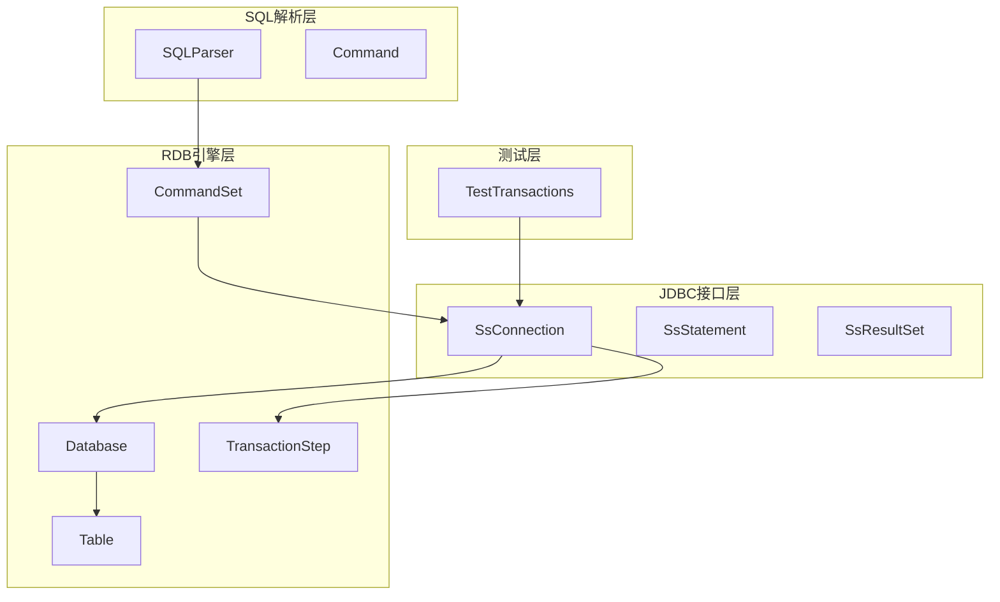
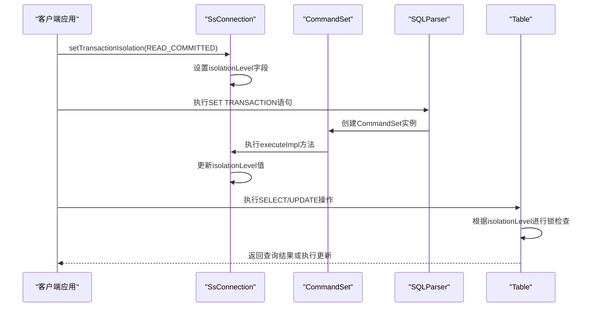
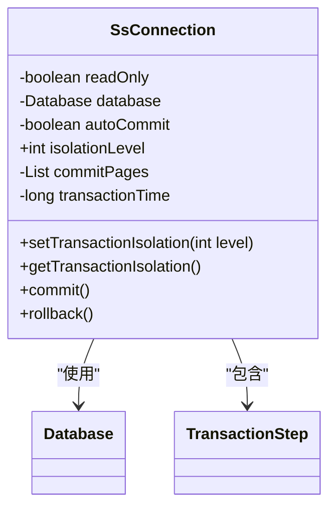
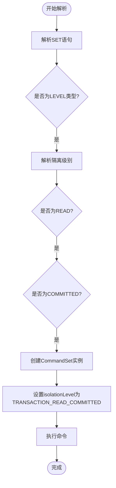
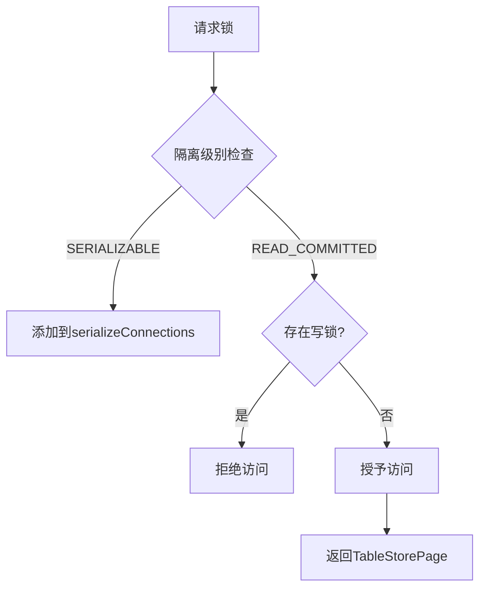
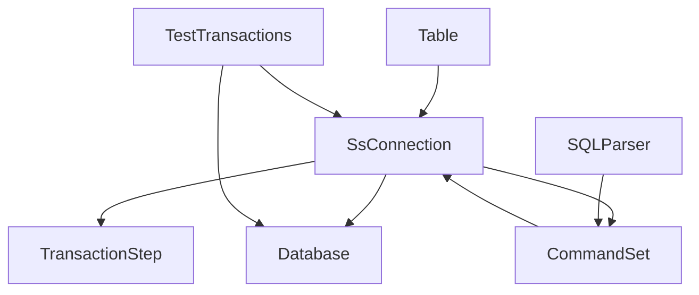

# READ_COMMITTED隔离级别

<cite>
**本文档中引用的文件**   
- [SsConnection.java](file://src/main/java/io/leavesfly/smallsql/jdbc/SsConnection.java)
- [Database.java](file://src/main/java/io/leavesfly/smallsql/rdb/engine/Database.java)
- [CommandSet.java](file://src/main/java/io/leavesfly/smallsql/rdb/command/ddl/CommandSet.java)
- [SQLParser.java](file://src/main/java/io/leavesfly/smallsql/rdb/sql/SQLParser.java)
- [Table.java](file://src/main/java/io/leavesfly/smallsql/rdb/engine/Table.java)
- [TestTransactions.java](file://src/test/java/io/leavesfly/smallsql/junit/sql/tpl/TestTransactions.java)
</cite>

## 目录
1. [简介](#简介)
2. [项目结构](#项目结构)
3. [核心组件](#核心组件)
4. [架构概述](#架构概述)
5. [详细组件分析](#详细组件分析)
6. [依赖分析](#依赖分析)
7. [性能考虑](#性能考虑)
8. [故障排除指南](#故障排除指南)
9. [结论](#结论)

## 简介
本文档深入解析SmallSQL数据库中READ_COMMITTED隔离级别的实现原理。重点说明事务提交状态如何控制数据可见性，分析SsConnection.setTransactionIsolation方法对TRANSACTION_READ_COMMITTED的支持机制，探讨Database类在已提交数据读取过程中的协调作用。通过对比测试案例展示不可重复读现象的处理方式，解释该级别下锁机制的工作模式，并提供性能优化建议和典型应用场景说明。

## 项目结构
SmallSQL项目采用典型的Java数据库系统分层架构，主要分为JDBC接口层、RDB引擎层和测试层。核心事务处理功能分布在jdbc和rdb/engine包中，通过清晰的模块划分实现了事务隔离级别的控制。

**图示来源**
- [SsConnection.java](file://src/main/java/io/leavesfly/smallsql/jdbc/SsConnection.java#L76-L120)
- [Database.java](file://src/main/java/io/leavesfly/smallsql/rdb/engine/Database.java#L35-L50)
- [CommandSet.java](file://src/main/java/io/leavesfly/smallsql/rdb/command/ddl/CommandSet.java#L34-L61)

## 核心组件
READ_COMMITTED隔离级别的实现涉及多个核心组件的协同工作。SsConnection类管理连接级别的事务状态，Database类负责数据库实例的全局协调，CommandSet处理SET TRANSACTION语句的解析和执行，而Table类则实现了具体的锁机制来控制数据访问。

**组件来源**
- [SsConnection.java](file://src/main/java/io/leavesfly/smallsql/jdbc/SsConnection.java#L76-L120)
- [Database.java](file://src/main/java/io/leavesfly/smallsql/rdb/engine/Database.java#L35-L50)
- [Table.java](file://src/main/java/io/leavesfly/smallsql/rdb/engine/Table.java#L325-L376)

## 架构概述
READ_COMMITTED隔离级别的架构设计体现了SmallSQL对ACID特性的支持。系统通过连接级别的隔离级别设置、事务步骤的提交管理以及表级别的锁机制，共同实现了已提交数据的可见性控制。

**图示来源**
- [SsConnection.java](file://src/main/java/io/leavesfly/smallsql/jdbc/SsConnection.java#L76-L120)
- [SQLParser.java](file://src/main/java/io/leavesfly/smallsql/rdb/sql/SQLParser.java#L1294-L1330)
- [CommandSet.java](file://src/main/java/io/leavesfly/smallsql/rdb/command/ddl/CommandSet.java#L34-L61)

## 详细组件分析

### SsConnection隔离级别控制
SsConnection类通过isolationLevel字段管理连接的事务隔离级别，默认值为TRANSACTION_READ_COMMITTED。该类提供了setTransactionIsolation和getTransactionIsolation方法来设置和获取当前隔离级别。

**图示来源**
- [SsConnection.java](file://src/main/java/io/leavesfly/smallsql/jdbc/SsConnection.java#L76-L120)
- [SsConnection.java](file://src/main/java/io/leavesfly/smallsql/jdbc/SsConnection.java#L545-L578)

### SQL解析与命令执行
SQLParser类负责解析SET TRANSACTION语句，并创建相应的CommandSet命令对象。CommandSet类的executeImpl方法最终将隔离级别设置应用到连接对象上。

**图示来源**
- [SQLParser.java](file://src/main/java/io/leavesfly/smallsql/rdb/sql/SQLParser.java#L1294-L1330)
- [CommandSet.java](file://src/main/java/io/leavesfly/smallsql/rdb/command/ddl/CommandSet.java#L34-L61)

### 表级锁机制实现
Table类的requestLockImpl方法根据当前连接的隔离级别决定是否授予锁请求。在READ_COMMITTED级别下，允许多个连接同时读取数据，但写操作会阻塞其他写操作。

**图示来源**
- [Table.java](file://src/main/java/io/leavesfly/smallsql/rdb/engine/Table.java#L325-L376)
- [Table.java](file://src/main/java/io/leavesfly/smallsql/rdb/engine/Table.java#L415-L456)

## 依赖分析
READ_COMMITTED隔离级别的实现依赖于多个组件的紧密协作。SsConnection作为入口点，依赖Database进行数据存储管理，依赖CommandSet处理事务命令，而Table类则依赖底层的锁机制来实现并发控制。

**图示来源**
- [SsConnection.java](file://src/main/java/io/leavesfly/smallsql/jdbc/SsConnection.java#L76-L120)
- [Database.java](file://src/main/java/io/leavesfly/smallsql/rdb/engine/Database.java#L35-L50)
- [CommandSet.java](file://src/main/java/io/leavesfly/smallsql/rdb/command/ddl/CommandSet.java#L34-L61)

## 性能考虑
READ_COMMITTED隔离级别在性能和数据一致性之间提供了良好的平衡。相比SERIALIZABLE级别，它减少了锁冲突的可能性，提高了并发性能。然而，由于允许不可重复读，应用程序需要处理可能的数据变化。

- **优点**：高并发性，读操作不会阻塞其他读操作
- **缺点**：可能出现不可重复读现象
- **优化建议**：对于需要一致读取的场景，考虑使用显式锁定或升级到更高隔离级别

## 故障排除指南
在使用READ_COMMITTED隔离级别时，可能会遇到以下常见问题：

1. **不可重复读问题**：同一事务中多次读取同一数据可能得到不同结果
2. **锁等待超时**：写操作可能因其他写锁而等待超时
3. **死锁**：循环等待锁可能导致死锁

测试用例testReadCommited和testReadWriteLock提供了验证这些问题的方法。

**来源**
- [TestTransactions.java](file://src/test/java/io/leavesfly/smallsql/junit/sql/tpl/TestTransactions.java#L428-L461)
- [TestTransactions.java](file://src/test/java/io/leavesfly/smallsql/junit/sql/tpl/TestTransactions.java#L493-L511)

## 结论
SmallSQL通过SsConnection.setTransactionIsolation方法实现了READ_COMMITTED隔离级别，利用Database类协调数据访问，通过Table类的锁机制控制并发。该实现允许读取已提交的数据，防止脏读，但允许不可重复读。这种设计在保证数据一致性的同时，提供了良好的并发性能，适用于大多数OLTP应用场景。