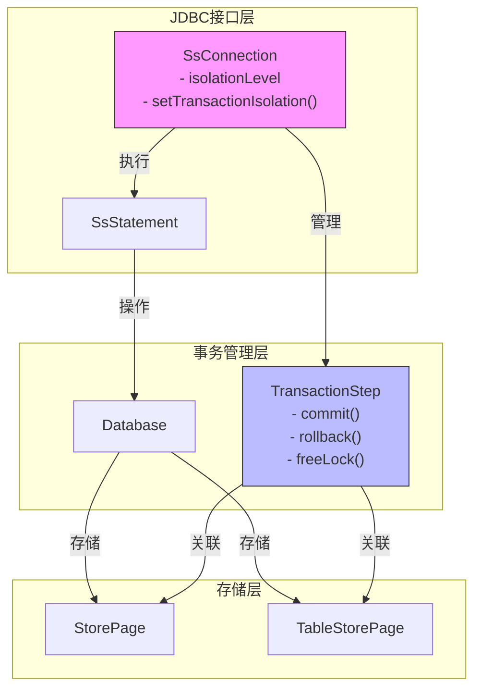
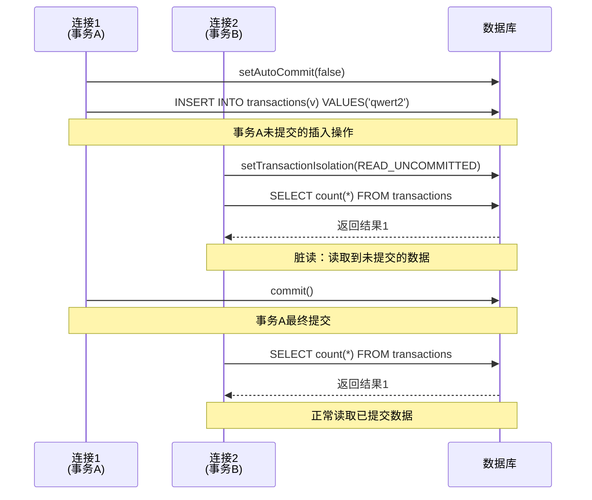
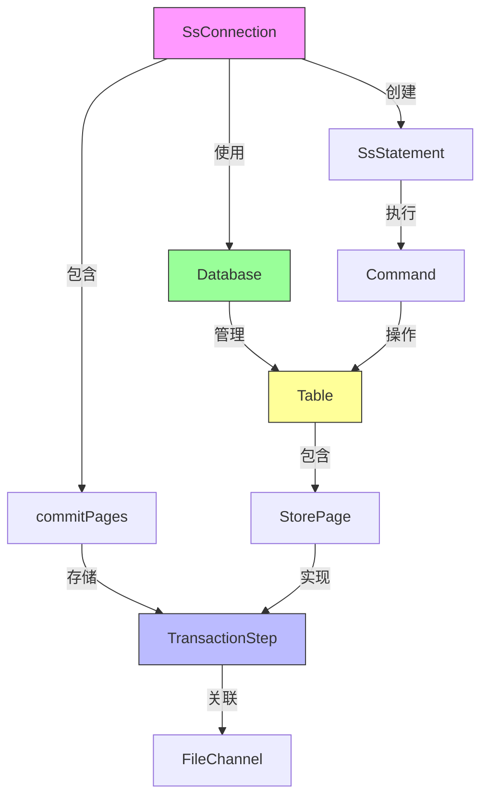

# READ_UNCOMMITTED隔离级别

<cite>
**本文档中引用的文件**   
- [SsConnection.java](file://src/main/java/io/leavesfly/smallsql/jdbc/SsConnection.java)
- [TransactionStep.java](file://src/main/java/io/leavesfly/smallsql/rdb/engine/TransactionStep.java)
- [TestTransactions.java](file://src/test/java/io/leavesfly/smallsql/junit/sql/tpl/TestTransactions.java)
</cite>

## 目录
1. [简介](#简介)
2. [核心组件分析](#核心组件分析)
3. [架构概述](#架构概述)
4. [详细组件分析](#详细组件分析)
5. [依赖关系分析](#依赖关系分析)
6. [性能考量](#性能考量)
7. [故障排除指南](#故障排除指南)
8. [结论](#结论)

## 简介
READ_UNCOMMITTED是数据库事务隔离级别中最宽松的一种，允许事务读取其他事务尚未提交的修改，即"脏读"。本文档深入解析SmallSQL数据库中READ_UNCOMMITTED隔离级别的实现机制，分析其允许脏读的特性及在SsConnection类中的具体表现。通过具体SQL执行案例展示脏读现象的发生场景，阐述该隔离级别对性能的影响及适用业务场景，并提供配置示例和潜在风险规避建议。

## 核心组件分析
本文档重点分析SmallSQL中实现READ_UNCOMMITTED隔离级别的核心组件，包括SsConnection类中的隔离级别设置逻辑、TransactionStep在未提交数据可见性中的作用机制，以及通过测试用例验证脏读现象的具体实现方式。

**本节来源**
- [SsConnection.java](file://src/main/java/io/leavesfly/smallsql/jdbc/SsConnection.java#L74-L80)
- [TransactionStep.java](file://src/main/java/io/leavesfly/smallsql/rdb/engine/TransactionStep.java#L41-L56)
- [TestTransactions.java](file://src/test/java/io/leavesfly/smallsql/junit/sql/tpl/TestTransactions.java#L386-L426)

## 架构概述
SmallSQL的事务隔离级别实现架构基于JDBC标准接口，通过SsConnection类管理连接状态和事务属性，TransactionStep类跟踪事务中的数据修改操作。当设置为READ_UNCOMMITTED隔离级别时，系统允许其他事务直接访问未提交的修改，无需等待事务提交。



**图表来源**
- [SsConnection.java](file://src/main/java/io/leavesfly/smallsql/jdbc/SsConnection.java#L74-L80)
- [TransactionStep.java](file://src/main/java/io/leavesfly/smallsql/rdb/engine/TransactionStep.java#L41-L56)

## 详细组件分析

### SsConnection隔离级别设置机制
SsConnection类实现了JDBC Connection接口，其中isolationLevel字段用于存储当前连接的事务隔离级别。该字段的设置和获取通过标准的JDBC方法实现，确保了与Java数据库编程模型的兼容性。

```mermaid
classDiagram
class SsConnection {
-readOnly : boolean
-database : Database
-autoCommit : boolean
+isolationLevel : int
-commitPages : List<TransactionStep>
-transactionTime : long
-metadata : SsDatabaseMetaData
-holdability : int
-log : Logger
+setTransactionIsolation(level : int)
+getTransactionIsolation() : int
+setAutoCommit(autoCommit : boolean)
+getAutoCommit() : boolean
+commit()
+rollback()
}
class TransactionStep {
+raFile : FileChannel
+commit() : long
+rollback()
+freeLock()
}
SsConnection --> TransactionStep : "包含"
SsConnection --> Database : "使用"
SsConnection --> SsDatabaseMetaData : "包含"
note right of SsConnection
isolationLevel默认值为
TRANSACTION_READ_COMMITTED
可通过setTransactionIsolation()
方法修改为TRANSACTION_READ_UNCOMMITTED
end note
```

**图表来源**
- [SsConnection.java](file://src/main/java/io/leavesfly/smallsql/jdbc/SsConnection.java#L74-L80)
- [TransactionStep.java](file://src/main/java/io/leavesfly/smallsql/rdb/engine/TransactionStep.java#L41-L56)

### 脏读现象的执行流程
当两个数据库连接分别设置不同的隔离级别时，READ_UNCOMMITTED级别的连接可以读取另一个连接中未提交的事务数据，这构成了脏读现象的核心机制。



**图表来源**
- [TestTransactions.java](file://src/test/java/io/leavesfly/smallsql/junit/sql/tpl/TestTransactions.java#L386-L426)
- [SsConnection.java](file://src/main/java/io/leavesfly/smallsql/jdbc/SsConnection.java#L670-L685)

### TransactionStep在数据可见性中的作用
TransactionStep作为抽象基类，定义了事务步骤的基本行为，包括提交、回滚和释放锁的操作。在READ_UNCOMMITTED隔离级别下，这些步骤的实现允许未提交的数据被其他事务访问。

```mermaid
flowchart TD
Start([开始事务操作]) --> CreateTransactionStep["创建TransactionStep实例"]
CreateTransactionStep --> AddToCommitPages["添加到SsConnection的commitPages列表"]
AddToCommitPages --> DataModification["执行数据修改操作<br/>(INSERT/UPDATE/DELETE)"]
DataModification --> CheckIsolationLevel{"检查隔离级别"}
CheckIsolationLevel --> |READ_UNCOMMITTED| AllowRead["允许其他事务读取未提交数据"]
CheckIsolationLevel --> |其他级别| RestrictRead["限制其他事务读取"]
AllowRead --> WaitForCommit["等待commit()或rollback()"]
RestrictRead --> WaitForCommit
WaitForCommit --> CommitOrRollback{"选择: 提交或回滚"}
CommitOrRollback --> |commit()| ExecuteCommit["执行commit()方法<br/>持久化更改"]
CommitOrRollback --> |rollback()| ExecuteRollback["执行rollback()方法<br/>撤销更改"]
ExecuteCommit --> ClearCommitPages["清空commitPages列表"]
ExecuteRollback --> ClearCommitPages
ClearCommitPages --> End([事务结束])
```

**图表来源**
- [TransactionStep.java](file://src/main/java/io/leavesfly/smallsql/rdb/engine/TransactionStep.java#L41-L56)
- [SsConnection.java](file://src/main/java/io/leavesfly/smallsql/jdbc/SsConnection.java#L250-L280)

## 依赖关系分析
READ_UNCOMMITTED隔离级别的实现依赖于多个核心组件的协同工作，形成了一个完整的事务管理链条。



**图表来源**
- [SsConnection.java](file://src/main/java/io/leavesfly/smallsql/jdbc/SsConnection.java#L74-L80)
- [TransactionStep.java](file://src/main/java/io/leavesfly/smallsql/rdb/engine/TransactionStep.java#L41-L56)
- [Database.java](file://src/main/java/io/leavesfly/smallsql/rdb/engine/Database.java)

## 性能考量
READ_UNCOMMITTED隔离级别在性能方面具有显著优势，因为它避免了读取操作时的锁等待，从而提高了并发性能。然而，这种性能提升是以牺牲数据一致性为代价的。

- **优点**：无需为读操作加锁，减少了锁争用，提高了并发吞吐量
- **缺点**：可能导致脏读、不可重复读和幻读等一致性问题
- **适用场景**：对数据一致性要求不高的分析型应用、缓存系统、日志记录等
- **不适用场景**：金融交易、库存管理、订单处理等对数据一致性要求严格的业务

## 故障排除指南
在使用READ_UNCOMMITTED隔离级别时，可能会遇到以下常见问题及相应的解决方案：

1. **意外的脏读导致业务逻辑错误**
   - **症状**：应用程序读取到后来被回滚的数据
   - **解决方案**：评估业务需求，必要时升级到更高的隔离级别

2. **数据不一致问题**
   - **症状**：同一查询在短时间内返回不一致的结果
   - **解决方案**：在关键业务逻辑中使用显式锁或更高隔离级别

3. **调试困难**
   - **症状**：难以复现和调试由脏读引起的问题
   - **解决方案**：启用详细的日志记录，特别是在事务开始和结束时

**本节来源**
- [SsConnection.java](file://src/main/java/io/leavesfly/smallsql/jdbc/SsConnection.java#L250-L280)
- [TestTransactions.java](file://src/test/java/io/leavesfly/smallsql/junit/sql/tpl/TestTransactions.java#L386-L426)

## 结论
READ_UNCOMMITTED隔离级别通过允许脏读来最大化并发性能，其核心实现机制在于SsConnection类的isolationLevel字段管理和TransactionStep类对未提交数据的可见性控制。SmallSQL通过JDBC标准接口提供了灵活的隔离级别设置功能，开发者可以根据具体业务需求权衡性能与数据一致性。在对数据一致性要求不高的场景下，READ_UNCOMMITTED可以显著提升系统性能；但在关键业务系统中，应谨慎使用并充分评估潜在风险。