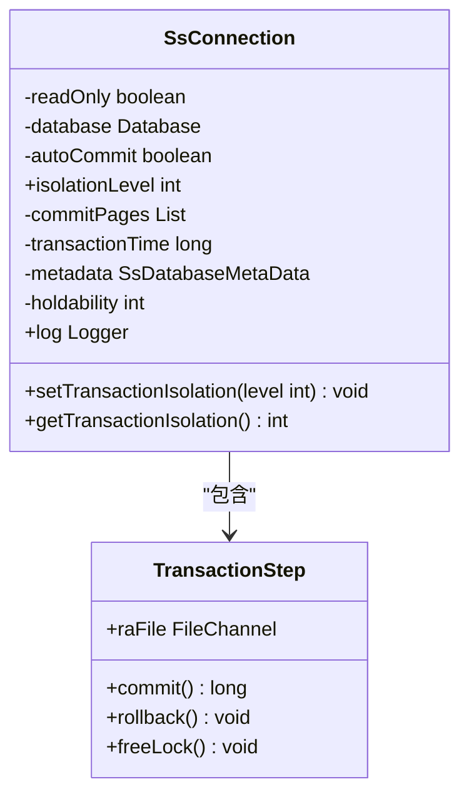
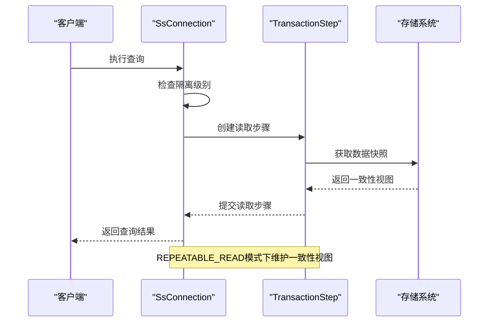
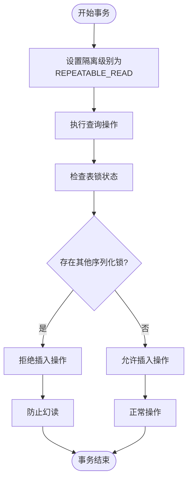
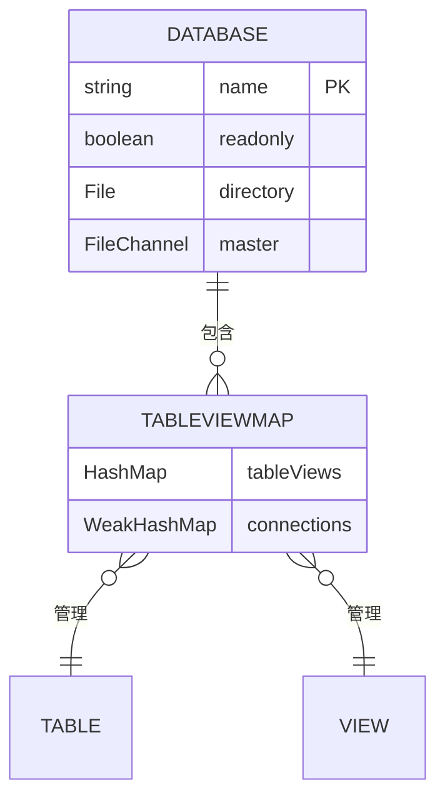

# REPEATABLE_READ隔离级别

<cite>
**本文档引用的文件**   
- [SsConnection.java](file://src/main/java/io/leavesfly/smallsql/jdbc/SsConnection.java)
- [TransactionStep.java](file://src/main/java/io/leavesfly/smallsql/rdb/engine/TransactionStep.java)
- [Database.java](file://src/main/java/io/leavesfly/smallsql/rdb/engine/Database.java)
- [Table.java](file://src/main/java/io/leavesfly/smallsql/rdb/engine/Table.java)
- [SsDatabaseMetaData.java](file://src/main/java/io/leavesfly/smallsql/jdbc/metadata/SsDatabaseMetaData.java)
- [TestTransactions.java](file://src/test/java/io/leavesfly/smallsql/junit/sql/tpl/TestTransactions.java)
</cite>

## 目录
1. [引言](#引言)
2. [REPEATABLE_READ隔离级别的实现机制](#repeatable_read隔离级别的实现机制)
3. [SsConnection中的隔离级别行为差异](#ssconnection中的隔离级别行为差异)
4. [TransactionStep在事务一致性中的作用](#transactionstep在事务一致性中的作用)
5. [幻读防范机制分析](#幻读防范机制分析)
6. [Database元数据管理支撑](#database元数据管理支撑)
7. [性能权衡与最佳实践](#性能权衡与最佳实践)
8. [结论](#结论)

## 引言
REPEATABLE_READ是SQL标准中定义的事务隔离级别之一，旨在保证在同一事务内多次读取相同数据时结果的一致性。SmallSQL通过其独特的架构设计实现了这一隔离级别，确保了事务的可重复读特性。本文将深入分析SmallSQL中REPEATABLE_READ隔离级别的实现机制，探讨其如何保证事务内读取结果的一致性，以及相关组件在其中的作用。

## REPEATABLE_READ隔离级别的实现机制
REPEATABLE_READ隔离级别通过锁定机制和事务视图管理来保证同一事务内多次读取结果的一致性。在SmallSQL中，当事务隔离级别设置为TRANSACTION_REPEATABLE_READ时，系统会为读取操作创建一致性的快照视图，确保事务内所有读取操作都基于相同的数据状态。

该机制的核心在于事务的锁定策略和数据访问控制。通过分析SsConnection类中的isolationLevel字段和相关方法，可以发现SmallSQL在事务执行过程中会根据隔离级别动态调整锁定行为，从而实现可重复读的语义。

**Section sources**
- [SsConnection.java](file://src/main/java/io/leavesfly/smallsql/jdbc/SsConnection.java#L74-L715)

## SsConnection中的隔离级别行为差异
SsConnection类中的isolationLevel字段决定了连接的事务隔离行为。当isolationLevel设置为TRANSACTION_REPEATABLE_READ时，连接的行为与其他隔离级别存在显著差异。

在REPEATABLE_READ模式下，SsConnection会确保事务内的所有读取操作都基于事务开始时的一致性视图。这意味着即使其他事务对数据进行了修改并提交，当前事务仍然能看到事务开始时的数据状态。这种行为通过事务步骤的管理和锁定机制来实现，确保了读取操作的可重复性。

通过setTransactionIsolation方法，可以动态设置连接的隔离级别。该方法会检查指定的隔离级别是否被支持，并在支持的情况下更新isolationLevel字段的值。

**Diagram sources **
- [SsConnection.java](file://src/main/java/io/leavesfly/smallsql/jdbc/SsConnection.java#L74-L715)
- [TransactionStep.java](file://src/main/java/io/leavesfly/smallsql/rdb/engine/TransactionStep.java#L41-L56)

**Section sources**
- [SsConnection.java](file://src/main/java/io/leavesfly/smallsql/jdbc/SsConnection.java#L74-L715)

## TransactionStep在事务一致性中的作用
TransactionStep类在维护事务一致性视图中扮演着关键角色。作为抽象基类，它定义了事务步骤的基本行为，包括提交、回滚和释放锁等操作。

在REPEATABLE_READ隔离级别下，TransactionStep的实例被用来跟踪事务中的各种操作。每个TransactionStep都与特定的文件通道(FileChannel)关联，这使得系统能够精确地管理事务对数据文件的访问。

当事务需要读取数据时，系统会创建相应的TransactionStep实例并将其添加到SsConnection的commitPages列表中。这些步骤在事务提交时会被依次处理，确保所有更改的一致性。在读取操作中，TransactionStep帮助维护了事务的一致性视图，防止了脏读和不可重复读的问题。

**Diagram sources **
- [TransactionStep.java](file://src/main/java/io/leavesfly/smallsql/rdb/engine/TransactionStep.java#L41-L56)
- [SsConnection.java](file://src/main/java/io/leavesfly/smallsql/jdbc/SsConnection.java#L74-L715)

**Section sources**
- [TransactionStep.java](file://src/main/java/io/leavesfly/smallsql/rdb/engine/TransactionStep.java#L41-L56)

## 幻读防范机制分析
幻读是指在同一事务内执行相同的查询时，由于其他事务的插入或删除操作，导致返回的结果集不一致的现象。SmallSQL通过其独特的锁定机制和事务管理策略来防范幻读。

在REPEATABLE_READ隔离级别下，SmallSQL通过表级锁定和序列化连接管理来防止幻读。当事务执行读取操作时，系统会检查是否存在其他序列化连接，如果有多个连接持有序列化锁，则插入操作将被阻止。

通过分析Table类中的锁定机制，可以发现SmallSQL使用了serializeConnections集合来跟踪持有序列化锁的连接。当事务需要执行插入操作时，系统会检查serializeConnections的大小，如果超过一个连接持有锁，则拒绝插入操作，从而防止了幻读的发生。

**Diagram sources **
- [Table.java](file://src/main/java/io/leavesfly/smallsql/rdb/engine/Table.java#L415-L456)
- [SsConnection.java](file://src/main/java/io/leavesfly/smallsql/jdbc/SsConnection.java#L74-L715)

**Section sources**
- [Table.java](file://src/main/java/io/leavesfly/smallsql/rdb/engine/Table.java#L415-L456)

## Database元数据管理支撑
Database类在REPEATABLE_READ隔离级别的实现中提供了重要的元数据管理支撑。作为数据库实例的管理者，它负责维护表定义、视图和连接信息。

在事务隔离的实现中，Database类通过其tableViews映射来管理打开的表和视图。当事务需要访问表时，系统会通过getTableView方法获取相应的视图对象。如果视图尚未加载，系统会将其从存储中加载并缓存到tableViews中。

这种元数据管理机制确保了事务能够访问到一致的表结构和数据视图。同时，Database类还负责管理连接的生命周期，当连接关闭时，它会清理相关的资源和锁，确保事务隔离的正确性。

**Diagram sources **
- [Database.java](file://src/main/java/io/leavesfly/smallsql/rdb/engine/Database.java#L0-L564)
- [Table.java](file://src/main/java/io/leavesfly/smallsql/rdb/engine/Table.java#L68-L99)

**Section sources**
- [Database.java](file://src/main/java/io/leavesfly/smallsql/rdb/engine/Database.java#L0-L564)

## 性能权衡与最佳实践
在REPEATABLE_READ隔离级别下，SmallSQL需要在数据一致性和系统性能之间进行权衡。较高的隔离级别虽然保证了数据的一致性，但可能会降低系统的并发性能。

为了优化性能，建议采取以下最佳实践：
1. 尽量缩短事务的持续时间，减少锁的持有时间
2. 合理设计查询，避免不必要的全表扫描
3. 在不需要高隔离级别的场景下，使用较低的隔离级别以提高并发性
4. 定期监控和优化数据库性能，及时发现和解决性能瓶颈

通过合理配置和使用REPEATABLE_READ隔离级别，可以在保证数据一致性的同时，最大限度地提高系统性能。

**Section sources**
- [SsConnection.java](file://src/main/java/io/leavesfly/smallsql/jdbc/SsConnection.java#L74-L715)
- [TestTransactions.java](file://src/test/java/io/leavesfly/smallsql/junit/sql/tpl/TestTransactions.java#L428-L511)

## 结论
SmallSQL通过其精心设计的架构和机制，成功实现了REPEATABLE_READ隔离级别。通过SsConnection中的isolationLevel设置、TransactionStep的事务步骤管理、以及Database的元数据支撑，系统能够保证同一事务内多次读取结果的一致性。

该实现不仅有效防止了脏读和不可重复读，还通过锁定机制防范了幻读。尽管较高的隔离级别可能影响系统性能，但通过合理的使用和优化，可以在数据一致性和系统性能之间取得良好的平衡。