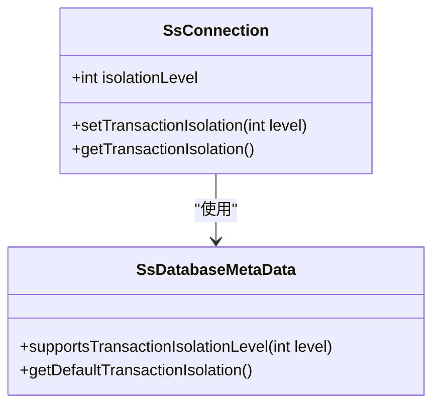
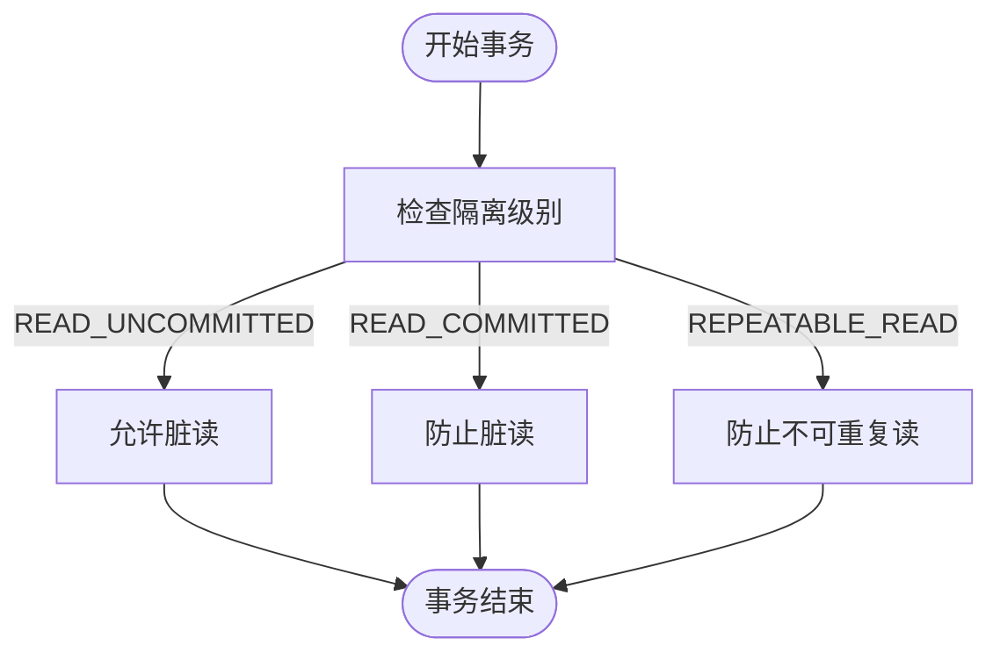
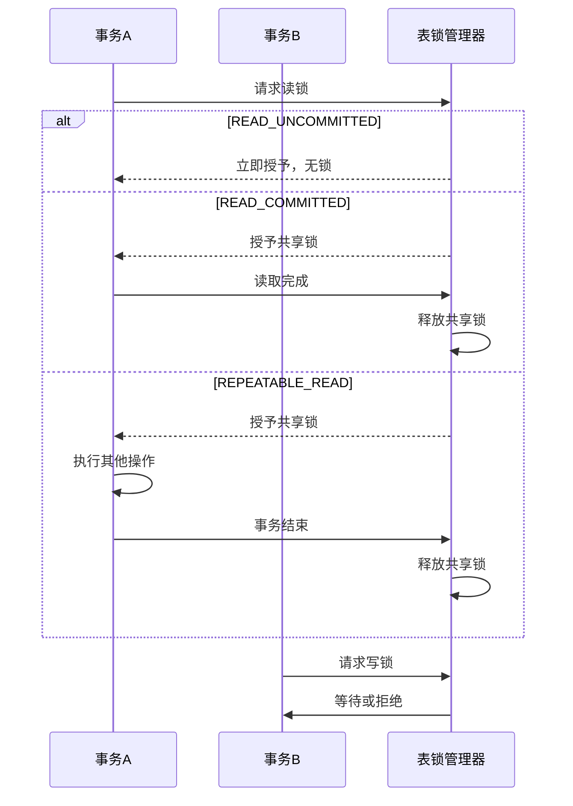
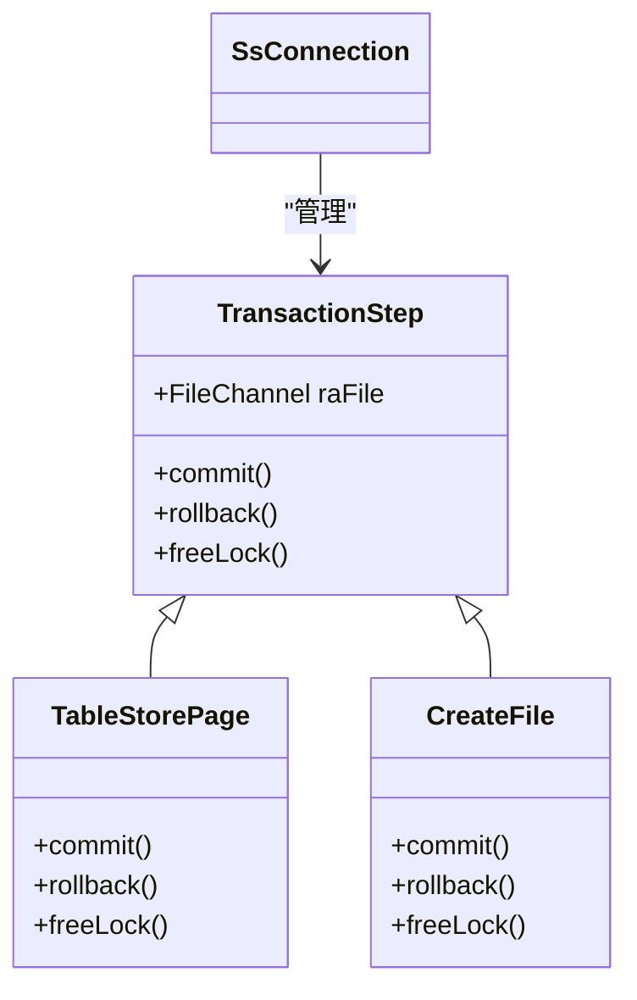
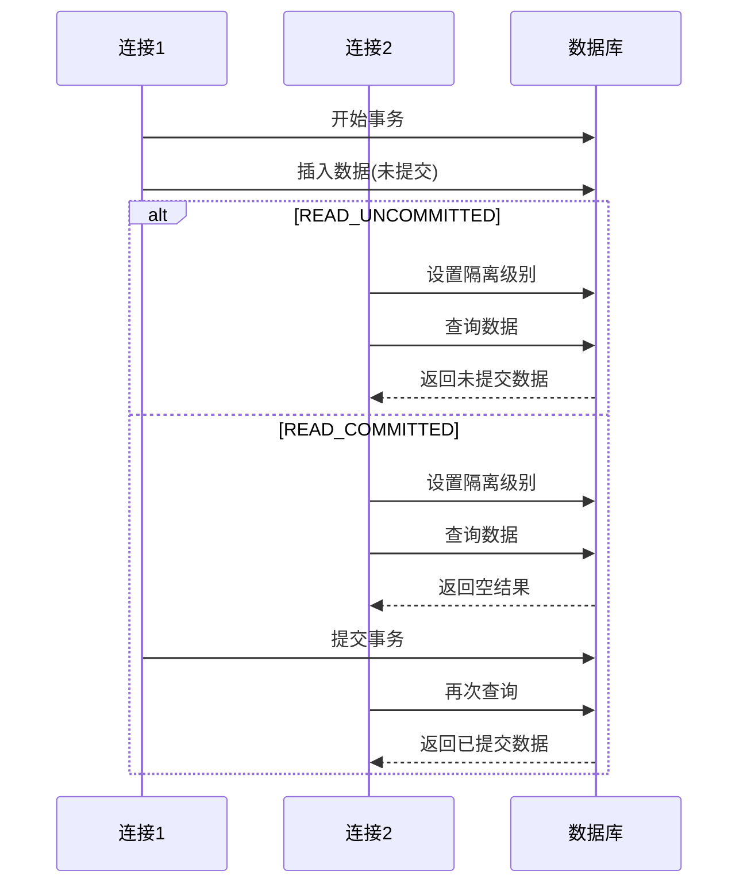

# 事务隔离级别

<cite>
**本文档引用的文件**
- [SsConnection.java](file://src/main/java/io/leavesfly/smallsql/jdbc/SsConnection.java)
- [SsDatabaseMetaData.java](file://src/main/java/io/leavesfly/smallsql/jdbc/metadata/SsDatabaseMetaData.java)
- [TransactionStep.java](file://src/main/java/io/leavesfly/smallsql/rdb/engine/TransactionStep.java)
- [Table.java](file://src/main/java/io/leavesfly/smallsql/rdb/engine/Table.java)
- [TestTransactions.java](file://src/test/java/io/leavesfly/smallsql/junit/sql/tpl/TestTransactions.java)
</cite>

## 目录
1. [事务隔离级别概述](#事务隔离级别概述)
2. [SsConnection类中的隔离级别实现](#ssconnection类中的隔离级别实现)
3. [不同隔离级别的数据可见性规则](#不同隔离级别的数据可见性规则)
4. [锁行为差异分析](#锁行为差异分析)
5. [并发控制中的TransactionStep类作用](#并发控制中的transactionstep类作用)
6. [实际查询案例分析](#实际查询案例分析)
7. [配置最佳实践与性能权衡](#配置最佳实践与性能权衡)

## 事务隔离级别概述

SmallSQL数据库支持多种事务隔离级别，包括READ_UNCOMMITTED、READ_COMMITTED和REPEATABLE_READ。这些隔离级别通过SsConnection类的setTransactionIsolation方法进行设置和管理。每个隔离级别定义了事务在并发执行时的数据可见性规则和锁行为，以平衡数据一致性和系统性能。SmallSQL的隔离级别实现遵循SQL标准，通过多版本并发控制机制来管理事务间的相互影响。

**Section sources**
- [SsConnection.java](file://src/main/java/io/leavesfly/smallsql/jdbc/SsConnection.java#L93-L95)
- [SsDatabaseMetaData.java](file://src/main/java/io/leavesfly/smallsql/jdbc/metadata/SsDatabaseMetaData.java#L535-L538)

## SsConnection类中的隔离级别实现

SsConnection类通过isolationLevel字段存储当前连接的事务隔离级别，默认值为TRANSACTION_READ_COMMITTED。setTransactionIsolation方法负责设置隔离级别，首先通过SsDatabaseMetaData的supportsTransactionIsolationLevel方法验证所请求的隔离级别是否被支持，然后更新isolationLevel字段的值。这种设计确保了隔离级别的设置既符合数据库的约束，又保持了连接状态的一致性。

**Diagram sources**
- [SsConnection.java](file://src/main/java/io/leavesfly/smallsql/jdbc/SsConnection.java#L95-L100)
- [SsDatabaseMetaData.java](file://src/main/java/io/leavesfly/smallsql/jdbc/metadata/SsDatabaseMetaData.java#L535-L538)

**Section sources**
- [SsConnection.java](file://src/main/java/io/leavesfly/smallsql/jdbc/SsConnection.java#L93-L100)
- [SsDatabaseMetaData.java](file://src/main/java/io/leavesfly/smallsql/jdbc/metadata/SsDatabaseMetaData.java#L525-L538)

## 不同隔离级别的数据可见性规则

SmallSQL在不同隔离级别下实现了不同的数据可见性规则。在READ_UNCOMMITTED级别，事务可以读取其他事务未提交的修改，这可能导致脏读。READ_COMMITTED级别确保事务只能读取已提交的数据，防止了脏读但可能出现不可重复读。REPEATABLE_READ级别通过锁定读取的数据行来保证在同一事务中多次读取同一数据时结果一致，避免了不可重复读的问题。这些规则通过Table类的getInserts方法和requestLockImpl方法实现，根据当前连接的隔离级别决定哪些数据修改对当前事务可见。

**Diagram sources**
- [Table.java](file://src/main/java/io/leavesfly/smallsql/rdb/engine/Table.java#L309-L315)
- [Table.java](file://src/main/java/io/leavesfly/smallsql/rdb/engine/Table.java#L449-L452)

**Section sources**
- [Table.java](file://src/main/java/io/leavesfly/smallsql/rdb/engine/Table.java#L309-L315)
- [Table.java](file://src/main/java/io/leavesfly/smallsql/rdb/engine/Table.java#L449-L452)

## 锁行为差异分析

SmallSQL的锁行为根据隔离级别而变化。在READ_UNCOMMITTED级别，读操作不获取锁，允许脏读。READ_COMMITTED级别在读取数据时获取共享锁，但在读取完成后立即释放，这可能导致不可重复读。REPEATABLE_READ级别在读取数据时获取共享锁并保持到事务结束，确保了数据的可重复读性。这些锁行为通过Table类的requestLockImpl方法实现，该方法根据隔离级别和操作类型决定是否授予锁请求。SERIALIZABLE级别还使用serializeConnections集合来跟踪具有序列化锁的连接，防止幻读。

**Diagram sources**
- [Table.java](file://src/main/java/io/leavesfly/smallsql/rdb/engine/Table.java#L463-L465)
- [Table.java](file://src/main/java/io/leavesfly/smallsql/rdb/engine/Table.java#L373-L375)

**Section sources**
- [Table.java](file://src/main/java/io/leavesfly/smallsql/rdb/engine/Table.java#L463-L465)
- [Table.java](file://src/main/java/io/leavesfly/smallsql/rdb/engine/Table.java#L373-L375)

## 并发控制中的TransactionStep类作用

TransactionStep类是SmallSQL多版本并发控制的核心组件，作为抽象基类定义了事务步骤的基本行为。它通过commit和rollback方法管理事务的提交和回滚操作，而freeLock方法用于释放事务持有的锁。具体的事务步骤实现（如TableStorePage）继承TransactionStep并提供具体的提交和回滚逻辑。SsConnection类通过commitPages列表管理所有待提交的TransactionStep对象，在事务提交时按顺序调用它们的commit方法，确保了事务的原子性和一致性。

**Diagram sources**
- [TransactionStep.java](file://src/main/java/io/leavesfly/smallsql/rdb/engine/TransactionStep.java#L41-L56)
- [SsConnection.java](file://src/main/java/io/leavesfly/smallsql/jdbc/SsConnection.java#L105-L107)

**Section sources**
- [TransactionStep.java](file://src/main/java/io/leavesfly/smallsql/rdb/engine/TransactionStep.java#L41-L56)
- [SsConnection.java](file://src/main/java/io/leavesfly/smallsql/jdbc/SsConnection.java#L105-L107)

## 实际查询案例分析

通过TestTransactions.java中的测试用例可以验证不同隔离级别的行为。在testReadUncommited测试中，一个连接在未提交事务中插入数据，另一个设置为READ_UNCOMMITTED隔离级别的连接能够立即读取到这些未提交的数据，演示了脏读现象。而在testReadCommited测试中，相同的操作下第二个连接无法读取未提交的数据，直到第一个连接提交事务后才能看到更改，这验证了READ_COMMITTED级别防止脏读的机制。这些测试用例通过创建多个连接并设置不同的隔离级别，清晰地展示了各种隔离级别的实际效果。

**Diagram sources**
- [TestTransactions.java](file://src/test/java/io/leavesfly/smallsql/junit/sql/tpl/TestTransactions.java#L411-L425)
- [TestTransactions.java](file://src/test/java/io/leavesfly/smallsql/junit/sql/tpl/TestTransactions.java#L433-L447)

**Section sources**
- [TestTransactions.java](file://src/test/java/io/leavesfly/smallsql/junit/sql/tpl/TestTransactions.java#L411-L447)

## 配置最佳实践与性能权衡

在配置SmallSQL的事务隔离级别时，需要在数据一致性和系统性能之间进行权衡。READ_UNCOMMITTED提供最高的并发性能但可能导致脏读，适用于对数据一致性要求不高的场景。READ_COMMITTED是默认选择，在保证基本数据一致性的同时提供良好的并发性能，适用于大多数应用场景。REPEATABLE_READ提供了更强的一致性保证，但可能降低并发性能，适用于需要避免不可重复读的场景。SERIALIZABLE提供最强的一致性保证，但可能显著影响性能，应谨慎使用。最佳实践是根据具体应用需求选择适当的隔离级别，并通过测试验证其在实际工作负载下的表现。

**Section sources**
- [SsDatabaseMetaData.java](file://src/main/java/io/leavesfly/smallsql/jdbc/metadata/SsDatabaseMetaData.java#L525-L526)
- [SsConnection.java](file://src/main/java/io/leavesfly/smallsql/jdbc/SsConnection.java#L95-L96)