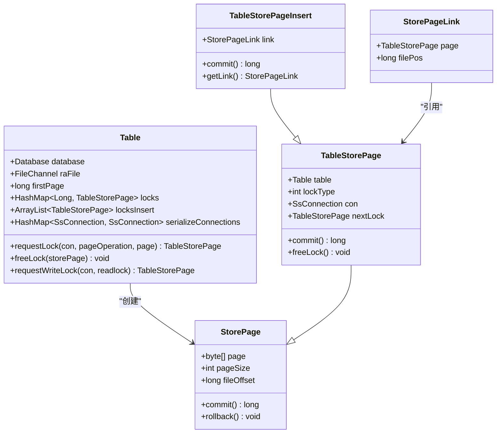
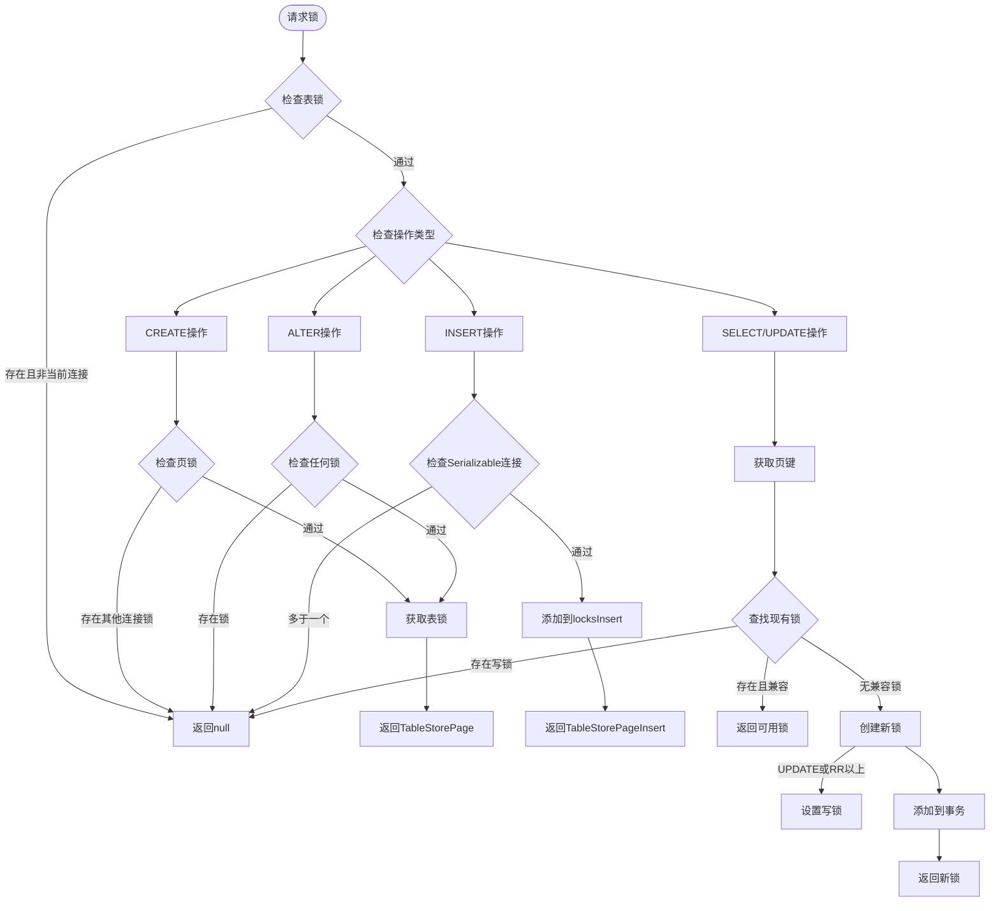
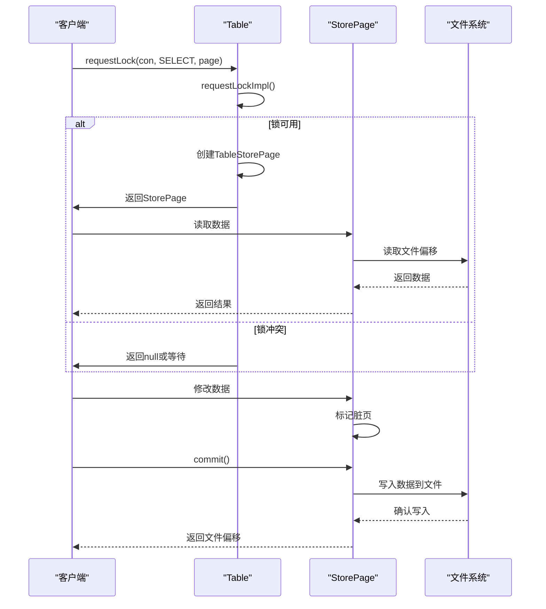
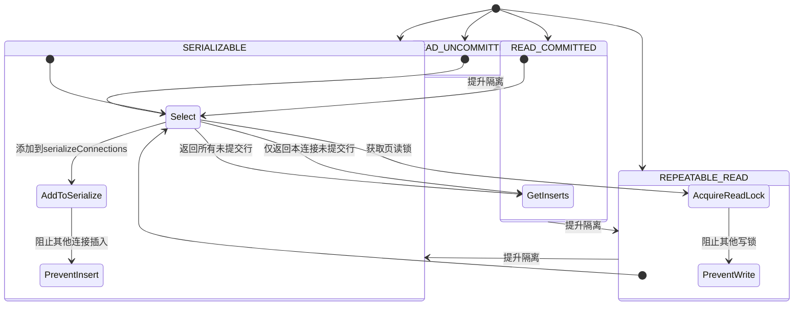
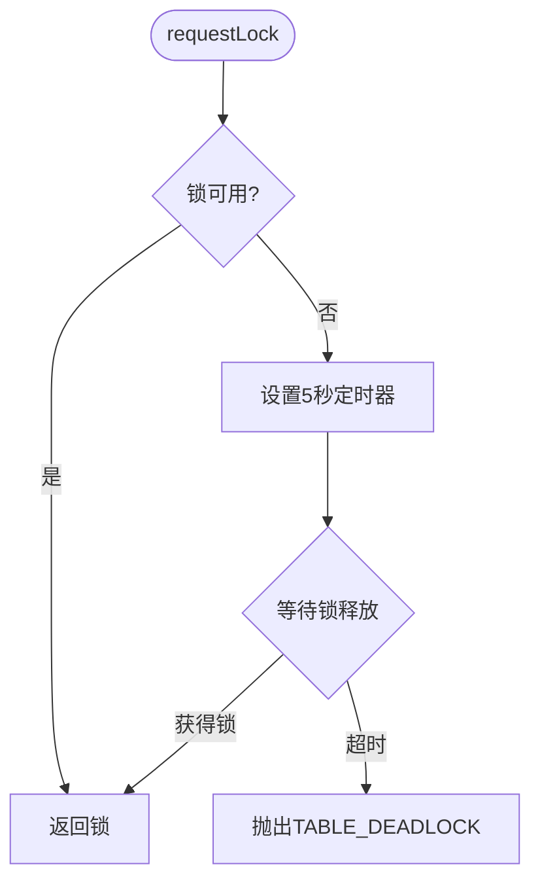
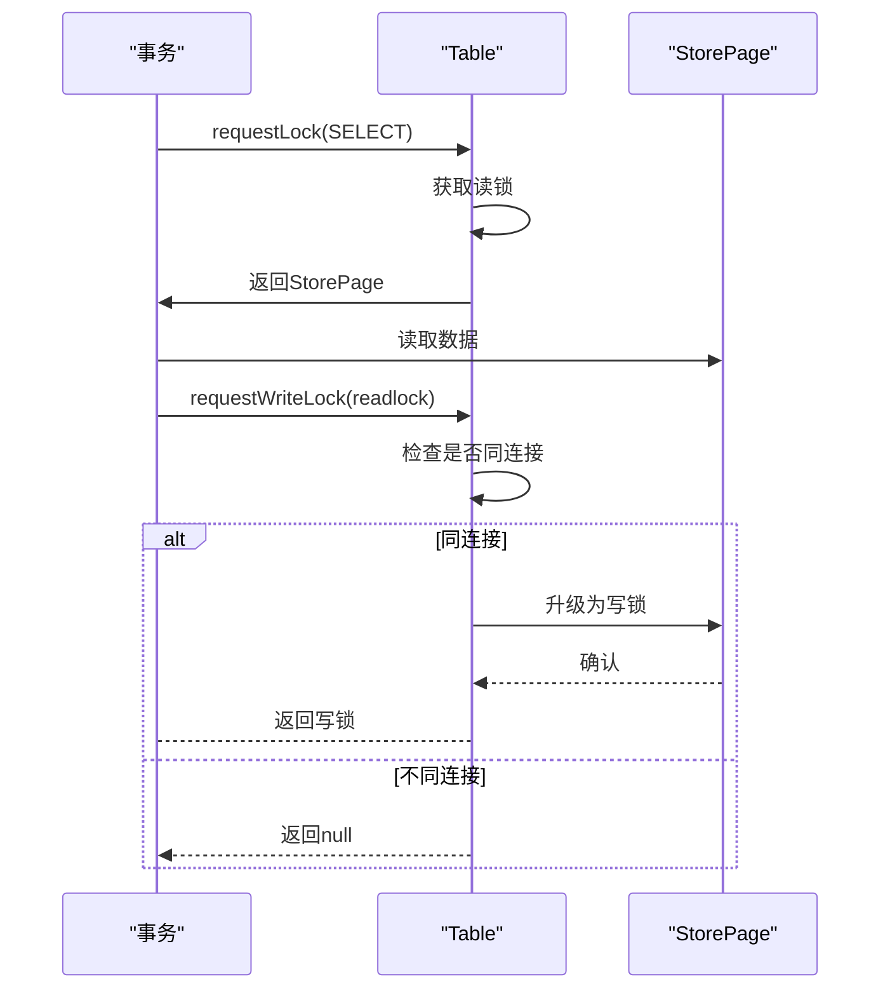

# 并发控制

<cite>
**本文档中引用的文件**  
- [Table.java](file://src/main/java/io/leavesfly/smallsql/rdb/engine/Table.java)
- [StorePage.java](file://src/main/java/io/leavesfly/smallsql/rdb/engine/store/StorePage.java)
- [TableStorePage.java](file://src/main/java/io/leavesfly/smallsql/rdb/engine/store/TableStorePage.java)
- [TableStorePageInsert.java](file://src/main/java/io/leavesfly/smallsql/rdb/engine/store/TableStorePageInsert.java)
- [TableViewResult.java](file://src/main/java/io/leavesfly/smallsql/rdb/engine/selector/result/TableViewResult.java)
- [TestTransactions.java](file://src/test/java/io/leavesfly/smallsql/junit/sql/tpl/TestTransactions.java)
</cite>

## 目录
1. [引言](#引言)
2. [锁机制设计概述](#锁机制设计概述)
3. [表级锁、页级锁与行级锁的实现原理](#表级锁页级锁与行级锁的实现原理)
4. [Table类与StorePage类的协作机制](#table类与storepage类的协作机制)
5. [事务隔离级别下的锁行为分析](#事务隔离级别下的锁行为分析)
6. [死锁检测与预防策略](#死锁检测与预防策略)
7. [锁升级与降级机制](#锁升级与降级机制)
8. [高并发场景下的最佳实践](#高并发场景下的最佳实践)
9. [性能监控与调优建议](#性能监控与调优建议)
10. [结论](#结论)

## 引言
SmallSQL 是一个轻量级的 Java 数据库管理系统，其并发控制机制基于多粒度锁模型，支持表级、页级和行级锁。本文档旨在深入剖析其锁机制的设计与实现，涵盖从底层数据结构到高层事务隔离的完整体系，为开发者提供权威的并发控制指南。

## 锁机制设计概述
SmallSQL 的并发控制通过 `Table` 类和 `StorePage` 类协同实现，采用基于文件偏移量的页级锁机制，并通过链式结构支持更细粒度的行级操作。锁的类型包括 `LOCK_NONE`、`LOCK_READ`、`LOCK_WRITE`、`LOCK_INSERT` 和 `LOCK_TAB`，分别对应不同的操作需求和隔离级别。

**图示来源**  
- [Table.java](file://src/main/java/io/leavesfly/smallsql/rdb/engine/Table.java#L59-L607)
- [StorePage.java](file://src/main/java/io/leavesfly/smallsql/rdb/engine/store/StorePage.java#L45-L89)
- [TableStorePage.java](file://src/main/java/io/leavesfly/smallsql/rdb/engine/store/TableStorePage.java#L0-L78)
- [TableStorePageInsert.java](file://src/main/java/leavesfly/smallsql/rdb/engine/store/TableStorePageInsert.java#L0-L75)

**本节来源**  
- [Table.java](file://src/main/java/io/leavesfly/smallsql/rdb/engine/Table.java#L59-L607)

## 表级锁、页级锁与行级锁的实现原理
SmallSQL 的锁机制以页为基本单位，通过 `Table` 类中的 `locks` 映射维护页级读写锁，`locksInsert` 列表维护插入锁。表级锁由 `tabLockConnection` 和 `tabLockCount` 控制，用于 DDL 操作。行级锁通过 `TableStorePageInsert` 的链式结构实现，每个插入操作生成一个带 `StorePageLink` 的锁对象，支持未提交行的追踪。

- **表级锁**：在执行 `CREATE` 或 `ALTER` 操作时获取，需确保无其他连接持有任何页锁或插入锁。
- **页级锁**：在 `SELECT` 或 `UPDATE` 操作时根据事务隔离级别和操作类型获取读锁或写锁。
- **行级锁**：通过 `TableStorePageInsert` 实现，支持高并发插入，锁信息通过 `StorePageLink` 关联。

**图示来源**  
- [Table.java](file://src/main/java/io/leavesfly/smallsql/rdb/engine/Table.java#L325-L456)
- [TableStorePage.java](file://src/main/java/io/leavesfly/smallsql/rdb/engine/store/TableStorePage.java#L0-L78)

**本节来源**  
- [Table.java](file://src/main/java/io/leavesfly/smallsql/rdb/engine/Table.java#L325-L456)

## Table类与StorePage类的协作机制
`Table` 类负责锁的申请与释放，`StorePage` 类负责数据的持久化。当执行查询或更新操作时，`Table` 的 `requestLock` 方法被调用，内部通过 `requestLockImpl` 实现具体的锁策略。成功获取锁后，创建 `TableStorePage` 实例并返回给 `StoreImpl` 用于数据操作。事务提交时，`TableStorePage.commit()` 负责将数据写入文件，并通过 `nextLock` 处理同一页面的多次修改。

**图示来源**  
- [Table.java](file://src/main/java/io/leavesfly/smallsql/rdb/engine/Table.java#L325-L376)
- [StorePage.java](file://src/main/java/io/leavesfly/smallsql/rdb/engine/store/StorePage.java#L45-L89)

**本节来源**  
- [Table.java](file://src/main/java/io/leavesfly/smallsql/rdb/engine/Table.java#L325-L376)
- [StorePage.java](file://src/main/java/io/leavesfly/smallsql/rdb/engine/store/StorePage.java#L45-L89)

## 事务隔离级别下的锁行为分析
SmallSQL 支持 `READ_UNCOMMITTED`、`READ_COMMITTED`、`REPEATABLE_READ` 和 `SERIALIZABLE` 隔离级别，其锁行为差异显著：

- **READ_UNCOMMITTED**：允许脏读，`getInserts` 方法返回所有未提交的插入行，无论连接归属。
- **READ_COMMITTED**：避免脏读，`getInserts` 仅返回当前连接的未提交行。
- **REPEATABLE_READ**：保证可重复读，在 `SELECT` 时获取读锁，防止其他事务修改同一页面。
- **SERIALIZABLE**：最高隔离级别，通过 `serializeConnections` 映射实现表级串行化，阻止其他连接的插入操作。

**图示来源**  
- [Table.java](file://src/main/java/io/leavesfly/smallsql/rdb/engine/Table.java#L325-L376)
- [TestTransactions.java](file://src/test/java/io/leavesfly/smallsql/junit/sql/tpl/TestTransactions.java#L428-L461)

**本节来源**  
- [Table.java](file://src/main/java/io/leavesfly/smallsql/rdb/engine/Table.java#L325-L376)
- [TestTransactions.java](file://src/test/java/io/leavesfly/smallsql/junit/sql/tpl/TestTransactions.java#L428-L461)

## 死锁检测与预防策略
SmallSQL 采用超时机制进行死锁检测。在 `requestLock` 方法中，设置 5 秒超时，若无法获取锁则抛出 `TABLE_DEADLOCK` 异常。该策略简单有效，避免了复杂的死锁图检测，适合轻量级数据库场景。

**图示来源**  
- [Table.java](file://src/main/java/io/leavesfly/smallsql/rdb/engine/Table.java#L325-L376)

**本节来源**  
- [Table.java](file://src/main/java/io/leavesfly/smallsql/rdb/engine/Table.java#L325-L376)

## 锁升级与降级机制
SmallSQL 支持锁的升级，通过 `requestWriteLock` 方法实现。当持有读锁的事务需要更新数据时，可请求写锁。若当前连接已持有该页的读锁，则直接升级为写锁；否则请求失败。该机制优化了事务回滚到保存点的场景。

**图示来源**  
- [Table.java](file://src/main/java/io/leavesfly/smallsql/rdb/engine/Table.java#L486-L524)

**本节来源**  
- [Table.java](file://src/main/java/io/leavesfly/smallsql/rdb/engine/Table.java#L486-L524)

## 高并发场景下的最佳实践
### 锁粒度选择
优先使用页级锁而非表级锁，避免阻塞其他操作。对于频繁插入的场景，利用 `TableStorePageInsert` 的链式结构，减少锁竞争。

### 事务范围优化
尽量缩短事务生命周期，及时提交或回滚，释放锁资源。避免在事务中执行耗时的业务逻辑。

### 避免热点竞争
对频繁更新的表，考虑增加索引或分表策略，分散热点。使用 `READ_COMMITTED` 隔离级别平衡一致性和并发性。

## 性能监控与调优建议
监控 `locks` 和 `locksInsert` 的大小，评估锁竞争程度。若频繁出现 `TABLE_DEADLOCK` 异常，应优化事务设计或调整隔离级别。定期分析慢查询，确保索引有效，减少锁持有时间。

## 结论
SmallSQL 的并发控制机制通过 `Table` 和 `StorePage` 类的紧密协作，实现了高效、灵活的多粒度锁管理。其基于超时的死锁检测和锁升级机制，为轻量级数据库提供了可靠的并发保障。通过合理选择锁粒度、优化事务范围和避免热点竞争，可在高并发场景下获得良好性能。