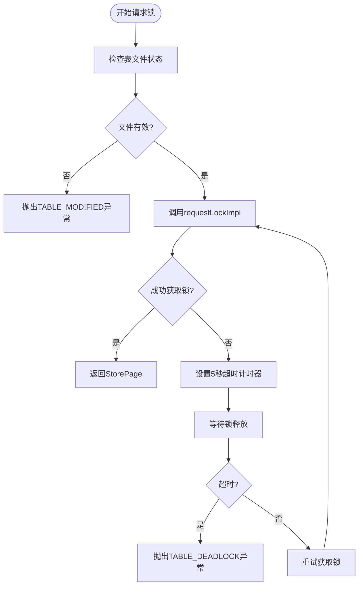
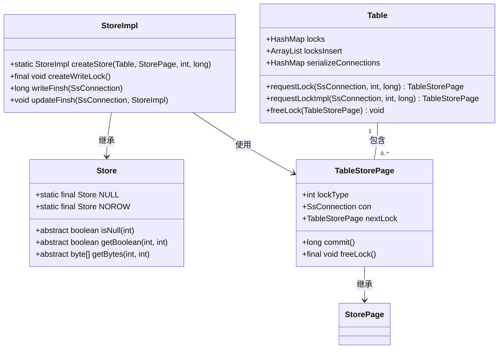
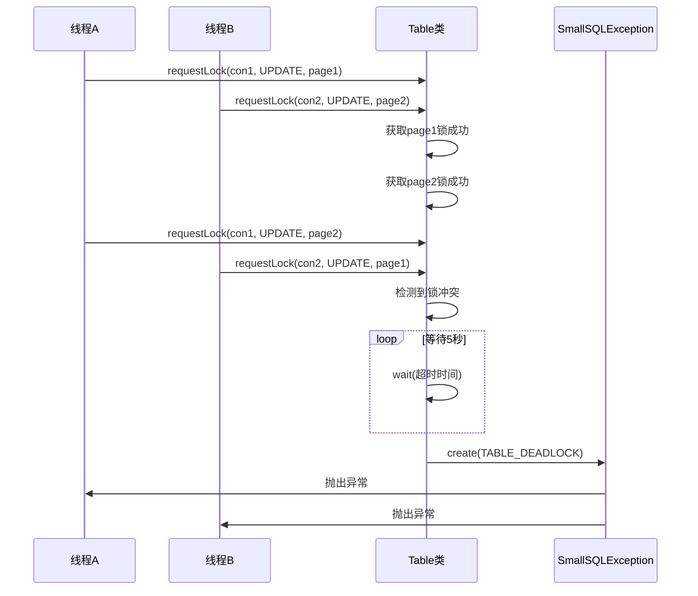

# 死锁检测与处理

<cite>
**本文档引用的文件**   
- [Table.java](file://src/main/java/io/leavesfly/smallsql/rdb/engine/Table.java)
- [Store.java](file://src/main/java/io/leavesfly/smallsql/rdb/engine/Store.java)
- [SmallSQLException.java](file://src/main/java/io/leavesfly/smallsql/jdbc/SmallSQLException.java)
</cite>

## 目录
1. [引言](#引言)
2. [死锁检测算法原理](#死锁检测算法原理)
3. [Table与Store类协作机制](#table与store类协作机制)
4. [死锁超时机制与异常处理](#死锁超时机制与异常处理)
5. [死锁预防最佳实践](#死锁预防最佳实践)
6. [结论](#结论)

## 引言
SmallSQL作为轻量级Java数据库管理系统，采用基于等待图的死锁检测机制来保障多线程环境下的数据一致性。本文深入分析其死锁检测与处理机制，重点阐述Table类和Store类在锁请求等待链构建中的协作方式，以及SmallSQLException在死锁回滚中的关键作用。通过详细解析源码实现，为开发者提供死锁预防的最佳实践指导。

**Section sources**
- [Table.java](file://src/main/java/io/leavesfly/smallsql/rdb/engine/Table.java#L68-L99)

## 死锁检测算法原理
SmallSQL采用超时机制实现死锁检测，而非复杂的等待图遍历算法。其核心思想是为每个锁请求设置5秒的等待时限，超时即判定为死锁。该机制在Table类的requestLock方法中实现，通过synchronized锁保护临界区，确保线程安全。

当连接请求页锁时，系统首先检查表文件状态，若文件已关闭则抛出TABLE_MODIFIED异常。随后进入循环等待，调用requestLockImpl尝试获取锁。若获取失败，则设置5秒超时计时器。在等待期间，线程通过wait()方法释放锁并进入阻塞状态。若在5秒内仍无法获取锁，系统将抛出TABLE_DEADLOCK异常，终止死锁循环。



**Diagram sources**
- [Table.java](file://src/main/java/io/leavesfly/smallsql/rdb/engine/Table.java#L325-L376)

**Section sources**
- [Table.java](file://src/main/java/io/leavesfly/smallsql/rdb/engine/Table.java#L325-L376)

## Table与Store类协作机制
Table类和Store类通过紧密协作构建锁请求等待链，实现精细化的并发控制。Table类维护多个锁容器，包括locks（页读写锁）、locksInsert（插入锁）和serializeConnections（可序列化事务连接），形成多维度的锁管理结构。

当执行不同操作时，Table类根据操作类型和事务隔离级别进行锁检查。例如，在CREATE操作中，需确保无其他连接持有锁；在INSERT操作中，限制可序列化事务的并发数。Store类则通过StoreImpl.createStore方法创建具体的数据存储实例，将锁请求与数据操作关联。

锁的获取流程始于Table.requestLock，经由requestLockImpl验证锁兼容性。对于SELECT和UPDATE操作，系统检查目标页是否存在写锁，若存在则拒绝当前请求。这种机制有效防止了脏读和不可重复读，同时避免了潜在的死锁风险。



**Diagram sources**
- [Table.java](file://src/main/java/io/leavesfly/smallsql/rdb/engine/Table.java#L68-L99)
- [Store.java](file://src/main/java/io/leavesfly/smallsql/rdb/engine/Store.java#L36-L78)
- [TableStorePage.java](file://src/main/java/io/leavesfly/smallsql/rdb/engine/store/TableStorePage.java#L36-L78)

**Section sources**
- [Table.java](file://src/main/java/io/leavesfly/smallsql/rdb/engine/Table.java#L378-L456)
- [StoreImpl.java](file://src/main/java/io/leavesfly/smallsql/rdb/engine/store/StoreImpl.java#L107-L142)

## 死锁超时机制与异常处理
SmallSQL的死锁超时机制以5秒为阈值，通过精确的时间控制平衡性能与可靠性。当锁请求超过时限，系统立即抛出SmallSQLException，携带TABLE_DEADLOCK错误码。该异常由SmallSQLException.create工厂方法创建，自动关联SQL状态码，便于上层应用识别和处理。

异常抛出流程始于requestLock方法的超时判断。当waitTime≤0时，系统调用SmallSQLException.create(Language.TABLE_DEADLOCK, name)生成异常实例。该异常不仅包含错误信息，还通过initCause关联底层异常，形成完整的异常链。开发者可通过printStackTrace方法获取详细的调用栈信息，辅助问题定位。



**Diagram sources**
- [Table.java](file://src/main/java/io/leavesfly/smallsql/rdb/engine/Table.java#L325-L376)
- [SmallSQLException.java](file://src/main/java/io/leavesfly/smallsql/jdbc/SmallSQLException.java#L150-L170)

**Section sources**
- [Table.java](file://src/main/java/io/leavesfly/smallsql/rdb/engine/Table.java#L325-L376)
- [SmallSQLException.java](file://src/main/java/io/leavesfly/smallsql/jdbc/SmallSQLException.java#L150-L170)

## 死锁预防最佳实践
为有效预防死锁，建议遵循以下最佳实践：

### 锁获取顺序规范
确保所有事务按相同顺序访问资源。例如，若事务需更新表A和表B，应始终先锁定表A再锁定表B。这可消除循环等待条件，从根本上避免死锁。

### 事务范围控制
尽量缩短事务持续时间，采用"晚获取，早释放"策略。避免在事务中执行耗时操作，如网络调用或复杂计算。对于批量操作，考虑分批次提交，减少锁持有时间。

### 重试策略
实现智能重试机制，捕获SmallSQLException后等待随机时间间隔再重试。示例代码如下：
```java
int retries = 0;
while (retries < MAX_RETRIES) {
    try {
        // 执行数据库操作
        break;
    } catch (SmallSQLException e) {
        if (e.getSQLState().equals("TABLE_DEADLOCK")) {
            Thread.sleep((long) (Math.random() * RETRY_DELAY));
            retries++;
        } else {
            throw e;
        }
    }
}
```

**Section sources**
- [Table.java](file://src/main/java/io/leavesfly/smallsql/rdb/engine/Table.java#L526-L573)
- [StoreImpl.java](file://src/main/java/io/leavesfly/smallsql/rdb/engine/store/StoreImpl.java#L276-L290)

## 结论
SmallSQL通过简洁高效的超时机制实现死锁检测，结合Table类和Store类的协同工作，构建了可靠的并发控制体系。其5秒超时策略在保证系统响应性的同时，有效避免了永久阻塞。开发者应遵循锁顺序规范、控制事务范围，并实施智能重试策略，以最大限度降低死锁风险。该设计体现了轻量级数据库在性能与可靠性之间的精妙平衡。